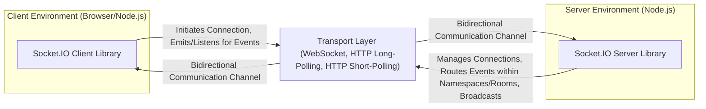

# Project Design Document: Socket.IO

**Version:** 1.1
**Date:** October 26, 2023
**Author:** AI Software Architect

## 1. Introduction

This document provides an enhanced design overview of the Socket.IO project, a widely adopted JavaScript library enabling real-time, bidirectional, and event-based communication between web clients and servers. This detailed design aims to provide a clear understanding of Socket.IO's architecture, components, and data flow, specifically tailored for subsequent threat modeling activities. This revision includes more granular detail and expands on security considerations.

## 2. Goals and Objectives

The core objectives of Socket.IO are:

* **Facilitate Real-time Bidirectional Communication:**  Enable immediate data exchange between connected clients and the server.
* **Ensure Reliable Connections:** Abstract the complexities of underlying transport protocols and manage connection disruptions and automatic reconnections effectively.
* **Offer a Developer-Friendly API:** Provide a straightforward and intuitive interface for implementing real-time features in web applications.
* **Support Diverse Transport Mechanisms:** Adapt to varying network conditions and browser capabilities by offering multiple transport options.
* **Enable Structured Real-time Applications:** Provide organizational features like namespaces and rooms for managing communication channels.

## 3. Architectural Overview

Socket.IO employs a client-server model where clients initiate connections to a central server. Once connected, both the client and server can asynchronously send and receive event-based messages.



## 4. Detailed Design

### 4.1. Server-Side Architecture Breakdown

The Socket.IO server, typically implemented using Node.js, is responsible for managing client connections, routing messages based on events, and facilitating broadcasts to groups of clients.

* **Socket.IO Server Instance (`Server` class):** The central object responsible for listening for incoming connections and managing the overall state of the Socket.IO application.
* **Engine.IO (`Server` class):** The underlying transport abstraction layer. It handles the initial connection handshake and manages the lifecycle of different transport mechanisms for each client.
    * **WebSocket Transport:** Provides a persistent, full-duplex connection over a single TCP connection when available and negotiated.
    * **HTTP Long Polling Transport:** A fallback mechanism where the server holds an HTTP request open until it has data to send to the client, simulating a persistent connection.
    * **HTTP Short Polling Transport:** Another fallback where the client periodically sends HTTP requests to the server to check for new data.
* **Parser (`Parser` class):** Responsible for encoding outgoing messages into a transportable format and decoding incoming messages back into usable data structures.
* **Manager (`Manager` class):** Manages the lifecycle of Engine.IO connections and provides higher-level features like namespaces and rooms.
* **Namespace (`Namespace` class):**  Allows for logical separation of communication channels within a single Socket.IO server instance. Clients can connect to specific namespaces, enabling application segmentation.
* **Room:** A logical grouping of connected clients within a namespace. The server can emit events to all clients in a specific room, facilitating group communication.
* **Adapter (`Adapter` interface):** An abstraction layer for storing and managing room membership and broadcasting messages across multiple Socket.IO server instances, crucial for horizontal scaling.
    * **In-Memory Adapter (default):** Stores room membership in memory, suitable for single-server deployments.
    * **Redis Adapter (`socket.io-redis`):** A common alternative for production environments, leveraging Redis for shared state management across multiple server instances.

### 4.2. Client-Side Architecture Breakdown

The Socket.IO client library, available for browsers and Node.js, handles establishing connections to the server, emitting and listening for events, and managing connection state.

* **Socket.IO Client Instance (`Socket` class):** The primary object used by the client application to connect to the Socket.IO server and interact with it by emitting and receiving events.
* **Engine.IO Client (`Socket` class):** The client-side counterpart to the server's Engine.IO, responsible for transport negotiation with the server and managing the underlying transport connection.
* **Parser (`Parser` class):**  Encodes outgoing messages and decodes incoming messages, ensuring compatibility with the server's parser.
* **EventEmitter (`EventEmitter` class):** Provides the core mechanism for emitting custom events and registering listeners to handle incoming events.

### 4.3. Connection Establishment Flow

The process of establishing a connection between a client and the Socket.IO server involves these key steps:

1. **Client Connection Attempt:** The client application initiates a connection to the Socket.IO server endpoint.
2. **Transport Negotiation (Engine.IO):** The client and server engage in a negotiation process to determine the most suitable transport mechanism. This typically starts with attempting a WebSocket connection and falling back to polling mechanisms if WebSocket fails or is not supported.
3. **Engine.IO Connection Establishment:** An Engine.IO connection is established using the agreed-upon transport protocol. This involves a handshake process specific to the chosen transport.
4. **Socket.IO Handshake:** Once the Engine.IO connection is established, a Socket.IO-specific handshake occurs on top of it. This involves the server sending a unique session ID to the client.
5. **`connect` Event Emission:** Upon successful handshake, the `connect` event is emitted on both the client and server Socket.IO instances, signaling a successful connection.

### 4.4. Message Exchange Flow

Messages are exchanged as named "events" with optional data payloads. This event-driven model allows for flexible and structured communication.

* **Client Emitting an Event:**
    * The client application calls `socket.emit('eventName', data)` to send a message to the server.
    * The client-side Socket.IO library encodes the event name and the associated data payload using the `Parser`.
    * The encoded message is transmitted to the server via the established transport managed by Engine.IO.
* **Server Receiving an Event:**
    * The server receives the encoded message through the transport layer.
    * The server-side Socket.IO library decodes the message using the `Parser`.
    * The server emits the event on the specific `Socket` instance corresponding to the client connection.
    * Server-side application logic listens for this event using `socket.on('eventName', (data) => { ... })`.
* **Server Emitting an Event:**
    * The server application can emit events to various targets:
        * `io.emit('eventName', data)`: Broadcasts the event to all connected clients across all namespaces.
        * `socket.emit('eventName', data)`: Sends the event only to the specific client associated with that `Socket` instance.
        * `io.to('roomName').emit('eventName', data)`: Sends the event to all clients currently in the specified room within the current namespace.
    * The server-side Socket.IO library encodes the event name and data.
    * The encoded message is sent to the targeted client(s) via the transport layer.
* **Client Receiving an Event:**
    * The client receives the encoded message through the transport layer.
    * The client-side Socket.IO library decodes the message.
    * The client emits the event on the `socket` instance.
    * Client-side application logic listens for this event using `socket.on('eventName', (data) => { ... })`.

## 5. Components

* **Socket.IO Client Library (JavaScript):**  Enables real-time communication capabilities within client-side applications (browsers, Node.js).
* **Socket.IO Server Library (Node.js):**  Provides the core functionality for handling real-time connections and message routing on the server.
* **Engine.IO (JavaScript):**  A transport abstraction library used by both the client and server to manage the underlying communication protocols.
* **Parser (JavaScript):**  Handles the serialization and deserialization of messages between the client and server.
* **Adapter (JavaScript Interface):** Defines the interface for managing room membership and message broadcasting, with different implementations for various deployment scenarios.

## 6. Data Flow Diagram

```mermaid
sequenceDiagram
    participant Client Application
    participant Client Socket.IO Library
    participant Transport Layer (e.g., WebSocket)
    participant Server Socket.IO Library
    participant Server Application

    Client Application->>Client Socket.IO Library: socket.emit('chatMessage', { text: 'Hello Server' })
    Client Socket.IO Library->>Transport Layer: Encoded Message (e.g., '42["chatMessage",{"text":"Hello Server"}]')
    Transport Layer-->>Server Socket.IO Library: Encoded Message
    Server Socket.IO Library->>Server Application: socket.on('chatMessage', (data) => { ... })
    Server Application->>Server Socket.IO Library: io.to('general').emit('broadcastMessage', { sender: 'Server', text: 'Welcome!' })
    Server Socket.IO Library->>Transport Layer: Encoded Message (for clients in 'general' room)
    Transport Layer-->>Client Socket.IO Library: Encoded Message
    Client Socket.IO Library->>Client Application: socket.on('broadcastMessage', (data) => { ... })
```

## 7. Security Considerations (Enhanced)

This section details potential security vulnerabilities and considerations crucial for threat modeling Socket.IO applications.

* **Transport Layer Security:**
    * **Unencrypted Communication (HTTP/WS):**  Using unencrypted protocols makes communication susceptible to eavesdropping and man-in-the-middle (MITM) attacks, allowing attackers to intercept and potentially modify messages. **Mitigation:** Enforce HTTPS/WSS for all Socket.IO connections.
    * **Transport Downgrade Attacks:** Attackers might attempt to force a downgrade from secure WebSockets (WSS) to insecure WebSockets (WS) or polling mechanisms. **Mitigation:** Implement proper security headers and server-side checks to prevent downgrades.
* **Authentication and Authorization:**
    * **Lack of Authentication:** Without proper authentication, any client can connect to the server, potentially gaining unauthorized access to data and functionalities. **Mitigation:** Implement robust authentication mechanisms (e.g., JWT, session cookies) to verify client identities upon connection.
    * **Insufficient Authorization:** Even with authentication, clients might have access to sensitive data or actions they are not authorized to perform. **Mitigation:** Implement granular authorization checks on the server-side to control access to specific namespaces, rooms, and events based on user roles or permissions.
* **Input Validation and Sanitization:**
    * **Data Injection Vulnerabilities:** Failure to validate and sanitize data received from clients can lead to various injection attacks.
        * **Cross-Site Scripting (XSS):** If client-provided data is rendered on other clients without proper sanitization, attackers can inject malicious scripts. **Mitigation:** Sanitize all user-provided input before broadcasting it to other clients.
        * **Command Injection:** If server-side code processes client input without proper validation, attackers might inject malicious commands. **Mitigation:** Avoid executing arbitrary commands based on client input. Use parameterized queries or prepared statements for database interactions.
* **Denial of Service (DoS) Attacks:**
    * **Connection Flooding:** An attacker can open a large number of connections to exhaust server resources and prevent legitimate clients from connecting. **Mitigation:** Implement connection rate limiting and potentially use techniques like CAPTCHA for connection requests.
    * **Message Flooding:** Sending a high volume of messages can overwhelm the server and consume excessive resources. **Mitigation:** Implement message rate limiting per connection and potentially per namespace/room.
* **Cross-Site WebSocket Hijacking (CSWSH):**
    * If not properly protected, an attacker can trick a user's browser into establishing a WebSocket connection to a malicious server, potentially exposing sensitive information. **Mitigation:** Implement robust CSRF protection mechanisms, such as checking the `Origin` header on the server-side during the WebSocket handshake.
* **Session Management Vulnerabilities:**
    * **Session Fixation/Hijacking:** Vulnerabilities in how Socket.IO sessions are managed can allow attackers to steal or manipulate legitimate user sessions. **Mitigation:** Use secure session management practices, including generating strong, unpredictable session IDs and protecting them from disclosure.
* **Server-Side Code Injection:**
    * Dynamically evaluating client-provided data on the server-side can create code injection vulnerabilities. **Mitigation:** Avoid using `eval()` or similar functions with untrusted client input.
* **Dependency Vulnerabilities:**
    * Socket.IO and its dependencies might contain known security vulnerabilities. **Mitigation:** Regularly update Socket.IO and its dependencies to the latest versions to patch known vulnerabilities. Use tools to scan for dependency vulnerabilities.
* **Resource Exhaustion:**
    *  Uncontrolled creation of namespaces or rooms by clients could lead to resource exhaustion on the server. **Mitigation:** Implement server-side controls to limit the creation of namespaces and rooms, potentially requiring administrative privileges.

## 8. Deployment Considerations (Expanded)

* **Scalability Strategies:**
    * **Horizontal Scaling:** For high-traffic applications, distribute client connections across multiple Socket.IO server instances.
    * **Message Broker (e.g., Redis):** Utilize a message broker with a Socket.IO adapter (like `socket.io-redis`) to share room membership and broadcast messages efficiently across multiple server instances.
* **Load Balancing:** Employ a load balancer to distribute incoming client connections evenly across available Socket.IO server instances.
    * **Sticky Sessions (for Polling):** When using HTTP polling, configure the load balancer to use sticky sessions (session affinity) to ensure requests from the same client are routed to the same server instance, maintaining connection state. This is less critical with WebSockets.
* **Security Best Practices:**
    * **HTTPS/WSS Enforcement:** Ensure all Socket.IO connections use HTTPS/WSS for encryption.
    * **Security Headers:** Configure appropriate HTTP security headers on the web server serving the client application (e.g., `Content-Security-Policy`, `Strict-Transport-Security`, `X-Frame-Options`).
    * **Firewall Configuration:** Configure firewalls to allow WebSocket connections (typically port 80 or 443) and block any unnecessary ports.
    * **Regular Updates:** Keep Socket.IO and its dependencies updated to patch security vulnerabilities.
* **Monitoring and Logging:** Implement robust monitoring and logging to track connection status, message flow, and potential security incidents.

## 9. Future Considerations

* **Enhanced Built-in Security Features:** Explore and potentially implement more integrated security features directly within the Socket.IO library, such as standardized authentication middleware.
* **Improved Monitoring and Observability Tools:** Develop or integrate with tools that provide better insights into the performance and health of Socket.IO deployments.
* **Standardized Error Handling and Reporting:**  Improve error handling mechanisms and provide more detailed error reporting for debugging and troubleshooting.
* **Further Optimization of Transport Mechanisms:** Continuously evaluate and optimize the performance and reliability of different transport mechanisms.

This enhanced design document provides a more detailed and security-focused overview of the Socket.IO project, making it a more effective resource for threat modeling and secure development practices.