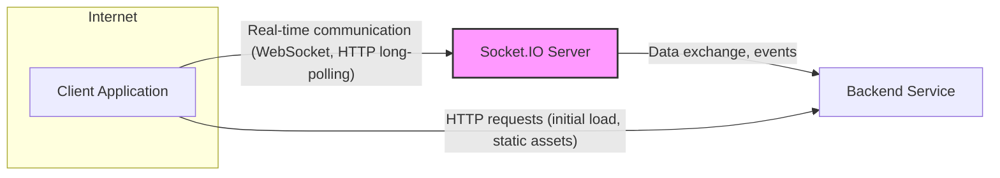
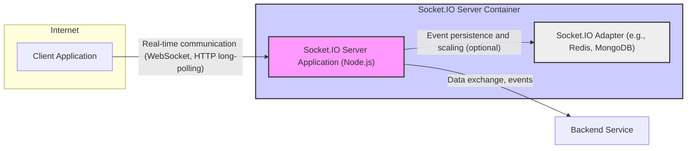
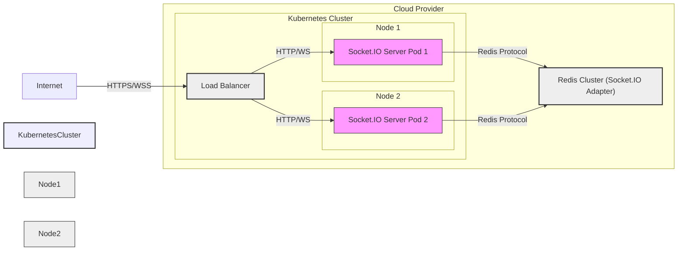

# BUSINESS POSTURE

The socket.io project aims to provide real-time, bidirectional and event-based communication between web clients and servers. It abstracts away the complexities of establishing and maintaining persistent connections, allowing developers to focus on building real-time features in their applications.

Business Priorities and Goals:
- Enable real-time features in web applications, such as chat, collaborative editing, live dashboards, and gaming.
- Simplify the development of real-time applications by providing a robust and easy-to-use library.
- Ensure reliable and efficient communication between clients and servers, even under varying network conditions.
- Maintain a widely adopted and actively developed open-source project to support a large community of users.

Business Risks:
- Availability and reliability of real-time communication are critical for applications relying on socket.io. Downtime or performance issues can directly impact user experience and business operations.
- Security vulnerabilities in socket.io could be exploited to compromise applications using it, leading to data breaches, unauthorized access, or denial of service.
- Data integrity during real-time communication is essential. Data loss or corruption can lead to incorrect application behavior and user dissatisfaction.
- Compatibility issues with different browsers, server environments, and network configurations can hinder adoption and increase development costs.
- Open-source nature implies reliance on community contributions and maintainers, which can introduce risks related to code quality, security, and project sustainability.

# SECURITY POSTURE

Existing Security Controls:
- security control: Open Source Code - The source code is publicly available on GitHub, allowing for community review and identification of potential vulnerabilities. Implemented: GitHub repository.
- security control: Regular Updates - The project is actively maintained with regular updates and bug fixes, including security patches. Implemented: GitHub release history and commit logs.
- security control: Community Support - A large and active community contributes to identifying and reporting security issues. Implemented: GitHub issues and community forums.
- security control: Input Validation - Socket.IO likely performs some basic input validation to handle different data types and prevent crashes. Implemented: Within the socket.io library code.
- accepted risk: Reliance on Underlying Protocols - Socket.IO relies on WebSocket and HTTP long-polling, inheriting potential vulnerabilities from these protocols. Accepted risk: inherent to the technology choice.
- accepted risk: Third-Party Dependencies - Socket.IO depends on other npm packages, which could introduce supply chain vulnerabilities. Accepted risk: inherent to npm ecosystem.

Recommended Security Controls:
- security control: Security Audits - Conduct regular security audits and penetration testing by independent security experts to identify and address potential vulnerabilities proactively.
- security control: Dependency Scanning - Implement automated dependency scanning to detect and alert on known vulnerabilities in third-party dependencies.
- security control: Static Application Security Testing (SAST) - Integrate SAST tools into the development pipeline to automatically analyze code for security vulnerabilities during development.
- security control: Dynamic Application Security Testing (DAST) - Implement DAST tools to test the running application for vulnerabilities from an attacker's perspective.
- security control: Rate Limiting and DoS Protection - Implement rate limiting and other DoS protection mechanisms to prevent abuse and ensure availability.
- security control: Content Security Policy (CSP) - Recommend and document best practices for using CSP to mitigate XSS risks in applications using socket.io.

Security Requirements:
- Authentication:
    - Requirement: Applications using socket.io should implement a robust authentication mechanism to verify the identity of clients connecting to the server.
    - Requirement: Socket.io itself should provide mechanisms or guidance for integrating with existing authentication systems (e.g., JWT, OAuth).
- Authorization:
    - Requirement: Applications should implement authorization controls to ensure that authenticated clients only have access to the resources and actions they are permitted to access.
    - Requirement: Socket.io should provide mechanisms to manage and enforce authorization rules based on client identity or roles.
- Input Validation:
    - Requirement: All data received from clients should be thoroughly validated on the server-side to prevent injection attacks (e.g., XSS, command injection).
    - Requirement: Socket.io should provide guidance and tools for developers to easily implement input validation.
- Cryptography:
    - Requirement: Sensitive data transmitted over socket.io connections should be encrypted to protect confidentiality.
    - Requirement: Socket.io should support or recommend secure communication protocols like WSS (WebSocket Secure) and HTTPS for long-polling.
    - Requirement: If application-level encryption is needed for specific data, socket.io should not interfere with its implementation.

# DESIGN

## C4 CONTEXT



Context Diagram Elements:

- Name: Client Application
    - Type: Software System
    - Description: Web or mobile application running in a user's browser or device that requires real-time communication capabilities.
    - Responsibilities:
        - Establish and maintain a connection with the Socket.IO Server.
        - Send and receive real-time messages and events.
        - Render real-time data and updates to the user interface.
        - Authenticate with the Socket.IO Server and/or Backend Service.
    - Security controls:
        - Input validation on user inputs before sending to the server.
        - Secure storage of authentication tokens or credentials.
        - Implementation of Content Security Policy (CSP) to mitigate XSS.

- Name: Socket.IO Server
    - Type: Software System
    - Description: Node.js server application using the socket.io library to handle real-time communication with clients and potentially interact with backend services.
    - Responsibilities:
        - Accept and manage WebSocket and HTTP long-polling connections from clients.
        - Route messages and events between clients and the backend service.
        - Implement authentication and authorization logic.
        - Handle connection management, including disconnections and reconnections.
        - Potentially perform data transformation or aggregation.
    - Security controls:
        - Input validation on all data received from clients.
        - Rate limiting and DoS protection.
        - Secure configuration of the Socket.IO server and underlying Node.js environment.
        - Implementation of authentication and authorization mechanisms.

- Name: Backend Service
    - Type: Software System
    - Description: Existing backend system (e.g., REST API, database) that provides data and business logic for the Client Application. Socket.IO Server might interact with it to fetch or update data.
    - Responsibilities:
        - Provide data and business logic to the Client Application.
        - Authenticate and authorize requests from the Socket.IO Server.
        - Store and manage persistent data.
        - Potentially initiate real-time events through the Socket.IO Server.
    - Security controls:
        - Standard backend security controls (authentication, authorization, input validation, database security).
        - Secure API design and implementation.
        - Protection against injection attacks (SQL injection, etc.).

## C4 CONTAINER



Container Diagram Elements:

- Name: Client Application
    - Type: Application
    - Description: Web or mobile application running in a user's browser or device.
    - Responsibilities: Same as in Context Diagram.
    - Security controls: Same as in Context Diagram.

- Name: Socket.IO Server Application (Node.js)
    - Type: Application
    - Description: Node.js application built using the socket.io library. This is the core component responsible for handling real-time connections and message routing.
    - Responsibilities:
        - Manage WebSocket and HTTP long-polling connections.
        - Implement Socket.IO protocol and API.
        - Route messages and events between clients and potentially adapters/backend services.
        - Handle authentication and authorization logic within the real-time context.
    - Security controls:
        - Input validation within the Node.js application.
        - Secure coding practices for Node.js applications.
        - Use of secure libraries and frameworks.
        - Regular security updates of Node.js and npm dependencies.

- Name: Socket.IO Adapter (e.g., Redis, MongoDB)
    - Type: Data Store
    - Description: Optional component used for scaling Socket.IO across multiple server instances and for message persistence. Examples include Redis or MongoDB adapters.
    - Responsibilities:
        - Store and forward messages between Socket.IO server instances in a clustered environment.
        - Provide message persistence if required.
        - Facilitate horizontal scaling of the Socket.IO server.
    - Security controls:
        - Security controls specific to the chosen adapter technology (e.g., Redis or MongoDB security configurations).
        - Secure communication between Socket.IO Server Application and the Adapter (if applicable).
        - Access control to the Adapter data store.

- Name: Backend Service
    - Type: Software System
    - Description: Existing backend system.
    - Responsibilities: Same as in Context Diagram.
    - Security controls: Same as in Context Diagram.

## DEPLOYMENT

Deployment Solution: Cloud-based Deployment using Containerization (e.g., Kubernetes)



Deployment Diagram Elements:

- Name: Internet
    - Type: Network
    - Description: Public internet network.
    - Responsibilities: Provides connectivity for clients to access the Socket.IO Server.
    - Security controls: Standard internet security considerations (DDoS protection at the edge, etc.).

- Name: Load Balancer
    - Type: Infrastructure Component
    - Description: Cloud load balancer distributing traffic across multiple Socket.IO Server Pods.
    - Responsibilities:
        - Distribute incoming client connections across available Socket.IO Server Pods.
        - Provide high availability and scalability.
        - Terminate SSL/TLS connections (HTTPS/WSS).
    - Security controls:
        - SSL/TLS termination and certificate management.
        - DDoS protection and rate limiting.
        - Access control to the load balancer management interface.

- Name: Kubernetes Cluster
    - Type: Infrastructure Component
    - Description: Kubernetes cluster providing container orchestration for Socket.IO Server Pods.
    - Responsibilities:
        - Deploy and manage Socket.IO Server Pods.
        - Provide scaling and self-healing capabilities.
        - Manage networking and storage for the application.
    - Security controls:
        - Kubernetes security best practices (RBAC, network policies, pod security policies).
        - Secure configuration of Kubernetes components (API server, kubelet, etc.).
        - Regular security updates of Kubernetes cluster.

- Name: Node 1 & Node 2
    - Type: Infrastructure Component
    - Description: Worker nodes within the Kubernetes cluster.
    - Responsibilities: Run Socket.IO Server Pods.
    - Security controls:
        - Operating system security hardening.
        - Regular security updates of the operating system and node components.
        - Network security within the Kubernetes cluster.

- Name: Socket.IO Server Pod 1 & Socket.IO Server Pod 2
    - Type: Container
    - Description: Containerized instances of the Socket.IO Server Application.
    - Responsibilities: Same as Socket.IO Server Application in Container Diagram.
    - Security controls:
        - Container image security scanning.
        - Minimal container image with only necessary components.
        - Resource limits and quotas for containers.
        - Application-level security controls (as described in Security Posture and Container Diagram).

- Name: Redis Cluster (Socket.IO Adapter)
    - Type: Infrastructure Component
    - Description: Clustered Redis deployment used as the Socket.IO Adapter for message persistence and scaling.
    - Responsibilities: Same as Socket.IO Adapter in Container Diagram.
    - Security controls:
        - Redis security configuration (authentication, access control, network security).
        - Regular security updates of Redis.
        - Secure communication between Socket.IO Server Pods and Redis Cluster (if applicable).

## BUILD

```mermaid
flowchart LR
    Developer["Developer"] --> SourceCodeRepository["Source Code Repository (GitHub)"]
    SourceCodeRepository -- "Code Changes, Pull Requests" --> CI_CD_Pipeline["CI/CD Pipeline (GitHub Actions)"]
    CI_CD_Pipeline -- "Build, Test, Security Scans" --> BuildArtifacts["Build Artifacts (npm package)"]
    BuildArtifacts -- "Publish" --> PackageRegistry["Package Registry (npm registry)"]

    subgraph CI_CD_Pipeline
        BuildStage["Build Stage"]
        TestStage["Test Stage"]
        SecurityScanStage["Security Scan Stage (SAST, Dependency Check)"]
        PublishStage["Publish Stage"]

        CI_CD_Pipeline --> BuildStage
        BuildStage --> TestStage
        TestStage --> SecurityScanStage
        SecurityScanStage --> PublishStage
    end

    style CI_CD_Pipeline fill:#eef,stroke:#333,stroke-width:2px
    style BuildStage fill:#eee,stroke:#333,stroke-width:1px
    style TestStage fill:#eee,stroke:#333,stroke-width:1px
    style SecurityScanStage fill:#eee,stroke:#333,stroke-width:1px
    style PublishStage fill:#eee,stroke:#333,stroke-width:1px
```

Build Process Diagram Elements:

- Name: Developer
    - Type: Human Role
    - Description: Software developer contributing to the socket.io project.
    - Responsibilities:
        - Write and commit code changes.
        - Create and review pull requests.
        - Adhere to coding standards and security guidelines.
    - Security controls:
        - Secure development environment.
        - Code review process.
        - Security awareness training.

- Name: Source Code Repository (GitHub)
    - Type: Software System
    - Description: GitHub repository hosting the socket.io source code.
    - Responsibilities:
        - Version control of the source code.
        - Collaboration platform for developers.
        - Trigger CI/CD pipeline on code changes.
    - Security controls:
        - Access control to the repository.
        - Branch protection rules.
        - Audit logging of repository activities.

- Name: CI/CD Pipeline (GitHub Actions)
    - Type: Software System
    - Description: Automated CI/CD pipeline using GitHub Actions to build, test, and publish socket.io.
    - Responsibilities:
        - Automate the build, test, and release process.
        - Run security scans (SAST, dependency checks).
        - Publish build artifacts to the package registry.
    - Security controls:
        - Secure configuration of CI/CD pipeline.
        - Use of secure build environments.
        - Integration of security scanning tools.
        - Access control to CI/CD pipeline configuration and execution.

- Name: Build Artifacts (npm package)
    - Type: Data
    - Description: npm package containing the compiled and packaged socket.io library.
    - Responsibilities:
        - Distributable artifact of the socket.io project.
        - Used by developers to integrate socket.io into their applications.
    - Security controls:
        - Signing of build artifacts (if applicable).
        - Integrity checks (checksums) for build artifacts.
        - Secure storage of build artifacts before publishing.

- Name: Package Registry (npm registry)
    - Type: Software System
    - Description: npm registry where the socket.io package is published and distributed.
    - Responsibilities:
        - Host and distribute npm packages.
        - Provide package versioning and management.
        - Authenticate package publishers.
    - Security controls:
        - npm registry security controls (authentication, malware scanning).
        - Package integrity verification.
        - Vulnerability scanning of published packages.

# RISK ASSESSMENT

Critical Business Processes:
- Real-time communication functionality in applications using socket.io. This includes features like live chat, collaborative editing, real-time dashboards, and online gaming. Disruption of these processes can directly impact user experience and business operations.

Data to Protect and Sensitivity:
- Messages exchanged through socket.io connections. Sensitivity depends on the application. Messages can range from public chat messages (low sensitivity) to sensitive personal or financial data (high sensitivity).
- Authentication credentials or session tokens used to secure socket.io connections. These are highly sensitive as their compromise can lead to unauthorized access.
- Application configuration data related to socket.io server and client setup. Sensitivity depends on the configuration details, but exposure could lead to misconfiguration or exploitation.

# QUESTIONS & ASSUMPTIONS

Questions:
- What type of applications are primarily using socket.io? (e.g., chat, gaming, IoT, financial applications). This would help to better understand the sensitivity of data transmitted.
- Are there specific compliance requirements that applications using socket.io need to adhere to (e.g., GDPR, HIPAA, PCI DSS)?
- What are the typical deployment environments for socket.io servers? (Cloud, on-premises, hybrid).
- Are there any specific security features or configurations that are commonly used or recommended for socket.io in production environments?
- What is the process for reporting and handling security vulnerabilities in socket.io?

Assumptions:
- BUSINESS POSTURE: The primary business goal is to enable and simplify real-time communication for web applications. Availability, reliability, and security are key priorities.
- SECURITY POSTURE: Socket.io project follows standard open-source security practices. Applications using socket.io are responsible for implementing their own authentication, authorization, and data encryption on top of socket.io's base functionality.
- DESIGN: Socket.io is typically deployed in a cloud environment using containerization for scalability and resilience. A Redis adapter is used for clustered deployments. The build process is automated using CI/CD pipelines and includes basic security checks.