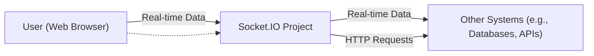
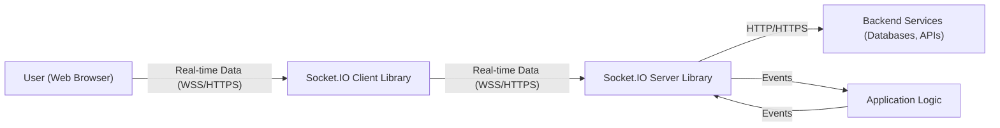
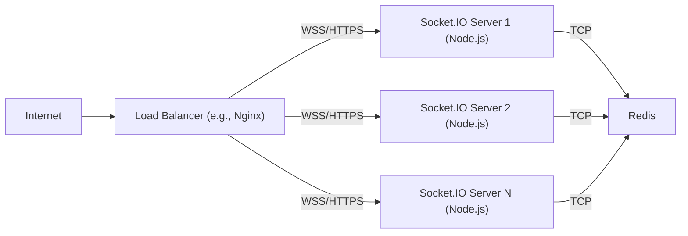
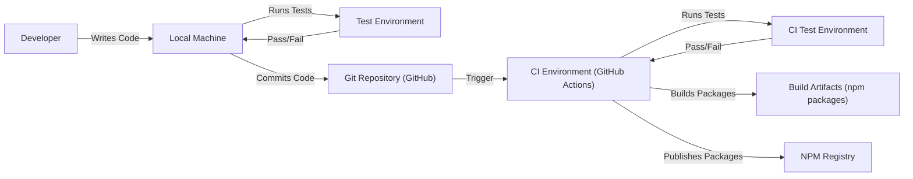

# BUSINESS POSTURE

Business Priorities and Goals:

The primary goal of Socket.IO is to provide a reliable and easy-to-use real-time, bidirectional communication layer between web clients and servers. It aims to abstract away the complexities of various real-time transport mechanisms (like WebSockets, long polling, etc.) and provide a consistent API for developers. The project prioritizes ease of use, broad compatibility across different browsers and environments, and performance. It's a foundational library used in many applications requiring real-time features like chat, live updates, and collaborative tools.

Business Risks:

-   Service Degradation/Outage: Since Socket.IO is often a critical component for real-time applications, any instability or outage can directly impact the user experience and functionality of those applications.
-   Data Breaches/Leaks: If the Socket.IO implementation is compromised, it could potentially expose sensitive data transmitted between clients and servers.
-   Scalability Issues: Applications using Socket.IO might face scalability challenges if the library or its implementation cannot handle a large number of concurrent connections or high message throughput.
-   Compatibility Problems: As web technologies evolve, maintaining compatibility with various browsers and environments is an ongoing challenge. Incompatibility can lead to application breakage.
-   Dependency Vulnerabilities: Like any software project, Socket.IO relies on third-party dependencies. Vulnerabilities in these dependencies could be exploited.
-   Improper Use/Configuration: Developers might misuse or misconfigure Socket.IO, leading to security vulnerabilities or performance issues in their applications.

# SECURITY POSTURE

Existing Security Controls:

-   security control: The project's GitHub repository includes a `SECURITY.md` file, which provides instructions for reporting vulnerabilities.
-   security control: The project uses automated dependency management (Dependabot) to identify and update vulnerable dependencies. This is visible in the GitHub repository's configuration.
-   security control: The documentation (implied, not directly in the repo, but on the Socket.IO website) provides guidance on secure usage, such as using TLS/SSL for secure communication.
-   security control: The library supports namespaces and rooms, which can be used to implement logical separation and access control for different groups of clients. (Documentation and code).
-   security control: The library supports different transports, including WebSockets (which can be secured via WSS) and HTTP long-polling. (Code and documentation).
-   security control: The library provides mechanisms for handling disconnects and reconnects, which are important for resilience. (Code and documentation).
-   security control: The library uses well-established and tested underlying libraries for handling WebSockets and HTTP communication (e.g., `engine.io`). (Code, `package.json`).

Accepted Risks:

-   accepted risk: The library, by its nature, deals with real-time communication, which can be more challenging to secure than traditional request-response interactions. There's an inherent risk of denial-of-service (DoS) attacks if not properly managed.
-   accepted risk: The library supports older browsers and environments, which might have limited security features or known vulnerabilities.
-   accepted risk: The library's flexibility in terms of transport mechanisms means that some transports (like HTTP long-polling) might be less secure than others (like WebSockets over TLS).

Recommended Security Controls:

-   security control: Implement comprehensive input validation on both the client and server sides to prevent injection attacks and ensure data integrity.
-   security control: Provide clear documentation and examples on how to implement authentication and authorization mechanisms with Socket.IO.
-   security control: Offer guidance and tools for monitoring and logging Socket.IO traffic to detect and respond to security incidents.
-   security control: Conduct regular security audits and penetration testing of the library and its associated components.
-   security control: Implement rate limiting and connection throttling to mitigate DoS attacks.
-   security control: Consider adding support for end-to-end encryption for sensitive data.

Security Requirements:

-   Authentication:
    -   The system SHOULD allow developers to integrate various authentication mechanisms (e.g., JWT, session cookies, custom tokens) to verify the identity of clients connecting to the Socket.IO server.
    -   The system SHOULD provide clear documentation and examples for implementing authentication.
-   Authorization:
    -   The system SHOULD allow developers to define authorization rules to control which clients can access specific namespaces, rooms, or events.
    -   The system SHOULD support role-based access control (RBAC) or similar mechanisms.
    -   The system SHOULD provide clear documentation and examples for implementing authorization.
-   Input Validation:
    -   The system MUST validate all data received from clients on the server-side to prevent injection attacks and ensure data integrity.
    -   The system SHOULD provide helper functions or libraries to simplify input validation.
    -   The system SHOULD validate data types, lengths, and formats.
-   Cryptography:
    -   The system MUST use TLS/SSL (WSS for WebSockets) to encrypt all communication between clients and servers.
    -   The system SHOULD provide options for configuring TLS/SSL settings (e.g., cipher suites, protocols).
    -   The system SHOULD consider supporting end-to-end encryption for sensitive data in specific use cases.

# DESIGN

## C4 CONTEXT

Element Descriptions:

-   1.  Name: User (Web Browser)
    -   2.  Type: Person
    -   3.  Description: A user interacting with a web application that uses Socket.IO for real-time communication.
    -   4.  Responsibilities:
        -   Initiates connections to the Socket.IO server.
        -   Sends and receives real-time data.
        -   Renders the user interface.
    -   5.  Security controls:
        -   Runs in a sandboxed browser environment.
        -   Uses HTTPS for secure communication with the web server.
        -   Relies on the web application's authentication and authorization mechanisms.

-   1.  Name: Socket.IO Project
    -   2.  Type: Software System
    -   3.  Description: The Socket.IO library and the server-side implementation using it.
    -   4.  Responsibilities:
        -   Provides a real-time communication layer between clients and the server.
        -   Abstracts away the complexities of different transport mechanisms.
        -   Handles connection management, message routing, and broadcasting.
    -   5.  Security controls:
        -   Uses TLS/SSL for secure communication.
        -   Supports namespaces and rooms for logical separation.
        -   Relies on underlying libraries for secure WebSocket and HTTP handling.
        -   Can be integrated with authentication and authorization mechanisms.

-   1.  Name: Other Systems (e.g., Databases, APIs)
    -   2.  Type: Software System
    -   3.  Description: External systems that the Socket.IO server might interact with, such as databases, APIs, or other backend services.
    -   4.  Responsibilities:
        -   Provides data persistence.
        -   Performs business logic.
        -   Handles requests from the Socket.IO server.
    -   5.  Security controls:
        -   Uses appropriate security mechanisms for their respective functions (e.g., database authentication, API keys, OAuth).
        -   Implements input validation and access control.

## C4 CONTAINER

Element Descriptions:

-   1.  Name: User (Web Browser)
    -   2.  Type: Person
    -   3.  Description: A user interacting with a web application that uses Socket.IO for real-time communication.
    -   4.  Responsibilities:
        -   Initiates connections to the Socket.IO server.
        -   Sends and receives real-time data.
        -   Renders the user interface.
    -   5.  Security controls:
        -   Runs in a sandboxed browser environment.
        -   Uses HTTPS for secure communication with the web server.
        -   Relies on the web application's authentication and authorization mechanisms.

-   1.  Name: Socket.IO Client Library
    -   2.  Type: Container (JavaScript Library)
    -   3.  Description: The client-side Socket.IO library running in the user's web browser.
    -   4.  Responsibilities:
        -   Establishes and maintains a connection with the Socket.IO server.
        -   Sends and receives events.
        -   Handles transport upgrades and fallbacks.
    -   5.  Security controls:
        -   Runs in the browser's sandboxed environment.
        -   Uses WSS (WebSockets over TLS) for secure communication.
        -   Relies on the web application's authentication mechanisms.

-   1.  Name: Socket.IO Server Library
    -   2.  Type: Container (Node.js Library)
    -   3.  Description: The server-side Socket.IO library running on a Node.js server.
    -   4.  Responsibilities:
        -   Manages client connections.
        -   Handles event routing and broadcasting.
        -   Provides namespaces and rooms for logical separation.
        -   Integrates with application logic.
    -   5.  Security controls:
        -   Uses TLS/SSL for secure communication.
        -   Can be integrated with authentication and authorization mechanisms.
        -   Relies on underlying libraries for secure WebSocket and HTTP handling.

-   1.  Name: Backend Services (Databases, APIs)
    -   2.  Type: Container (Various)
    -   3.  Description: External systems that the Socket.IO server might interact with.
    -   4.  Responsibilities:
        -   Provides data persistence.
        -   Performs business logic.
        -   Handles requests from the Socket.IO server.
    -   5.  Security controls:
        -   Uses appropriate security mechanisms for their respective functions (e.g., database authentication, API keys, OAuth).
        -   Implements input validation and access control.

-   1.  Name: Application Logic
    -   2.  Type: Container (Code/Module)
    -   3.  Description: The server-side application code that uses the Socket.IO library.
    -   4.  Responsibilities:
        -   Handles business logic.
        -   Processes events received from clients.
        -   Emits events to clients.
        -   Interacts with backend services.
    -   5.  Security controls:
        -   Implements authentication and authorization logic.
        -   Performs input validation.
        -   Applies appropriate security measures based on the application's requirements.

## DEPLOYMENT

Possible Deployment Solutions:

1.  Single Node.js Server: Simplest deployment, suitable for small-scale applications.
2.  Multiple Node.js Servers with a Load Balancer: Improves scalability and availability.  A load balancer (e.g., Nginx, HAProxy) distributes traffic across multiple Socket.IO server instances.  Requires a mechanism for synchronizing state between servers (e.g., Redis, a database).
3.  Cloud-Based Platform (e.g., Heroku, AWS Elastic Beanstalk, Google App Engine):  Leverages cloud provider's infrastructure for scalability and management.  Often uses a load balancer and multiple instances.
4.  Containerized Deployment (e.g., Docker, Kubernetes):  Provides portability, scalability, and resource isolation.  Ideal for complex applications and microservices architectures.

Chosen Solution (for detailed description): Multiple Node.js Servers with a Load Balancer and Redis Adapter

Element Descriptions:

-   1.  Name: Internet
    -   2.  Type: Infrastructure
    -   3.  Description: The public internet.
    -   4.  Responsibilities:
        -   Routes traffic to the load balancer.
    -   5.  Security controls:
        -   Standard internet security protocols (e.g., TCP/IP, DNS).

-   1.  Name: Load Balancer (e.g., Nginx)
    -   2.  Type: Infrastructure (Software)
    -   3.  Description: A load balancer that distributes incoming traffic across multiple Socket.IO server instances.
    -   4.  Responsibilities:
        -   Distributes traffic based on a configured algorithm (e.g., round-robin, least connections).
        -   Performs health checks on the Socket.IO servers.
        -   Terminates TLS/SSL connections (optional).
    -   5.  Security controls:
        -   Can be configured to use TLS/SSL certificates for secure communication.
        -   Can be configured to block malicious traffic (e.g., using a Web Application Firewall).
        -   Can implement rate limiting and connection throttling.

-   1.  Name: Socket.IO Server 1 (Node.js)
    -   2.  Type: Infrastructure (Server)
    -   3.  Description: An instance of the Node.js server running the Socket.IO server library.
    -   4.  Responsibilities:
        -   Handles client connections.
        -   Processes events.
        -   Communicates with other Socket.IO servers via Redis.
    -   5.  Security controls:
        -   Uses TLS/SSL for secure communication with clients.
        -   Implements authentication and authorization logic.
        -   Performs input validation.

-   1.  Name: Socket.IO Server 2 (Node.js)
    -   2.  Type: Infrastructure (Server)
    -   3.  Description: Another instance of the Node.js server running the Socket.IO server library.
    -   4.  Responsibilities: Identical to Socket.IO Server 1.
    -   5.  Security controls: Identical to Socket.IO Server 1.

-   1.  Name: Socket.IO Server N (Node.js)
    -   2.  Type: Infrastructure (Server)
    -   3.  Description: Yet another instance of the Node.js server.
    -   4.  Responsibilities: Identical to Socket.IO Server 1.
    -   5.  Security controls: Identical to Socket.IO Server 1.

-   1.  Name: Redis
    -   2.  Type: Infrastructure (Software)
    -   3.  Description: A Redis instance used for inter-process communication (IPC) between the Socket.IO servers.  The Socket.IO Redis adapter allows multiple Socket.IO instances to broadcast events to all connected clients, regardless of which server they are connected to.
    -   4.  Responsibilities:
        -   Provides a pub/sub mechanism for Socket.IO servers.
        -   Stores session data (optional).
    -   5.  Security controls:
        -   Can be configured to require authentication.
        -   Can be configured to use TLS/SSL for secure communication.
        -   Should be deployed in a secure network environment.

## BUILD

The Socket.IO project uses a combination of tools and processes for building and publishing the library.

Build Process Description:

1.  Developer writes code on their local machine.
2.  Developer runs tests locally to ensure code quality.
3.  Developer commits code to the Git repository (GitHub).
4.  The commit triggers a workflow in the CI environment (GitHub Actions).
5.  The CI environment runs tests in a clean environment.
6.  If tests pass, the CI environment builds the Socket.IO packages (client and server).
7.  The CI environment publishes the packages to the NPM registry.

Security Controls in Build Process:

-   security control: Automated Testing: The project has a comprehensive test suite that is run both locally and in the CI environment. This helps to catch bugs and regressions early.
-   security control: Dependency Management: The project uses Dependabot to automatically identify and update vulnerable dependencies.
-   security control: CI/CD: The use of GitHub Actions for CI/CD ensures that the build and publishing process is automated and consistent.
-   security control: Code Review: All code changes are reviewed by other developers before being merged into the main branch. (Implicit in the GitHub workflow).
-   security control: Linting: The project uses linters (e.g., ESLint) to enforce code style and identify potential issues. (Visible in the `.eslintrc.js` file).
-   security control: Static Analysis: While not explicitly mentioned, it's highly recommended to integrate static analysis tools (e.g., SonarQube) into the CI pipeline to detect security vulnerabilities and code quality issues.

# RISK ASSESSMENT

Critical Business Processes:

-   Real-time communication between clients and servers: This is the core functionality of Socket.IO and is essential for applications that rely on it.
-   Reliable message delivery: Ensuring that messages are delivered reliably and in the correct order is crucial for many applications.
-   Scalability: The ability to handle a large number of concurrent connections and high message throughput is important for growing applications.

Data Sensitivity:

-   The data transmitted via Socket.IO can vary greatly in sensitivity depending on the application. It could range from non-sensitive public data to highly sensitive personal or financial information.
-   The sensitivity of the data should be assessed on a per-application basis.
-   Examples:
    -   Chat application: Messages might contain personal conversations, which should be considered sensitive.
    -   Online game: Game state data might not be highly sensitive, but user authentication tokens would be.
    -   Financial trading platform: Real-time market data and trading orders would be highly sensitive.

# QUESTIONS & ASSUMPTIONS

Questions:

-   Are there any specific compliance requirements (e.g., GDPR, HIPAA) that apply to applications using Socket.IO?
-   What are the expected traffic patterns and peak loads for applications using Socket.IO?
-   What are the existing security policies and procedures of the organizations using Socket.IO?
-   What level of logging and monitoring is required for applications using Socket.IO?
-   Are there any specific threat models or attack scenarios that are of particular concern?
-   What is the process for handling security incidents related to Socket.IO?

Assumptions:

-   BUSINESS POSTURE: It is assumed that users of Socket.IO are responsible for implementing appropriate security measures in their own applications, including authentication, authorization, and input validation.
-   SECURITY POSTURE: It is assumed that the underlying infrastructure (e.g., servers, networks) is secured according to best practices.
-   DESIGN: It is assumed that developers using Socket.IO will follow the documentation and best practices provided by the project.
-   It is assumed that Redis, or a similar solution, will be used for scaling to multiple Socket.IO server instances.
-   It is assumed that a load balancer will be used to distribute traffic across multiple Socket.IO server instances.
-   It is assumed that TLS/SSL will be used for all communication between clients and servers.