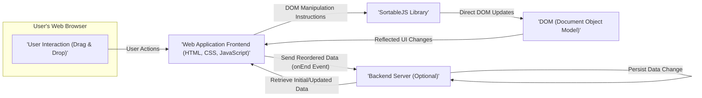
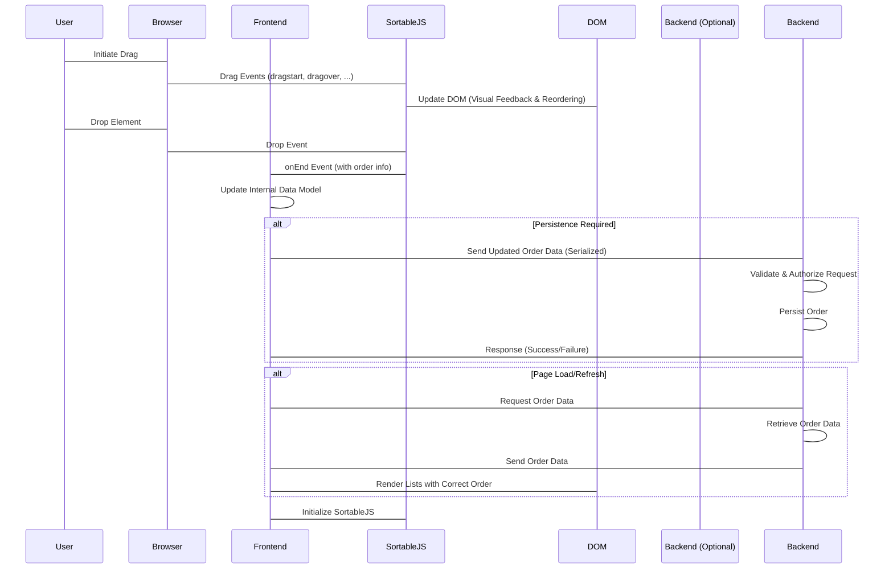

# Project Design Document: SortableJS Integration - Enhanced

**Version:** 1.1
**Date:** October 26, 2023
**Author:** AI Software Architect

## 1. Introduction

This document provides an enhanced design for a web application integrating the SortableJS library (https://github.com/SortableJS/Sortable). This detailed design serves as a crucial foundation for subsequent threat modeling, offering a clear understanding of the system's architecture, data flow, and potential security implications. This version builds upon the initial design by providing more granular detail and addressing potential areas of ambiguity.

## 2. Goals and Objectives

*   Clearly and comprehensively define the architecture of a web application utilizing SortableJS.
*   Illustrate the data flow within the system with greater detail, specifically focusing on interactions involving SortableJS and potential backend communication.
*   Identify key components and their specific responsibilities within the integration.
*   Provide a robust and detailed foundation for identifying potential security vulnerabilities during the threat modeling process.
*   Clarify the interaction points and data exchanged between different components.

## 3. System Overview

The system is a web application that leverages the client-side SortableJS library to enable users to dynamically reorder elements within lists, potentially across multiple lists, using drag-and-drop functionality. The primary components involved are the user's web browser, the web application's frontend (incorporating SortableJS), and an optional backend server responsible for persisting changes.

## 4. System Architecture

**Component Descriptions:**

*   **User's Web Browser:** The client-side environment where the user interacts with the web application. It interprets HTML, CSS, and executes JavaScript, including the SortableJS library. This is the primary interface for the user.
*   **Web Application Frontend (HTML, CSS, JavaScript):** The client-side codebase of the web application. This includes:
    *   HTML: Defines the structure of the sortable lists and their items.
    *   CSS: Provides styling and visual presentation.
    *   JavaScript:  Includes application-specific logic, initialization of SortableJS, and handling of SortableJS events.
*   **SortableJS Library:** A third-party JavaScript library responsible for enabling the drag-and-drop reordering functionality. Key responsibilities include:
    *   Handling browser drag and drop events.
    *   Dynamically updating the DOM to reflect the reordering.
    *   Providing events (e.g., `onEnd`) to notify the application of changes.
*   **DOM (Document Object Model):** The tree-like representation of the HTML document. SortableJS directly manipulates the DOM to visually reorder elements in response to user actions.
*   **Backend Server (Optional):** A server-side component responsible for:
    *   Persisting the order of elements if the application requires statefulness across sessions or users.
    *   Potentially providing the initial order of elements to the frontend.
    *   Handling authentication and authorization for order updates.

## 5. Data Flow

The following details the data flow during a typical reordering operation using SortableJS:

*   **User Initiates Drag:** The user interacts with the browser by clicking and holding a sortable element, initiating the drag operation. This interaction is within the browser environment.
*   **Browser Event Handling:** The browser generates drag-related events (e.g., `dragstart`, `dragover`, `drop`).
*   **SortableJS Interception:** The SortableJS library, attached to the relevant DOM elements, intercepts these browser drag events.
*   **Visual Feedback & DOM Manipulation (During Drag):** SortableJS provides real-time visual feedback to the user (e.g., highlighting drop zones, displaying a ghost image of the dragged element). Simultaneously, it manipulates the DOM to visually rearrange elements as the user drags. This is a direct interaction between SortableJS and the DOM.
*   **User Drops Element:** The user releases the mouse button, completing the drag-and-drop action.
*   **SortableJS `onEnd` Event Trigger:** Upon the `drop` event, SortableJS triggers the `onEnd` event. This event object typically contains:
    *   References to the moved element and the lists involved.
    *   The old and new indices of the moved element within its list.
    *   Information about the source and target lists (if moving between lists).
*   **Frontend Application Logic Execution:** The web application's JavaScript code, which has registered a listener for the `onEnd` event, executes.
*   **Data Update in Frontend:** The frontend application updates its internal data model (e.g., an array representing the order of items) based on the information provided in the `onEnd` event.
*   **Optional Backend Interaction for Persistence:**
    *   **Data Serialization:** The frontend application serializes the updated order data into a format suitable for transmission (e.g., JSON).
    *   **API Request:** The frontend sends an HTTP request (e.g., POST, PUT) to the backend server, including the serialized order data. This request typically targets a specific API endpoint.
    *   **Authentication and Authorization:** The request may include authentication credentials (e.g., session cookies, tokens) to verify the user's identity and authorization to perform the update.
*   **Backend Processing (Optional):**
    *   **Request Validation:** The backend server validates the incoming request and the data format.
    *   **Authentication and Authorization Check:** The backend verifies the user's credentials and permissions.
    *   **Data Persistence:** The backend updates the database or other persistent storage with the new order of elements.
    *   **Response:** The backend sends a response back to the frontend, indicating the success or failure of the operation.
*   **Data Retrieval (Optional - on Page Load or Refresh):**
    *   **Frontend Request:** When the page loads or is refreshed, the frontend application may send a request to the backend to retrieve the current order of elements.
    *   **Backend Retrieval:** The backend retrieves the order data from the database.
    *   **Backend Response:** The backend sends the order data back to the frontend.
    *   **Initial DOM Rendering:** The frontend uses the retrieved order data to dynamically generate the HTML for the sortable lists in the correct order.
    *   **SortableJS Initialization:** SortableJS is then initialized on these rendered lists, enabling the drag-and-drop functionality.

## 6. Security Considerations

This section expands on the potential security considerations related to SortableJS integration, providing more specific examples and potential attack vectors.

*   **Cross-Site Scripting (XSS):**
    *   **Vulnerability:** If the content of the sortable items is sourced from user input or external data without proper sanitization, malicious scripts can be injected.
    *   **Attack Vector:** An attacker could inject `` into an item's name. When another user views or interacts with this list, the script will execute in their browser, potentially stealing cookies or performing other malicious actions.
    *   **Mitigation:** Implement robust server-side and client-side input sanitization and output encoding. Use Content Security Policy (CSP) to restrict the sources from which the browser can load resources.
*   **Client-Side Data Manipulation and Integrity:**
    *   **Vulnerability:** Since SortableJS operates on the client-side, a malicious user with sufficient technical knowledge could manipulate the JavaScript code or the DOM directly using browser developer tools.
    *   **Attack Vector:** A user could alter the `onEnd` event data before it's sent to the backend, potentially changing the order of items in a way that grants them an unfair advantage or disrupts the application's logic.
    *   **Mitigation:** Never rely solely on client-side data for critical operations. Always validate and authorize data received from the client on the backend. Implement server-side logic to verify the integrity of the order changes.
*   **Insecure Backend Integration (if applicable):**
    *   **Vulnerability:**  Lack of proper authentication and authorization on the backend API endpoints used for receiving order updates.
    *   **Attack Vector:** An attacker could forge requests to the backend API, sending arbitrary order updates without proper authorization, leading to data corruption or unauthorized modifications.
    *   **Mitigation:** Implement robust authentication mechanisms (e.g., OAuth 2.0, JWT) and authorization checks on the backend API endpoints. Ensure that only authenticated and authorized users can modify the order of elements.
*   **Denial of Service (DoS):**
    *   **Vulnerability:**  Inefficient handling of a large number of sortable items or frequent reordering requests.
    *   **Attack Vector:** A malicious user could intentionally trigger a large number of reordering actions or manipulate a very large list, potentially overloading the client's browser or the backend server.
    *   **Mitigation:** Implement client-side performance optimizations (e.g., virtualization for large lists). Implement rate limiting and request throttling on the backend to prevent abuse.
*   **Information Disclosure:**
    *   **Vulnerability:** Sensitive information displayed within the sortable items.
    *   **Attack Vector:**  An unauthorized user could gain access to sensitive information by simply viewing the reordered list, even if they don't actively participate in the reordering.
    *   **Mitigation:** Avoid displaying sensitive information directly within sortable items if not necessary. Implement appropriate access controls and authorization to ensure only authorized users can view the lists.
*   **Race Conditions (if applicable):**
    *   **Vulnerability:** Concurrent updates to the same list by multiple users without proper synchronization on the backend.
    *   **Attack Vector:**  Multiple users reordering the same list simultaneously could lead to inconsistent data if the backend doesn't handle concurrent updates correctly. The final order might not reflect all the intended changes.
    *   **Mitigation:** Implement appropriate concurrency control mechanisms on the backend, such as optimistic or pessimistic locking, to prevent race conditions and ensure data consistency.

## 7. Assumptions and Constraints

*   Developers integrating SortableJS are expected to have a solid understanding of web development principles, security best practices, and the specific requirements of the application.
*   This document primarily focuses on the client-side integration of SortableJS and its interaction with a potential backend. Specific backend implementation details (e.g., database schema, specific API frameworks) are outside the scope.
*   The SortableJS library is assumed to be used as intended and is kept up-to-date with the latest security patches.
*   The web application is assumed to be served over HTTPS to ensure the confidentiality and integrity of data transmitted between the client and the server.

## 8. Future Considerations

*   **Accessibility Enhancements:**  Further explore and implement accessibility features to ensure the sortable functionality is usable by individuals with disabilities, including robust keyboard navigation and screen reader compatibility.
*   **Performance Optimization Strategies:** Investigate and implement advanced performance optimization techniques for handling very large datasets or complex reordering scenarios, such as virtual scrolling, debouncing, and efficient DOM updates.
*   **Advanced SortableJS Feature Integration:**  Document the integration and security implications of utilizing more advanced SortableJS features, such as:
    *   Filtering and searching within sortable lists.
    *   Grouping and nested sortable lists.
    *   Custom drag handles and animation effects.
*   **Frontend Framework Specific Integrations:** Provide detailed guidance and best practices for integrating SortableJS within popular frontend frameworks like React, Angular, and Vue.js, highlighting framework-specific security considerations and patterns.
*   **Real-time Collaboration:** Explore the design and security implications of implementing real-time collaborative reordering features, where multiple users can simultaneously modify the order of elements.

This enhanced design document provides a more detailed and comprehensive understanding of a system integrating SortableJS. This level of detail is crucial for effective threat modeling, enabling the identification and mitigation of a wider range of potential security vulnerabilities.
