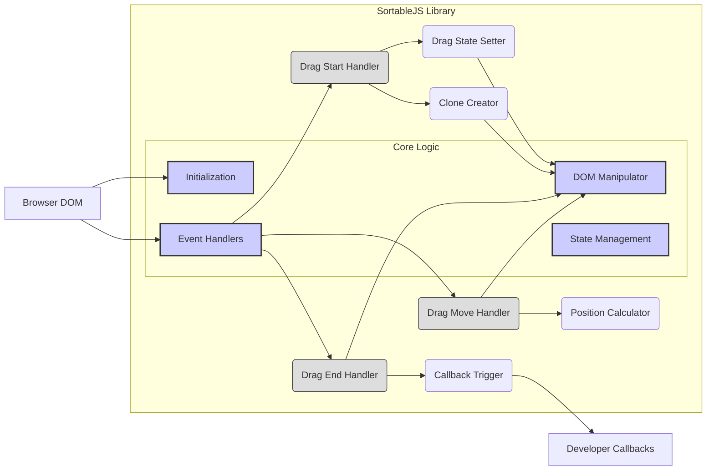
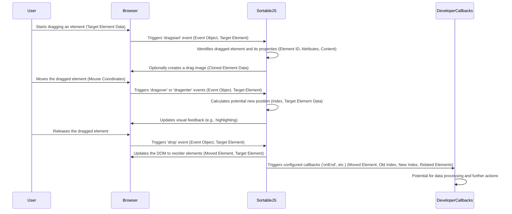

# Project Design Document: SortableJS Library (Improved for Threat Modeling)

**Version:** 1.1
**Date:** October 26, 2023
**Author:** Gemini (AI Language Model)

## 1. Introduction

This document provides a detailed design overview of the SortableJS library, a lightweight JavaScript library for reordering items in a list using drag and drop. This document is specifically crafted to serve as a foundation for future threat modeling activities by clearly outlining the library's architecture, data flow, and external interactions, highlighting potential areas of security concern.

## 2. Goals

The primary goals of this design document, with a focus on threat modeling, are:

*   To clearly articulate the architecture and functionality of the SortableJS library, identifying key components that could be potential attack surfaces.
*   To identify key components and their interactions within the library, illustrating potential points of vulnerability during data exchange.
*   To detail the data flow during drag-and-drop operations, highlighting sensitive data and its transformations.
*   To highlight external interfaces and dependencies, pinpointing where untrusted data might enter the system.
*   To provide a comprehensive understanding of the system's inner workings to facilitate a thorough and effective threat modeling exercise.

## 3. Scope

This document covers the design of the client-side JavaScript library, SortableJS. It focuses on the core functionality of enabling drag-and-drop reordering of elements within a specified container. The scope includes:

*   The core JavaScript logic of the library, including its event handling and DOM manipulation mechanisms.
*   The event handling mechanisms used for drag-and-drop interactions, as these are direct interfaces with user input.
*   The manipulation of the Document Object Model (DOM), a critical area for potential client-side vulnerabilities.
*   The configuration options provided by the library, which can influence its security posture.
*   The callbacks and events exposed for developer interaction, representing potential injection points.

This document does *not* cover:

*   Server-side implementation for persisting the reordered state, as this is outside the library's direct control.
*   Specific integration details within various frontend frameworks, although general security principles discussed will be applicable.
*   The visual styling of the draggable elements, as this is handled by the developer and not the core library logic.

## 4. Architecture

SortableJS is a client-side JavaScript library operating within the user's web browser. Its architecture is event-driven, leveraging browser drag-and-drop APIs and custom event handling. Understanding this architecture is crucial for identifying potential points of attack and data manipulation.

**Components (with Threat Modeling Relevance):**

*   **Initialization:**  The process of attaching SortableJS to a DOM element. Improper initialization or configuration could lead to unexpected behavior or expose unintended elements to drag-and-drop.
*   **Event Handlers:**  These are the primary entry points for user interaction. Vulnerabilities here could allow malicious scripts to be injected or to manipulate the drag-and-drop process in unintended ways.
    *   `Drag Start Handler`: Handles the beginning of a drag operation. Potential threats include manipulating the dragged element or its data before the operation begins.
    *   `Drag Move Handler`:  Handles the movement of the dragged element. Vulnerabilities here could involve manipulating the target element or the calculated position.
    *   `Drag End Handler`: Handles the completion of the drag operation. This is a critical point for ensuring data integrity and preventing unintended side effects.
*   **DOM Manipulator:**  This component directly interacts with the browser's DOM to reorder elements. Vulnerabilities here could lead to XSS if unsanitized data is used or to DOM clobbering if not implemented carefully.
*   **State Management:** Internal mechanisms to track the state of the drag operation. Inconsistent or improperly managed state could lead to unexpected behavior or vulnerabilities.
*   **Clone Creator:**  Responsible for creating a visual representation of the dragged element. Potential issues include creating clones with malicious content.
*   **Drag State Setter:**  Sets internal flags and properties related to the drag operation. Incorrect state setting could lead to bypasses or unexpected behavior.
*   **Position Calculator:**  Calculates the new position of the dragged element. Flaws in this logic could lead to incorrect reordering or unexpected DOM manipulation.
*   **Callback Trigger:**  Executes developer-defined callback functions. This is a significant area for potential XSS vulnerabilities if developer callbacks are not handled securely.

## 5. Data Flow

Understanding the data flow during a drag-and-drop operation is crucial for identifying potential points of data interception or manipulation.

**Data Elements (with Security Relevance):**

*   **Target Element Data:**  Information associated with the element being dragged and the target elements. This data could be manipulated before or during the drag operation.
*   **Event Object:**  Browser-generated event data associated with drag-and-drop events. Malicious actors could potentially craft or manipulate these events.
*   **Element ID, Attributes, Content:**  Properties of the dragged element. Exposure or manipulation of these properties could lead to vulnerabilities.
*   **Cloned Element Data:**  Data associated with the optional clone created during the drag operation. Ensuring this clone doesn't contain malicious content is important.
*   **Mouse Coordinates:**  The position of the mouse cursor. While seemingly innocuous, this data is used to determine the drop location.
*   **Index, Target Element Data:**  Information about the potential new position and the target element. Manipulation of this data could lead to incorrect reordering.
*   **Moved Element, Old Index, New Index, Related Elements:** Data passed to developer callbacks. This data needs to be carefully handled by developers to prevent XSS or other vulnerabilities.

## 6. External Interactions

SortableJS interacts with the browser environment and developer-provided code. These interactions represent boundaries where security measures are critical.

*   **Browser DOM:** SortableJS reads and manipulates the DOM. This interaction is fundamental to its functionality but also a potential attack surface if the library itself has vulnerabilities or if developer code interacts unsafely with the DOM after SortableJS operations.
    *   **Data Exchanged:** Element references, HTML content, attributes.
*   **Browser Events:** SortableJS listens for and responds to browser drag-and-drop events. Malicious scripts could potentially trigger or manipulate these events.
    *   **Data Exchanged:** Event objects containing mouse coordinates, target element information, and event type.
*   **Developer Code (Configuration):** Developers provide configuration options during initialization. Incorrect or insecure configuration can weaken the library's security.
    *   **Data Exchanged:** JavaScript objects containing configuration parameters like `draggable`, `handle`, `group`, and callback function references.
*   **Developer Code (Callbacks):** Developers can define callback functions that are executed by SortableJS. These callbacks are a primary point of interaction and a significant potential source of vulnerabilities if not handled securely.
    *   **Data Exchanged:**  JavaScript objects containing information about the drag operation, such as the moved element, old and new indices, and related elements. **Crucially, developers must sanitize any data received in these callbacks before using it to manipulate the DOM or perform other potentially dangerous actions.**

## 7. Security Considerations (Pre-Threat Modeling)

This section outlines potential security threats based on the design, serving as a starting point for a formal threat modeling exercise.

**Potential Threat Categories:**

*   **Input Validation & Sanitization:**
    *   **Threat:** Malicious data injected through developer-provided configuration options or element attributes could lead to unexpected behavior or XSS.
    *   **Example:** A developer might allow user-controlled data to be used as part of the `draggable` selector without proper sanitization.
*   **Cross-Site Scripting (XSS):**
    *   **Threat:**  Vulnerabilities in SortableJS or insecure handling of callbacks by developers could allow execution of malicious scripts.
    *   **Example:** A developer's `onEnd` callback might directly insert HTML received from the event into the DOM without sanitization.
*   **DOM Manipulation Issues:**
    *   **Threat:**  Flaws in SortableJS's DOM manipulation logic could lead to unexpected DOM states, potentially breaking the application or creating security holes.
    *   **Example:**  Incorrectly handling edge cases during element insertion or removal could lead to DOM clobbering.
*   **Client-Side Logic Manipulation:**
    *   **Threat:**  Malicious scripts could interfere with SortableJS's internal logic, potentially bypassing security checks or causing unintended behavior.
    *   **Example:**  Overriding SortableJS event handlers or manipulating its internal state.
*   **Denial of Service (DoS):**
    *   **Threat:**  While less likely, excessive drag-and-drop operations or manipulation of the DOM could potentially impact browser performance.
    *   **Example:**  A script rapidly triggering drag events.
*   **Information Disclosure:**
    *   **Threat:**  The structure of the DOM after reordering might unintentionally reveal sensitive information.
    *   **Example:**  The order of elements might indicate user preferences or priorities.
*   **Insecure Configuration:**
    *   **Threat:**  Developers might misconfigure SortableJS, creating security vulnerabilities.
    *   **Example:**  Using overly broad selectors for `draggable`, allowing unintended elements to be manipulated.

## 8. Future Considerations

*   Detailed code review of SortableJS's internal modules to identify potential implementation vulnerabilities.
*   Formal threat modeling sessions using frameworks like STRIDE to systematically analyze potential threats and mitigations.
*   Security testing, including penetration testing, to identify and validate vulnerabilities.
*   Analysis of the impact of different browser implementations and security policies on SortableJS's behavior.
*   Exploration of potential security enhancements that could be implemented within the SortableJS library itself.

This improved design document provides a more detailed and security-focused overview of the SortableJS library. By explicitly considering potential threats and vulnerabilities within each component and interaction, this document serves as a strong foundation for a comprehensive threat modeling exercise.
