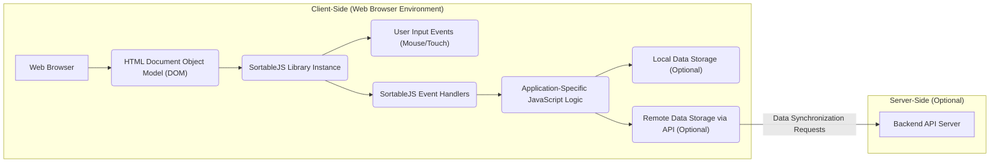

# Project Design Document: SortableJS Integration and Usage

**Version:** 1.1
**Date:** October 26, 2023
**Author:** AI Architecture Expert

## 1. Introduction

This document provides an enhanced design overview of a system integrating the SortableJS library (https://github.com/sortablejs/sortable) to enable drag-and-drop functionality within web applications. This revised document aims to provide a more detailed foundation for subsequent threat modeling activities, offering a clearer understanding of the architecture, data flow, and key components involved in utilizing SortableJS.

## 2. Goals

*   Provide a more granular and detailed overview of how SortableJS is integrated and used within a typical web application.
*   Identify key components and their interactions with a stronger emphasis on security-relevant aspects.
*   Establish a clearer and more detailed understanding of data flow, explicitly highlighting potential attack surfaces and data handling.
*   Serve as a robust and comprehensive basis for conducting a thorough threat model of the system.

## 3. Non-Goals

*   In-depth analysis of the SortableJS library's internal implementation details beyond what is necessary for understanding its integration and potential vulnerabilities.
*   Highly specific implementation details tailored to a single application using SortableJS. This document maintains a general design applicable to various integration scenarios.
*   Detailed performance benchmarking or optimization techniques related to SortableJS.
*   Specific UI/UX design specifications beyond the fundamental drag-and-drop interaction provided by SortableJS.

## 4. System Architecture

The system architecture centers around a client-side web application leveraging the SortableJS library to provide interactive list reordering.

**Components:**

*   **Web Browser:** The user's web browser, responsible for rendering the web page, executing JavaScript, and handling user interactions.
*   **HTML Document Object Model (DOM):** The structured representation of the web page's content. SortableJS directly manipulates the DOM to enable the drag-and-drop functionality.
*   **SortableJS Library Instance:** A specific instantiation of the SortableJS library applied to one or more HTML container elements. This instance manages the drag-and-drop behavior for those elements.
*   **User Input Events (Mouse/Touch):** User actions such as mouse clicks, drags, and touch gestures that initiate the drag-and-drop process.
*   **SortableJS Event Handlers:** Internal functions within the SortableJS library that respond to user input events and manage the visual and logical aspects of the drag-and-drop operation. These also trigger custom events.
*   **Application-Specific JavaScript Logic:** Custom JavaScript code developed for the specific web application. This code initializes SortableJS, configures its options, and handles events emitted by SortableJS to update the application's data model.
*   **Local Data Storage (Optional):** Mechanisms within the browser for storing data, such as `localStorage` or `sessionStorage`. This can be used to persist the order of items locally.
*   **Remote Data Storage via API (Optional):**  Interaction with a backend server through API calls to persist the order of items in a database or other persistent storage.
*   **Backend API Server (Optional):** A server-side application that provides an API for the client-side application to store and retrieve the order of sortable items.

## 5. Data Flow

The data flow within the system involves the following stages:

1. **Initialization and Configuration:**
    *   The web browser loads the HTML page, and the DOM is constructed.
    *   The SortableJS library is loaded and initialized, typically by including its JavaScript file.
    *   Application-specific JavaScript code selects target HTML container elements and creates `Sortable` instances for them. This includes configuring SortableJS options, such as:
        *   `group`: Defining which lists can interact with each other.
        *   `sort`: Enabling or disabling sorting within the list.
        *   `handle`: Specifying which element within a list item acts as the drag handle.
        *   `draggable`: Defining which items within the container are draggable.
        *   Event handlers (e.g., `onAdd`, `onUpdate`, `onRemove`, `onEnd`).
2. **User Initiates Drag Operation:**
    *   The user interacts with a designated draggable element within a SortableJS-enabled container (e.g., by clicking and holding the mouse button or touching and holding).
    *   The browser registers the initial mouse or touch event.
    *   SortableJS intercepts this event based on its configuration and visually indicates that the item is being dragged (e.g., by changing the cursor or applying a visual effect).
3. **During the Dragging Process:**
    *   As the user moves the dragged item, SortableJS continuously updates the visual representation of the list(s), showing the potential new position of the item.
    *   SortableJS manages the movement of the dragged element within the DOM, often using techniques like creating a temporary placeholder element.
4. **User Completes Drag Operation (Drop):**
    *   The user releases the mouse button or lifts their finger, completing the drag-and-drop action.
    *   SortableJS finalizes the reordering of the items in the DOM, moving the dragged element to its new position.
    *   SortableJS triggers specific events, such as:
        *   `onAdd`: When an item is moved from one list to another.
        *   `onUpdate`: When the order of items within the same list changes.
        *   `onRemove`: When an item is removed from a list (due to being moved to another).
        *   `onEnd`:  Triggered at the end of any drag operation. This event provides information about the drag operation, including the moved element, the old index, and the new index.
5. **Application Logic Responds to SortableJS Events:**
    *   The application's JavaScript code has registered event listeners for the SortableJS events.
    *   When a SortableJS event is triggered, the corresponding event handler in the application logic executes.
    *   The event handler typically performs actions such as:
        *   Retrieving the updated order of items in the affected container(s) by querying the DOM.
        *   Updating the application's internal data model to reflect the new order.
6. **Optional Local Data Persistence:**
    *   If the application needs to persist the order locally, the application logic may store the updated order in `localStorage` or `sessionStorage`. This typically involves serializing the order data (e.g., as a JSON string).
7. **Optional Remote Data Synchronization:**
    *   If the application needs to persist the order on a backend server, the application logic makes an API request to the backend. This request usually includes the updated order of items.
    *   The backend API server receives the request, authenticates and authorizes the user (if necessary), and updates the data in the persistent storage (e.g., a database).
8. **Optional Data Retrieval and Initial Rendering:**
    *   When the web page is initially loaded or refreshed, the application may retrieve the persisted order of items from local storage or a backend API.
    *   The application logic then uses this retrieved data to dynamically generate the initial order of the list items in the DOM before SortableJS is initialized.

## 6. Security Considerations

This section details potential security considerations associated with the integration and use of SortableJS.

*   **Client-Side DOM Manipulation Risks:** SortableJS operates directly on the client-side DOM. This exposes the application to risks if the content being sorted is not properly sanitized, potentially leading to Cross-Site Scripting (XSS) vulnerabilities. Malicious scripts could be injected into list items and executed when the list is rendered or manipulated.
*   **Cross-Site Scripting (XSS) via Unsafe Content:** If the data being displayed in the sortable lists originates from untrusted sources (e.g., user-generated content) and is not properly encoded before being inserted into the DOM, attackers can inject malicious scripts. When SortableJS manipulates these elements, the injected scripts can be executed.
*   **Data Integrity Issues with Local Storage:** If `localStorage` is used to persist the order, this data is accessible by any JavaScript code on the same origin. This makes it vulnerable to manipulation by malicious scripts if an XSS vulnerability exists elsewhere in the application. Sensitive information should not be stored directly in `localStorage`.
*   **Session Storage Vulnerabilities:** While `sessionStorage` is scoped to the current browser tab, it is still susceptible to client-side attacks if the application is vulnerable to XSS.
*   **Man-in-the-Middle (MITM) Attacks on API Communication:** When synchronizing the order with a backend server, ensure that all communication occurs over HTTPS to prevent eavesdropping and tampering of the data in transit.
*   **Backend API Security Weaknesses:** If a backend API is used to persist the order, standard API security best practices must be followed, including:
    *   **Authentication:** Verifying the identity of the user making the request.
    *   **Authorization:** Ensuring the user has the necessary permissions to modify the order.
    *   **Input Validation:**  Sanitizing and validating the data received from the client to prevent injection attacks.
    *   **Protection against CSRF (Cross-Site Request Forgery):** Implementing measures to prevent malicious websites from making unauthorized requests on behalf of authenticated users.
*   **Denial of Service (DoS) through Excessive Manipulation:** While less likely, a malicious actor could potentially trigger rapid and excessive reordering of items, potentially impacting client-side performance and causing a denial of service for the user.
*   **Configuration Vulnerabilities in SortableJS:** Incorrect or insecure configuration of SortableJS options can introduce vulnerabilities. For example, allowing drag-and-drop between lists with different security contexts or improperly configuring the `handle` option could be exploited.
*   **Dependency Vulnerabilities:** Ensure that the SortableJS library and any other client-side dependencies are regularly updated to patch known security vulnerabilities. Utilize tools like vulnerability scanners to identify and address outdated dependencies.
*   **Insecure Handling of SortableJS Events:** If the application logic that handles SortableJS events does not properly validate or sanitize data derived from these events (e.g., the old or new index of an item), it could introduce vulnerabilities.

## 7. Dependencies

*   **Web Browser:** A modern web browser with full JavaScript and DOM API support.
*   **SortableJS Library:** The core JavaScript library for enabling drag-and-drop functionality.

## 8. Deployment

SortableJS is typically integrated into a web application through one of the following methods:

*   **Direct Inclusion via `<script>` Tag:** Downloading the SortableJS library files and including them directly in the HTML using a `<script>` tag. This is the simplest method for basic integrations.
*   **Content Delivery Network (CDN):** Linking to the SortableJS library hosted on a CDN. This can improve loading times by leveraging browser caching and geographically distributed servers.
*   **Package Manager (npm, yarn, etc.):** Installing SortableJS as a project dependency using a package manager and then bundling it with the application's JavaScript code using tools like Webpack or Parcel. This is the preferred method for larger, more complex applications.

## 9. Future Considerations

*   **Enhanced Accessibility Features:** Explore and implement accessibility best practices for drag-and-drop interactions, providing alternative input methods and ARIA attributes to ensure usability for users with disabilities.
*   **Advanced SortableJS Features and Security Implications:** Investigate the security implications of more advanced SortableJS features, such as:
    *   **Filtering:** How is filtering implemented and are there any potential bypasses?
    *   **Animation:** Could custom animations introduce any security risks?
    *   **Custom Drag Handlers:** Are there any security considerations when using custom drag handles?
*   **Integration with Frontend Frameworks/Libraries Security:**  Analyze the security considerations specific to integrating SortableJS with popular JavaScript frameworks like React, Angular, and Vue.js, considering framework-specific security features and potential vulnerabilities.
*   **Subresource Integrity (SRI):** When including SortableJS from a CDN, consider using Subresource Integrity (SRI) tags to ensure that the browser fetches the expected files and prevents tampering.