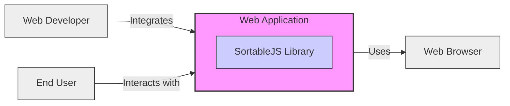
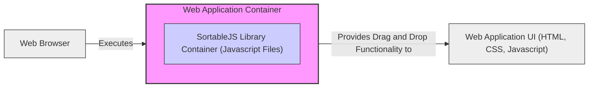
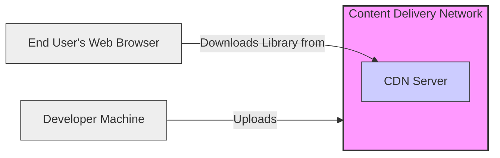

# BUSINESS POSTURE

This project is a Javascript library called SortableJS, designed to enable drag-and-drop functionality in web applications. The primary business goal for projects utilizing SortableJS is to enhance user interface (UI) and user experience (UX) by providing intuitive and interactive elements for list reordering and data manipulation directly within the browser. This leads to improved user satisfaction and potentially increased efficiency in web applications.

Business Priorities:
- Enhance User Experience: Provide a smooth and intuitive drag-and-drop interface for web applications.
- Ease of Integration: Ensure the library is easy to integrate into various Javascript frameworks and web projects.
- Performance: Maintain high performance and responsiveness to ensure a seamless user experience.
- Stability and Reliability: Offer a stable and reliable library that minimizes bugs and compatibility issues.
- Maintainability: Ensure the library is well-maintained and updated to address issues and incorporate new features.

Business Risks:
- Security Vulnerabilities:  Vulnerabilities in the library could be exploited in applications using it, leading to potential security breaches.
- Performance Issues:  Poorly performing library could negatively impact the user experience of applications using it.
- Compatibility Problems:  Incompatibility with different browsers or Javascript frameworks could limit the library's usability.
- Lack of Maintenance:  If the library is not actively maintained, bugs and security issues may not be addressed, and it may become outdated.
- Supply Chain Risks:  Compromised dependencies or build process could introduce malicious code into the library.

# SECURITY POSTURE

Existing Security Controls:
- security control: Open Source Community Review: The library is open source, allowing for community review of the code, which can help identify potential issues. Implemented through GitHub repository and public contributions.
- security control: Public Issue Tracking:  GitHub issue tracker allows users to report bugs and potential security vulnerabilities. Implemented through GitHub repository issue tracker.
- accepted risk: Reliance on Community Security Contributions: Security relies on the vigilance and contributions of the open-source community, which may not be as comprehensive as dedicated security testing.
- accepted risk: Dependency Vulnerabilities:  The library may depend on other Javascript packages, which could have their own vulnerabilities.

Recommended Security Controls:
- security control: Dependency Scanning: Implement automated dependency scanning to identify and address vulnerabilities in the library's dependencies.
- security control: Static Application Security Testing (SAST): Integrate SAST tools into the development process to automatically scan the codebase for potential security flaws.
- security control: Regular Security Audits: Conduct periodic security audits, potentially by external security experts, to identify and address vulnerabilities.
- security control: Security Awareness Training for Contributors: Provide security awareness training for contributors to promote secure coding practices.

Security Requirements:
- Authentication: Not applicable to this Javascript library itself. Authentication is the responsibility of the web application using SortableJS.
- Authorization: Not applicable to this Javascript library itself. Authorization is the responsibility of the web application using SortableJS.
- Input Validation: While SortableJS primarily handles UI events (drag and drop), applications using it should perform input validation on any data manipulated or submitted based on user interactions with the library. Input validation should be implemented in the application code that uses SortableJS.
- Cryptography: Not directly applicable to this Javascript library. Cryptography requirements would be determined by the web application using SortableJS if it handles sensitive data.

# DESIGN

## C4 CONTEXT

Context Diagram Elements:
- Element:
    - Name: Web Application
    - Type: Software System
    - Description: The web application that integrates and utilizes the SortableJS library to provide drag-and-drop functionality to its users.
    - Responsibilities:
        - Integrate SortableJS library into its codebase.
        - Implement application logic that utilizes the drag-and-drop functionality provided by SortableJS.
        - Handle user interactions and data manipulation within the application context.
        - Implement security controls for the application, including authentication, authorization, and input validation where applicable to the application's data and workflows.
    - Security controls:
        - security control: Application-level authentication and authorization.
        - security control: Input validation for data handled by the application.
        - security control: Secure session management.
        - security control: Protection of sensitive data within the application.

- Element:
    - Name: SortableJS Library
    - Type: Software System
    - Description: A Javascript library providing drag-and-drop functionality for HTML elements in web browsers.
    - Responsibilities:
        - Provide core drag-and-drop functionality.
        - Handle browser events related to drag and drop interactions.
        - Allow customization of drag-and-drop behavior through configuration options.
    - Security controls:
        - security control: Code review by open-source community.
        - security control: Public issue reporting and bug fixing.

- Element:
    - Name: Web Browser
    - Type: Technology
    - Description: The web browser used by end-users to access and interact with the web application.
    - Responsibilities:
        - Execute Javascript code, including the SortableJS library.
        - Render the web application's UI.
        - Handle user interactions and browser events.
    - Security controls:
        - security control: Browser security features (e.g., Content Security Policy, Same-Origin Policy).
        - security control: Regular browser updates and security patches managed by the end-user.

- Element:
    - Name: Web Developer
    - Type: Person
    - Description: Developers who integrate the SortableJS library into web applications.
    - Responsibilities:
        - Integrate SortableJS into web application projects.
        - Configure and customize SortableJS to meet application requirements.
        - Ensure proper usage and integration of the library within the application's codebase.
        - Stay updated with library updates and security advisories.
    - Security controls:
        - security control: Secure coding practices.
        - security control: Dependency management and vulnerability scanning during development.

- Element:
    - Name: End User
    - Type: Person
    - Description: Users who interact with web applications that utilize the SortableJS library.
    - Responsibilities:
        - Interact with the drag-and-drop interface provided by the web application.
    - Security controls:
        - security control: User awareness of phishing and malicious websites.
        - security control: Maintaining up-to-date and secure web browser.

## C4 CONTAINER

Container Diagram Elements:
- Element:
    - Name: Web Application Container
    - Type: Container
    - Description: Represents the container for the SortableJS library within a web application. In this case, it's essentially the collection of Javascript files that constitute the library.
    - Responsibilities:
        - Contain the Javascript code of the SortableJS library.
        - Expose the library's API to the web application's UI.
    - Security controls:
        - security control: Minification and obfuscation (optional, for reducing code size and slightly hindering reverse engineering, not strong security).
        - security control: Source code integrity checks during build process.

- Element:
    - Name: SortableJS Library Container (Javascript Files)
    - Type: Container
    - Description: Specific container representing the Javascript files of the SortableJS library.
    - Responsibilities:
        - Implement drag-and-drop logic in Javascript.
        - Interact with the browser's DOM and event system.
    - Security controls:
        - security control: Secure coding practices in Javascript development.
        - security control: Code review and static analysis.

- Element:
    - Name: Web Browser
    - Type: Container
    - Description: The web browser environment where the Javascript code (including SortableJS) is executed.
    - Responsibilities:
        - Execute Javascript code.
        - Render HTML and CSS.
        - Provide browser security features.
    - Security controls:
        - security control: Browser's built-in security features (CSP, SOP, etc.).
        - security control: Browser extensions and security settings managed by the user.

- Element:
    - Name: Web Application UI (HTML, CSS, Javascript)
    - Type: Container
    - Description: The user interface components of the web application that utilize SortableJS.
    - Responsibilities:
        - Define the HTML structure where drag-and-drop functionality is applied.
        - Use Javascript to initialize and configure SortableJS.
        - Handle events and data related to drag-and-drop interactions within the application's UI.
    - Security controls:
        - security control: Secure coding practices in UI development (e.g., preventing XSS).
        - security control: Input validation on data received from user interactions.

## DEPLOYMENT

Deployment Architecture: CDN Delivery

Deployment Diagram Elements:
- Element:
    - Name: CDN (Content Delivery Network)
    - Type: Infrastructure
    - Description: A network of geographically distributed servers that host and deliver the SortableJS library to end-users.
    - Responsibilities:
        - Host the SortableJS library files.
        - Deliver the library files efficiently to end-users based on their location.
        - Ensure high availability and performance for library delivery.
    - Security controls:
        - security control: CDN provider's infrastructure security.
        - security control: HTTPS for secure delivery of library files.
        - security control: Access control to CDN management interfaces.

- Element:
    - Name: CDN Server
    - Type: Infrastructure Component
    - Description: A server within the CDN that stores and serves the SortableJS library files.
    - Responsibilities:
        - Store the library files.
        - Serve the files to requesting browsers.
    - Security controls:
        - security control: Server hardening and security configuration.
        - security control: Regular security patching and updates.

- Element:
    - Name: Developer Machine
    - Type: Infrastructure
    - Description: The machine used by developers to build and upload the SortableJS library to the CDN.
    - Responsibilities:
        - Build and package the library.
        - Upload the library files to the CDN.
    - Security controls:
        - security control: Secure development environment.
        - security control: Access control to CDN upload credentials.
        - security control: Malware protection on developer machine.

- Element:
    - Name: End User's Web Browser
    - Type: Infrastructure
    - Description: The web browser used by end-users to download and execute the SortableJS library from the CDN.
    - Responsibilities:
        - Download the library files from the CDN.
        - Execute the Javascript code in the browser environment.
    - Security controls:
        - security control: Browser security features.
        - security control: HTTPS connection to CDN.

## BUILD

Build Process Diagram:

```mermaid
flowchart LR
  Developer["Developer"] -->|Code Changes, Commits| SourceCodeRepo["Source Code Repository (GitHub)"]
  SourceCodeRepo -->|Triggers Webhook| CI_CD["CI/CD System (GitHub Actions)"]
  CI_CD -->|Build, Test, Lint, Scan| BuildArtifacts["Build Artifacts (Javascript Files)"]
  BuildArtifacts -->|Publish to| CDN_NPM["CDN & NPM Registry"]

  style SourceCodeRepo fill:#f9f,stroke:#333,stroke-width:2px
  style CI_CD fill:#f9f,stroke:#333,stroke-width:2px
  style BuildArtifacts fill:#ccf,stroke:#333,stroke-width:1px
  style CDN_NPM fill:#ccf,stroke:#333,stroke-width:1px
  style Developer fill:#eee,stroke:#333,stroke-width:1px
```

Build Process Description:
The build process for SortableJS likely involves the following steps, focusing on security aspects:

1. Code Development and Commit: Developers write code, commit changes, and push them to the Source Code Repository (GitHub).
2. CI/CD Trigger: Code changes pushed to the repository trigger the CI/CD system (e.g., GitHub Actions).
3. Build, Test, Lint, Scan: The CI/CD pipeline performs the following actions:
    - Build: Compiles and bundles the Javascript code.
    - Test: Executes automated unit and integration tests.
    - Lint: Runs linters to enforce code style and identify potential code quality issues.
    - Scan: Performs security scans, including:
        - security control: Static Application Security Testing (SAST): Scans the source code for potential vulnerabilities.
        - security control: Dependency Scanning: Checks for known vulnerabilities in dependencies.
4. Build Artifacts: If the build, tests, and scans are successful, build artifacts (Javascript files) are created.
5. Publish to CDN & NPM Registry: The build artifacts are published to:
    - CDN: For direct delivery to web browsers.
    - NPM Registry: For developers to install and manage as a dependency in their projects.
    - security control: Signing of published artifacts (e.g., NPM package signing) to ensure integrity and authenticity.

Build Process Security Controls:
- security control: Automated Build Process: CI/CD pipeline ensures consistent and repeatable builds, reducing the risk of manual errors.
- security control: Static Application Security Testing (SAST): Automated SAST tools help identify potential security vulnerabilities in the code.
- security control: Dependency Scanning: Automated dependency scanning identifies vulnerabilities in third-party libraries.
- security control: Code Linting: Linters enforce code quality and can help prevent certain types of vulnerabilities.
- security control: Automated Testing: Automated tests ensure code quality and reduce the risk of introducing bugs, including security-related bugs.
- security control: Secure Credential Management: Securely manage credentials for accessing repositories, CI/CD systems, and publishing platforms.
- security control: Access Control to CI/CD Pipeline: Restrict access to the CI/CD pipeline to authorized personnel.
- security control: Code Signing: Signing of published artifacts ensures integrity and authenticity.

# RISK ASSESSMENT

Critical Business Processes:
The critical business processes being protected are those of the web applications that utilize SortableJS. The library itself is a component that enhances UI/UX, and its failure or compromise could impact the functionality and user experience of these applications. The criticality depends on the specific application using SortableJS. For applications where UI/UX is crucial for user engagement, data manipulation, or critical workflows, SortableJS becomes a more critical component.

Data Sensitivity:
SortableJS itself does not directly handle sensitive data. However, web applications using SortableJS might use it to manipulate or display sensitive data. The sensitivity of the data being indirectly handled depends entirely on the application context. If an application uses SortableJS to reorder lists of financial transactions, personal information, or other sensitive data, then the security of SortableJS and its integration becomes relevant to protecting that sensitive data. The primary data to protect in the context of SortableJS itself is the integrity and availability of the library code to ensure applications using it function correctly and are not compromised by malicious modifications to the library.

# QUESTIONS & ASSUMPTIONS

Questions:
- What types of web applications are the primary users of SortableJS? (e.g., e-commerce, project management, dashboards).
- What is the typical criticality level of applications that integrate SortableJS? (e.g., low, medium, high business impact if compromised).
- Are there specific regulatory compliance requirements for applications using SortableJS (e.g., GDPR, HIPAA, PCI DSS)?
- What is the expected lifetime and maintenance plan for SortableJS?
- Are there specific performance requirements or constraints for applications using SortableJS?

Assumptions:
- BUSINESS POSTURE:
    - The primary business goal for using SortableJS is to improve user experience in web applications.
    - Ease of integration and performance are important business priorities.
    - Security vulnerabilities in SortableJS could pose a risk to applications using it.
- SECURITY POSTURE:
    - Security is primarily addressed through open-source community review and standard development practices.
    - Applications integrating SortableJS are responsible for their own application-level security controls.
    - Dependency scanning and regular updates are important security considerations.
- DESIGN:
    - SortableJS is delivered primarily via CDN and NPM.
    - The build process includes basic security checks like linting and potentially dependency scanning.
    - Deployment is typically CDN-based for public web applications.