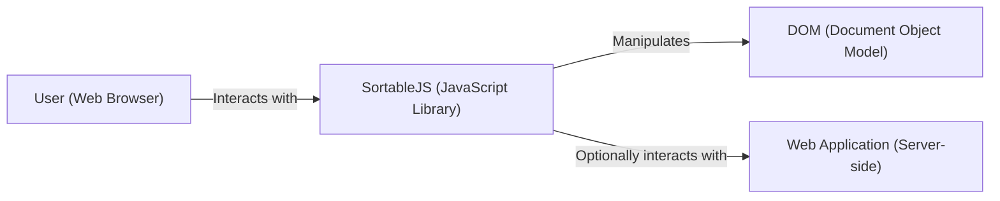
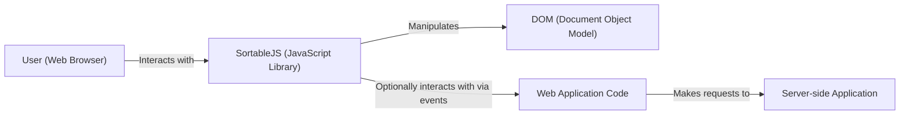
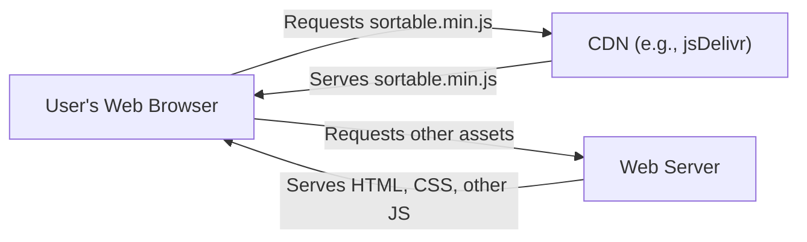
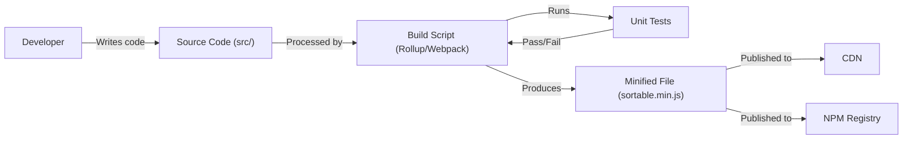

Okay, let's create a design document for the SortableJS library, keeping in mind its purpose and potential security considerations.

# BUSINESS POSTURE

Business Priorities and Goals:

*   Provide a lightweight, dependency-free JavaScript library for creating reorderable drag-and-drop lists.
*   Offer broad browser compatibility, including touch devices.
*   Maintain a simple, easy-to-use API.
*   Ensure high performance and minimal impact on page load times.
*   Foster a strong open-source community with contributions and issue reporting.
*   Provide good documentation and examples.

Most Important Business Risks:

*   Malicious code injection through user-provided configuration or event handlers, leading to Cross-Site Scripting (XSS) vulnerabilities.
*   Denial of Service (DoS) attacks if the library is misused or exploited to cause excessive DOM manipulation or resource consumption.
*   Compatibility issues with other JavaScript libraries or frameworks, leading to unexpected behavior or breakage.
*   Data loss or corruption if the library interacts with server-side data and doesn't handle updates correctly.
*   Reputational damage due to security vulnerabilities or poor performance.

# SECURITY POSTURE

Existing Security Controls:

*   security control: The library itself is primarily focused on client-side DOM manipulation and does not directly handle sensitive data or server-side interactions. This limits the attack surface. (Implicit in the library's design)
*   security control: The library's core functionality is relatively simple, reducing the likelihood of complex vulnerabilities. (Implicit in the library's design)
*   security control: The library is open-source, allowing for community review and identification of potential security issues. (GitHub repository)
*   security control: The library has unit tests. (GitHub repository)

Accepted Risks:

*   accepted risk: The library relies on the user to properly sanitize any user-provided data used in configuration options or event handlers. The library itself does not perform extensive input validation.
*   accepted risk: The library does not provide built-in protection against DoS attacks. It's the user's responsibility to ensure the library is used in a way that doesn't cause excessive resource consumption.
*   accepted risk: The library does not directly handle server-side data persistence. Any data updates resulting from list reordering must be handled by the user's application code.

Recommended Security Controls:

*   security control: Provide clear documentation and examples demonstrating how to securely use the library, especially when dealing with user-provided data.
*   security control: Consider adding optional input sanitization features or recommendations for integrating with existing sanitization libraries.
*   security control: Implement a Content Security Policy (CSP) to mitigate the impact of potential XSS vulnerabilities. This is a responsibility of the user integrating the library, but guidance should be provided.
*   security control: Add security tests to the test suite.

Security Requirements:

*   Authentication: Not directly applicable, as the library operates on the client-side and doesn't handle user authentication.
*   Authorization: Not directly applicable, as the library doesn't manage user roles or permissions.
*   Input Validation:
    *   The library should provide guidance on validating user-provided data used in configuration options (e.g., `group`, `handle`, `filter`, etc.).
    *   Consider adding optional built-in sanitization for specific options that are more prone to XSS (e.g., custom HTML content).
*   Cryptography: Not directly applicable, as the library doesn't handle encryption or cryptographic operations.

# DESIGN

## C4 CONTEXT

Element Descriptions:

*   Element:
    *   Name: User (Web Browser)
    *   Type: Person
    *   Description: The end-user interacting with a web page that utilizes SortableJS.
    *   Responsibilities:
        *   Initiates drag-and-drop actions.
        *   Views the reordered list.
        *   May trigger server-side updates based on list changes (indirectly, through the Web Application).
    *   Security Controls:
        *   Browser's built-in security mechanisms (e.g., same-origin policy, XSS protection).
        *   Content Security Policy (CSP) implemented by the Web Application.

*   Element:
    *   Name: SortableJS (JavaScript Library)
    *   Type: Software System
    *   Description: The core SortableJS library, providing drag-and-drop functionality.
    *   Responsibilities:
        *   Handles drag-and-drop events.
        *   Manipulates the DOM to reflect list reordering.
        *   Provides callbacks for user interaction.
    *   Security Controls:
        *   Relies on user-provided input sanitization.
        *   Simple core functionality.
        *   Open-source code review.

*   Element:
    *   Name: DOM (Document Object Model)
    *   Type: Software System
    *   Description: The browser's representation of the web page's structure.
    *   Responsibilities:
        *   Provides the structure that SortableJS manipulates.
        *   Renders the visual representation of the list.
    *   Security Controls:
        *   Browser's built-in DOM security mechanisms.

*   Element:
    *   Name: Web Application (Server-side)
    *   Type: Software System
    *   Description: An optional server-side application that may interact with SortableJS to persist list changes.
    *   Responsibilities:
        *   Receives data updates from the client-side (e.g., via AJAX).
        *   Persists changes to a database or other storage.
        *   Provides data to populate the initial list.
    *   Security Controls:
        *   Standard server-side security measures (authentication, authorization, input validation, output encoding, etc.).

## C4 CONTAINER

Since SortableJS is a JavaScript library, the container diagram is essentially an extension of the context diagram.

Element Descriptions:

*   Element:
    *   Name: User (Web Browser)
    *   Type: Person
    *   Description: The end-user interacting with a web page.
    *   Responsibilities: Initiates drag-and-drop, views reordered list.
    *   Security Controls: Browser's built-in security.

*   Element:
    *   Name: SortableJS (JavaScript Library)
    *   Type: JavaScript Library
    *   Description: Provides drag-and-drop functionality.
    *   Responsibilities: Handles events, manipulates DOM.
    *   Security Controls: Relies on user-provided input sanitization.

*   Element:
    *   Name: DOM (Document Object Model)
    *   Type: Browser API
    *   Description: Browser's representation of the page structure.
    *   Responsibilities: Provides structure, renders visual representation.
    *   Security Controls: Browser's built-in DOM security.

*   Element:
    *   Name: Web Application Code
    *   Type: JavaScript Code
    *   Description: The user's application code that integrates with SortableJS.
    *   Responsibilities: Initializes SortableJS, handles events, communicates with the server.
    *   Security Controls: Input validation, output encoding, secure communication with the server.

*   Element:
    *   Name: Server-side Application
    *   Type: Web Application
    *   Description: Optional server-side application.
    *   Responsibilities: Persists changes, provides data.
    *   Security Controls: Standard server-side security measures.

## DEPLOYMENT

SortableJS is a client-side library, so deployment typically involves including the library file (sortable.min.js) in a web page.  There are several deployment options:

1.  **Direct Download:** Download the library file and host it on your web server.
2.  **CDN (Content Delivery Network):** Use a CDN like jsDelivr or cdnjs to include the library. This is the recommended approach for most users.
3.  **Package Manager:** Use a package manager like npm or yarn to install the library as a dependency. This is common for projects using build tools like Webpack or Parcel.

Chosen Deployment Solution (CDN):

Element Descriptions:

*   Element:
    *   Name: User's Web Browser
    *   Type: Web Browser
    *   Description: The user's browser accessing the web page.
    *   Responsibilities: Requests and executes SortableJS, renders the page.
    *   Security Controls: Browser's built-in security mechanisms.

*   Element:
    *   Name: CDN (e.g., jsDelivr)
    *   Type: Content Delivery Network
    *   Description: A distributed network of servers that delivers SortableJS.
    *   Responsibilities: Serves SortableJS quickly and reliably.
    *   Security Controls: CDN's security measures (e.g., HTTPS, DDoS protection).

*   Element:
    *   Name: Web Server
    *   Type: Web Server
    *   Description: The server hosting the web application's other assets.
    *   Responsibilities: Serves HTML, CSS, and other JavaScript files.
    *   Security Controls: Standard web server security measures.

## BUILD

SortableJS uses a build process to create the minified distribution file (sortable.min.js).  The process involves:

1.  **Source Code:** Developers write and modify the source code (JavaScript files in the `src/` directory).
2.  **Build Script:** A build script (typically using tools like Rollup or Webpack) is used to:
    *   Concatenate the source files.
    *   Transpile the code (e.g., from ES6+ to ES5 for broader compatibility).
    *   Minify the code (remove whitespace and shorten variable names) to reduce file size.
3.  **Testing:** Unit tests are run to ensure the code functions correctly.
4.  **Distribution:** The resulting minified file (sortable.min.js) is made available for download, CDN inclusion, and package manager installation.

Security Controls in Build Process:

*   security control: Unit Tests: The test suite helps ensure code quality and can catch potential security regressions.
*   security control: Code Review: The open-source nature of the project allows for community code review, which can identify vulnerabilities.
*   security control: Dependency Management: Package managers (npm, yarn) help manage dependencies and can be used with tools to identify known vulnerabilities in dependencies (e.g., `npm audit`).  SortableJS has no dependencies, which eliminates this risk.
*   security control: Linting: Linters (e.g., ESLint) can be used to enforce coding standards and identify potential security issues.

# RISK ASSESSMENT

Critical Business Processes:

*   Providing a functional and reliable drag-and-drop library.
*   Maintaining a positive reputation within the developer community.

Data to Protect:

*   SortableJS itself does not directly handle sensitive user data. However, it *indirectly* manipulates data represented in the DOM. The sensitivity of this data depends entirely on the web application using SortableJS.
*   Data Sensitivity:
    *   If SortableJS is used to reorder a list of public blog post titles, the data sensitivity is low.
    *   If SortableJS is used to reorder items in a shopping cart, the data sensitivity is medium (potential financial impact).
    *   If SortableJS is used to reorder elements containing personal information (e.g., addresses, phone numbers), the data sensitivity is high.

# QUESTIONS & ASSUMPTIONS

Questions:

*   Are there any specific security standards or compliance requirements that the web application using SortableJS must adhere to (e.g., PCI DSS, HIPAA)? This will influence the overall security posture.
*   What is the expected scale of usage? This will help determine the potential impact of DoS attacks.
*   What is the level of trust in the users who will be interacting with the SortableJS-enabled lists? This will influence the need for input validation and sanitization.

Assumptions:

*   BUSINESS POSTURE: The primary goal is to provide a functional and reliable library, with security being a secondary but important consideration.
*   SECURITY POSTURE: The user integrating SortableJS is responsible for the overall security of their web application, including input validation, server-side security, and data protection.
*   DESIGN: SortableJS will be used primarily in a web browser environment, and interaction with server-side systems is optional and handled by the user's application code. The library will be included via CDN or direct download.