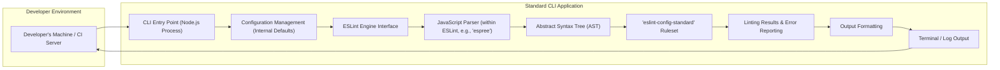

# Project Design Document: Standard JavaScript Style Guide and Linter

**Version:** 1.1
**Date:** October 26, 2023
**Author:** AI Software Architect

## 1. Introduction

This document provides an enhanced design overview of the `standard` project, a widely adopted JavaScript style guide and linter. It builds upon the previous version, offering more detail and clarity to facilitate effective threat modeling. This document details the project's architecture, data flow, and key components, highlighting potential areas of security concern.

## 2. Project Overview

The `standard` project is a prescriptive JavaScript style guide, implemented as a command-line interface (CLI) tool. It leverages ESLint with a predefined, non-configurable set of rules to enforce consistent code style, promoting readability and maintainability. The core philosophy is "no decisions" regarding style, simplifying the linting setup and reducing stylistic debates.

## 3. Goals

*   Enforce a strict and consistent JavaScript coding style across projects.
*   Provide an opinionated, zero-configuration linting experience out-of-the-box.
*   Improve the overall quality, readability, and maintainability of JavaScript codebases.
*   Minimize time spent on stylistic code reviews and discussions.
*   Offer a straightforward and user-friendly CLI tool for developers.
*   Enable seamless integration with various development workflows and tools.

## 4. Non-Goals

*   Providing extensive customization options for linting rules.
*   Acting as a comprehensive static analysis tool beyond style and basic error detection.
*   Serving as a JavaScript compiler, transpiler, or bundler.
*   Supporting highly complex or project-specific linting configurations.

## 5. Architecture

The `standard` project's architecture centers around a CLI application that orchestrates the ESLint engine with a pre-configured rule set.

**Component Descriptions:**

*   **CLI Entry Point (Node.js Process):** The main executable script (`standard` command) that parses command-line arguments (e.g., file paths) and initiates the linting process.
*   **Configuration Management (Internal Defaults):**  While aiming for zero configuration, `standard` internally manages the loading and application of the default `eslint-config-standard` ruleset. It might handle minimal internal settings.
*   **ESLint Engine Interface:**  The layer that interacts with the ESLint library's programmatic API. This component feeds the code to be linted and receives the results.
*   **JavaScript Parser (within ESLint, e.g., 'espree'):**  A core part of ESLint responsible for parsing the input JavaScript code into an Abstract Syntax Tree (AST). The specific parser used is typically a dependency of ESLint.
*   **Abstract Syntax Tree (AST):** A hierarchical representation of the code's structure, generated by the parser. This is the primary data structure used by the linting rules for analysis.
*   **'eslint-config-standard' Ruleset:**  A specific ESLint configuration package (`eslint-config-standard`) that defines the complete set of linting rules enforced by `standard`. This is a crucial dependency.
*   **Linting Results & Error Reporting:** The output from the ESLint engine, detailing any violations of the configured rules found in the analyzed code. This includes error messages, locations, and severity levels.
*   **Output Formatting:**  A module responsible for transforming the raw linting results into a user-friendly format for display in the terminal or logs.
*   **Terminal / Log Output:** The formatted linting report displayed to the user or recorded in logs, indicating any style violations or potential errors.

## 6. Data Flow

The data flow illustrates how JavaScript code is processed by `standard` to produce a linting report.

**Detailed Data Flow Steps:**

1. **Input: JavaScript Code Files:** The JavaScript code to be analyzed is provided as input, typically as file paths passed to the `standard` CLI command.
2. **CLI Entry Point:** The CLI tool receives the file paths and initiates the linting process by invoking the ESLint engine.
3. **ESLint Engine:** The `standard` CLI interacts with the ESLint engine, providing the code content to be analyzed.
4. **JavaScript Parser:** ESLint utilizes a configured JavaScript parser (e.g., espree) to parse the input JavaScript code into a structured representation.
5. **Abstract Syntax Tree (AST):** The parser generates an Abstract Syntax Tree (AST), which represents the syntactic structure of the code.
6. **'eslint-config-standard' Rules:** The ESLint engine loads and applies the linting rules defined in the `eslint-config-standard` package.
7. **Linting Process & Rule Evaluation:** The ESLint engine traverses the AST and evaluates each node against the configured linting rules.
8. **Linting Results (Violations):**  When a rule violation is detected, the ESLint engine generates a linting result, including the location, message, and severity of the violation.
9. **Output Formatter:** The raw linting results are passed to an output formatter module within `standard` or ESLint.
10. **Output: Linting Report (Terminal/Logs):** The formatter generates a human-readable report, typically displayed in the terminal or written to log files, detailing the identified linting issues.

## 7. Key Components

*   **`eslint` (Core Dependency):** The foundational JavaScript linting library that provides the core engine for parsing, rule application, and reporting.
*   **`eslint-config-standard` (Configuration):**  The npm package containing the specific set of ESLint rules and their configurations that define the "standard" JavaScript style. This is the heart of the project's style enforcement.
*   **Command-Line Interface (CLI):** The primary interface for users to interact with `standard`. Built using Node.js, it handles command-line argument parsing, file system interaction, and invoking the linting process.
*   **JavaScript Parser (e.g., `espree`):**  While a dependency of ESLint, the specific parser used is a critical component for understanding how the code is interpreted.
*   **Output Formatting Module:**  Responsible for presenting the linting results in a clear and informative way. This might be part of `standard` itself or leverage ESLint's formatters.
*   **Dependencies (npm Packages):**  `standard` relies on a collection of npm packages for its functionality, including ESLint, the standard configuration, and potentially plugins for specific rule sets.

## 8. Dependencies

This list highlights key dependencies and their roles:

*   **Core Linting:**
    *   `eslint`: The core JavaScript linting engine.
    *   `eslint-config-standard`: The preset configuration defining the standard rules.
*   **ESLint Plugins (Included in `eslint-config-standard`):**
    *   `eslint-plugin-import`: For linting import/export statements.
    *   `eslint-plugin-n`: For Node.js specific linting rules.
    *   `eslint-plugin-promise`: For enforcing best practices with Promises.
*   **JavaScript Parser (Indirect Dependency of ESLint):**
    *   `espree` (or similar):  Parses JavaScript code into an AST.
*   **Runtime Environment:**
    *   `node`: The JavaScript runtime environment required to execute the CLI tool.
*   **Package Management:**
    *   `npm` or `yarn`: Used for installing and managing project dependencies.

## 9. Deployment Scenarios

*   **Local Development Environment:** Developers install `standard` as a development dependency and run it via the command line to check code style during development.
*   **Continuous Integration/Continuous Deployment (CI/CD) Pipelines:** `standard` is integrated into CI/CD pipelines to automatically enforce code style on every commit, pull request, or build.
*   **Code Editor Integration:** Plugins for various code editors allow developers to see linting errors and warnings in real-time as they write code.
*   **Pre-commit Hooks:**  `standard` can be configured to run automatically before code is committed using tools like Husky or lint-staged, preventing code with style violations from being checked in.
*   **Standalone CLI Tool:** Developers can install `standard` globally and use it to lint JavaScript files in any project.

## 10. Security Considerations (For Threat Modeling)

This section outlines potential security considerations relevant for threat modeling:

*   **Dependency Vulnerabilities:** `standard` relies on numerous npm packages. Vulnerabilities in these dependencies (especially `eslint` and its plugins) could be exploited if `standard` processes untrusted code or if the development environment is compromised. Regular dependency updates and security audits are crucial.
*   **Malicious Code in Input:** While `standard` doesn't execute the input code, vulnerabilities in the underlying ESLint engine or the JavaScript parser could potentially be exploited by specially crafted malicious JavaScript code designed to cause denial-of-service (DoS) or other unexpected behavior during parsing or linting.
*   **Denial of Service (Resource Exhaustion):**  Maliciously crafted or extremely large JavaScript files could potentially cause the parser or linting rules to consume excessive CPU or memory resources, leading to a denial of service, particularly in CI/CD environments.
*   **Supply Chain Attacks:**  Compromise of the `standard` package itself, its direct dependencies (like `eslint-config-standard`), or indirect dependencies on npm could lead to the distribution of malicious code to a large number of users. Verification of package integrity is important.
*   **Configuration Manipulation (Limited Scope):** While `standard` aims for zero configuration, any mechanisms for extending or overriding the configuration (even if discouraged) could be potential attack vectors if not handled securely. Understanding the scope of any allowed configuration is important.
*   **Information Disclosure (Indirect):**  Verbose error messages or debugging output from the linting process might inadvertently reveal sensitive information about the codebase structure or internal paths. Care should be taken to control the verbosity of output in production or shared environments.
*   **Regex Denial of Service (ReDoS):** If any of the linting rules rely on complex regular expressions, specially crafted input code could potentially trigger catastrophic backtracking, leading to a denial of service.

This enhanced design document provides a more detailed understanding of the `standard` project's architecture and data flow, specifically tailored for effective threat modeling. The identified security considerations serve as a starting point for a more in-depth security analysis.