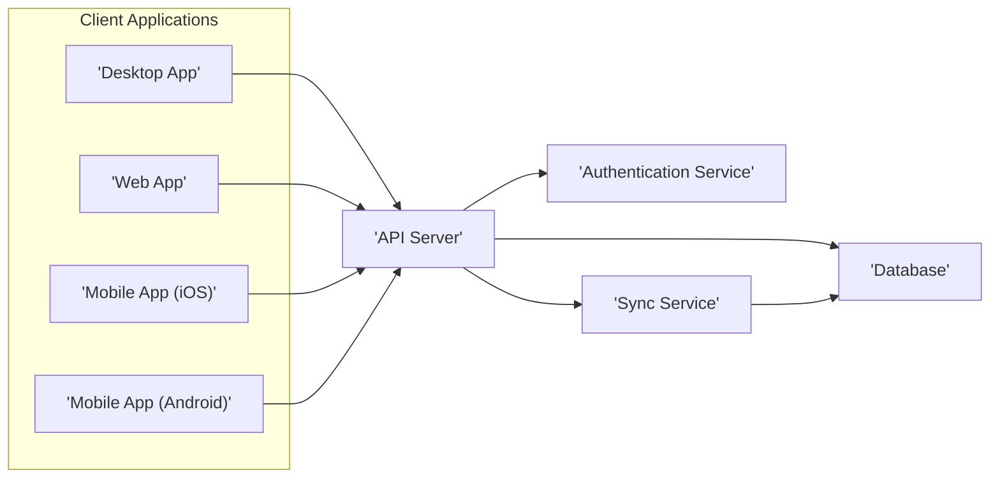
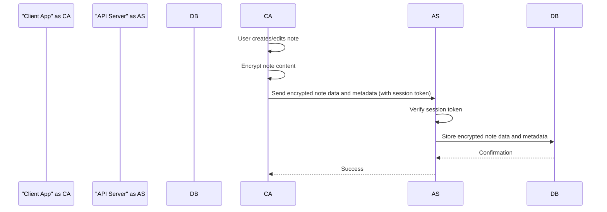
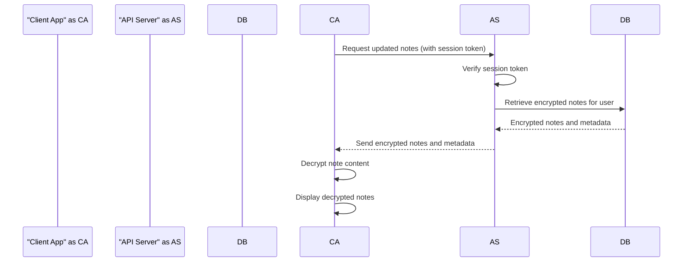
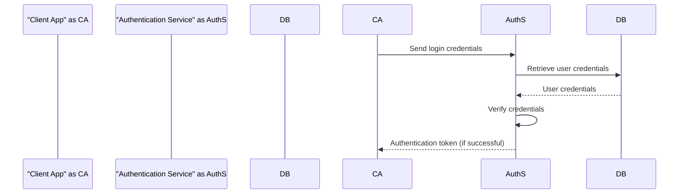

# Project Design Document: Standard Notes Application

**Version:** 1.1
**Date:** October 26, 2023
**Author:** AI Software Architect

## 1. Introduction

This document provides a detailed architectural design of the Standard Notes application, based on the publicly available codebase at [https://github.com/standardnotes/app](https://github.com/standardnotes/app). This document aims to provide a comprehensive understanding of the system's components, their interactions, and data flow, which will serve as the foundation for subsequent threat modeling activities. This revision includes more detail on component responsibilities and potential technologies.

## 2. Project Overview

Standard Notes is a free, open-source, and end-to-end encrypted note-taking application. Its core features include:

*   Secure creation and management of plain text and rich text notes.
*   Robust organization of notes using tags and nested folders (through extensions).
*   Seamless synchronization of notes across a variety of devices and platforms.
*   Strong end-to-end encryption of note content, attachments (if enabled), and other sensitive user data.
*   Extensibility through a plugin system, allowing for added features and customization via extensions and themes.

This design document focuses on the core application architecture and does not delve into the specifics of individual extensions or themes beyond their interaction points with the core system.

## 3. System Architecture

The Standard Notes application follows a client-server architecture with a strong emphasis on client-side encryption, ensuring user data privacy and security.

### 3.1. Components

*   **Client Applications:** These are the user-facing applications that provide the interface for interacting with notes.
    *   **Desktop Application:** A standalone application built using Electron, offering cross-platform compatibility (macOS, Windows, Linux). This client handles local encryption/decryption and interacts with the API Server.
    *   **Web Application:** A browser-based application, typically built with JavaScript frameworks (e.g., React), providing access to notes through a web browser. Similar to the desktop app, it manages local encryption/decryption.
    *   **Mobile Applications (iOS and Android):** Native mobile applications developed for their respective platforms (Swift/Objective-C for iOS, Kotlin/Java for Android). These applications leverage platform-specific features and handle encryption/decryption locally.
*   **API Server:** The backend server acts as the central hub for user authentication, data synchronization, and account management.
    *   Likely implemented using a framework like Ruby on Rails (as indicated by the repository structure).
    *   Responsible for receiving encrypted data from clients and storing it securely.
    *   Handles user registration, login, password resets, and potentially subscription management for paid features.
    *   Does *not* have access to the decryption keys or the decrypted content of notes.
*   **Database:** Stores persistent data for the application.
    *   Likely a relational database such as PostgreSQL or MySQL, used to store user accounts, encrypted note blobs, metadata (e.g., timestamps, tags), and potentially extension settings.
    *   Encryption at rest for the database is a likely security measure.
*   **Authentication Service:** Manages user identities and authentication.
    *   Could be integrated within the API Server or implemented as a separate service for better separation of concerns.
    *   Handles the generation and validation of authentication tokens (e.g., JWT).
    *   Manages password hashing and storage using secure algorithms.
*   **Sync Service:**  The core logic for synchronizing encrypted data between different client applications.
    *   Likely a logical component within the API Server, handling requests for fetching and updating encrypted note data.
    *   Ensures data consistency across multiple devices.
*   **Extensions/Themes Infrastructure:** Enables the integration of additional functionality and customization.
    *   Client applications provide a mechanism to load and execute extension code (typically JavaScript).
    *   Extensions can interact with the core application through a defined API, allowing them to add features like rich text editing, markdown support, or custom themes.

### 3.2. Architecture Diagram

### 3.3. Component Interactions

*   **User Registration:**
    *   Client application sends registration details (username, email, password) to the Authentication Service (via the API Server).
    *   Authentication Service creates a new user account, securely hashing the password before storing it in the database.
    *   The API Server might also create user-specific data structures in the database.
*   **User Login:**
    *   Client application sends login credentials to the Authentication Service (via the API Server).
    *   Authentication Service verifies the provided password against the stored hash.
    *   Upon successful authentication, the Authentication Service issues a session token (e.g., JWT).
    *   The session token is returned to the client application and included in subsequent API requests for authorization.
*   **Note Creation/Update:**
    *   User creates or modifies a note in the client application.
    *   The note content is encrypted locally on the client device using a user-derived key (often based on the user's password).
    *   The encrypted note data, along with metadata (e.g., title, tags, timestamps), is sent to the API Server.
    *   The API Server, after verifying the user's session token, stores the encrypted data and metadata in the database, associated with the user's account.
*   **Note Synchronization:**
    *   Client application periodically or on-demand requests updated notes from the Sync Service (via the API Server), providing the session token.
    *   The Sync Service queries the database for encrypted notes associated with the user, potentially filtering by modification timestamps to optimize the process.
    *   The API Server sends the encrypted notes and metadata to the requesting client application.
    *   The client application decrypts the notes locally using the user-derived key.
*   **Extension/Theme Loading and Interaction:**
    *   Client application loads extensions and themes from local storage or potentially downloads them from a designated source (e.g., a marketplace or directly from a URL).
    *   Extensions interact with the client application's core functionality by using provided APIs to access and manipulate note data, UI elements, and other application features. This interaction happens entirely within the client application.

## 4. Data Flow

This section details the movement and transformation of data within the Standard Notes application, focusing on the lifecycle of a note and user authentication.

### 4.1. Note Creation and Synchronization

### 4.2. Note Retrieval and Decryption

### 4.3. User Authentication Flow

## 5. Security Considerations

Security is a core design principle of Standard Notes. Key security features and considerations include:

*   **End-to-End Encryption (E2EE):** Notes and attachments are encrypted on the user's device before transmission and remain encrypted until decrypted on another authorized device. This ensures that even the server administrators cannot access the content.
*   **Client-Side Encryption with User-Derived Keys:** Encryption keys are derived from the user's password or passphrase using a key derivation function (KDF) like PBKDF2 or Argon2. This means the server never stores the actual encryption keys.
*   **Secure Authentication and Authorization:** Robust authentication mechanisms (e.g., password-based authentication, potentially multi-factor authentication) and secure session management (e.g., using JWTs with appropriate expiration and signing) are crucial.
*   **Data at Rest Encryption:** The database storing encrypted data should also employ encryption at rest to protect against unauthorized physical access to the database storage.
*   **Transport Layer Security (TLS/HTTPS):** All communication between client applications and the API Server must be encrypted using TLS/HTTPS to protect data in transit.
*   **Regular Security Audits:**  The open-source nature allows for community audits, and professional security audits are recommended to identify and address potential vulnerabilities.
*   **Content Security Policy (CSP):**  The web application should implement a strong CSP to mitigate the risk of cross-site scripting (XSS) attacks.
*   **Input Sanitization and Validation:** Both client and server-side input validation are necessary to prevent injection attacks.
*   **Rate Limiting:** Implementing rate limiting on API endpoints can help prevent brute-force attacks and denial-of-service attacks.

## 6. Deployment Model

Standard Notes offers flexibility in deployment:

*   **Standard Notes Hosted Service (standardnotes.com):** This is the most common deployment model where users rely on the infrastructure managed by the Standard Notes team.
    *   The Standard Notes team manages the API Server, Database, Authentication Service, and related infrastructure.
    *   This offers convenience and ease of use for end-users.
*   **Self-Hosted Deployment:** Users can choose to deploy and manage their own Standard Notes backend infrastructure.
    *   This provides greater control over data and infrastructure but requires technical expertise to set up and maintain.
    *   Typically involves deploying the API Server and Database components on their own servers or cloud infrastructure.
    *   The client applications can be configured to point to the user's self-hosted server.
*   **Potential for Enterprise Deployment:** Organizations might deploy Standard Notes on their private infrastructure to maintain full control over their data and security policies.

## 7. Assumptions and Constraints

*   User devices are assumed to be reasonably secure and not compromised by malware that could steal encryption keys before data is encrypted.
*   The security of the end-to-end encryption is heavily reliant on the strength and secrecy of the user's master password/passphrase.
*   The implementation of cryptographic algorithms and protocols is assumed to be correct and secure.
*   This document focuses on the core application architecture. The security of third-party extensions is the responsibility of their respective developers.

## 8. Out of Scope

The following are explicitly excluded from the scope of this design document:

*   Detailed internal design and implementation specifics of individual client applications (e.g., specific UI frameworks or state management solutions).
*   In-depth implementation details of individual extensions and themes, including their specific functionalities and security measures.
*   Detailed infrastructure setup, configuration management, and monitoring for the hosted service or self-hosted deployments.
*   Specific cryptographic algorithms and libraries used for encryption and key derivation.
*   Detailed code-level implementation of the API Server and database interactions.
*   Specific business logic related to subscription management or payment processing (if applicable).
*   Detailed design of the Standard Notes website or other related services.

This improved design document provides a more detailed and comprehensive overview of the Standard Notes application architecture, making it a more effective resource for threat modeling and security analysis.
