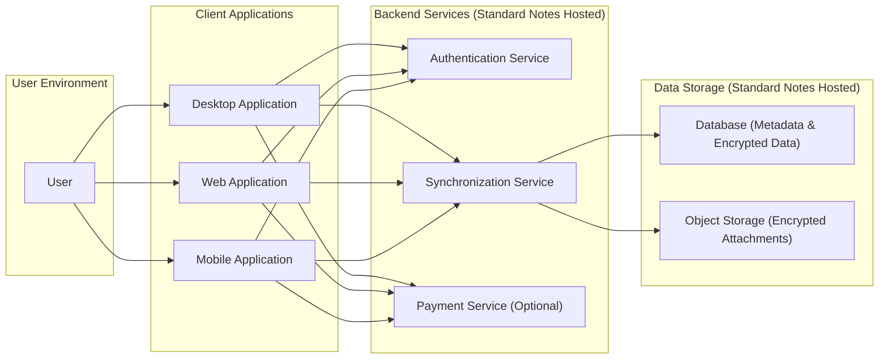
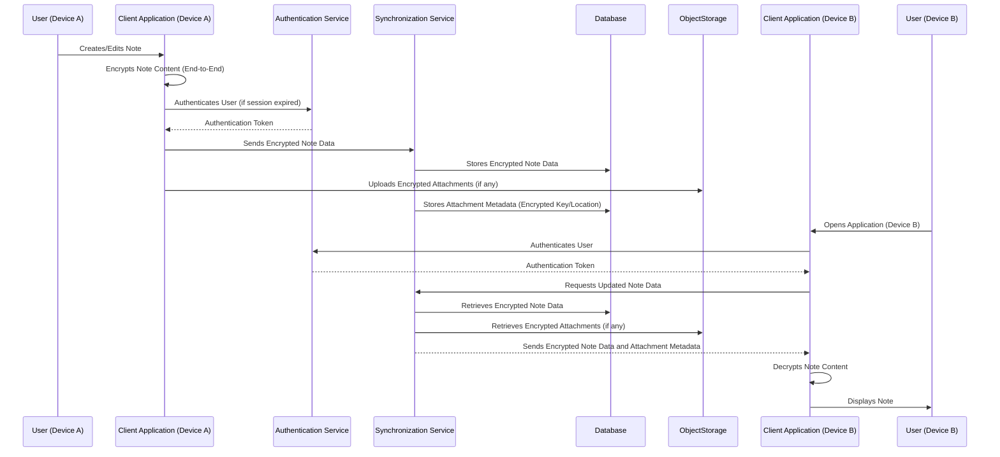

## Project Design Document: Standard Notes Application (Improved)

**1. Introduction**

This document provides an enhanced high-level architectural design of the Standard Notes application, based on the open-source codebase available at [https://github.com/standardnotes/app](https://github.com/standardnotes/app). This revised document aims to offer a more comprehensive understanding of the system's components, their interactions, and data flow, specifically tailored for subsequent threat modeling activities. It builds upon the previous version by adding more detail and clarity.

**2. Goals and Objectives**

The primary goals of the Standard Notes application are:

*   Provide a secure and private platform for users to create, store, and manage notes with a strong emphasis on data protection.
*   Offer seamless cross-platform compatibility across desktop, web, and mobile environments, ensuring consistent user experience.
*   Ensure user data is end-to-end encrypted, guaranteeing only the user can access their note content.
*   Enable reliable and efficient synchronization of notes across multiple devices used by the same user.
*   Offer extensibility through a plugin system, allowing users to customize functionality, and themes for visual personalization.

**3. High-Level Architecture**

The Standard Notes application architecture comprises the following key components and their relationships:

**4. Component Details**

This section provides a more detailed description of each component, outlining its responsibilities and key technologies.

*   **User:** The individual who utilizes the Standard Notes application to create, manage, and access their notes.

*   **Client Applications:** The user-facing interfaces for interacting with the application.
    *   **Desktop Application:** A standalone application installed on the user's computer, offering a rich feature set.
        *   Responsibilities: Note creation, editing, viewing, local encrypted storage of notes (before sync), initiating synchronization, managing plugins and themes, handling user authentication.
        *   Key Technologies: JavaScript, Electron framework, platform-specific APIs for local storage and system integration.
    *   **Web Application:** Accessed through a web browser, providing core note-taking functionalities without requiring installation.
        *   Responsibilities: Note creation, editing, viewing, browser-based encrypted storage (using browser APIs), initiating synchronization, managing plugins and themes.
        *   Key Technologies: JavaScript, HTML, CSS, a modern JavaScript framework (e.g., React, Vue), browser storage APIs.
    *   **Mobile Application:** Native applications for iOS and Android devices, optimized for mobile use.
        *   Responsibilities: Note creation, editing, viewing, device-specific encrypted storage, initiating synchronization, managing plugins and themes.
        *   Key Technologies: Swift/Objective-C (iOS), Kotlin/Java (Android), platform-specific APIs for secure storage and background processes.

*   **Backend Services (Standard Notes Hosted):**  The server-side components managed by Standard Notes.
    *   **Authentication Service:** Manages user accounts and verifies user credentials.
        *   Responsibilities: User registration, login, session management, password reset, multi-factor authentication (potentially), generating and managing authentication tokens.
        *   Key Technologies: Likely a standard web framework (e.g., Node.js with Express, Python with Django/Flask), database interaction libraries, secure password hashing algorithms (e.g., Argon2, bcrypt).
    *   **Synchronization Service:** Orchestrates the secure synchronization of encrypted notes between user devices and the backend storage.
        *   Responsibilities: Receiving encrypted note data from clients, securely storing it in the database, retrieving encrypted data for other authorized devices, handling conflict resolution (potentially), managing synchronization queues. Crucially, it does not have access to the decrypted note content.
        *   Key Technologies: Likely a robust web framework, database interaction libraries, potentially message queuing systems (e.g., Kafka, RabbitMQ) for handling asynchronous synchronization tasks.
    *   **Payment Service (Optional):** Manages user subscriptions and payment processing for premium features.
        *   Responsibilities: Handling payment transactions (likely through integration with third-party payment processors like Stripe or Paddle), managing user subscription status, associating premium features with user accounts, handling billing-related notifications.
        *   Key Technologies: Likely a standard web framework, integration with payment gateway APIs, database for storing subscription information.

*   **Data Storage (Standard Notes Hosted):** The persistent storage for application data.
    *   **Database (Metadata & Encrypted Data):** Stores user account information, metadata about notes (creation date, modification date, titles), and the core encrypted content of the notes.
        *   Responsibilities: Persistent storage of user data and encrypted note content, ensuring data integrity and availability.
        *   Key Technologies: A relational database (e.g., PostgreSQL, MySQL) or a NoSQL database, chosen for its reliability and scalability. Encryption at rest for the database itself is crucial.
    *   **Object Storage (Encrypted Attachments):** Stores user-uploaded files and attachments associated with notes, also encrypted.
        *   Responsibilities: Secure and scalable storage for binary data (attachments), ensuring data integrity and availability. Attachments are likely encrypted client-side before upload.
        *   Key Technologies: Cloud object storage services (e.g., AWS S3, Google Cloud Storage, Azure Blob Storage), chosen for their scalability, durability, and cost-effectiveness.

**5. Data Flow (Note Creation and Synchronization)**

This section illustrates the typical data flow for a user creating a note on one device and accessing it on another.

**6. Security Considerations**

This section expands on the key security considerations inherent in the design, providing more specific examples.

*   **Robust End-to-End Encryption:**  Employs strong cryptographic algorithms (e.g., AES-256) and secure key management practices. User keys are derived from their passwords and are not stored on the server.
*   **Secure Authentication and Authorization:** Utilizes secure password hashing with salts, potentially incorporates multi-factor authentication (MFA), and employs secure session management techniques (e.g., HTTP-only, secure cookies). Authorization mechanisms ensure users can only access their own data.
*   **Data Security at Rest:**  The database and object storage should implement encryption at rest to protect data even if the storage media is compromised. Access controls should be strictly enforced.
*   **Secure Communication Channels:** All communication between client applications and backend services must be encrypted using TLS/HTTPS to protect data in transit from eavesdropping and tampering.
*   **Input Validation and Sanitization:**  Both client-side and server-side input validation is crucial to prevent injection attacks (e.g., SQL injection, cross-site scripting). Data should be sanitized before being stored or displayed.
*   **Regular Security Audits and Penetration Testing:**  Independent security assessments should be conducted regularly to identify potential vulnerabilities in the application and infrastructure.
*   **Dependency Management and Vulnerability Scanning:**  Keeping all software dependencies up-to-date and regularly scanning for known vulnerabilities is essential to maintain a secure environment.
*   **Secure Key Derivation and Management:** The process of deriving encryption keys from user passwords must be robust and resistant to brute-force attacks. Secure storage and handling of encryption keys within client applications are also critical.
*   **Protection Against Replay Attacks:** Mechanisms should be in place to prevent attackers from intercepting and re-transmitting valid requests.

**7. Deployment Model**

The Standard Notes application is typically deployed using a cloud-native approach.

*   **Client Applications:** Distributed through app stores (mobile), direct downloads (desktop), or accessed via a web URL. Updates are managed through respective platform mechanisms.
*   **Backend Services:** Deployed on cloud infrastructure providers (e.g., AWS, Google Cloud, Azure) using containerization technologies (e.g., Docker) and orchestrated by platforms like Kubernetes for scalability and resilience.
*   **Database:**  Utilizes managed database services offered by cloud providers (e.g., AWS RDS, Google Cloud SQL, Azure Database) for simplified management, backups, and high availability.
*   **Object Storage:** Leverages highly scalable and durable cloud object storage services for storing encrypted attachments.
*   **Content Delivery Network (CDN):**  A CDN may be used to distribute static assets (e.g., web application code, images) closer to users, improving performance and reducing latency.

**8. Assumptions and Constraints**

*   **Assumption:** The open-source repository accurately reflects the core architectural principles and functionalities of the deployed Standard Notes application.
*   **Assumption:** End-to-end encryption is correctly implemented and maintained across all client applications and versions.
*   **Constraint:** This document provides a high-level overview and does not delve into the intricate details of specific code implementations or library choices.
*   **Constraint:** The architecture described pertains to the Standard Notes hosted service. Self-hosted options may have variations.

**9. Future Considerations**

*   Detailed exploration of the plugin architecture and its security model, including permissions and sandboxing.
*   In-depth analysis of the key derivation function and its resistance to various attacks.
*   Strategies for handling compromised user accounts and data recovery.
*   Scalability and performance optimization strategies for handling a growing user base and data volume.
*   Implementation details of real-time collaboration features, if any.

This improved design document provides a more detailed and nuanced understanding of the Standard Notes application's architecture, making it a more effective foundation for comprehensive threat modeling activities.
