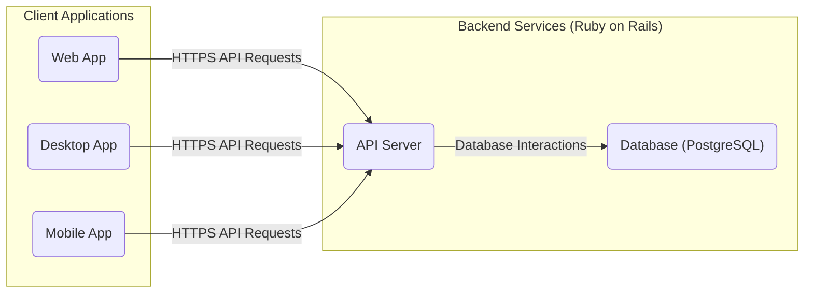
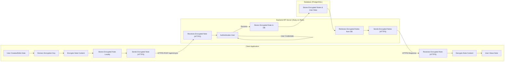

## Project Design Document: Standard Notes Application (Improved)

**1. Introduction**

This document provides an enhanced architectural design of the Standard Notes application, based on the publicly available codebase at [https://github.com/standardnotes/app](https://github.com/standardnotes/app). This revised document aims to offer a more detailed and precise understanding of the system's components, their interactions, and data flow, specifically tailored for effective threat modeling.

**1.1. Purpose**

The primary purpose of this document is to provide a comprehensive and accurate architectural blueprint of the Standard Notes application, enabling thorough and effective threat modeling. It meticulously describes the key components, their specific responsibilities, and the intricate interactions between them.

**1.2. Scope**

This document encompasses the core components of the Standard Notes application, providing a deeper level of detail:

*   Client applications (web, desktop, mobile) including their key functionalities.
*   Backend API, detailing its primary endpoints and responsibilities.
*   Synchronization mechanisms, elaborating on the data exchange process.
*   Data storage, specifying the types of data stored and their organization.
*   Authentication and authorization processes, including the methods used.
*   Extension and theme architecture, outlining their integration points.

This document intentionally excludes:

*   Granular implementation details within individual components' codebases.
*   Specific network infrastructure configurations and topologies.
*   In-depth analysis of third-party integrations beyond their direct interaction points with the core system.

**1.3. Target Audience**

This document is primarily intended for:

*   Security engineers and architects tasked with performing threat modeling and security assessments.
*   Development team members requiring a detailed understanding of the system architecture for development and maintenance.
*   Operations team members responsible for the deployment, monitoring, and maintenance of the application.

**2. System Overview**

Standard Notes is a robust, open-source note-taking application distinguished by its commitment to end-to-end encryption. Its fundamental function is to enable users to securely create, store, and seamlessly synchronize notes across a multitude of devices. The application's core tenet is the prioritization of user privacy and data security through client-side encryption.

**3. Architectural Design**

The Standard Notes architecture is logically divided into client-side applications and backend services, each with distinct responsibilities.

**3.1. Client Applications**

These are the applications that users directly interact with to access Standard Notes functionality.

*   **Web Application:** A single-page application (SPA) accessible through web browsers, likely built using a JavaScript framework such as React. It communicates with the backend API via HTTPS, typically interacting with RESTful endpoints.
*   **Desktop Applications (macOS, Windows, Linux):**  Standalone applications, often built using frameworks like Electron, which embed a Chromium browser. This allows for cross-platform development while providing access to native operating system features. They communicate with the backend API over HTTPS.
*   **Mobile Applications (iOS, Android):** Native or hybrid mobile applications developed using platform-specific SDKs (Swift/Objective-C for iOS, Kotlin/Java for Android) or cross-platform frameworks like React Native. They interact with the backend API via HTTPS.

**Key Responsibilities of Client Applications:**

*   Rendering the user interface and providing a seamless user experience for note management.
*   Facilitating note creation, editing, deletion, and organization.
*   Local storage of encrypted notes, enabling offline access.
*   Implementing end-to-end encryption and decryption of notes using keys derived from the user's password or a securely stored key.
*   Initiating and managing communication with the backend API for user authentication, synchronization, and other services.
*   Loading and executing extensions and themes, potentially within a sandboxed environment.

**3.2. Backend Services**

These are the server-side components that provide the core infrastructure and functionalities for the application.

*   **API Server (Ruby on Rails):** The central point of contact for client applications. It handles:
    *   User authentication (login, registration, password reset) likely using methods like username/password and potentially multi-factor authentication.
    *   Authorization, ensuring users can only access their own data.
    *   Synchronization requests, receiving encrypted notes from clients and providing updated encrypted notes. Key endpoints likely include `/api/v1/notes`, `/api/v1/sync`, `/api/v1/users`.
    *   Account management, including profile updates and subscription management if applicable.
*   **Database (PostgreSQL):** Stores persistent data, including:
    *   User account information (usernames, hashed passwords, email addresses).
    *   Encrypted note content and associated metadata (timestamps, tags).
    *   Potentially, information about extensions, themes, and subscriptions.
*   **Synchronization Logic (Likely integrated within the API Server):** Manages the process of merging changes from different clients, handling potential conflicts, and ensuring data consistency across all devices.
*   **Authentication Logic (Likely integrated within the API Server):**  Handles the verification of user credentials and the generation of authentication tokens (e.g., JWT).
*   **Extension/Theme Hosting (Potentially a separate service or part of the API Server):**  May serve static files for extensions and themes or provide an API for retrieving extension metadata.

**Key Responsibilities of Backend Services:**

*   Securely managing user accounts and their associated credentials.
*   Receiving and securely storing encrypted note data without the ability to decrypt it.
*   Orchestrating the synchronization process between different user devices.
*   Enforcing authentication and authorization policies to protect user data.
*   Potentially managing user subscriptions and payment processing.
*   Serving and managing extensions and themes for client applications.

**4. Data Flow**

The fundamental data flow revolves around the secure creation, encryption, synchronization, and decryption of user notes.

*   **Note Creation/Modification:**
    *   A user creates or modifies a note within a client application.
    *   The client application encrypts the note content locally using an encryption key derived from the user's password (or a key securely managed by the application's key management system).
    *   The encrypted note, along with relevant metadata, is stored locally on the client device for offline access.
*   **Synchronization Process:**
    *   The client application initiates a synchronization request to the API server via an HTTPS POST request to an endpoint like `/api/v1/sync`.
    *   The request includes the encrypted note data and potentially information about local changes.
    *   The API server authenticates the user.
    *   Upon successful authentication, the server receives the encrypted note data.
    *   The server stores the encrypted note in the database, associating it with the user's account.
    *   When another client application belonging to the same user synchronizes, it sends a similar request to the API server.
    *   The API server retrieves the latest encrypted notes associated with the user from the database.
    *   The API server sends the encrypted notes back to the requesting client application via an HTTPS response.
*   **Note Decryption and Viewing:**
    *   The client application receives the encrypted note data from the server or local storage.
    *   The client application decrypts the note content using the user's derived encryption key.
    *   The decrypted note is then rendered and displayed to the user within the application's interface.

**5. Security Considerations (Detailed)**

*   **End-to-End Encryption (E2EE):**  A cornerstone of Standard Notes security. Notes are encrypted on the client-side *before* transmission to the server, ensuring that the backend has zero-knowledge of the note content. This relies heavily on robust client-side encryption libraries and secure key derivation.
*   **Client-Side Key Derivation and Management:** The security of E2EE hinges on the secure generation and management of encryption keys on the client. Typically, a key is derived from the user's master password using a key derivation function (KDF) like PBKDF2 or Argon2. Secure storage of this derived key (or the means to derive it) on the client is critical.
*   **Secure Authentication:**  Robust authentication mechanisms are paramount. This likely involves:
    *   Secure password hashing with salting using algorithms like bcrypt or Argon2.
    *   Protection against brute-force attacks through rate limiting and account lockout policies.
    *   Potentially, support for multi-factor authentication (MFA) to enhance security.
*   **Authorization:**  Strict authorization controls are necessary to ensure that users can only access and modify their own data. The backend API must enforce these policies on every request.
*   **Data at Rest Encryption:** While E2EE protects note content, the database itself should also employ encryption at rest to protect other sensitive data like user credentials and metadata. Database-level encryption or full-disk encryption on the server can achieve this.
*   **Data in Transit Encryption:** All communication between client applications and the backend API *must* be encrypted using HTTPS (TLS). This protects data from eavesdropping and man-in-the-middle attacks.
*   **Input Validation:**  Rigorous input validation is crucial on both the client and server-side to prevent various injection attacks (e.g., SQL injection, cross-site scripting). The server-side should never trust data received from the client.
*   **Secure Storage of User Credentials:**  Passwords should never be stored in plaintext. Strong, salted hashing algorithms are essential.
*   **Vulnerability Management:**  A proactive approach to vulnerability management is necessary, including:
    *   Regular security audits and penetration testing.
    *   Keeping dependencies up-to-date with security patches.
    *   Having a process for reporting and addressing security vulnerabilities.
*   **Extension and Theme Security:**  The architecture for extensions and themes needs to consider potential security risks. This might involve:
    *   Sandboxing extensions to limit their access to system resources and user data.
    *   Code signing or verification of extensions to ensure their integrity.
    *   Clear permission models for extensions.

**6. Technologies Used (Based on GitHub Repository and Common Practices)**

This section provides a more specific list of technologies likely used in the Standard Notes application.

*   **Client Applications:**
    *   **Web:** JavaScript (React or a similar framework), HTML, CSS, potentially Redux or similar for state management.
    *   **Desktop:** Electron (Chromium, Node.js), JavaScript, HTML, CSS.
    *   **Mobile:** React Native (JavaScript, native UI components) or potentially native platform SDKs (Swift/Objective-C for iOS, Kotlin/Java for Android).
*   **Backend API:**
    *   **Language:** Ruby on Rails (a Model-View-Controller framework).
    *   **Web Server:** Puma or a similar Ruby application server.
    *   **Background Jobs:** Likely Sidekiq or a similar library for asynchronous task processing.
*   **Database:**
    *   PostgreSQL (a robust open-source relational database).
*   **Authentication:**
    *   Likely Devise (a popular authentication gem for Ruby on Rails) or a custom authentication implementation.
    *   Potentially JWT (JSON Web Tokens) for API authentication.
*   **Encryption:**
    *   JavaScript libraries for client-side encryption (e.g., CryptoJS, SJCL, or more modern alternatives like libsodium-wrappers).
    *   Potentially Ruby libraries for server-side encryption for data at rest (e.g., `pgcrypto` for PostgreSQL).
*   **Testing:**
    *   Likely RSpec for backend testing in Ruby on Rails.
    *   Jest or similar for JavaScript testing on the client-side.

**7. Diagrams**

**7.1. High-Level Architecture Diagram**

**7.2. Data Flow Diagram (Note Creation and Synchronization - Detailed)**

**8. Future Considerations**

*   **Real-time Collaboration:** Implementing features for real-time collaborative note editing would introduce significant architectural complexity, requiring technologies like WebSockets and conflict resolution mechanisms.
*   **Advanced Security Features:**  Integration of hardware security key support (e.g., WebAuthn), more granular access controls, or verifiable builds could further enhance security.
*   **Decentralized or Federated Options:** Exploring options for decentralized or federated note storage could align with the privacy-focused nature of the application.
*   **Enhanced Extension API:**  Expanding the extension API with more capabilities and stricter security controls could foster a richer ecosystem.

This improved document provides a more granular and accurate representation of the Standard Notes application architecture. The enhanced details regarding components, data flow, and security considerations will be invaluable for conducting a comprehensive and effective threat modeling exercise.