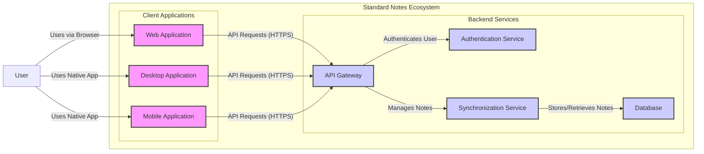
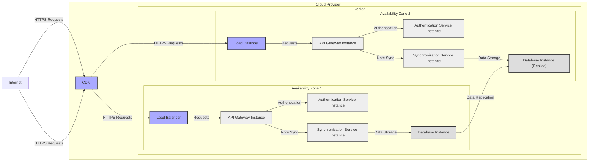
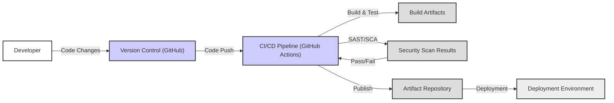

# BUSINESS POSTURE

- Business Priorities and Goals:
 - Provide a secure and private note-taking application.
 - Offer end-to-end encryption to protect user data.
 - Ensure accessibility across multiple platforms (web, desktop, mobile).
 - Maintain user trust by prioritizing data security and privacy.
 - Offer a reliable and stable note-taking service.

- Business Risks:
 - Data breach leading to exposure of user notes.
 - Loss of user trust due to security vulnerabilities.
 - Service unavailability impacting user productivity.
 - Compliance issues related to data privacy regulations (e.g., GDPR, CCPA).
 - Supply chain attacks compromising the application or its dependencies.

# SECURITY POSTURE

- Existing Security Controls:
 - security control: End-to-end encryption of notes (described in application documentation and likely implemented within the client applications).
 - security control: Password-based authentication (standard authentication mechanism for user accounts).
 - security control: Secure software development lifecycle (inferred from the project's focus on security and privacy, although specific details are not provided in the input).
 - security control: HTTPS for communication (standard practice for web applications, assumed for Standard Notes web and API interactions).
 - accepted risk: Reliance on user-generated passwords for account security (inherent risk with password-based authentication).
 - accepted risk: Potential vulnerabilities in third-party dependencies (common risk in software development, requires ongoing dependency management).

- Recommended Security Controls:
 - security control: Implement multi-factor authentication (MFA) to enhance account security.
 - security control: Regularly perform penetration testing and vulnerability scanning to identify and address security weaknesses.
 - security control: Implement a robust security incident response plan to handle potential security breaches effectively.
 - security control: Conduct regular security awareness training for developers and operations teams.
 - security control: Implement static application security testing (SAST) and dynamic application security testing (DAST) in the CI/CD pipeline.
 - security control: Implement software composition analysis (SCA) to manage and monitor third-party dependencies for known vulnerabilities.

- Security Requirements:
 - Authentication:
  - Requirement: Securely authenticate users accessing the application.
  - Requirement: Support strong password policies and consider passwordless authentication options.
  - Requirement: Implement session management to control user access after successful authentication.
 - Authorization:
  - Requirement: Implement role-based access control (RBAC) if different user roles or access levels are required (although not explicitly stated as needed for a note-taking app, it's good practice for future scalability).
  - Requirement: Ensure users can only access and modify their own notes and data.
 - Input Validation:
  - Requirement: Validate all user inputs to prevent injection attacks (e.g., XSS, SQL injection if a database is directly accessed from the client - unlikely in this architecture, but relevant for backend services).
  - Requirement: Sanitize user-generated content before rendering it in the application to prevent XSS.
 - Cryptography:
  - Requirement: Utilize strong encryption algorithms for end-to-end encryption of notes (likely AES-256 or similar).
  - Requirement: Securely manage encryption keys, ensuring they are not accessible to unauthorized parties.
  - Requirement: Use HTTPS for all communication channels to protect data in transit.

# DESIGN

- C4 CONTEXT

```mermaid
flowchart LR
    subgraph "Standard Notes Ecosystem"
        center "Standard Notes Application"
    end

    u1["User"] -- "Uses" --> center
    center -- "Syncs data with" --> bs["Backend Services"]
    center -- "Uses" --> os["Operating System"]
    center -- "Uses" --> db["Local Device Storage"]

    style center fill:#f9f,stroke:#333,stroke-width:2px
```

 - C4 Context Elements:
  - Element:
   - Name: User
   - Type: Person
   - Description: Individual user who uses the Standard Notes application to create, manage, and access notes.
   - Responsibilities: Creates, reads, updates, and deletes notes. Manages their account and preferences.
   - Security controls: Strong password or MFA for account access. Responsible for keeping their encryption key secure (if applicable to their setup).
  - Element:
   - Name: Standard Notes Application
   - Type: Software System
   - Description: The note-taking application itself, available on web, desktop, and mobile platforms. Provides the user interface and core note-taking functionalities.
   - Responsibilities: Allows users to create, edit, and organize notes. Encrypts and decrypts notes. Synchronizes notes with backend services. Manages local data storage.
   - Security controls: End-to-end encryption of notes. Input validation on user inputs. Secure storage of encryption keys locally (protected by OS mechanisms). HTTPS for communication with backend services.
  - Element:
   - Name: Backend Services
   - Type: Software System
   - Description: Cloud-based services that handle user account management, note synchronization, and potentially other features like extensions or subscriptions.
   - Responsibilities: Authenticates users. Stores encrypted notes. Manages user accounts and subscriptions. Provides API for application to interact with.
   - Security controls: Secure authentication and authorization mechanisms. Encryption of data at rest and in transit. Access control to backend resources. Regular security updates and patching.
  - Element:
   - Name: Operating System
   - Type: Technology
   - Description: The operating system on which the Standard Notes application runs (e.g., Windows, macOS, iOS, Android, Linux).
   - Responsibilities: Provides the environment for the application to run. Manages system resources. Provides security features like file system permissions and process isolation.
   - Security controls: OS-level security controls (firewall, antivirus, access controls). Application sandboxing (depending on OS and platform).
  - Element:
   - Name: Local Device Storage
   - Type: Data Store
   - Description: Local storage on the user's device where the Standard Notes application stores notes and application data locally.
   - Responsibilities: Persistently stores notes and application settings locally. Provides fast access to notes when offline.
   - Security controls: Encryption of local storage (depending on OS capabilities and application implementation). File system permissions to restrict access to application data.

- C4 CONTAINER



 - C4 Container Elements:
  - Element:
   - Name: Web Application
   - Type: Container
   - Description: Browser-based client application built using web technologies (likely JavaScript, HTML, CSS). Provides access to Standard Notes features through a web browser.
   - Responsibilities: User interface for note creation, editing, and management. Handles note encryption and decryption in the browser. Communicates with the API Gateway for backend services.
   - Security controls: Input validation in the browser. Secure handling of encryption keys in the browser's memory or local storage. HTTPS for all communication. Content Security Policy (CSP) to mitigate XSS.
  - Element:
   - Name: Desktop Application
   - Type: Container
   - Description: Native desktop application for Windows, macOS, and Linux, providing access to Standard Notes features. Likely built using technologies like Electron or native platform frameworks.
   - Responsibilities: User interface for note creation, editing, and management. Handles note encryption and decryption within the application. Communicates with the API Gateway for backend services. Manages local data storage.
   - Security controls: Input validation within the application. Secure storage of encryption keys using OS-specific secure storage mechanisms. HTTPS for all communication. Code signing of the application to ensure integrity.
  - Element:
   - Name: Mobile Application
   - Type: Container
   - Description: Native mobile application for iOS and Android, providing access to Standard Notes features on mobile devices.
   - Responsibilities: User interface for note creation, editing, and management on mobile. Handles note encryption and decryption within the application. Communicates with the API Gateway for backend services. Manages local data storage.
   - Security controls: Input validation within the application. Secure storage of encryption keys using mobile OS secure storage mechanisms (Keychain, Keystore). HTTPS for all communication. Application signing and permissions management.
  - Element:
   - Name: API Gateway
   - Type: Container
   - Description: Entry point for all API requests from client applications to the backend services. Routes requests to appropriate backend services. May handle rate limiting, authentication, and other cross-cutting concerns.
   - Responsibilities: API request routing. Authentication and authorization of requests. Rate limiting and traffic management. SSL termination.
   - Security controls: Web Application Firewall (WAF) to protect against common web attacks. DDoS protection. Secure configuration of API gateway. Access control lists (ACLs) to restrict access to backend services.
  - Element:
   - Name: Authentication Service
   - Type: Container
   - Description: Service responsible for user authentication and session management. Verifies user credentials and issues authentication tokens.
   - Responsibilities: User authentication (username/password, MFA if implemented). Session management. Token generation and validation. Password management (hashing, storage).
   - Security controls: Secure password hashing algorithms. Protection against brute-force attacks. Secure storage of authentication secrets. Regular security audits of authentication logic.
  - Element:
   - Name: Synchronization Service
   - Type: Container
   - Description: Service responsible for synchronizing encrypted notes between user devices and the backend database. Handles conflict resolution and data consistency.
   - Responsibilities: Receives encrypted notes from clients. Stores encrypted notes in the database. Retrieves encrypted notes for clients. Handles synchronization logic and conflict resolution.
   - Security controls: Secure communication channels (HTTPS). Access control to the database. Input validation on data received from clients. Rate limiting to prevent abuse.
  - Element:
   - Name: Database
   - Type: Container
   - Description: Persistent storage for encrypted notes and user account data. Likely a relational database or NoSQL database.
   - Responsibilities: Stores encrypted notes and user data. Provides data persistence and retrieval. Ensures data integrity and availability.
   - Security controls: Encryption at rest for stored data. Database access controls and authentication. Regular database backups. Security hardening of the database server.

- DEPLOYMENT

Deployment Solution: Cloud-based Deployment (Common for SaaS applications)



 - Deployment Elements:
  - Element:
   - Name: CDN (Content Delivery Network)
   - Type: Infrastructure
   - Description: Global network of servers that caches static content (e.g., web application assets) to improve performance and availability for users worldwide.
   - Responsibilities: Caching and serving static content. Reducing latency for users. Providing DDoS protection.
   - Security controls: DDoS mitigation. Secure configuration of CDN. HTTPS support.
  - Element:
   - Name: Load Balancer (LB)
   - Type: Infrastructure
   - Description: Distributes incoming traffic across multiple instances of backend services (API Gateway). Improves availability and scalability.
   - Responsibilities: Traffic distribution. Health checks of backend instances. SSL termination.
   - Security controls: Secure configuration of load balancer. SSL/TLS encryption. Protection against common load balancer vulnerabilities.
  - Element:
   - Name: API Gateway Instance
   - Type: Infrastructure
   - Description: Virtual machine or container instance running the API Gateway software.
   - Responsibilities: API request routing, authentication, rate limiting.
   - Security controls: Security hardening of the instance. Regular security patching. Network security groups/firewalls to restrict access.
  - Element:
   - Name: Authentication Service Instance
   - Type: Infrastructure
   - Description: Virtual machine or container instance running the Authentication Service software.
   - Responsibilities: User authentication and session management.
   - Security controls: Security hardening of the instance. Regular security patching. Network security groups/firewalls to restrict access.
  - Element:
   - Name: Synchronization Service Instance
   - Type: Infrastructure
   - Description: Virtual machine or container instance running the Synchronization Service software.
   - Responsibilities: Note synchronization logic. Data handling.
   - Security controls: Security hardening of the instance. Regular security patching. Network security groups/firewalls to restrict access.
  - Element:
   - Name: Database Instance
   - Type: Infrastructure
   - Description: Managed database service instance (e.g., AWS RDS, Google Cloud SQL, Azure Database) or self-managed database server.
   - Responsibilities: Persistent storage of encrypted notes and user data. Data replication for high availability.
   - Security controls: Database access controls. Encryption at rest. Regular backups. Security hardening of the database instance. Network security groups/firewalls to restrict access.
  - Element:
   - Name: Availability Zone
   - Type: Infrastructure
   - Description: Isolated location within a cloud region. Using multiple availability zones provides redundancy and fault tolerance.
   - Responsibilities: Physical isolation and redundancy.
   - Security controls: Physical security of data centers. Redundancy to improve resilience against infrastructure failures.
  - Element:
   - Name: Region
   - Type: Infrastructure
   - Description: Geographical area containing availability zones.
   - Responsibilities: Geographical location for infrastructure deployment.
   - Security controls: Data residency compliance (depending on region and regulations).

- BUILD



 - Build Elements:
  - Element:
   - Name: Developer
   - Type: Person
   - Description: Software developer who writes and modifies the application code.
   - Responsibilities: Writing secure code. Following secure coding practices. Committing code changes to version control.
   - Security controls: Security awareness training. Secure coding guidelines. Code review process.
  - Element:
   - Name: Version Control (GitHub)
   - Type: Tool
   - Description: System for tracking changes to the codebase. Provides collaboration and version history.
   - Responsibilities: Source code management. Access control to codebase. Audit logging of changes.
   - Security controls: Access control to repository (role-based access). Branch protection rules. Audit logs.
  - Element:
   - Name: CI/CD Pipeline (GitHub Actions)
   - Type: Tool
   - Description: Automated pipeline for building, testing, and deploying the application.
   - Responsibilities: Automated build process. Automated testing (unit, integration, etc.). Security scanning (SAST, SCA). Artifact publishing. Deployment automation.
   - Security controls: Secure pipeline configuration. Access control to pipeline configuration and secrets. Security scanning tools integration. Audit logging of pipeline activities.
  - Element:
   - Name: Build Artifacts
   - Type: Data
   - Description: Output of the build process, e.g., compiled code, packaged applications, container images.
   - Responsibilities: Deployable application components.
   - Security controls: Integrity checks of build artifacts (e.g., checksums, signatures). Secure storage of build artifacts.
  - Element:
   - Name: Security Scan Results
   - Type: Data
   - Description: Output of security scanning tools (SAST, SCA) indicating potential vulnerabilities.
   - Responsibilities: Identification of security vulnerabilities in code and dependencies.
   - Security controls: Automated security scanning tools. Vulnerability reporting and tracking.
  - Element:
   - Name: Artifact Repository
   - Type: Tool
   - Description: Storage for build artifacts (e.g., container registry, package repository).
   - Responsibilities: Secure storage of build artifacts. Versioning of artifacts. Access control to artifacts.
   - Security controls: Access control to artifact repository. Encryption at rest for stored artifacts. Vulnerability scanning of stored artifacts (if applicable).
  - Element:
   - Name: Deployment Environment
   - Type: Environment
   - Description: Target environment where the application is deployed (e.g., cloud infrastructure, staging environment, production environment).
   - Responsibilities: Running the application. Providing runtime environment.
   - Security controls: Security hardening of deployment environment. Network security controls. Monitoring and logging.

# RISK ASSESSMENT

- Critical Business Processes:
 - User note creation, editing, and deletion.
 - Note synchronization across devices.
 - User authentication and account management.
 - Subscription management (if applicable).

- Data to Protect and Sensitivity:
 - User notes: Highly sensitive. Contain personal thoughts, ideas, and potentially confidential information. Confidentiality and integrity are critical.
 - User credentials (passwords): Highly sensitive. Confidentiality and integrity are critical to prevent unauthorized access.
 - User metadata (account information, settings): Sensitive. Confidentiality and integrity are important to protect user privacy and account security.

# QUESTIONS & ASSUMPTIONS

- Questions:
 - What type of database is used for the backend? (Relational, NoSQL?)
 - What specific cloud provider is used for deployment (if any)?
 - Are there any specific compliance requirements (e.g., GDPR, HIPAA)?
 - What is the process for managing and rotating encryption keys?
 - Are there any third-party integrations that need to be considered from a security perspective?
 - What is the current level of security awareness training for developers?

- Assumptions:
 - BUSINESS POSTURE: The primary business goal is to provide a secure and private note-taking application. User privacy and data security are paramount.
 - SECURITY POSTURE: End-to-end encryption is a core security control. HTTPS is used for all communication. Secure software development lifecycle practices are followed.
 - DESIGN: The application uses a cloud-based backend architecture with separate services for API gateway, authentication, and synchronization. A relational or NoSQL database is used for persistent storage. Client applications handle end-to-end encryption. Deployment is likely on a major cloud provider using multiple availability zones for high availability. GitHub Actions or similar CI/CD is used for build and deployment automation.