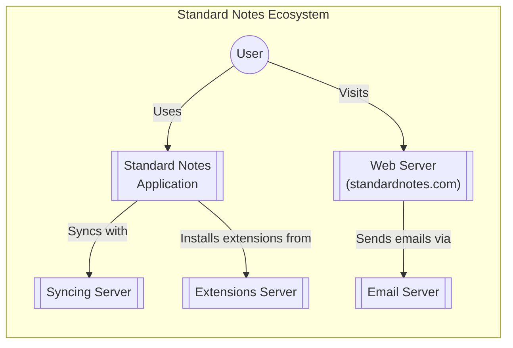
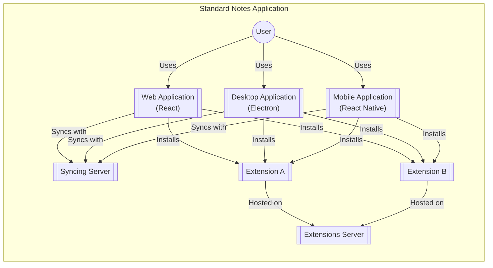
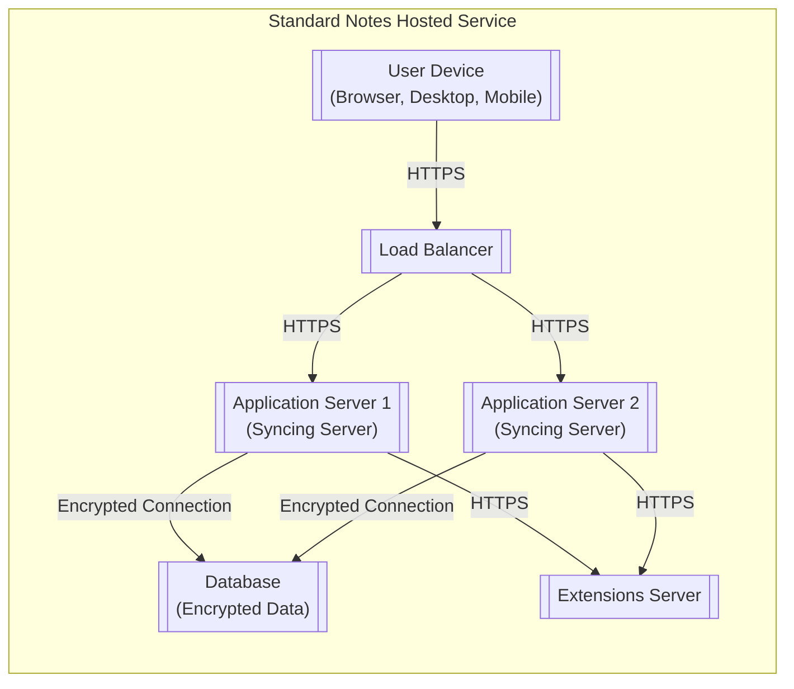
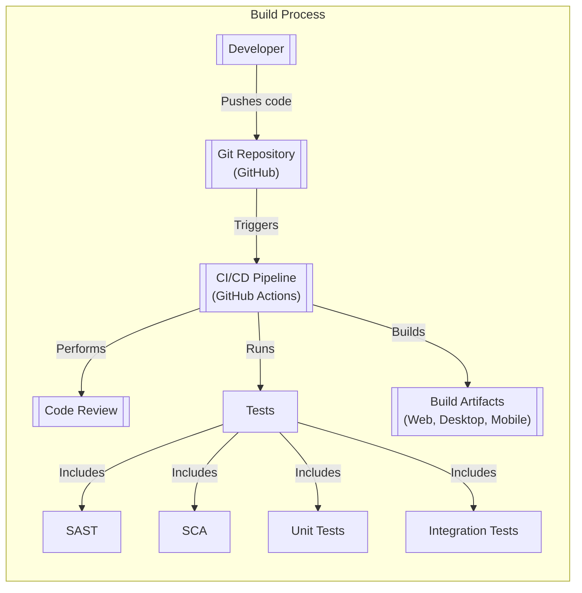

Okay, let's create a design document for the Standard Notes application based on the provided GitHub repository.

# BUSINESS POSTURE

Business Priorities and Goals:

*   Provide a secure and private note-taking application across multiple platforms.
*   Ensure data confidentiality and integrity for user notes.
*   Offer a simple, clean, and distraction-free user experience.
*   Maintain a sustainable development model through open-source contributions and paid subscriptions.
*   Build user trust through transparency and a strong security focus.
*   Provide end-to-end encryption.

Most Important Business Risks:

*   Data breaches leading to exposure of user notes.
*   Loss of user data due to system failures or vulnerabilities.
*   Reputational damage due to security incidents or privacy violations.
*   Compromise of encryption keys or mechanisms.
*   Inability to maintain the application due to lack of resources or developer interest.
*   Supply chain attacks.

# SECURITY POSTURE

Existing Security Controls:

*   security control: End-to-end encryption (E2EE) using XChaCha20-Poly1305 and Argon2 for key derivation. (Implemented in the application logic and libraries).
*   security control: Cross-platform support (Web, Desktop, Mobile) to ensure consistent security. (Architecture design).
*   security control: Open-source codebase, allowing for community review and auditing. (Development model).
*   security control: Two-factor authentication (2FA) support. (Implemented in server and client applications).
*   security control: Automatic synchronization with encryption. (Implemented in the application logic).
*   security control: Use of well-vetted cryptographic libraries. (Dependencies).
*   security control: Regular security audits and penetration testing (mentioned on their website, assumed to be ongoing).
*   security control: Data at rest and in transit encryption.

Accepted Risks:

*   accepted risk: Reliance on third-party services for infrastructure (e.g., hosting providers, email delivery).
*   accepted risk: Potential for vulnerabilities in third-party libraries and dependencies.
*   accepted risk: User error, such as weak passwords or compromised devices.
*   accepted risk: The possibility of sophisticated, targeted attacks that may bypass existing security measures.

Recommended Security Controls:

*   Implement a robust vulnerability disclosure program (bug bounty).
*   Integrate static application security testing (SAST) and dynamic application security testing (DAST) into the CI/CD pipeline.
*   Implement software composition analysis (SCA) to identify and manage vulnerabilities in third-party dependencies.
*   Consider implementing certificate pinning to mitigate man-in-the-middle attacks.
*   Provide security hardening guides for self-hosting users.
*   Implement account activity monitoring and alerting for suspicious behavior.

Security Requirements:

*   Authentication:
    *   Strong password policies enforced.
    *   Support for multi-factor authentication (MFA).
    *   Secure session management with appropriate timeouts.
    *   Protection against brute-force and credential stuffing attacks.
    *   Secure password reset mechanisms.

*   Authorization:
    *   Role-based access control (RBAC) for different user roles (e.g., free, paid, administrator).
    *   Access to notes and features restricted based on user subscription level.
    *   Proper segregation of user data.

*   Input Validation:
    *   Sanitization of all user inputs to prevent cross-site scripting (XSS) and other injection vulnerabilities.
    *   Validation of data types and formats to prevent unexpected behavior.

*   Cryptography:
    *   Use of strong, industry-standard encryption algorithms (already implemented).
    *   Secure key management practices, including key rotation and protection.
    *   Protection against replay attacks.
    *   Data integrity checks using cryptographic hashes or signatures.

# DESIGN

## C4 CONTEXT

Element Descriptions:

*   Element:
    *   Name: User
    *   Type: Person
    *   Description: A person who uses Standard Notes to create and manage their notes.
    *   Responsibilities: Create, edit, and manage notes; configure application settings; manage their account.
    *   Security controls: Strong passwords, 2FA (optional), device security.

*   Element:
    *   Name: Standard Notes Application
    *   Type: Software System
    *   Description: The core note-taking application, available on multiple platforms.
    *   Responsibilities: Provide a user interface for note management; handle encryption and decryption; synchronize data with the syncing server.
    *   Security controls: End-to-end encryption, input validation, secure session management.

*   Element:
    *   Name: Syncing Server
    *   Type: Software System
    *   Description: The server responsible for synchronizing notes between different instances of the application.
    *   Responsibilities: Store encrypted notes; manage user accounts; handle synchronization requests.
    *   Security controls: Data at rest encryption, access controls, regular security audits.

*   Element:
    *   Name: Extensions Server
    *   Type: Software System
    *   Description: Server that hosts extensions.
    *   Responsibilities: Store extensions, provide list of extensions.
    *   Security controls: Access controls, regular security audits.

*   Element:
    *   Name: Web Server (standardnotes.com)
    *   Type: Software System
    *   Description: The web server hosting the Standard Notes website and potentially web application.
    *   Responsibilities: Serve static content; handle user authentication (if applicable); provide information about the application.
    *   Security controls: HTTPS, secure configuration, regular security updates.

*   Element:
    *   Name: Email Server
    *   Type: Software System
    *   Description: A third-party email service used for account-related communications.
    *   Responsibilities: Send emails for account verification, password resets, and other notifications.
    *   Security controls: Standard email security protocols (SPF, DKIM, DMARC), reliance on the provider's security measures.

## C4 CONTAINER

Element Descriptions:

*   Element:
    *   Name: User
    *   Type: Person
    *   Description: A person who uses Standard Notes.
    *   Responsibilities: Interact with the application interfaces.
    *   Security controls: Strong passwords, 2FA, device security.

*   Element:
    *   Name: Web Application (React)
    *   Type: Container (Web Application)
    *   Description: The web-based version of the Standard Notes application, built using React.
    *   Responsibilities: Provide a user interface for note management in a web browser; handle encryption/decryption; communicate with the syncing server.
    *   Security controls: End-to-end encryption, input validation, secure communication (HTTPS), XSS protection.

*   Element:
    *   Name: Desktop Application (Electron)
    *   Type: Container (Desktop Application)
    *   Description: The desktop version of the application, built using Electron.
    *   Responsibilities: Provide a native desktop experience; handle encryption/decryption; communicate with the syncing server.
    *   Security controls: End-to-end encryption, input validation, secure communication, secure storage of local data.

*   Element:
    *   Name: Mobile Application (React Native)
    *   Type: Container (Mobile Application)
    *   Description: The mobile version of the application, built using React Native.
    *   Responsibilities: Provide a native mobile experience; handle encryption/decryption; communicate with the syncing server.
    *   Security controls: End-to-end encryption, input validation, secure communication, secure storage of local data, platform-specific security features.

*   Element:
    *   Name: Syncing Server
    *   Type: Container (Server Application)
    *   Description: The server responsible for data synchronization.
    *   Responsibilities: Store encrypted notes; manage user accounts; handle synchronization requests.
    *   Security controls: Data at rest encryption, access controls, regular security audits, intrusion detection/prevention systems.

*   Element:
    *   Name: Extensions Server
    *   Type: Container (Server Application)
    *   Description: Server that hosts extensions.
    *   Responsibilities: Store extensions, provide list of extensions.
    *   Security controls: Access controls, regular security audits.

*   Element:
    *   Name: Extension A, Extension B
    *   Type: Container (Extension)
    *   Description: Extensions that provide additional functionality.
    *   Responsibilities: Provide additional functionality.
    *   Security controls: Access controls, regular security audits.

## DEPLOYMENT

Possible Deployment Solutions:

1.  Self-Hosting (Docker): Users can deploy their own syncing server using Docker.
2.  Standard Notes Hosted Service: Users can use the official Standard Notes hosted service.
3.  Third-Party Hosting: Users could potentially deploy the syncing server on other cloud platforms (AWS, GCP, Azure, etc.), although this is less common.

Chosen Solution (Detailed Description): Standard Notes Hosted Service

Element Descriptions:

*   Element:
    *   Name: User Device (Browser, Desktop, Mobile)
    *   Type: Node
    *   Description: The user's device running the Standard Notes application.
    *   Responsibilities: Run the application, encrypt/decrypt data, communicate with the syncing server.
    *   Security controls: Device security, application security, secure communication (HTTPS).

*   Element:
    *   Name: Load Balancer
    *   Type: Node
    *   Description: Distributes incoming traffic across multiple application servers.
    *   Responsibilities: Improve availability and scalability; handle SSL termination.
    *   Security controls: DDoS protection, intrusion detection/prevention.

*   Element:
    *   Name: Application Server 1, Application Server 2 (Syncing Server)
    *   Type: Node
    *   Description: Instances of the syncing server application.
    *   Responsibilities: Handle synchronization requests; manage user accounts; interact with the database.
    *   Security controls: Secure configuration, regular security updates, access controls, monitoring.

*   Element:
    *   Name: Database (Encrypted Data)
    *   Type: Node
    *   Description: Stores encrypted user data.
    *   Responsibilities: Persist data; provide data access to the application servers.
    *   Security controls: Data at rest encryption, access controls, database security best practices.

*   Element:
    *   Name: Extensions Server
    *   Type: Node
    *   Description: Server that hosts extensions.
    *   Responsibilities: Store extensions, provide list of extensions.
    *   Security controls: Access controls, regular security audits.

## BUILD

Build Process Description:

1.  Developers write code and push changes to the GitHub repository.
2.  GitHub Actions (CI/CD pipeline) is triggered by pushes and pull requests.
3.  Code review is performed as part of the pull request process.
4.  The CI pipeline runs various tests, including:
    *   Static Application Security Testing (SAST) to identify potential vulnerabilities in the codebase.
    *   Software Composition Analysis (SCA) to identify and manage vulnerabilities in third-party dependencies.
    *   Unit tests to verify the functionality of individual components.
    *   Integration tests to verify the interaction between different parts of the application.
5.  If all tests pass, the CI pipeline builds the application for different platforms (Web, Desktop, Mobile).
6.  Build artifacts are created and made available for deployment.

Security Controls in Build Process:

*   Code review: Manual inspection of code changes to identify potential security issues.
*   SAST: Automated analysis of the codebase to detect vulnerabilities.
*   SCA: Automated analysis of dependencies to identify known vulnerabilities.
*   Automated testing: Unit and integration tests to ensure code quality and prevent regressions.
*   CI/CD pipeline: Automation of the build process to ensure consistency and reduce manual errors.
*   Signed commits: To ensure the integrity and authenticity of the code.

# RISK ASSESSMENT

Critical Business Processes to Protect:

*   User authentication and authorization.
*   Data synchronization and storage.
*   Encryption key management.
*   Application updates and deployments.

Data to Protect and Sensitivity:

*   User notes: Highly sensitive, confidential user data.
*   User account information (email, password hash, subscription details): Sensitive personal information.
*   Encryption keys: Extremely sensitive, must be protected at all costs.
*   Application logs: Potentially sensitive, may contain information about user activity or system behavior.

# QUESTIONS & ASSUMPTIONS

Questions:

*   What specific threat actors are considered most relevant (e.g., script kiddies, organized crime, nation-states)?
*   What is the acceptable downtime for the application?
*   Are there any specific compliance requirements (e.g., GDPR, HIPAA)?
*   What is the process for handling security incidents?
*   Details about infrastructure and hosting environment.
*   Details about monitoring and logging.

Assumptions:

*   BUSINESS POSTURE: The primary business goal is to provide a secure and private note-taking service.
*   SECURITY POSTURE: The existing security controls are implemented correctly and effectively.
*   DESIGN: The application architecture is as described in the GitHub repository and documentation. The syncing server is the primary backend component. The deployment environment for the hosted service uses a load balancer and multiple application server instances.
*   The build process uses GitHub Actions.
*   Regular security audits and penetration testing are conducted.