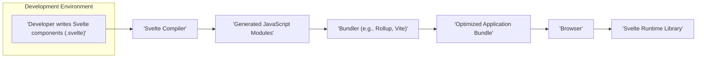
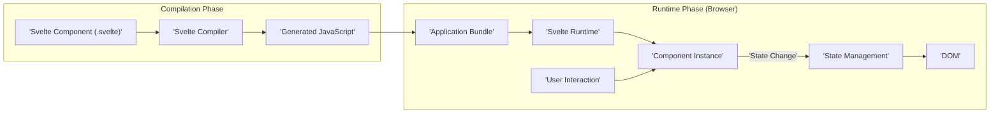

## Project Design Document: Svelte (Improved)

**1. Introduction**

This document provides an enhanced architectural overview of the Svelte JavaScript framework, building upon the previous version. It offers a more detailed explanation of the key components, data flow, and technologies within the Svelte ecosystem. This refined document is intended to serve as a robust foundation for subsequent threat modeling activities.

**2. Goals**

* Provide a clear, comprehensive, and more detailed description of the Svelte architecture.
* Identify key components and their intricate interactions with greater specificity.
* Illustrate the data flow within the Svelte compilation and runtime processes with enhanced clarity.
* Serve as a more robust and informative basis for identifying potential security vulnerabilities during threat modeling.

**3. Architecture Overview**

Svelte operates as a compiler, transforming declarative component code into highly optimized vanilla JavaScript that directly manipulates the Document Object Model (DOM). This compilation step is the cornerstone of Svelte's architecture, occurring at build time, thereby shifting the workload away from the browser.

* **Compilation Phase:** The Svelte compiler meticulously analyzes component code, encompassing HTML structure, CSS styling, and JavaScript logic, to generate efficient JavaScript modules tailored for optimal performance.
* **Runtime Phase:** The generated JavaScript, augmented by a minimal runtime library, executes within the user's browser. This runtime manages the application's state and orchestrates precise DOM updates in response to state changes.

**4. Key Components**

* **Svelte Compiler:**
    * The central processing unit of the Svelte framework.
    * Responsible for the meticulous parsing of `.svelte` files, dissecting their structure and content.
    * Performs in-depth analysis of the component's template (HTML), script (JavaScript), and style (CSS).
    * Generates highly optimized, human-readable vanilla JavaScript code, specifically tailored for the component.
    * Executes static analysis to identify potential issues and apply performance optimizations.
    * Outputs JavaScript modules that encapsulate the component's logic, including state management and precise DOM manipulation instructions.

* **Svelte Runtime Library:**
    * A lightweight library embedded within the generated JavaScript bundle.
    * Provides essential utilities for managing component state, ensuring reactivity, and orchestrating DOM updates.
    * Implements the core reactivity system, efficiently updating the DOM only when necessary based on state changes.
    * Offers lifecycle hooks (e.g., `'onMount'`, `'onDestroy'`, `'beforeUpdate'`, `'afterUpdate'`) that allow developers to execute code at specific points in a component's lifecycle.
    * Handles tasks like event delegation and managing component scope.

* **Svelte Component (`.svelte` files):**
    * The fundamental and self-contained building blocks for constructing Svelte applications.
    * Encapsulate HTML markup for structure, JavaScript logic for behavior, and CSS styles for presentation within a single, cohesive file.
    * Define the visual representation, interactive behavior, and data handling of individual UI elements or sections.
    * Leverage Svelte-specific syntax for streamlined reactivity declarations (`$:`), declarative event handling (`on:event`), and efficient data binding (`bind:value`).

* **Bundler (e.g., Rollup, Vite):**
    * A crucial tool employed to aggregate the generated JavaScript modules, along with other project assets, into optimized bundles suitable for deployment.
    * Performs essential optimizations such as tree-shaking (eliminating unused code), code splitting (dividing the bundle for improved loading), and asset management (handling images, fonts, etc.).
    * Integrates seamlessly with the Svelte compiler, often through dedicated plugins or configuration settings, to orchestrate the build process.

* **Development Tools (e.g., Svelte Language Server, Svelte Devtools):**
    * A suite of tools designed to significantly enhance the developer experience and productivity.
    * **Svelte Language Server:** Provides real-time feedback and assistance within code editors, offering features like autocompletion, syntax error highlighting, jump-to-definition, and code formatting.
    * **Svelte Devtools:** A browser extension that enables developers to inspect the state, props, and emitted events of Svelte components in real-time, facilitating debugging and understanding application behavior.

**5. Data Flow**

The flow of data within a Svelte application can be distinctly separated into two primary phases: the compilation phase and the runtime phase.

* **Compilation Phase Data Flow:**
    * A developer authors `.svelte` component files, defining the structure, behavior, and styling of UI elements.
    * The Svelte compiler ingests and meticulously parses these `.svelte` files, breaking them down into their constituent parts.
    * The compiler performs a detailed analysis of the HTML template to understand the DOM structure, the JavaScript script for component logic, and the CSS styles for visual presentation.
    * Based on this analysis, the compiler generates highly optimized JavaScript code that directly manipulates the DOM, ensuring efficient updates.
    * The compiler outputs these generated JavaScript modules, ready for bundling.

* **Runtime Phase Data Flow:**
    * The user's browser loads the bundled JavaScript application, which includes the generated component code and the Svelte runtime library.
    * The Svelte runtime library initializes and manages instances of the defined components, setting up their initial state.
    * When component state variables are modified (either through user interaction or programmatic changes), the reactivity system is triggered.
    * The Svelte runtime library efficiently updates the DOM, targeting only the specific parts of the UI that need to change, based on the state updates.
    * User interactions within the browser (e.g., mouse clicks, keyboard input) trigger DOM events.
    * These events are handled by event listeners defined within the component's script, potentially updating the component's state.
    * This cycle of state changes and DOM updates continues throughout the application's lifecycle, driving its dynamic behavior.

**6. Security Considerations (More Specific)**

This section outlines potential security considerations with more concrete examples, which will be further investigated during threat modeling.

* **Supply Chain Security:**
    * **Dependency Vulnerabilities:** Risks associated with using third-party libraries (npm packages) as dependencies for the Svelte compiler and runtime. A compromised dependency could introduce malicious code into the build process or the final application.
    * **Build Toolchain Compromise:** Potential vulnerabilities in build tools like Node.js, npm/yarn/pnpm, and bundlers (Rollup, Vite). If these tools are compromised, attackers could inject malicious code during the build process.

* **Compiler Security:**
    * **Malicious Input Handling:** Ensuring the Svelte compiler robustly handles maliciously crafted `.svelte` files that could exploit parsing vulnerabilities, leading to denial-of-service or code injection during compilation.
    * **Code Generation Flaws:** Potential vulnerabilities in the compiler's code generation logic that could inadvertently produce JavaScript code with security flaws, such as XSS vulnerabilities.

* **Generated Code Security:**
    * **Cross-Site Scripting (XSS):** Ensuring the generated JavaScript code properly sanitizes user-provided data before rendering it into the DOM to prevent attackers from injecting malicious scripts.
    * **Injection Attacks:**  Careful handling of data passed to dynamic HTML attributes or event handlers to prevent injection attacks (e.g., HTML injection, JavaScript injection).

* **Runtime Security:**
    * **Runtime Library Vulnerabilities:** Potential security flaws within the Svelte runtime library itself that could be exploited by attackers.
    * **Third-Party Component Vulnerabilities:** Risks associated with using community-created Svelte components that may contain security vulnerabilities.

* **Development Environment Security:**
    * **Compromised Developer Machines:** If developer machines are compromised, attackers could potentially inject malicious code into the project or steal sensitive information.
    * **Stolen Credentials:**  Compromised developer credentials could allow unauthorized access to the codebase and build infrastructure.

**7. Technology Stack**

* **Core Language:** JavaScript is the primary language for writing Svelte components. TypeScript is used for the development of the Svelte compiler itself, providing static typing and improved code maintainability.
* **Component Syntax:** Svelte components utilize a combination of HTML for structuring the user interface, CSS for styling the presentation, and JavaScript (with Svelte-specific extensions) for handling component logic and interactivity.
* **Build Tools:** Node.js serves as the runtime environment for executing the Svelte compiler and build scripts. npm, yarn, or pnpm are used as package managers to manage project dependencies.
* **Bundlers (Commonly Used):** Rollup is a popular bundler known for its efficiency in producing optimized bundles, particularly for libraries and frameworks. Vite is a modern bundler that offers extremely fast development server startup times and efficient bundling. Webpack is a highly configurable and widely used bundler for complex applications.
* **Testing Frameworks (Commonly Used):** Jest is a widely adopted JavaScript testing framework known for its ease of use and rich features. Playwright is a framework for end-to-end testing of web applications across various browsers. Cypress is another popular end-to-end testing framework focused on developer experience.
* **Development Tools:** The Svelte Language Server provides language intelligence features within code editors. The Svelte Devtools browser extension aids in debugging and inspecting Svelte applications.

**8. Deployment Model**

Svelte applications offer flexibility in deployment, commonly utilizing static site generation or integration into server-rendered applications.

* **Static Site Generation (SSG):**
    * Svelte components are pre-rendered into static HTML files during the build process.
    * The resulting HTML, CSS, and JavaScript assets are served directly to the user's browser, typically via a Content Delivery Network (CDN) or a web server.
    * This model is well-suited for content-driven websites, blogs, and applications where data changes infrequently, offering excellent performance and SEO benefits.

* **Single-Page Applications (SPA):**
    * The application logic primarily resides and executes within the user's browser.
    * An initial HTML page is loaded, and subsequent interactions and content updates are handled dynamically by JavaScript, without requiring full page reloads.
    * SPAs are commonly used for interactive web applications, offering a rich and responsive user experience.

* **Server-Side Rendering (SSR):**
    * Svelte components are rendered on the server for the initial page load, sending fully rendered HTML to the browser.
    * This improves initial load performance (perceived speed) and enhances Search Engine Optimization (SEO) by making content readily available to crawlers.
    * Subsequent interactions can be handled as in an SPA, creating a hybrid approach. This typically requires a Node.js server or a similar environment capable of executing JavaScript on the server.

**9. Assumptions and Constraints**

* This document primarily focuses on the core Svelte framework architecture and its compilation process. Specific project implementations and configurations may introduce variations.
* Security considerations outlined are intended as a starting point for threat modeling and are not exhaustive. A comprehensive threat model will require further analysis.
* The document assumes a foundational understanding of web development principles, including HTML, CSS, and JavaScript.
* The scope of this document does not extend to specific SvelteKit features or integrations unless explicitly mentioned.
