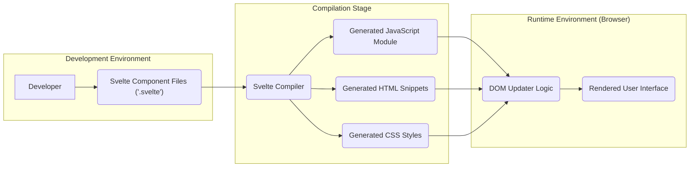
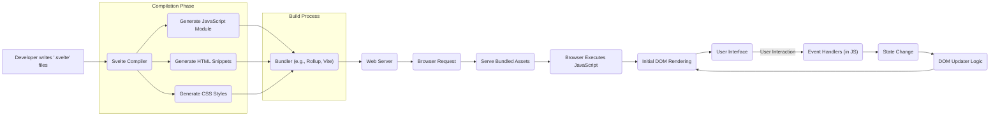

# Project Design Document: Svelte Framework

**Version:** 1.1
**Date:** October 26, 2023
**Author:** AI Software Architect

## 1. Introduction

This document provides an enhanced architectural overview of the Svelte JavaScript framework, specifically tailored for threat modeling activities. Building upon the previous version, this document offers a more detailed exploration of the key components, data flows, and interactions within the Svelte ecosystem, with a strong emphasis on aspects relevant to security considerations. The aim is to provide a comprehensive foundation for identifying potential vulnerabilities and designing appropriate security measures.

## 2. Project Overview

Svelte is a modern JavaScript framework distinguished by its compiler-first approach. Instead of performing the bulk of its work in the browser at runtime, Svelte transforms declarative component code into highly optimized vanilla JavaScript during a build step. This compilation process leads to smaller bundle sizes, improved runtime performance, and a different set of security considerations compared to traditional runtime-heavy frameworks. This document focuses on dissecting this compilation process and the characteristics of the resulting runtime environment for security analysis.

## 3. Architectural Overview

The Svelte architecture can be conceptually divided into three distinct phases:

*   **Development Phase:** Developers create Svelte components using a declarative syntax that integrates HTML, CSS, and JavaScript within `.svelte` files. This phase involves the authoring of the application's logic and presentation.
*   **Compilation Phase:** The Svelte compiler, the core of the framework, processes these `.svelte` files. It analyzes the code, optimizes performance, and generates vanilla JavaScript, along with corresponding HTML and CSS. This phase is where the framework's magic happens, transforming the declarative input into efficient imperative output.
*   **Runtime Phase:** The generated JavaScript, HTML, and CSS are deployed and executed within the user's browser. The JavaScript directly manipulates the Document Object Model (DOM) to render and update the user interface based on application state and user interactions.

Here's a refined high-level architectural diagram illustrating these phases:

## 4. Key Components

This section provides a more in-depth look at the core components and their functionalities.

*   **Svelte Component Files ('.svelte'):**
    *   These files serve as the primary input to the Svelte compilation process.
    *   They encapsulate the structure (HTML), styling (CSS), and behavior (JavaScript) of individual UI components.
    *   The syntax allows for reactive declarations, event handlers, and component-level state management.

*   **Svelte Compiler:**
    *   This is the central component responsible for transforming `.svelte` files into optimized browser-executable code.
    *   It performs a series of operations, including:
        *   **Parsing:** Analyzing the `.svelte` file to understand its structure and syntax.
        *   **Abstract Syntax Tree (AST) Generation:** Creating a tree-like representation of the code for further analysis and manipulation.
        *   **Static Analysis:** Examining the code for potential issues and opportunities for optimization.
        *   **Code Generation:** Emitting highly efficient vanilla JavaScript code that directly manipulates the DOM.
        *   **CSS Extraction and Processing:** Scoping CSS rules to individual components to prevent style collisions.
        *   **HTML Generation:** Producing the initial HTML structure, often with placeholders for dynamic content.
        *   **Dependency Resolution:** Identifying and managing dependencies between components.

*   **Generated JavaScript Module:**
    *   The primary output of the compilation process. This module contains the imperative JavaScript code necessary to render and update the component in the browser.
    *   Key aspects include:
        *   Initialization logic for setting up the component's state.
        *   Reactive update functions that efficiently modify the DOM when state changes.
        *   Event handler implementations that respond to user interactions.
        *   Component lifecycle methods (e.g., `onMount`, `onDestroy`).

*   **Generated HTML Snippets:**
    *   Represent the initial HTML structure of the component.
    *   Often includes minimal markup with placeholders that are dynamically filled by the generated JavaScript.

*   **Generated CSS Styles:**
    *   CSS rules that are scoped to the specific component, ensuring encapsulation and preventing unintended style conflicts.
    *   May involve transformations and optimizations performed by the compiler.

*   **DOM Updater Logic:**
    *   The code within the generated JavaScript module that directly interacts with the browser's DOM API.
    *   Svelte's approach focuses on surgically updating only the necessary parts of the DOM, leading to performance benefits.

## 5. Data Flow

The data flow within a Svelte application can be broken down into the following steps:

1. **Developer authors Svelte components ('.svelte' files).**
2. **The Svelte compiler processes these files during the build process.**
3. **The compiler generates optimized JavaScript modules, HTML snippets, and CSS styles.**
4. **These generated assets are typically bundled using tools like Rollup or Vite.**
5. **The bundled assets are deployed to a web server.**
6. **A user's browser requests the application.**
7. **The server sends the bundled JavaScript, HTML, and CSS to the browser.**
8. **The browser executes the JavaScript module.**
9. **The JavaScript initializes the component, potentially rendering initial HTML.**
10. **As the application state changes (due to user interactions or other events), the generated JavaScript's DOM updater logic modifies the DOM.**
11. **The browser re-renders the user interface based on the updated DOM.**
12. **User interactions trigger events, which are handled by event listeners within the generated JavaScript, potentially leading to further state changes.**

Here's a more detailed flowchart illustrating the data flow:

## 6. Security Considerations (Detailed)

This section provides a more structured and detailed overview of potential security considerations relevant to Svelte applications.

*   **Compiler Security:**
    *   **Compiler Bugs:** Vulnerabilities within the Svelte compiler could lead to the generation of insecure code, such as introducing XSS vectors or allowing for unexpected behavior.
        *   *Example:* A bug in the compiler's string escaping logic could result in unescaped user input being directly injected into the DOM.
    *   **Malicious Input Exploitation:** Carefully crafted `.svelte` files could potentially exploit vulnerabilities in the compiler's parsing or code generation stages.
        *   *Example:* A deeply nested or excessively complex component structure might cause the compiler to crash or exhibit unexpected behavior.

*   **Generated Code Security:**
    *   **Cross-Site Scripting (XSS):** If the compiler doesn't properly handle dynamic data or user input, the generated JavaScript might be susceptible to XSS attacks.
        *   *Example:* Rendering user-provided HTML directly without sanitization could allow attackers to inject malicious scripts.
    *   **Logic Errors:** Flaws in the compiler's logic could result in generated code with unintended security implications.
        *   *Example:* Incorrect implementation of reactive updates might lead to data leaks or unauthorized access to component state.

*   **Dependency Management Security:**
    *   **Vulnerable Dependencies:** Svelte projects rely on npm packages. Vulnerabilities in these dependencies can be introduced into the build process or the final application.
        *   *Mitigation:* Employing dependency scanning tools and regularly updating dependencies.
    *   **Supply Chain Attacks:** Compromised dependencies could inject malicious code into the application during the build process.
        *   *Mitigation:* Utilizing tools like Software Bill of Materials (SBOM) and verifying package integrity.

*   **Build Process Security:**
    *   **Compromised Build Environment:** If the build pipeline is compromised, attackers could inject malicious code into the generated output.
        *   *Mitigation:* Secure build servers, use isolated environments, and implement access controls.
    *   **Insecure Build Configurations:** Incorrectly configured build tools or settings could introduce security vulnerabilities.
        *   *Example:* Disabling security-related optimizations or using outdated build tools.

*   **Client-Side Security:**
    *   **Traditional Web Application Vulnerabilities:** Despite the compilation step, Svelte applications are still susceptible to standard client-side vulnerabilities like CSRF, clickjacking, and insecure data storage.
    *   **State Management Issues:** Improper handling of component state could lead to security vulnerabilities if sensitive data is exposed or manipulated incorrectly.

*   **Server-Side Rendering (SSR) Security:**
    *   **Server-Side XSS:** If using SSR, ensure proper sanitization of data rendered on the server to prevent server-side XSS attacks.
    *   **Data Exposure:** Securely handle data fetched and rendered on the server to prevent unauthorized access.

## 7. Threat Modeling Scope

The subsequent threat modeling exercise will specifically focus on the following areas within each stage of the Svelte architecture:

*   **Development Phase:**
    *   Analysis of potential vulnerabilities introduced through developer practices and the use of external libraries within `.svelte` components.

*   **Compilation Phase:**
    *   Detailed examination of the Svelte compiler's code for potential bugs or vulnerabilities that could lead to insecure code generation.
    *   Analysis of how the compiler handles different types of input and potential edge cases.

*   **Generated Output:**
    *   Threats arising from the characteristics of the generated JavaScript, HTML, and CSS, including potential XSS vectors and logic flaws.
    *   Analysis of how the generated code interacts with the browser's APIs and the DOM.

*   **Build Process:**
    *   Security of the build pipeline, including dependency management, build tool configurations, and the integrity of the build environment.

*   **Runtime Environment:**
    *   Client-side vulnerabilities that could be present in Svelte applications, such as those related to state management, event handling, and interaction with external services.

The threat modeling will consider various threat actors with different levels of sophistication and motivations, aiming to identify a comprehensive set of potential threats and vulnerabilities.

## 8. Diagrams

The architectural and data flow diagrams are included in the respective sections above.

## 9. Conclusion

This improved design document provides a more comprehensive and detailed architectural overview of the Svelte framework, specifically tailored for threat modeling. By elaborating on the key components, data flows, and security considerations, this document serves as a robust foundation for identifying potential vulnerabilities and developing appropriate security mitigations. The detailed breakdown of the compilation process and the characteristics of the generated output are crucial for understanding the unique security landscape of Svelte applications. The subsequent threat modeling activities will leverage this document to perform a thorough analysis and ensure the development of secure and resilient Svelte applications.
