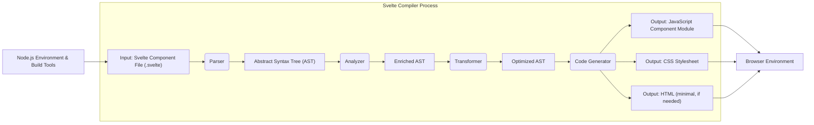

## Project Design Document: Svelte Compiler

**Version:** 1.1
**Date:** October 26, 2023
**Author:** AI Software Architect

### 1. Project Overview

This document details the design of the Svelte compiler, a crucial build-time tool that transforms declarative component code written in Svelte syntax into highly optimized vanilla JavaScript, along with corresponding CSS and minimal HTML. This process enables developers to build performant web applications with a concise and intuitive syntax. This document serves as a comprehensive reference for understanding the system's architecture, component interactions, and data flow, and is a prerequisite for conducting thorough threat modeling activities.

### 2. Project Goals

*   **Efficiently compile Svelte components:**  The core objective is to translate `.svelte` files into browser-ready JavaScript, CSS, and HTML with minimal overhead.
*   **Optimize for performance:**  Svelte aims to maximize web application performance by performing significant work during the compilation phase, reducing the runtime burden on the browser. This includes techniques like fine-grained DOM updates.
*   **Provide a superior developer experience:** Offer a declarative and straightforward syntax for building user interfaces, simplifying the development process.
*   **Implement fine-grained reactivity:**  Enable automatic and efficient updates to the Document Object Model (DOM) in response to changes in the application's state.
*   **Generate human-readable and maintainable output:** Produce JavaScript code that, while optimized, remains relatively understandable, aiding in debugging and maintenance.
*   **Support a wide range of web development workflows:** Integrate seamlessly with common build tools and development environments.

### 3. Target Audience

This document is primarily intended for:

*   Security engineers responsible for identifying and mitigating potential security risks through threat modeling and security assessments.
*   Software architects requiring a detailed understanding of the Svelte compiler's internal workings and its place within the broader web development ecosystem.
*   Developers contributing to the Svelte compiler project, needing a comprehensive overview of its architecture and components.
*   Technical leads and project managers involved in projects utilizing Svelte, requiring insight into the underlying technology.

### 4. System Architecture

The Svelte compiler operates as a build-time tool, typically integrated within a larger build process. It consumes individual Svelte component files and produces optimized web assets.

### 5. Key Components

*   **Input: Svelte Component File (.svelte):**
    *   Description: The foundational unit of a Svelte application, written by the developer. It encapsulates HTML markup, JavaScript logic, and CSS styles within a single file, using Svelte's specific syntax.
    *   Functionality: Defines the structure, behavior, and presentation of a reusable UI component.

*   **Parser:**
    *   Description: The initial stage of the compilation process, responsible for dissecting the raw text of the `.svelte` file and converting it into a structured, machine-readable representation.
    *   Functionality:
        *   **Lexical Analysis (Tokenization):** Breaks down the input stream into a sequence of meaningful tokens (keywords, identifiers, operators, etc.).
        *   **Syntactic Analysis (Parsing):**  Organizes the tokens according to the grammar rules of the Svelte language, building an Abstract Syntax Tree (AST) that reflects the hierarchical structure of the component.
        *   **Error Reporting:** Identifies and reports syntax errors and violations of the Svelte language rules, providing feedback to the developer.

*   **Abstract Syntax Tree (AST):**
    *   Description: A tree-like data structure that represents the syntactic structure of the Svelte component. Each node in the tree corresponds to a construct in the source code (e.g., HTML elements, JavaScript expressions, Svelte directives).
    *   Functionality: Serves as an intermediate representation that facilitates further analysis, transformation, and code generation. It provides a structured and easily traversable representation of the component's code.

*   **Analyzer:**
    *   Description: This component performs static analysis on the AST to gather semantic information and prepare it for transformations.
    *   Functionality:
        *   **Scope Analysis:** Determines the scope of variables and identifiers within the component.
        *   **Dependency Analysis:** Identifies dependencies between different parts of the component (e.g., reactive statements, template expressions).
        *   **Type Inference (limited):**  Infers types where possible to aid in optimization and error detection.

*   **Enriched AST:**
    *   Description: The AST after the analysis phase, containing additional semantic information and annotations.
    *   Functionality: Provides a more complete and context-aware representation of the component, enabling more sophisticated transformations.

*   **Transformer:**
    *   Description: The core of the compilation process, responsible for transforming the Enriched AST into an optimized representation suitable for code generation.
    *   Functionality:
        *   **Reactivity Implementation:**  Injects code to manage state updates and trigger DOM re-renders efficiently. This involves transforming Svelte's reactive declarations (`$:`) into JavaScript code that updates the DOM only when necessary.
        *   **Component Logic Transformation:** Converts Svelte-specific syntax (e.g., `{#if}`, `{#each}`, event handlers) into standard JavaScript constructs.
        *   **Style Processing and Scoping:** Extracts CSS styles defined within the component and applies scoping mechanisms (e.g., adding unique class names) to prevent style collisions between components.
        *   **Optimization:** Applies various optimization techniques to the generated code, such as dead code elimination and inlining.

*   **Optimized AST:**
    *   Description: The AST after undergoing transformations and optimizations, representing the component in a form that is ready for code generation.
    *   Functionality:  Provides a highly efficient and semantically equivalent representation of the original component.

*   **Code Generator:**
    *   Description: The final stage of the compilation process, responsible for generating the output files based on the Optimized AST.
    *   Functionality:
        *   **JavaScript Code Generation:** Produces the JavaScript module containing the component's logic, reactivity implementation, and DOM manipulation instructions. This is the primary output of the compiler.
        *   **CSS Stylesheet Generation:** Extracts and generates the CSS styles for the component, often including scoping attributes.
        *   **HTML Generation (Minimal):** Generates any necessary static HTML structure that cannot be efficiently created dynamically.

*   **Output: JavaScript Component Module:**
    *   Description: A JavaScript module containing the compiled component logic, ready to be imported and used in a web application.
    *   Functionality:  Provides the runtime behavior of the Svelte component in the browser.

*   **Output: CSS Stylesheet:**
    *   Description: A CSS file containing the styles specific to the compiled component, often with scoping to prevent style conflicts.
    *   Functionality: Defines the visual presentation of the component.

*   **Output: HTML (minimal, if needed):**
    *   Description: In some cases, the compiler may generate minimal static HTML.
    *   Functionality: Provides a basic HTML structure where necessary.

*   **Node.js Environment & Build Tools:**
    *   Description: The runtime environment where the Svelte compiler executes, often integrated with build tools like Vite, Webpack, or Rollup.
    *   Functionality: Provides the necessary APIs, libraries, and tools for file system access, module loading, and managing the build process.

*   **Browser Environment:**
    *   Description: The environment where the generated JavaScript, CSS, and HTML are executed by the user's web browser.
    *   Functionality: Renders the user interface, executes the component's logic, and responds to user interactions.

### 6. Data Flow

The data flows through the Svelte compiler in a sequential manner:

*   A developer authors a `.svelte` component file.
*   The Svelte compiler, running within a **Node.js Environment & Build Tools**, reads the `.svelte` file.
*   The **Parser** analyzes the input file and constructs an **Abstract Syntax Tree (AST)**.
*   The **Analyzer** processes the AST, gathering semantic information and producing an **Enriched AST**.
*   The **Transformer** manipulates the Enriched AST, implementing reactivity, transforming syntax, and applying optimizations, resulting in an **Optimized AST**.
*   The **Code Generator** takes the Optimized AST and generates the output files: a **JavaScript Component Module**, a **CSS Stylesheet**, and potentially minimal **HTML**.
*   These output files are then included in a web application and executed within the **Browser Environment**.

### 7. Interactions with External Systems

*   **File System:** The compiler interacts extensively with the file system to read input `.svelte` files, write output JavaScript, CSS, and HTML files, and potentially access configuration files.
*   **Node.js Modules:** The compiler relies on a rich ecosystem of Node.js modules for various tasks, including parsing (e.g., potentially leveraging existing HTML or CSS parsers), AST manipulation, code generation, and interacting with the file system.
*   **Build Tools (e.g., Vite, Webpack, Rollup):** Svelte is commonly integrated into larger build pipelines managed by tools like Vite, Webpack, or Rollup. These tools orchestrate the compilation process, manage dependencies, and handle bundling and optimization of the final application assets. The compiler exposes APIs or plugins for these tools to interact with.
*   **Package Managers (npm, yarn, pnpm):** The Svelte compiler itself is distributed and managed as a Node.js package through package managers like npm, yarn, or pnpm. Developers use these tools to install and manage the compiler as a project dependency.
*   **Configuration Files (e.g., `svelte.config.js`):** The compiler may interact with configuration files to customize its behavior, such as specifying preprocessors or compiler options.

### 8. Deployment Model

The Svelte compiler is primarily a development-time dependency.

*   **Development:** Developers utilize the compiler (often indirectly through integration with build tools) to transform their `.svelte` components into browser-ready code during the development process. This typically involves a watch mode that automatically recompiles components upon changes.
*   **Production:** The compiled output (JavaScript, CSS, HTML) is the artifact that is deployed to production environments. The Svelte compiler itself is not required in the production environment, as the compilation step has already been completed.

### 9. Security Considerations (For Threat Modeling)

This section outlines potential security considerations that will be the focus of subsequent threat modeling activities:

*   **Malicious Input Files:** The compiler must be resilient against maliciously crafted `.svelte` files that could exploit vulnerabilities in the parser or other components, potentially leading to denial-of-service or other unexpected behavior during the build process.
*   **Vulnerabilities in Dependencies:** The compiler relies on numerous third-party Node.js modules. Security vulnerabilities in these dependencies could be exploited if not properly managed and updated. Supply chain attacks targeting these dependencies are a concern.
*   **Cross-Site Scripting (XSS) in Generated Code:**  Care must be taken during code generation to ensure that the output JavaScript, especially when handling user-provided data within templates, does not introduce XSS vulnerabilities. Improper escaping or sanitization could lead to malicious script injection in the browser.
*   **Build Process Integrity:**  Compromising the build process, for example, by injecting malicious code into the compiler's source code or its dependencies, could lead to the distribution of compromised applications. Secure development practices and supply chain security measures are crucial.
*   **Source Code Confidentiality and Integrity:** Protecting the confidentiality and integrity of the Svelte compiler's source code is essential to prevent unauthorized modifications or disclosure of sensitive information.
*   **Regular Expression Denial of Service (ReDoS):** If the parser or other components utilize regular expressions for input validation or processing, poorly written regular expressions could be vulnerable to ReDoS attacks, potentially causing the build process to hang or consume excessive resources.
*   **Path Traversal Vulnerabilities:** If the compiler handles file paths based on user input or configuration, vulnerabilities could arise allowing attackers to access or modify files outside of the intended project directory.

This document provides a detailed design overview of the Svelte compiler, serving as a crucial input for the upcoming threat modeling exercise. By understanding the architecture, components, and data flow, potential security vulnerabilities can be systematically identified and addressed.