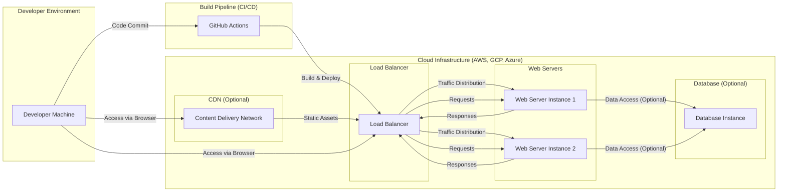

# BUSINESS POSTURE

The Svelte project aims to provide a modern, efficient, and developer-friendly approach to building web applications. It differentiates itself by being a compiler that transforms component code into highly optimized vanilla JavaScript, leading to better runtime performance and a smaller bundle size compared to traditional JavaScript frameworks.

Business Priorities and Goals:
- Provide a performant and efficient frontend framework for web developers.
- Enhance developer experience by offering a concise and intuitive syntax.
- Foster a strong and active community around the framework.
- Ensure long-term stability and maintainability of the framework.
- Promote the adoption of Svelte for building various types of web applications.

Most Important Business Risks:
- Security vulnerabilities in the Svelte compiler or runtime could negatively impact applications built with Svelte, leading to potential data breaches or service disruptions.
- Supply chain attacks targeting Svelte's dependencies or build process could compromise the integrity of the framework and applications using it.
- Performance regressions or architectural flaws could undermine the core value proposition of Svelte.
- Lack of community support or insufficient documentation could hinder adoption and developer satisfaction.
- Changes in web standards or browser technologies could require significant rework and impact compatibility.

# SECURITY POSTURE

Existing Security Controls:
- security control: Open Source Development - The project is publicly accessible on GitHub, allowing for community review and scrutiny of the codebase. Implemented: GitHub repository.
- security control: Dependency Management - Utilizes `npm` for managing dependencies, which includes mechanisms for package integrity checks. Implemented: `package.json`, `package-lock.json`, npm registry.
- security control: GitHub Security Features - Leverages GitHub's built-in security features such as vulnerability scanning for dependencies. Implemented: GitHub Dependabot.
- security control: Community Contributions and Review - Pull requests are reviewed by maintainers before merging, providing a degree of code review. Implemented: GitHub Pull Request process.

Accepted Risks:
- accepted risk: Reliance on Third-Party Dependencies - The project depends on external libraries and tools, which could introduce vulnerabilities.
- accepted risk: Open Source Vulnerability Disclosure - Vulnerabilities might be publicly disclosed before a patch is available, potentially leading to exploitation.
- accepted risk: Community-Driven Security - Security relies on the vigilance and expertise of the open-source community, which can vary.

Recommended Security Controls:
- security control: Automated Security Scanning - Implement automated static application security testing (SAST) and dependency scanning in the CI/CD pipeline to identify potential vulnerabilities early in the development process.
- security control: Regular Security Audits - Conduct periodic security audits by external security experts to identify and address potential weaknesses in the codebase and architecture.
- security control: Security Champions - Designate security champions within the core development team to promote security awareness and best practices.
- security control: Vulnerability Disclosure Policy - Establish a clear vulnerability disclosure policy to guide security researchers and users on how to report security issues responsibly.
- security control: Fuzzing - Implement fuzzing techniques to automatically test the compiler and runtime for unexpected behavior and potential vulnerabilities.

Security Requirements:
- Authentication: Not directly applicable to the Svelte framework itself. Authentication is typically handled by applications built using Svelte. Svelte should provide guidance and best practices for secure authentication in its documentation and examples.
- Authorization: Not directly applicable to the Svelte framework itself. Authorization is typically handled by applications built using Svelte. Svelte should provide guidance and best practices for secure authorization in its documentation and examples.
- Input Validation: The Svelte compiler needs to perform input validation on component code to prevent injection vulnerabilities and ensure code integrity. The runtime needs to handle user inputs in applications built with Svelte securely, following general web security best practices.
- Cryptography: While Svelte itself might not directly implement cryptographic functions, it should not hinder or discourage the use of strong cryptography in applications built with Svelte. If Svelte provides any utility functions related to cryptography (e.g., in examples), they must adhere to security best practices.

# DESIGN

## C4 CONTEXT

```mermaid
flowchart LR
    subgraph "Web Application Users"
        A[Web Browsers]
    end
    subgraph "Software Developers"
        B[Svelte Developers]
    end
    C[Svelte Project]
    D[npm Registry]
    E[Build Tools (Vite, Rollup, etc.)]

    B --> C
    C --> D
    C --> E
    E --> A
    A -- "Requests" --> E
    E -- "Responses" --> A
```

Context Diagram Elements:

- Element:
    - Name: Svelte Project
    - Type: Software System
    - Description: The Svelte open-source project, encompassing the compiler, runtime, documentation, and examples. It provides a framework for building web applications.
    - Responsibilities: Compiling Svelte components into optimized JavaScript, providing a runtime library for component management, offering documentation and examples for developers.
    - Security controls: Open source development, community review, dependency management, GitHub security features, recommended security controls listed in SECURITY POSTURE section.

- Element:
    - Name: Svelte Developers
    - Type: Person
    - Description: Software developers who use the Svelte framework to build web applications.
    - Responsibilities: Writing Svelte components, using build tools to compile and bundle applications, deploying applications to web servers.
    - Security controls: Responsible for implementing security best practices in the applications they build using Svelte, including secure authentication, authorization, and input validation.

- Element:
    - Name: Web Browsers
    - Type: Software System
    - Description: Web browsers used by end-users to access and interact with web applications built with Svelte.
    - Responsibilities: Rendering web pages, executing JavaScript code, handling user interactions, enforcing browser security policies.
    - Security controls: Browser security features such as Content Security Policy (CSP), Same-Origin Policy (SOP), and built-in vulnerability protection.

- Element:
    - Name: npm Registry
    - Type: Software System
    - Description: A public registry for JavaScript packages, used to distribute and manage Svelte and its dependencies.
    - Responsibilities: Hosting and distributing npm packages, providing package integrity checks.
    - Security controls: Package signing, vulnerability scanning, npm security policies.

- Element:
    - Name: Build Tools (Vite, Rollup, etc.)
    - Type: Software System
    - Description: Tools used by Svelte developers to build, bundle, and optimize Svelte applications for deployment. Examples include Vite, Rollup, and Webpack.
    - Responsibilities: Compiling Svelte components, bundling JavaScript, optimizing assets, providing development servers.
    - Security controls: Dependency management, plugin security, configuration security.

## C4 CONTAINER

```mermaid
flowchart LR
    subgraph "Web Application Users"
        A[Web Browsers]
    end
    subgraph "Software Developers"
        B[Svelte Developers]
    end
    subgraph "Svelte Project"
        C[Svelte Compiler]
        D[Svelte Runtime]
        E[Documentation Website]
        F[Example Applications]
    end
    G[npm Registry]
    H[Build Tools (Vite, Rollup, etc.)]

    B --> C
    C --> D
    C --> H
    C --> E
    C --> F
    D --> A
    H --> A
    F --> A
    C --> G
    D --> G
    E --> G
    F --> G
```

Container Diagram Elements:

- Element:
    - Name: Svelte Compiler
    - Type: Application
    - Description: The core component of Svelte, responsible for transforming Svelte component code into optimized JavaScript.
    - Responsibilities: Parsing Svelte components, generating efficient JavaScript code, performing static analysis, optimizing output for performance and bundle size.
    - Security controls: Input validation of Svelte component code, SAST during development, fuzzing to detect compiler vulnerabilities.

- Element:
    - Name: Svelte Runtime
    - Type: Library
    - Description: A small JavaScript library included in Svelte applications, providing essential functionalities for component lifecycle management and DOM updates.
    - Responsibilities: Managing component instances, handling reactivity, efficiently updating the DOM, providing lifecycle hooks.
    - Security controls: Input validation of data within the runtime, protection against DOM-based XSS vulnerabilities, regular security review of runtime code.

- Element:
    - Name: Documentation Website
    - Type: Web Application
    - Description: The official Svelte documentation website, providing guides, tutorials, API references, and examples for developers.
    - Responsibilities: Hosting documentation content, providing search functionality, offering interactive examples, managing user feedback.
    - Security controls: Standard web application security practices, including input validation, output encoding, protection against XSS and CSRF, regular security updates of website platform.

- Element:
    - Name: Example Applications
    - Type: Web Applications
    - Description: A collection of example applications built with Svelte, showcasing different features and use cases.
    - Responsibilities: Demonstrating Svelte capabilities, providing code examples for developers, serving as test cases.
    - Security controls: Review of example application code for security vulnerabilities, ensuring examples follow security best practices, regular updates of example applications.

- Element:
    - Name: npm Registry
    - Type: Software System
    - Description: (Same as in Context Diagram) A public registry for JavaScript packages, used to distribute and manage Svelte and its dependencies.
    - Responsibilities: (Same as in Context Diagram) Hosting and distributing npm packages, providing package integrity checks.
    - Security controls: (Same as in Context Diagram) Package signing, vulnerability scanning, npm security policies.

- Element:
    - Name: Build Tools (Vite, Rollup, etc.)
    - Type: Software System
    - Description: (Same as in Context Diagram) Tools used by Svelte developers to build, bundle, and optimize Svelte applications for deployment.
    - Responsibilities: (Same as in Context Diagram) Compiling Svelte components, bundling JavaScript, optimizing assets, providing development servers.
    - Security controls: (Same as in Context Diagram) Dependency management, plugin security, configuration security.

## DEPLOYMENT

Svelte itself is not deployed as a standalone application. Instead, it is used by developers to build web applications. The deployment architecture described here is for a typical web application built using Svelte.

Deployment Architecture: Cloud-based Web Application Deployment



Deployment Diagram Elements:

- Element:
    - Name: Developer Machine
    - Type: Infrastructure
    - Description: The local development environment used by Svelte developers to write code, run development servers, and build applications.
    - Responsibilities: Code development, local testing, running build tools.
    - Security controls: Developer machine security practices, code editor security, local development environment security.

- Element:
    - Name: GitHub Actions
    - Type: CI/CD Pipeline
    - Description: A cloud-based CI/CD service used to automate the build, test, and deployment process for Svelte applications.
    - Responsibilities: Automated building, testing, and deployment of Svelte applications, running security scans, managing deployment workflows.
    - Security controls: Secure pipeline configuration, access control to pipeline resources, secrets management, security scanning integration.

- Element:
    - Name: Load Balancer
    - Type: Infrastructure
    - Description: Distributes incoming web traffic across multiple web server instances to ensure high availability and scalability.
    - Responsibilities: Traffic distribution, health checks, SSL termination, load balancing algorithms.
    - Security controls: DDoS protection, SSL/TLS configuration, access control, security monitoring.

- Element:
    - Name: Web Server Instance (1 & 2)
    - Type: Infrastructure (Compute Instance)
    - Description: Virtual machines or containers running the Svelte application, serving web pages and handling application logic.
    - Responsibilities: Running the Svelte application, serving HTTP requests, processing application logic, interacting with databases (if applicable).
    - Security controls: Operating system hardening, web server configuration security, application security controls, intrusion detection systems, security monitoring.

- Element:
    - Name: Database Instance (Optional)
    - Type: Infrastructure (Data Storage)
    - Description: A database system used to store application data, if required by the Svelte application.
    - Responsibilities: Data storage, data retrieval, data persistence, data integrity.
    - Security controls: Database access control, encryption at rest and in transit, database security hardening, regular backups, security monitoring.

- Element:
    - Name: Content Delivery Network (CDN) (Optional)
    - Type: Infrastructure (Content Delivery)
    - Description: A network of geographically distributed servers that cache static assets (e.g., JavaScript, CSS, images) to improve performance and reduce latency for users.
    - Responsibilities: Caching static content, serving content from edge locations, improving website performance.
    - Security controls: CDN security configuration, protection against CDN-specific attacks, secure content delivery, access control to CDN configuration.

## BUILD

```mermaid
flowchart LR
    A[Developer] --> B{Code Changes};
    B -- Commit & Push --> C[GitHub Repository];
    C --> D[GitHub Actions Workflow];
    D --> E{Build Process};
    E -- "npm install" --> F[Dependency Download];
    E -- "Svelte Compile" --> G[Compiled Code];
    E -- "Tests & Linters" --> H{Security Checks};
    H -- Pass --> I[Build Artifacts];
    H -- Fail --> J[Build Failure & Notifications];
    I --> K[Artifact Storage (e.g., npm, Cloud Storage)];
    K --> L[Deployment Pipeline];
```

Build Process Description:

1. Developer makes code changes and commits them to the GitHub repository.
2. GitHub Actions workflow is triggered by code changes (e.g., push, pull request).
3. The workflow initiates the build process, which typically includes:
    - Downloading dependencies using `npm install` or similar package manager commands.
    - Compiling Svelte components using the Svelte compiler.
    - Running tests (unit tests, integration tests) to ensure code quality and functionality.
    - Executing linters and static analysis tools to identify code style issues and potential vulnerabilities.
    - Performing security checks, such as dependency scanning and SAST.
4. If all checks pass, build artifacts (compiled JavaScript, CSS, assets) are generated.
5. Build artifacts are stored in artifact storage, such as npm registry for libraries or cloud storage for applications.
6. The deployment pipeline then picks up the build artifacts for deployment to target environments.
7. If any checks fail during the build process, the build fails, and notifications are sent to developers.

Build Process Security Controls:

- security control: Automated Build Pipeline - Using GitHub Actions to automate the build process ensures consistency and reduces manual errors. Implemented: GitHub Actions workflows.
- security control: Dependency Scanning - Integrating dependency scanning tools (e.g., npm audit, Dependabot) into the build pipeline to identify and address vulnerable dependencies. Implemented: GitHub Actions workflow, npm audit.
- security control: Static Application Security Testing (SAST) - Incorporating SAST tools to analyze the Svelte compiler and potentially example applications for code-level vulnerabilities. Implemented: Can be integrated into GitHub Actions workflow.
- security control: Code Linting and Formatting - Using linters (e.g., ESLint) and formatters (e.g., Prettier) to enforce code style and catch potential code quality issues. Implemented: GitHub Actions workflow, developer tooling.
- security control: Test Automation - Automated unit and integration tests to ensure code functionality and prevent regressions. Implemented: GitHub Actions workflow, testing frameworks.
- security control: Artifact Signing (for npm packages) - Signing npm packages to ensure integrity and authenticity. Implemented: npm publish process.
- security control: Access Control to Build Pipeline - Restricting access to GitHub Actions workflows and build configurations to authorized personnel. Implemented: GitHub repository permissions.
- security control: Secrets Management - Securely managing secrets (API keys, credentials) used in the build and deployment process, using GitHub Secrets or similar secret management solutions. Implemented: GitHub Secrets.

# RISK ASSESSMENT

Critical Business Processes:
- Maintaining the integrity and availability of the Svelte compiler and runtime.
- Ensuring the security and reliability of the npm package distribution of Svelte.
- Providing a secure and trustworthy framework for web developers to build applications.
- Maintaining the reputation and community trust in the Svelte project.

Data Sensitivity:
- Svelte Source Code: High sensitivity. Integrity and confidentiality are important to prevent unauthorized modifications and maintain trust in the project. Availability is crucial for ongoing development and community contributions.
- Svelte npm Package: High sensitivity. Integrity is paramount to prevent supply chain attacks and ensure users download a safe and unmodified package. Availability is essential for developers to use Svelte in their projects.
- Documentation and Website Content: Medium sensitivity. Integrity is important to ensure accurate and trustworthy information. Availability is important for developer access and learning.
- User Data in Applications Built with Svelte: Sensitivity depends on the specific application. Svelte itself does not handle user data, but applications built with it might handle sensitive user data. Security of these applications is the responsibility of the application developers, but Svelte should provide guidance and best practices.

# QUESTIONS & ASSUMPTIONS

Questions:
- What specific SAST tools are currently used or planned to be used for the Svelte project?
- Is there a formal vulnerability disclosure policy in place for Svelte?
- Are there designated security champions within the core Svelte development team?
- Are regular security audits conducted for the Svelte project?
- What specific dependency scanning tools are used in the CI/CD pipeline?

Assumptions:
- The Svelte project prioritizes the security and integrity of its compiler, runtime, and npm package.
- The Svelte community values security and contributes to identifying and addressing security issues.
- The Svelte project follows standard open-source security best practices.
- The primary deployment model for Svelte applications is cloud-based web application deployments.
- The build process is automated using GitHub Actions.