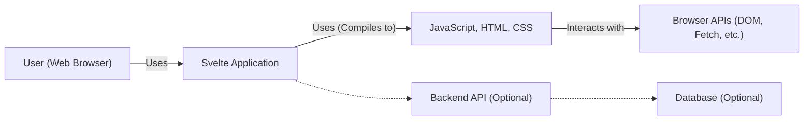
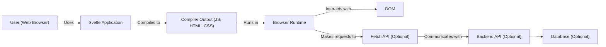
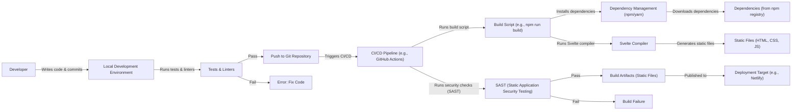

# BUSINESS POSTURE

Business Priorities and Goals:

*   Provide a modern, efficient, and developer-friendly framework for building user interfaces.
*   Minimize the runtime overhead of the framework, resulting in faster and smaller applications.
*   Maintain a vibrant and active open-source community.
*   Attract developers and companies to adopt Svelte for their projects.
*   Ensure the long-term maintainability and evolution of the framework.
*   Reduce the amount of boilerplate code developers need to write.
*   Provide a component-based architecture for building reusable UI elements.

Most Important Business Risks:

*   Security vulnerabilities in the framework could lead to exploits in applications built with Svelte, damaging the reputation and adoption of the framework.
*   Inability to keep up with the evolving web development landscape could lead to Svelte becoming obsolete.
*   Lack of community engagement and contributions could hinder the development and maintenance of the framework.
*   Competition from other established frameworks (React, Angular, Vue.js) could limit Svelte's market share.
*   Performance regressions could negate the benefits of Svelte's compiler-based approach.

# SECURITY POSTURE

Existing Security Controls:

*   security control: Regular code reviews and audits. (Mentioned throughout the repository's contribution guidelines and development practices.)
*   security control: Dependency management to track and update third-party libraries. (Visible in package.json and related files.)
*   security control: Testing for common web vulnerabilities (though the specifics need further clarification). (Implied by the presence of test suites.)
*   security control: Community involvement in identifying and reporting security issues. (Encouraged through GitHub issues and discussions.)
*   security control: Use of linters and static analysis tools. (Visible in configuration files and build scripts.)

Accepted Risks:

*   accepted risk: Reliance on community contributions for security reviews and fixes. While beneficial, it introduces a dependency on external factors.
*   accepted risk: Potential for unknown vulnerabilities in third-party dependencies, despite efforts to keep them updated.
*   accepted risk: The framework itself, being relatively new compared to giants like React or Angular, might have undiscovered architectural vulnerabilities.

Recommended Security Controls:

*   Implement a comprehensive security testing strategy, including static application security testing (SAST), dynamic application security testing (DAST), and interactive application security testing (IAST).
*   Establish a formal vulnerability disclosure program to encourage responsible reporting of security issues.
*   Conduct regular penetration testing to identify and address potential weaknesses.
*   Implement Content Security Policy (CSP) headers to mitigate the risk of cross-site scripting (XSS) attacks.
*   Implement Subresource Integrity (SRI) to ensure that fetched resources haven't been tampered with.

Security Requirements:

*   Authentication: Not directly applicable to the framework itself, as Svelte is a front-end framework. Authentication is typically handled by the backend application.
*   Authorization: Not directly applicable to the framework itself. Authorization is typically handled by the backend application. However, Svelte applications should be designed to interact securely with authorized APIs.
*   Input Validation: Svelte should provide mechanisms or guidance for developers to implement proper input validation to prevent common web vulnerabilities like XSS and injection attacks. This includes sanitizing user input and escaping output appropriately.
*   Cryptography: Svelte should not handle cryptographic operations directly. It should rely on browser-provided APIs (e.g., Web Crypto API) or well-vetted libraries for any cryptographic needs. The framework should provide guidance on securely using these APIs.

# DESIGN

## C4 CONTEXT

Element Descriptions:

*   Element:
    *   Name: User (Web Browser)
    *   Type: Person
    *   Description: A person interacting with the Svelte application through a web browser.
    *   Responsibilities: Initiates requests, views and interacts with the UI, provides input.
    *   Security controls: Browser-based security controls (e.g., same-origin policy, cookies, HTTPS).

*   Element:
    *   Name: Svelte Application
    *   Type: Software System
    *   Description: The application built using the Svelte framework.
    *   Responsibilities: Renders the user interface, handles user interactions, communicates with backend APIs (if any).
    *   Security controls: Input validation, output encoding, secure communication with backend APIs (HTTPS), adherence to secure coding practices.

*   Element:
    *   Name: JavaScript, HTML, CSS
    *   Type: Code
    *   Description: The output of the Svelte compiler, which is standard web code executed by the browser.
    *   Responsibilities: Executes the application logic, renders the UI, interacts with the DOM.
    *   Security controls: Adherence to web security best practices, proper use of browser APIs.

*   Element:
    *   Name: Browser APIs (DOM, Fetch, etc.)
    *   Type: API
    *   Description: Standard web APIs provided by the browser.
    *   Responsibilities: Provide access to browser functionalities, network communication, etc.
    *   Security controls: Browser-enforced security mechanisms.

*   Element:
    *   Name: Backend API (Optional)
    *   Type: Software System
    *   Description: An optional backend API that the Svelte application might interact with.
    *   Responsibilities: Handles business logic, data persistence, authentication, authorization.
    *   Security controls: Authentication, authorization, input validation, secure coding practices, secure communication (HTTPS).

*   Element:
    *   Name: Database (Optional)
    *   Type: Database
    *   Description: An optional database used by the Backend API.
    *   Responsibilities: Stores and retrieves data.
    *   Security controls: Access controls, encryption, data validation.

## C4 CONTAINER

Element Descriptions:

*   Element:
    *   Name: User (Web Browser)
    *   Type: Person
    *   Description: A person interacting with the Svelte application.
    *   Responsibilities: Initiates requests, views and interacts with the UI.
    *   Security controls: Browser-based security controls.

*   Element:
    *   Name: Svelte Application
    *   Type: Software System
    *   Description: The application code written in Svelte.
    *   Responsibilities: Defines the application's components, logic, and data flow.
    *   Security controls: Secure coding practices within the Svelte components.

*   Element:
    *   Name: Compiler Output (JS, HTML, CSS)
    *   Type: Code
    *   Description: The compiled output of the Svelte application.
    *   Responsibilities: Executes in the browser runtime.
    *   Security controls: Output encoding, adherence to web security best practices.

*   Element:
    *   Name: Browser Runtime
    *   Type: Environment
    *   Description: The JavaScript runtime environment within the web browser.
    *   Responsibilities: Executes JavaScript code, manages the DOM, handles events.
    *   Security controls: Browser-enforced security mechanisms.

*   Element:
    *   Name: DOM
    *   Type: API
    *   Description: The Document Object Model, the browser's representation of the web page.
    *   Responsibilities: Provides an interface for manipulating the page's structure and content.
    *   Security controls: Browser-enforced security mechanisms related to DOM manipulation.

*   Element:
    *   Name: Fetch API (Optional)
    *   Type: API
    *   Description: The browser's API for making network requests.
    *   Responsibilities: Sends and receives data from backend APIs.
    *   Security controls: Browser-enforced security mechanisms (e.g., CORS).

*   Element:
    *   Name: Backend API (Optional)
    *   Type: Software System
    *   Description: An optional backend API.
    *   Responsibilities: Handles business logic, data persistence.
    *   Security controls: Authentication, authorization, input validation, secure coding practices.

*   Element:
    *   Name: Database (Optional)
    *   Type: Database
    *   Description: An optional database.
    *   Responsibilities: Stores and retrieves data.
    *   Security controls: Access controls, encryption, data validation.

## DEPLOYMENT

Possible Deployment Solutions:

1.  Static Hosting (Netlify, Vercel, GitHub Pages, AWS S3 + CloudFront, etc.): This is the most common deployment method for Svelte applications, as they compile down to static HTML, CSS, and JavaScript files.
2.  Server-Side Rendering (SSR) with a Node.js server (using SvelteKit): This approach is used for applications that require server-side rendering for SEO or other performance reasons.
3.  Hybrid approach (combining static and server-side rendering): Some parts of the application might be statically generated, while others require server-side rendering.
4.  Embedded within another application: A Svelte component or application could be embedded within a larger application built with a different framework.

Chosen Solution (for detailed description): Static Hosting (e.g., Netlify)

```mermaid
graph LR
    Developer["Developer"] -- "Pushes code to" --> GitRepo["Git Repository (GitHub)"];
    GitRepo -- "Triggers webhook on push" --> Netlify["Netlify (Deployment Platform)"];
    Netlify -- "Builds the application" --> BuildServer["Build Server"];
    BuildServer -- "Runs Svelte compiler" --> Compiler["Svelte Compiler"];
    Compiler -- "Generates static files" --> StaticFiles["Static Files (HTML, CSS, JS)"];
    StaticFiles -- "Deployed to" --> CDN["CDN (Content Delivery Network)"];
    CDN -- "Serves files to" --> UserBrowser["User's Browser"];

```

Element Descriptions:

*   Element:
    *   Name: Developer
    *   Type: Person
    *   Description: The developer writing and deploying the Svelte application.
    *   Responsibilities: Writes code, commits changes, pushes to the repository.
    *   Security controls: Code reviews, secure coding practices, access controls to the repository.

*   Element:
    *   Name: Git Repository (GitHub)
    *   Type: Software System
    *   Description: The source code repository hosted on GitHub.
    *   Responsibilities: Stores the application code, tracks changes, triggers deployment pipelines.
    *   Security controls: Access controls, branch protection rules, code review requirements.

*   Element:
    *   Name: Netlify (Deployment Platform)
    *   Type: Software System
    *   Description: The platform used to build and deploy the Svelte application.
    *   Responsibilities: Automates the build process, deploys the application to a CDN.
    *   Security controls: Secure build environment, access controls, HTTPS deployment.

*   Element:
    *   Name: Build Server
    *   Type: Server
    *   Description: The server within Netlify that executes the build process.
    *   Responsibilities: Runs the build commands, installs dependencies, generates the static files.
    *   Security controls: Secure build environment, limited access.

*   Element:
    *   Name: Svelte Compiler
    *   Type: Software
    *   Description: The Svelte compiler that transforms the Svelte code into static files.
    *   Responsibilities: Compiles the application code.
    *   Security controls: Secure coding practices within the compiler itself.

*   Element:
    *   Name: Static Files (HTML, CSS, JS)
    *   Type: Files
    *   Description: The output of the build process, ready to be served to users.
    *   Responsibilities: Represents the application's UI and logic.
    *   Security controls: Output encoding, adherence to web security best practices.

*   Element:
    *   Name: CDN (Content Delivery Network)
    *   Type: Network
    *   Description: A distributed network of servers that deliver the application's static files to users.
    *   Responsibilities: Caches and serves the static files, improving performance and reducing latency.
    *   Security controls: HTTPS, DDoS protection, access controls.

*   Element:
    *   Name: User's Browser
    *   Type: Software
    *   Description: The user's web browser.
    *   Responsibilities: Requests and renders the application.
    *   Security controls: Browser-based security controls.

## BUILD

Build Process Description:

1.  Developer writes code and commits changes to their local development environment.
2.  Local tests and linters are run to ensure code quality and identify potential issues.
3.  If tests and linters pass, the code is pushed to a Git repository (e.g., GitHub).
4.  Pushing to the repository triggers a CI/CD pipeline (e.g., GitHub Actions).
5.  The CI/CD pipeline executes a build script (e.g., `npm run build`).
6.  The build script installs project dependencies using a package manager (npm or yarn). Dependencies are fetched from a registry (e.g., npm registry).
7.  The build script runs the Svelte compiler, which transforms the Svelte code into static HTML, CSS, and JavaScript files.
8.  Security checks, such as Static Application Security Testing (SAST), are performed on the code.
9.  If the SAST checks pass, the build artifacts (static files) are created.
10. If the SAST checks fail, the build fails, and the developer is notified to fix the issues.
11. The build artifacts are then published to a deployment target (e.g., Netlify, Vercel, AWS S3).

Security Controls in Build Process:

*   Dependency Management: Using package managers (npm/yarn) with lock files to ensure consistent and reproducible builds. Regularly auditing and updating dependencies to mitigate vulnerabilities in third-party libraries.
*   Tests & Linters: Running automated tests and linters to catch errors and enforce code style guidelines early in the development process.
*   CI/CD Pipeline: Automating the build and deployment process using a CI/CD pipeline to ensure consistency and reduce manual errors.
*   SAST (Static Application Security Testing): Integrating SAST tools into the CI/CD pipeline to automatically scan the code for security vulnerabilities.
*   Secure Build Environment: Using a secure and isolated build environment to prevent tampering with the build process.
*   Artifact Signing (Optional): Digitally signing build artifacts to ensure their integrity and authenticity.

# RISK ASSESSMENT

Critical Business Processes to Protect:

*   Continuous Integration and Continuous Deployment (CI/CD) pipeline: Ensuring the integrity and availability of the build and deployment process is crucial for delivering updates and maintaining the application.
*   Source Code Repository: Protecting the source code from unauthorized access, modification, or deletion is essential for maintaining the integrity and confidentiality of the application.
*   Framework Reputation: Protecting the reputation of the Svelte framework by preventing and addressing security vulnerabilities is critical for its continued adoption and success.

Data to Protect and Sensitivity:

*   Source Code: High sensitivity. Contains the application's logic and potentially sensitive information (if not properly managed).
*   User Data (if handled by the Svelte application directly, which is unlikely): High sensitivity. This would typically be handled by a backend, but if any user data is processed client-side, it needs to be protected.
*   Configuration Files: Medium to High sensitivity. May contain API keys, secrets, or other sensitive configuration data. These should be managed securely and not committed to the source code repository.
*   Dependencies: Medium sensitivity. Vulnerabilities in dependencies can be exploited to compromise the application.
*   Build Artifacts: Medium sensitivity. The compiled application code, which should be protected from tampering.

# QUESTIONS & ASSUMPTIONS

Questions:

*   What specific types of testing are currently implemented for Svelte (unit, integration, end-to-end, security)?
*   Are there any existing security audits or penetration testing reports available for review?
*   What is the process for handling security vulnerabilities reported by the community?
*   Are there any specific security concerns or requirements from users or adopters of Svelte?
*   What is the current process for managing and updating dependencies?
*   Is there a specific threat model already in place, even if informal?
*   What is the process for reviewing and merging pull requests, particularly regarding security considerations?

Assumptions:

*   BUSINESS POSTURE: The Svelte project prioritizes performance, developer experience, and community engagement. Security is a significant concern, but not necessarily the *primary* driver.
*   SECURITY POSTURE: The project follows basic secure coding practices, but a formal, comprehensive security program may not be fully established. There's reliance on community contributions for security.
*   DESIGN: The deployment model is primarily static hosting, although server-side rendering with SvelteKit is also a possibility. The build process is automated through a CI/CD pipeline. The primary security focus is on preventing common web vulnerabilities like XSS.