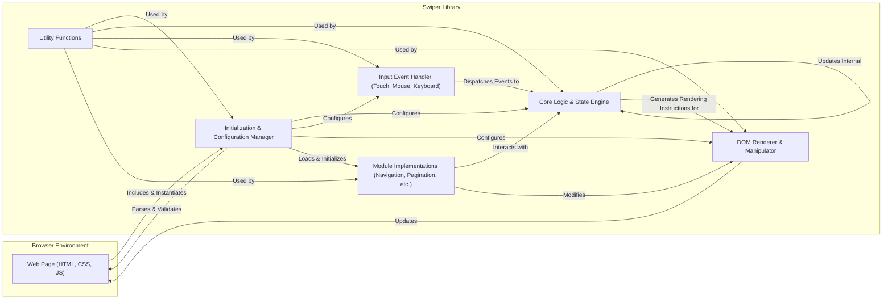
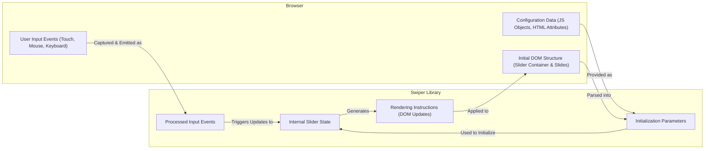

## Project Design Document: Swiper JavaScript Library (Improved)

**1. Introduction**

This document provides an enhanced design overview of the Swiper JavaScript library, a widely used open-source library for creating touch-enabled sliders and carousels with native-like behavior in web browsers. This document aims to provide a comprehensive understanding of Swiper's architecture, its core components, and the flow of data within the library and its interactions with the surrounding environment. This detailed design serves as a critical input for subsequent threat modeling activities.

**2. Goals and Objectives**

*   To present a clear and in-depth description of the Swiper library's internal structure and operation.
*   To precisely identify the key components of Swiper and delineate their specific responsibilities and interactions.
*   To thoroughly describe the data flow within the library, including the types of data being processed and exchanged between components and with the external environment.
*   To explicitly highlight potential areas of security vulnerability and concern, providing a solid foundation for future threat modeling exercises.
*   To serve as a valuable reference document for security analysts, developers integrating Swiper, and contributors to the Swiper project.

**3. Target Audience**

*   Security engineers and analysts responsible for performing threat modeling and security assessments.
*   Web developers who are integrating the Swiper library into their web applications.
*   Maintainers and contributors involved in the development and upkeep of the Swiper library.

**4. System Overview**

Swiper is a client-side JavaScript library designed to enable the creation of interactive, touch-friendly sliders and carousels within web pages. It manages user input (touch and mouse events), maintains the internal state of the slider, and dynamically updates the Document Object Model (DOM) to reflect the current slide and any applied transitions or effects. Swiper is highly customizable through a rich set of configuration options and offers a modular architecture for extending its functionality. Key features include:

*   Comprehensive navigation options (pagination indicators, navigation arrows).
*   Automatic sliding functionality (autoplay).
*   Various modes of operation (looping, free mode).
*   Visual transition effects (fade, cube, coverflow, etc.).
*   Support for lazy loading of images within slides.
*   Built-in accessibility features and ARIA attribute management.

**5. Architectural Design**

The Swiper library's architecture is structured around several interconnected components, each with specific responsibilities.

**5.1. Component Descriptions**

*   **Web Page (HTML, CSS, JS):** The host environment where Swiper is integrated. This includes the HTML markup defining the slider structure, CSS for styling, and the JavaScript code that instantiates and interacts with the Swiper library.
*   **Initialization & Configuration Manager:** This component is responsible for the initial setup of a Swiper instance. It parses and validates user-provided configuration options (passed via JavaScript or HTML data attributes), sets up internal data structures, and initializes other components. It also handles default configuration settings.
*   **Core Logic & State Engine:** This central component manages the internal state of the slider, including the current slide index, transition progress, and active features. It implements the core logic for handling slide transitions, managing autoplay, and responding to events.
*   **Input Event Handler (Touch, Mouse, Keyboard):** This component listens for and processes user interactions such as touch gestures (swipes, drags), mouse clicks, and keyboard navigation. It translates these raw events into higher-level actions that are then passed to the Core Logic & State Engine.
*   **DOM Renderer & Manipulator:** This component directly interacts with the browser's DOM. It receives rendering instructions from the Core Logic & State Engine and updates the visual representation of the slider, including positioning slides, applying CSS transitions, and showing or hiding navigation elements.
*   **Module Implementations (Navigation, Pagination, etc.):** Swiper's functionality is extended through optional modules. These modules implement specific features like pagination dots, navigation arrows, parallax effects, and more. They interact with the Core Logic & State Engine and the DOM Renderer & Manipulator to provide their respective functionalities.
*   **Utility Functions:** This component contains a collection of helper functions used across various parts of the library for tasks such as calculations, DOM manipulation, and event handling.

**6. Data Flow**

The following describes the key data flows within and around the Swiper library, highlighting the movement and transformation of information.

**6.1. Data Flow Descriptions**

*   **User Input Events (Touch, Mouse, Keyboard) -> Processed Input Events:** User interactions with the slider are captured by the browser and processed by the Input Event Handler, which translates them into meaningful events for Swiper.
*   **Configuration Data (JS Objects, HTML Attributes) -> Initialization Parameters:** Developers provide configuration options through JavaScript objects or HTML attributes. This data defines the slider's behavior and appearance and is used during initialization.
*   **Initial DOM Structure (Slider Container & Slides) -> Initialization Parameters:** The initial HTML structure of the slider elements is parsed by the Initialization & Configuration Manager to identify and manage the relevant DOM nodes.
*   **Initialization Parameters -> Internal Slider State:** The configuration data and information extracted from the DOM are used to set up the initial state of the slider, including the starting slide, enabled features, and internal variables.
*   **Processed Input Events -> Internal Slider State:** Processed user input events trigger updates to the slider's internal state, such as changing the current slide index, initiating transitions, or updating drag positions.
*   **Internal Slider State -> Rendering Instructions (DOM Updates):** Based on the current internal state, the Core Logic & State Engine generates instructions for the DOM Renderer & Manipulator on how to update the visual representation of the slider.
*   **Rendering Instructions (DOM Updates) -> Initial DOM Structure (Slider Container & Slides):** The DOM Renderer & Manipulator applies the rendering instructions, modifying the HTML elements to reflect the current state of the slider, such as changing CSS `transform` properties, adding or removing classes, and updating attributes.

**7. External Interfaces**

Swiper interacts with the external environment through the following interfaces:

*   **Configuration Options:**  JavaScript objects or HTML data attributes used to customize Swiper's behavior and appearance.
*   **Public API:**  JavaScript methods and properties exposed by the Swiper instance for programmatic control and interaction (e.g., `slideNext()`, `slideTo()`, `destroy()`).
*   **Events:**  Custom JavaScript events emitted by the Swiper instance to notify the application about state changes and user interactions (e.g., `slideChange`, `reachBeginning`, `touchStart`).
*   **DOM Structure:**  The HTML elements that Swiper manipulates to create the slider interface.
*   **CSS Styling:**  CSS classes applied by Swiper and custom CSS provided by the developer to style the slider.

**8. Security Considerations (Detailed)**

This section outlines potential security considerations that should be thoroughly investigated during threat modeling.

*   **Cross-Site Scripting (XSS):**
    *   **Configuration Injection:** If configuration options are sourced from untrusted user input and not properly sanitized, malicious scripts could be injected and executed within the context of the web page.
    *   **Unsafe HTML in Slides:** If the content of the slides is dynamically generated from user input without proper sanitization, it could lead to XSS vulnerabilities.
    *   **Event Handler Injection:** If user-provided data is used to define event handlers or callbacks, it could be exploited to execute arbitrary JavaScript code.
*   **Dependency Vulnerabilities:** Swiper relies on browser APIs and may have transitive dependencies. Vulnerabilities in these underlying components could be exploited through Swiper. Regular dependency updates and security audits are crucial.
*   **Configuration Manipulation:** If an attacker can manipulate the configuration options passed to Swiper (e.g., through URL parameters or compromised local storage), they might be able to alter the slider's behavior in unintended ways, potentially leading to information disclosure or other attacks.
*   **Denial of Service (DoS):**
    *   **Resource Exhaustion:**  Maliciously crafted configurations or excessive user interactions could potentially lead to resource exhaustion in the browser, causing performance degradation or crashes.
    *   **Logic Exploits:**  Exploiting flaws in Swiper's logic could lead to infinite loops or other resource-intensive operations.
*   **Logic Flaws and Unexpected Behavior:** Bugs in Swiper's core logic or event handling could lead to unexpected behavior that might be exploitable. Thorough testing and code reviews are necessary to mitigate this risk.
*   **Client-Side Prototype Pollution:** While less likely in a library context, if Swiper's internal mechanisms inadvertently allow modification of built-in JavaScript prototypes, it could have wider security implications for the application.
*   **Accessibility Issues as Security Vectors:** While primarily an accessibility concern, improper handling of focus or ARIA attributes could potentially be leveraged in social engineering attacks or to bypass security controls.

**9. Assumptions and Constraints**

*   The web page integrating Swiper is served over HTTPS to protect against man-in-the-middle attacks and ensure the integrity of the delivered code.
*   The browser environment adheres to standard web security principles, including the same-origin policy, to limit cross-site interactions.
*   Developers integrating Swiper are responsible for sanitizing any user-provided content that is dynamically inserted into the slider's slides.
*   This design document primarily focuses on the client-side behavior of Swiper. Server-side interactions, if any, are outside the scope of this document.
*   It is assumed that the hosting environment for the web application has basic security measures in place to protect against common web attacks.

**10. Future Considerations**

*   A detailed security review of each Swiper module to identify module-specific vulnerabilities.
*   Analysis of the security implications of different transition effects and their potential for abuse.
*   Examination of the library's handling of custom callbacks and event listeners for potential security risks.
*   Regular security audits and penetration testing of applications using Swiper.
*   Investigation of potential security enhancements that could be incorporated into the Swiper library itself.

This improved design document provides a more detailed and comprehensive understanding of the Swiper JavaScript library's architecture and data flow. This enhanced information will be invaluable for conducting a thorough and effective threat model to identify and mitigate potential security vulnerabilities.
