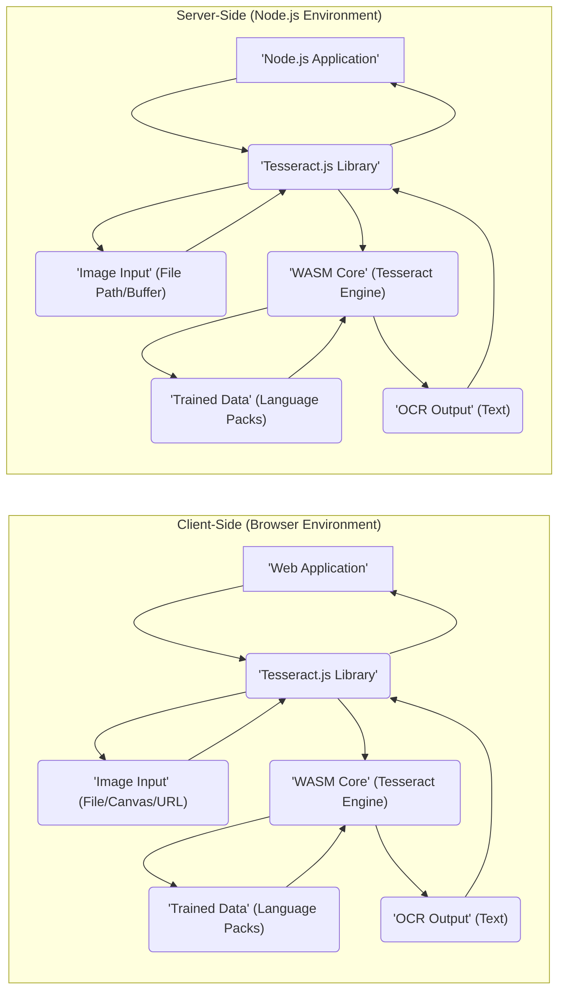
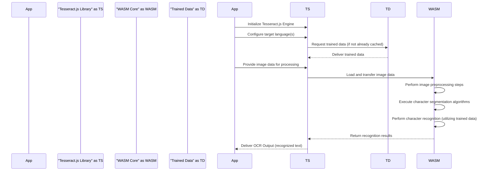

# Project Design Document: Tesseract.js

**Version:** 1.1
**Date:** October 26, 2023
**Author:** AI Software Architect

## 1. Introduction

This document provides an enhanced and detailed design overview of the Tesseract.js project. Tesseract.js is a pure Javascript port of the renowned Tesseract OCR engine, enabling Optical Character Recognition (OCR) capabilities directly within web browsers and Node.js environments. This document aims to provide a clear and comprehensive articulation of the system's architecture, core components, data flow mechanisms, and crucial design considerations, specifically tailored for subsequent threat modeling activities.

## 2. Goals and Objectives

The primary goals guiding the development and functionality of Tesseract.js are:

*   To seamlessly integrate Optical Character Recognition (OCR) capabilities within client-side web browsers and server-side Node.js environments.
*   To offer a user-friendly and intuitive Javascript API, facilitating straightforward integration into diverse web applications and server-side Javascript projects.
*   To achieve a high degree of accuracy and maintain performance levels that are comparable to the native, underlying Tesseract engine.
*   To provide broad support for a wide array of image formats commonly encountered in OCR tasks and a diverse set of languages.
*   To ensure platform independence, allowing Tesseract.js to operate effectively on any modern web browser or Node.js runtime environment without requiring specific platform adaptations.

## 3. High-Level Architecture

The following diagram illustrates the high-level architectural components and their interactions within Tesseract.js:

## 4. Detailed Architecture

Tesseract.js is composed of the following key components, each with specific responsibilities:

*   **Tesseract.js Library (JavaScript Facade):**
    *   Serves as the primary interface and entry point for developers interacting with the library.
    *   Exposes the public API for initializing the OCR engine, loading and managing image data, specifying the target language(s) for recognition, and retrieving the resulting recognized text.
    *   Manages the lifecycle of the underlying WebAssembly (WASM) core, including its instantiation and termination.
    *   Orchestrates the loading and management of trained data files required for language-specific OCR.
    *   Facilitates seamless communication and data exchange between the JavaScript environment and the WASM module.
    *   Provides mechanisms for reporting progress updates during the OCR process and handling potential errors.

*   **WASM Core (Compiled Tesseract Engine):**
    *   Represents a pre-compiled version of the core Tesseract OCR engine, originally implemented in C++.
    *   This component is responsible for performing the computationally intensive core OCR processing tasks.
    *   These tasks include detailed image analysis, precise character segmentation to isolate individual characters, and the actual character recognition process.
    *   It is loaded and executed within the JavaScript environment through the WebAssembly technology, enabling near-native performance.
    *   Relies heavily on the availability and proper loading of trained data files that are specific to the language(s) being processed.

*   **Trained Data (Language-Specific Packs):**
    *   Consists of data files that contain language-specific information crucial for accurate character recognition.
    *   This information encompasses details about character shapes (glyphs), common ligatures within the language, and statistical language models that aid in disambiguation.
    *   These files are typically loaded dynamically based on the language(s) specified by the user or application.
    *   In browser environments, these files are often hosted on Content Delivery Networks (CDNs) for efficient distribution and caching. In Node.js environments, they might be bundled directly with the application or loaded from local storage.

*   **Image Input Handling Subsystem:**
    *   **Browser Environment:** Manages the acquisition of image data from various sources available within a web browser:
        *   Direct file uploads initiated by the user through `<input type="file">` elements.
        *   Image data sourced from `<canvas>` elements, allowing for manipulation before OCR.
        *   Images referenced by URLs, fetched over the network.
        *   Image data from `` elements already present in the DOM.
        *   `Blob` objects representing raw image data.
    *   **Node.js Environment:** Handles image input from sources common in server-side applications:
        *   File paths pointing to image files on the local file system.
        *   `Buffer` objects containing raw image data in memory.

*   **OCR Output Handling Subsystem:**
    *   Responsible for delivering the recognized text as a standard string.
    *   May also provide richer output, including:
        *   Confidence levels associated with each recognized character or word.
        *   Bounding box coordinates for each recognized word or character, indicating their position within the original image.
        *   Other detailed information about the recognition process, such as text line information and paragraph structures.

## 5. Data Flow

The typical sequence of operations and data transformations during an OCR process using Tesseract.js is detailed below:

**Step-by-Step Breakdown:**

1. **Initialization Phase:** The host application initiates the Tesseract.js library, setting up the necessary internal structures.
2. **Language Configuration:** The application specifies the language(s) that the OCR engine should use for recognition.
3. **Trained Data Acquisition:** Tesseract.js checks its internal cache or storage for the required trained data files. If not found, it fetches them from a designated source (e.g., CDN or local storage).
4. **Image Input Provision:** The application provides the image data to be processed to the Tesseract.js library.
5. **Data Transfer to WASM:** Tesseract.js transfers the image data to the WebAssembly core for processing.
6. **Image Preprocessing within WASM:** The WASM core performs several preprocessing steps on the image to enhance recognition accuracy. These may include noise reduction, image deskewing to correct for tilted images, and binarization to convert the image to black and white.
7. **Character Segmentation within WASM:** The WASM core employs algorithms to identify and isolate individual characters within the preprocessed image.
8. **Character Recognition within WASM:** The core OCR engine within the WASM module uses the loaded trained data to identify the segmented characters. This involves comparing the shapes of the segmented characters against the patterns stored in the trained data.
9. **Recognition Results Output:** The WASM core returns the results of the character recognition process back to the Tesseract.js library.
10. **Output Delivery to Application:** Tesseract.js formats the recognition results and delivers the recognized text (and potentially other metadata) back to the host application.

## 6. Components Description

*   **JavaScript API Layer:** This layer provides the primary programmatic interface for interacting with Tesseract.js. It encapsulates the complexities of the underlying WASM core and offers a simplified set of functions for common OCR tasks.
*   **WASM Loader and Manager:** This component is responsible for loading the WebAssembly module into the JavaScript environment and managing its lifecycle. It handles the instantiation of the WASM module and facilitates communication between JavaScript and WASM functions.
*   **Image Preprocessing Module (WASM):** Integrated within the WASM core, this module performs essential image manipulation tasks to optimize the image for OCR. These tasks include resizing, converting the image to grayscale, applying noise reduction filters, and other enhancement techniques.
*   **Layout Analysis Engine (WASM):** This part of the WASM core analyzes the structure of the input image to identify regions containing text, lines of text, and individual words. This step is crucial for accurate character segmentation and recognition.
*   **Character Segmentation Engine (WASM):** This module focuses on accurately identifying the boundaries of individual characters within the identified text regions. This is a critical step as incorrect segmentation can lead to recognition errors.
*   **Character Recognition Engine (WASM):** This is the core of the Tesseract engine, responsible for the actual process of identifying the segmented characters by comparing them against the patterns and statistical models contained within the loaded trained data.
*   **Result Formatting Module (JavaScript):** This module takes the raw output from the WASM core and formats it into a more user-friendly and structured format. This may include organizing the recognized text, adding confidence scores, and providing bounding box information.
*   **Worker Thread Integration (Browser):** In browser environments, Tesseract.js often leverages Web Workers to offload the computationally intensive OCR processing to a separate background thread. This prevents the main browser thread from becoming unresponsive and ensures a smoother user experience.

## 7. Security Considerations (For Threat Modeling)

The following security considerations are crucial for subsequent threat modeling activities:

*   **Cross-Site Scripting (XSS) Vulnerabilities:** If the application displaying the OCR output does not properly sanitize the returned text, it could be susceptible to XSS attacks if malicious content is present in the recognized text (e.g., from a manipulated image).
*   **Content Security Policy (CSP) Bypasses:** The use of WebAssembly necessitates specific configurations within the Content Security Policy. Incorrect or overly permissive CSP settings could create vulnerabilities, potentially allowing the execution of unauthorized scripts.
*   **Supply Chain Security Risks:** Compromises in the dependencies of Tesseract.js, such as the WASM binary itself or the trained data files, could introduce malicious code into the application. Verifying the integrity and source of these dependencies is essential.
*   **Data Exfiltration Concerns:** Applications handling sensitive image data using Tesseract.js must implement appropriate security measures to prevent unauthorized access to or transmission of these images during the OCR process.
*   **Denial of Service (DoS) Potential:** Processing exceptionally large or complex images could consume significant computational resources, potentially leading to denial-of-service conditions if not properly handled with resource limits and timeouts.
*   **Code Injection Vulnerabilities (Node.js):** In Node.js environments, if image file paths or other input parameters are not rigorously validated, it could create opportunities for code injection attacks, allowing attackers to execute arbitrary code on the server.
*   **Trained Data Poisoning Attacks:** Maliciously crafted or tampered trained data files could potentially lead to incorrect OCR results, introduce biases, or even exploit vulnerabilities within the Tesseract engine itself.
*   **Side-Channel Attack Considerations:** While generally less of a concern in typical browser environments, the possibility of side-channel attacks targeting the WASM execution environment should be considered in highly sensitive applications.
*   **Memory Safety Issues within the WASM Core:** Although WebAssembly provides a degree of memory safety, underlying vulnerabilities in the original C++ code of the Tesseract engine (which is compiled to WASM) could still potentially be exploited.

## 8. Dependencies

Tesseract.js relies on the following key dependencies:

*   **WebAssembly (WASM):** The fundamental technology enabling the execution of the compiled Tesseract OCR engine within web browsers and Node.js.
*   **Emscripten Compiler Toolchain:** The toolchain used to compile the C++ source code of the Tesseract engine into the WebAssembly format.
*   **Trained Data Files (.traineddata):** Language-specific data files that are essential for the character recognition process. These files are typically distributed separately.
*   **Potentially other supporting JavaScript libraries:** Depending on the specific features and functionalities implemented, Tesseract.js might utilize other JavaScript libraries for tasks such as image manipulation or network requests.

## 9. Deployment

Tesseract.js can be deployed in the following environments:

*   **Web Browsers (Client-Side):** Integrated into web applications as a standard JavaScript library. Trained data files are commonly loaded from Content Delivery Networks (CDNs) to optimize loading times and reduce bandwidth consumption on the application's server.
*   **Node.js (Server-Side):** Installed as a package via npm (Node Package Manager). Trained data files can be bundled directly with the application for offline use or loaded from the local file system or remote sources as needed.

## 10. Future Considerations

Potential future enhancements and development directions for Tesseract.js include:

*   **Performance Optimizations:** Continued efforts to optimize the performance of the WASM core and the JavaScript bindings to achieve even faster OCR processing speeds.
*   **Expanded Language Support:** Adding support for a wider range of languages and writing systems to broaden the applicability of Tesseract.js.
*   **Integration of Specialized OCR Models:** Incorporating specialized OCR models that are fine-tuned for specific types of documents, such as receipts, invoices, or scanned forms, to improve accuracy in these domains.
*   **Exploration of GPU Acceleration:** Investigating the feasibility of leveraging GPU acceleration through technologies like WebGPU to further enhance the performance of computationally intensive OCR tasks.
*   **Enhanced Error Handling and Reporting:** Providing more detailed and informative error messages and debugging capabilities to assist developers in troubleshooting issues.

This improved design document provides a more comprehensive and detailed understanding of the Tesseract.js project, offering a solid foundation for conducting thorough and effective threat modeling activities. By clearly outlining the architecture, components, and data flow, this document facilitates the identification and mitigation of potential security vulnerabilities.