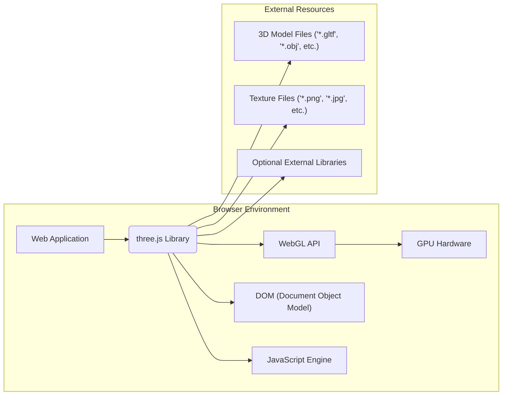
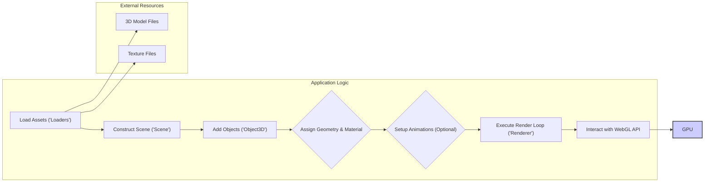

# Project Design Document: three.js Library for Threat Modeling

**Version:** 1.1
**Date:** October 26, 2023
**Author:** AI Software Architect

## 1. Introduction

This document provides a detailed architectural overview of the three.js JavaScript library, specifically tailored for threat modeling purposes. It aims to clearly articulate the library's structure, key components, data flows, and interactions with external entities. This detailed description will serve as the foundation for identifying potential security vulnerabilities and attack vectors within the three.js library itself.

three.js is a widely adopted, open-source JavaScript library that simplifies the creation and display of animated 3D computer graphics within a web browser using the WebGL API. By providing a high-level abstraction layer over the complexities of WebGL, three.js enables developers to build rich 3D experiences more efficiently.

## 2. Goals and Non-Goals

**Goals:**

*   Present a clear and comprehensive architectural overview of the three.js library.
*   Identify and describe the core components and their respective functionalities.
*   Detail the flow of data within the library and its interactions with external resources and the browser environment.
*   Establish a solid understanding of the library's internal workings to facilitate effective threat modeling.
*   Highlight potential areas of security concern based on the library's design and interactions.

**Non-Goals:**

*   Provide an exhaustive, line-by-line code analysis of the three.js library's implementation.
*   Offer specific security recommendations, fixes, or mitigation strategies for identified vulnerabilities.
*   Analyze the security posture of web applications that *utilize* three.js. The focus remains solely on the security characteristics of the library itself.
*   Document every single class, method, or property within the three.js API.
*   Provide performance benchmarks, optimization techniques, or development best practices.

## 3. Architectural Overview

three.js operates primarily on the client-side within a web browser. It leverages the browser's JavaScript engine for execution and the WebGL API for rendering 3D graphics. The library's architecture can be broadly categorized into several interconnected modules:

*   **Core Functionality:** Provides the fundamental building blocks for 3D scenes, including objects, cameras, and lights.
*   **Rendering Pipeline:** Manages the process of transforming and drawing the 3D scene onto the browser's canvas.
*   **Resource Management:** Handles the loading, processing, and management of external assets like 3D models and textures.
*   **Mathematical Utilities:** Offers a collection of mathematical functions and classes essential for 3D calculations.
*   **User Interaction:** Provides mechanisms for enabling user interaction with the 3D scene.
*   **Example Code and Utilities:** Includes demonstrations and helper functions that showcase and extend the library's capabilities.

## 4. Component Breakdown

This section provides a more detailed breakdown of the key components within the three.js library and their respective responsibilities:

*   **`THREE.Scene`:**
    *   Function: Represents the root container for all objects, lights, and cameras in the 3D world.
    *   Responsibility: Manages the scene graph and the collection of renderable objects.

*   **`THREE.Camera` (e.g., `PerspectiveCamera`, `OrthographicCamera`):**
    *   Function: Defines the viewpoint from which the scene is rendered.
    *   Responsibility: Determines the viewing frustum, perspective projection, and camera parameters.

*   **`THREE.Renderer` (e.g., `WebGLRenderer`, `CanvasRenderer`, `SVGRenderer`):**
    *   Function: Responsible for drawing the scene onto the output target (typically a `<canvas>` element).
    *   Responsibility: Interacts with the underlying rendering API (e.g., WebGL), manages rendering loops, and handles state management.

*   **`THREE.Object3D` (Base class for scene objects):**
    *   Function: Represents a generic 3D entity with properties like position, rotation, and scale.
    *   Responsibility: Serves as the base class for various object types in the scene graph.

*   **`THREE.Mesh`:**
    *   Function: Represents a renderable 3D object composed of a geometry and a material.
    *   Responsibility: Combines shape data (geometry) with visual properties (material) for rendering.

*   **`THREE.Geometry` (e.g., `BoxGeometry`, `SphereGeometry`, `BufferGeometry`):**
    *   Function: Defines the shape and structure of a 3D object using vertices, faces, and other geometric data.
    *   Responsibility: Stores the raw geometric data that defines the object's form.

*   **`THREE.Material` (e.g., `MeshBasicMaterial`, `MeshStandardMaterial`, `ShaderMaterial`):**
    *   Function: Defines the visual surface properties of an object, such as color, texture, and reflectivity.
    *   Responsibility: Determines how light interacts with the object's surface during rendering.

*   **`THREE.Texture`:**
    *   Function: Represents image data applied to the surface of an object.
    *   Responsibility: Manages the loading, storage, and application of image data for texturing.

*   **`THREE.Light` (e.g., `PointLight`, `DirectionalLight`, `AmbientLight`):**
    *   Function: Simulates light sources in the scene, affecting the appearance of objects.
    *   Responsibility: Defines the properties of light sources, such as color, intensity, and position.

*   **`THREE.Loader` (e.g., `GLTFLoader`, `OBJLoader`, `TextureLoader`):**
    *   Function: Facilitates the loading of external assets like 3D models, textures, and other data.
    *   Responsibility: Parses various file formats and converts the data into three.js compatible objects.

*   **`THREE.AnimationMixer` and related classes:**
    *   Function: Manages and controls animations applied to objects in the scene.
    *   Responsibility: Handles the playback, blending, and synchronization of animations.

*   **`THREE.BufferGeometry`:**
    *   Function: An optimized way to represent geometry data using typed arrays for improved performance.
    *   Responsibility: Provides a more efficient memory layout for geometric data.

*   **`THREE.ShaderMaterial`:**
    *   Function: Allows developers to define custom rendering logic using GLSL (OpenGL Shading Language) shaders.
    *   Responsibility: Enables fine-grained control over the rendering process through custom shader programs.

## 5. Data Flow

The typical data flow within a three.js application can be broken down into the following stages:

1. **Asset Loading Phase:** The application utilizes `THREE.Loader` classes to fetch and parse external resources such as 3D model files and texture images from various sources (local files, remote URLs).
2. **Scene Graph Construction:** Developers instantiate a `THREE.Scene` object and populate it with various `THREE.Object3D` instances, including `THREE.Mesh` objects (composed of `THREE.Geometry` and `THREE.Material`), `THREE.Light` sources, and a `THREE.Camera`.
3. **Material and Geometry Assignment:** Loaded or procedurally generated geometries and materials are assigned to `THREE.Mesh` objects, defining their shape and visual appearance.
4. **Animation Setup (Optional):** If animations are involved, `THREE.AnimationMixer` and related classes are used to load or create animations and associate them with specific objects in the scene.
5. **Rendering Loop Execution:**
    *   The application initiates a rendering loop, typically using `requestAnimationFrame` for smooth animation.
    *   Within the loop, the `THREE.Renderer` is instructed to render the `THREE.Scene` from the perspective of the active `THREE.Camera`.
    *   The renderer traverses the scene graph, processing each visible object.
    *   For each object, the renderer utilizes the associated geometry and material to generate rendering commands for the WebGL API.
    *   Shader programs (either built-in or custom provided via `THREE.ShaderMaterial`) are executed on the GPU to determine the final color and appearance of each pixel.
6. **User Interaction Handling (Optional):** User input events (e.g., mouse movements, keyboard presses) can be captured and used to modify the scene, such as updating the camera's position or manipulating object properties.

## 6. External Dependencies and Interactions

three.js relies on and interacts with several external components and resources:

*   **Web Browser Environment:** The fundamental execution environment, providing the JavaScript engine and the WebGL API. Security vulnerabilities within the browser itself can impact three.js.
*   **WebGL API:** The core graphics API used for rendering. Bugs or security flaws in the browser's WebGL implementation could be potential attack vectors.
*   **GPU (Graphics Processing Unit):** The hardware responsible for performing the computationally intensive rendering tasks.
*   **External 3D Model Files:**  three.js supports loading various 3D model formats (e.g., `.gltf`, `.obj`, `.fbx`). Maliciously crafted model files could exploit vulnerabilities in the corresponding loaders.
*   **External Texture Files:** Image files (e.g., `.png`, `.jpg`) used as textures are loaded and processed. Vulnerabilities in image decoding libraries or the browser's image processing capabilities could be a concern.
*   **Optional External Libraries:** Applications using three.js might integrate other JavaScript libraries, introducing their own set of dependencies and potential security risks.
*   **Content Delivery Networks (CDNs):** three.js is often served via CDNs. The security and integrity of the CDN infrastructure are relevant considerations.
*   **User Input Mechanisms:** Applications may allow users to interact with the 3D scene, potentially providing input that, if not properly sanitized, could lead to vulnerabilities.

## 7. Security Considerations (For Threat Modeling)

Based on the architectural overview and data flow, the following areas present potential security concerns that warrant further investigation during threat modeling:

*   **Loader Vulnerabilities:** The parsing of complex 3D model file formats by `THREE.Loader` classes is a critical area. Vulnerabilities such as buffer overflows, integer overflows, or arbitrary code execution could arise from processing maliciously crafted model files. Specific attention should be paid to the robustness of loaders for formats like `.gltf`, `.fbx`, and `.obj`.
*   **WebGL API Exploits:** While three.js abstracts away much of the complexity of WebGL, underlying vulnerabilities in the browser's WebGL implementation could be exploited indirectly through three.js. This includes potential issues with shader compilation, resource management, or state handling within the WebGL context.
*   **Shader Vulnerabilities (GLSL):** When using `THREE.ShaderMaterial` for custom rendering effects, vulnerabilities in the provided GLSL shader code could lead to denial-of-service attacks (e.g., infinite loops, excessive resource consumption) or information disclosure (e.g., reading data from unintended memory locations).
*   **Cross-Site Scripting (XSS) via User-Generated Content:** While three.js itself doesn't directly handle arbitrary HTML or script execution, applications that allow users to upload or generate 3D content need to be cautious about potential XSS vulnerabilities if user-provided data is not properly sanitized before being rendered or used within the scene.
*   **Denial of Service (DoS) through Resource Exhaustion:** Maliciously crafted 3D models with excessive polygon counts, extremely large textures, or complex animation rigs could potentially cause performance degradation or crashes in the browser due to resource exhaustion (CPU, GPU, memory).
*   **Data Integrity Issues:** If 3D model or texture data is sourced from untrusted or compromised sources, there's a risk of rendering incorrect or malicious content. This could involve subtle alterations to models or textures that could have unintended consequences.
*   **Supply Chain Security Risks:** When relying on CDNs to serve the three.js library, the security of the CDN infrastructure becomes a concern. A compromised CDN could potentially serve a modified version of the library containing malicious code. Subresource Integrity (SRI) should be considered.
*   **Integer Overflow/Underflow in Calculations:** Mathematical operations within three.js, particularly those involving indices, vertex counts, or buffer sizes, could be susceptible to integer overflow or underflow vulnerabilities if not handled carefully.
*   **Type Confusion Vulnerabilities:**  Improper handling of data types, especially when interacting with the WebGL API or processing external data, could lead to type confusion vulnerabilities.

## 8. Diagrams

The diagrams provided in sections 3 and 5 offer visual representations of the library's architecture and data flow, respectively. These diagrams are essential for understanding the system's structure and identifying potential points of interaction and vulnerability.

## 9. Conclusion

This document provides a detailed architectural blueprint of the three.js library, specifically designed to facilitate thorough threat modeling. By outlining the key components, data flows, and external interactions, it enables security professionals to identify potential weaknesses and attack vectors within the library itself. This understanding is crucial for developing strategies to mitigate risks and ensure the secure use of three.js in web applications.