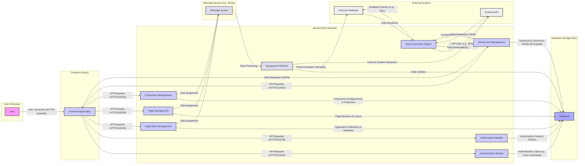

# Project Design Document: ToolJet - Low-Code Platform

**Version:** 1.1
**Date:** October 26, 2023
**Author:** Gemini (AI Language Model)

## 1. Introduction

This document provides an enhanced architectural design for ToolJet, an open-source low-code platform. It aims to offer a comprehensive understanding of the system's structure, individual components, and the interactions between them. This detailed design will serve as a robust foundation for subsequent threat modeling exercises.

## 2. Goals and Objectives

The primary objectives of this design document are to:

*   Clearly and concisely define the core components that constitute the ToolJet platform.
*   Elaborate on the interactions and data flow pathways connecting these components.
*   Identify the key technologies, frameworks, and architectural patterns employed within the platform.
*   Establish a solid basis for proactively identifying potential security vulnerabilities and associated threats.

## 3. High-Level Architecture

ToolJet employs a standard multi-tier architecture, logically separated into a user-facing frontend, a business logic handling backend, and a persistent data storage layer. Crucially, it also incorporates a mechanism for integrating with external data sources and services, extending its functionality.

*   **User Interface (Frontend):**  The interactive layer enabling users to design and operate applications.
*   **Backend API:** The central processing unit responsible for business rules, security, and data orchestration.
*   **Database:** The repository for storing application definitions, user details, and platform configurations.
*   **External Integrations:** The conduits for connecting to and interacting with external systems and data.

## 4. Detailed Component Description

### 4.1. User Interface (Frontend)

*   **Technology:** React.js, leveraging component-based architecture and state management libraries (e.g., Redux or Zustand).
*   **Description:** The frontend is implemented as a Single Page Application (SPA) using React. Its responsibilities include:
    *   Rendering the visual application builder, providing a WYSIWYG experience.
    *   Managing user input and interactions through event handlers and form management.
    *   Asynchronously communicating with the backend API using HTTP requests (typically RESTful).
    *   Dynamically displaying application dashboards and individual UI components based on backend data.
    *   Maintaining user session state and managing authentication tokens.
*   **Key Features:**
    *   Intuitive drag-and-drop interface for application assembly and layout design.
    *   A rich library of pre-built, reusable UI components (e.g., buttons, tables, charts, forms).
    *   A visual query builder interface simplifying data integration configuration.
    *   A real-time application preview mode for immediate feedback during development.

### 4.2. Backend API

*   **Technology:** Node.js runtime environment, built upon the NestJS framework (utilizing TypeScript), employing an MVC (Model-View-Controller) or similar architectural pattern.
*   **Description:** The backend API serves as the core engine of the platform, responsible for:
    *   Securely authenticating users and managing their sessions using strategies like JWT (JSON Web Tokens).
    *   Enforcing authorization policies to control access to specific resources and functionalities.
    *   Managing the lifecycle of applications, pages within applications, and individual UI components.
    *   Receiving and processing requests originating from the frontend application.
    *   Interacting with the database layer to persist and retrieve application and user data.
    *   Orchestrating communication with configured external integrations to fetch or manipulate external data.
    *   Executing server-side logic associated with application components, potentially involving data transformation or business rule enforcement.
*   **Key Modules:**
    *   **Authentication Module:**  Handles user credential verification, login procedures, registration, and session lifecycle management.
    *   **Authorization Module:**  Manages user roles, permissions, and access control policies, often implemented using an RBAC model.
    *   **Application Management Module:**  Provides functionalities for creating, updating, deleting, and managing application metadata and configurations.
    *   **Page Management Module:**  Handles the organization and structure of pages within an application, including layout and component arrangement.
    *   **Component Management Module:**  Manages the configuration, properties, and data bindings of individual UI components within an application.
    *   **Datasource Management Module:**  Facilitates the configuration and management of connections to various external data sources, securely storing connection details.
    *   **Query Execution Engine:**  Responsible for translating user-defined queries or API calls into the specific language or protocol required by the connected data source.

### 4.3. Database

*   **Technology:** PostgreSQL (primary supported database), with potential support for other relational and NoSQL databases through abstraction layers (e.g., using an ORM like TypeORM).
*   **Description:** The database serves as the persistent storage layer for the ToolJet platform, housing critical information such as:
    *   User account details, profiles, and associated credentials (hashed and salted).
    *   Complete application configurations, including page layouts, component properties, and data binding definitions.
    *   Connection details for external data sources, stored securely (potentially encrypted).
    *   Audit logs tracking user actions and system events for security and debugging purposes.
    *   Internal platform settings and configuration parameters.

### 4.4. External Integrations

*   **Technology:**  Implementation varies depending on the target system, often involving REST API calls using libraries like `axios` or `node-fetch`, or utilizing specific SDKs provided by the external service.
*   **Description:** ToolJet's ability to connect to external systems is a core feature, enabling data retrieval and manipulation across various sources. These integrations encompass:
    *   **Relational Databases:** PostgreSQL, MySQL, SQL Server, and others, accessed via database drivers.
    *   **NoSQL Databases:** MongoDB, Couchbase, etc., accessed via their respective client libraries.
    *   **RESTful APIs:**  Interaction with third-party services like payment gateways (Stripe), communication platforms (Twilio), or CRM systems.
    *   **GraphQL APIs:**  Fetching data from GraphQL endpoints using GraphQL client libraries.
    *   **Internal APIs:**  Connectivity to other microservices or internal systems within an organization.
*   **Key Aspects:**
    *   Secure storage of sensitive connection credentials, employing encryption at rest.
    *   An abstraction layer to provide a consistent interface for interacting with diverse integration types, simplifying development.
    *   Mechanisms for handling authentication and authorization requirements of external systems (e.g., API keys, OAuth tokens).
    *   Data transformation and mapping capabilities to adapt data structures between ToolJet and external systems.

### 4.5. Background Workers

*   **Technology:**  Likely leveraging a message queue system like Redis or RabbitMQ, coupled with worker processes (potentially using libraries like `bull` or `bee-queue` in Node.js).
*   **Description:**  Background workers are employed to handle asynchronous and non-interactive tasks, improving the responsiveness and scalability of the platform. Examples include:
    *   Scheduled data synchronization tasks between ToolJet and external data sources.
    *   Execution of long-running data processing jobs that would otherwise block user interactions.
    *   Sending out email notifications or other forms of asynchronous communication.
    *   Performing periodic maintenance tasks or data cleanup operations.

## 5. Data Flow Diagram

## 6. Key Security Considerations

*   **Authentication and Authorization:** Ensuring only legitimate users can access the platform and have appropriate permissions.
    *   Employing strong password hashing algorithms (e.g., bcrypt) with salting.
    *   Implementing robust session management with secure cookies (HttpOnly, Secure flags).
    *   Utilizing JWT for stateless authentication and authorization, ensuring proper signature verification.
    *   Enforcing role-based access control (RBAC) to restrict access to sensitive functionalities and data based on user roles.
*   **Input Validation and Sanitization:** Preventing injection attacks and data corruption by rigorously validating all user-provided input.
    *   Server-side validation is crucial, even if client-side validation is in place.
    *   Sanitizing input to remove potentially harmful characters or code before processing or storing it.
    *   Specifically protecting against SQL injection, cross-site scripting (XSS), and cross-site request forgery (CSRF) attacks.
*   **Data Protection (at rest and in transit):** Safeguarding the confidentiality and integrity of sensitive data.
    *   Encrypting sensitive data at rest in the database using appropriate encryption algorithms.
    *   Enforcing HTTPS for all communication between the client and server to protect data in transit.
    *   Securely managing and storing API keys, secrets, and database credentials, potentially using a secrets management service.
*   **Dependency Management and Vulnerability Scanning:**  Maintaining a secure software supply chain by regularly updating dependencies and scanning for vulnerabilities.
    *   Utilizing tools like `npm audit` or `yarn audit` to identify and address known vulnerabilities in dependencies.
    *   Implementing a process for promptly patching or updating vulnerable dependencies.
*   **External Integration Security:**  Securing interactions with external systems to prevent unauthorized access or data breaches.
    *   Storing external system credentials securely, ideally using encryption or a secrets management solution.
    *   Implementing secure authentication and authorization mechanisms when connecting to external APIs.
    *   Carefully validating data received from external systems to prevent injection attacks.
    *   Implementing rate limiting and throttling to prevent abuse of external APIs and protect against denial-of-service attacks.
*   **Rate Limiting and Throttling:** Protecting the platform from abuse and denial-of-service attacks.
    *   Implementing rate limits on API endpoints to restrict the number of requests from a single user or IP address within a given timeframe.
    *   Using throttling mechanisms to gradually slow down or reject excessive requests.
*   **Logging and Monitoring:**  Enabling detection and response to security incidents through comprehensive logging and monitoring.
    *   Logging significant events, including authentication attempts, authorization failures, and data access.
    *   Implementing monitoring systems to detect unusual activity or potential security breaches.
    *   Establishing alerting mechanisms to notify administrators of suspicious events.

## 7. Assumptions and Constraints

*   The underlying infrastructure (servers, network) is assumed to have basic security measures in place.
*   This design focuses on the logical architecture and does not detail specific deployment configurations or infrastructure security.
*   Security of external integrations is partially dependent on the security mechanisms implemented by those external systems.
*   The frontend application is served over HTTPS, ensuring secure communication with the backend.

## 8. Future Considerations

*   Implementation of more granular permission management and attribute-based access control (ABAC) for enhanced security.
*   Integration with security information and event management (SIEM) systems for centralized security monitoring.
*   Support for multi-factor authentication (MFA) to enhance user account security.
*   Regular penetration testing and security audits to identify and address potential vulnerabilities proactively.
*   Implementation of input validation schemas (e.g., using libraries like Joi or Yup) for more structured and robust input validation.
*   Consideration of Content Security Policy (CSP) to mitigate XSS attacks.

This improved design document provides a more detailed and nuanced understanding of the ToolJet platform's architecture. It serves as a more robust foundation for identifying and mitigating potential security threats during the threat modeling process.