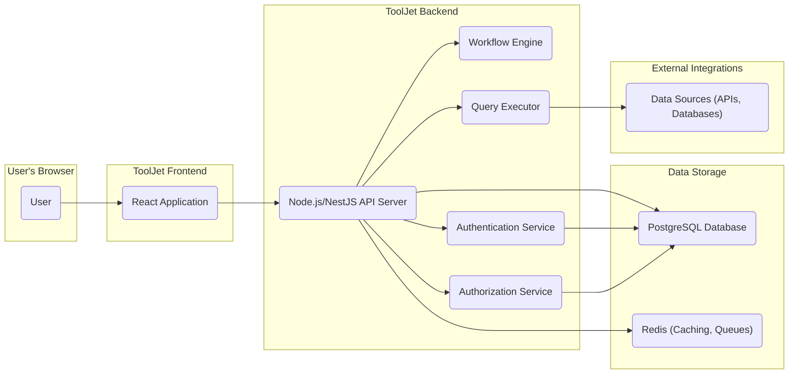
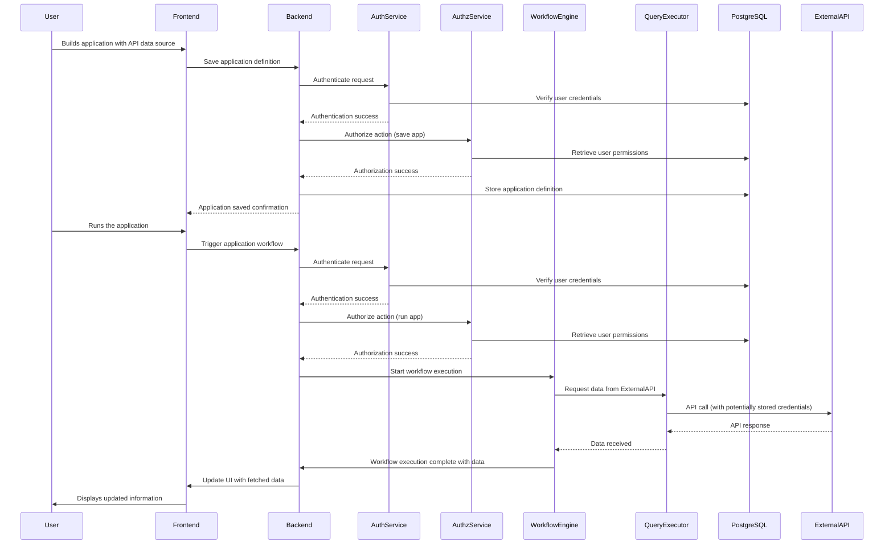

# Project Design Document: ToolJet - Low-Code Platform

**Version:** 1.1
**Date:** October 26, 2023
**Author:** AI Software Architect

## 1. Introduction

This document provides an enhanced and detailed design overview of the ToolJet project, an open-source low-code platform for building and deploying internal tools. This revised document aims to provide even greater clarity and depth, specifically catering to the needs of threat modeling and security analysis. It serves as a comprehensive foundation for understanding the system's architecture, components, and interactions.

## 2. Goals and Objectives

The primary goal of ToolJet remains to empower users, including those with limited coding experience, to rapidly build and deploy custom internal applications. Key objectives include:

*   Providing an intuitive visual drag-and-drop interface for application development.
*   Enabling secure and seamless integration with a wide range of data sources and APIs.
*   Offering granular user management and robust access control features.
*   Ensuring scalability, reliability, and security for production deployments.
*   Maintaining an open-source and extensible architecture to foster community contributions.

## 3. Target Audience

This document is primarily intended for:

*   Security engineers and architects responsible for threat modeling, security assessments, and penetration testing.
*   Development team members requiring a deep understanding of the system architecture for development and debugging.
*   Operations and infrastructure teams responsible for the secure deployment, maintenance, and monitoring of ToolJet.

## 4. High-Level Architecture

ToolJet employs a modular architecture, primarily composed of a frontend, backend, and database, along with supporting services for specialized functionalities.

**Components:**

*   **User:** Interacts with the ToolJet platform through a standard web browser.
*   **ToolJet Frontend (React Application):**  Delivers the user interface for building, configuring, and utilizing applications. It manages user interactions, renders UI components, and communicates with the backend API.
*   **ToolJet Backend (Node.js/NestJS API Server):**  The central component responsible for:
    *   Handling API requests from the frontend.
    *   Managing application definitions and configurations.
    *   Orchestrating workflows and data queries.
    *   Providing core services like authentication and authorization.
*   **Workflow Engine:**  Manages the execution of application workflows, encompassing business logic and integrations with other services.
*   **Query Executor:**  Responsible for securely connecting to and executing queries against external data sources.
*   **Authentication Service:**  Handles user authentication, verifying user credentials and establishing sessions.
*   **Authorization Service:**  Manages user roles, permissions, and access control policies, determining what actions users are allowed to perform.
*   **PostgreSQL Database:**  Stores persistent data, including application metadata, user information, configurations, audit logs, and more.
*   **Redis (Caching, Queues):**  Utilized for caching frequently accessed data to improve performance and managing background tasks and asynchronous operations through message queues.
*   **Data Sources (APIs, Databases):**  External systems that ToolJet integrates with to retrieve or manipulate data (e.g., REST APIs, databases like MySQL, MongoDB, SaaS platforms).

## 5. Detailed Component Design

### 5.1. ToolJet Frontend (React Application)

*   **Purpose:**  To provide the interactive user interface for the ToolJet platform.
*   **Technology:** React, JavaScript/TypeScript, leveraging various UI component libraries and state management solutions.
*   **Key Features:**
    *   Intuitive drag-and-drop interface builder for visually constructing application UIs.
    *   A rich library of pre-built UI components (buttons, tables, forms, charts, etc.).
    *   A visual workflow editor for defining application logic and data transformations.
    *   Management interface for configuring connections to external data sources.
    *   User authentication and authorization UI elements and flows.
*   **Interactions:**
    *   Communicates with the backend API server via secure HTTP/HTTPS requests, typically using RESTful principles.
    *   Receives application data, configurations, and user interface definitions from the backend.
    *   Sends user actions, application definitions, and configuration updates to the backend.
    *   Implements client-side input validation to improve user experience and prevent basic errors.

### 5.2. ToolJet Backend (Node.js/NestJS API Server)

*   **Purpose:**  To handle core application logic, manage data, and provide API endpoints for the frontend.
*   **Technology:** Node.js, NestJS (a TypeScript framework for building efficient and scalable Node.js server-side applications), potentially utilizing Express.js under the hood.
*   **Key Modules:**
    *   **Authentication Module:**  Handles user login, logout, session management, and potentially integration with identity providers (e.g., OAuth 2.0).
    *   **Authorization Module:**  Enforces access control policies based on user roles and permissions, protecting API endpoints and resources.
    *   **Application Management Module:**  Manages the creation, retrieval, updating, and deletion of applications and their associated configurations.
    *   **Data Source Management Module:**  Handles the storage and retrieval of data source connection details, ensuring secure storage of credentials (potentially using encryption).
    *   **API Endpoint Controllers:**  Handle specific API requests from the frontend, orchestrating interactions with other backend modules.
    *   **Workflow Orchestration Module:**  Manages the execution of application workflows, interacting with the Workflow Engine.
    *   **Query Execution Service Module:**  Handles requests to query external data sources, interacting with the Query Executor.
    *   **Audit Logging Module:**  Records significant events and actions within the system for security and compliance purposes.
*   **Interactions:**
    *   Receives and processes requests from the frontend application.
    *   Interacts with the PostgreSQL database for persistent data storage and retrieval.
    *   Interacts with Redis for caching frequently accessed data and managing background tasks.
    *   Communicates with the Workflow Engine to execute application logic.
    *   Communicates with the Query Executor to fetch or manipulate data from external sources.
    *   Interacts with the Authentication and Authorization services to verify user identity and permissions.

### 5.3. Workflow Engine

*   **Purpose:**  To execute the business logic and data transformations defined within ToolJet applications.
*   **Technology:**  Likely implemented within the backend using libraries specifically designed for workflow management or as a separate microservice.
*   **Key Features:**
    *   Execution of visually defined workflows, including conditional logic and loops.
    *   Integration with various actions, such as data transformations, API calls, and database operations.
    *   State management for tracking the progress of workflow executions.
    *   Error handling and logging mechanisms for debugging and monitoring.
*   **Interactions:**
    *   Receives workflow definitions and execution requests from the backend API server.
    *   Triggers data queries and actions through the Query Executor.
    *   Updates the backend API server with the status and results of workflow executions.

### 5.4. Query Executor

*   **Purpose:**  To securely connect to and execute queries against a variety of external data sources.
*   **Technology:**  Likely a module within the backend, potentially utilizing specific libraries or drivers for different database types and API protocols.
*   **Key Features:**
    *   Manages connections to various data sources using securely stored credentials.
    *   Executes queries based on user-defined actions within applications, ensuring proper sanitization to prevent injection attacks.
    *   Provides an abstraction layer to interact with different data source types in a consistent manner.
    *   May include features for data transformation and mapping.
*   **Interactions:**
    *   Receives query requests from the Workflow Engine or directly from the backend API server.
    *   Connects to external data sources using configured and securely stored credentials.
    *   Executes queries and returns the results to the requesting component.

### 5.5. Authentication Service

*   **Purpose:**  To verify the identity of users attempting to access the ToolJet platform.
*   **Technology:**  Likely integrated within the backend, potentially using libraries like Passport.js for Node.js.
*   **Key Features:**
    *   Handles user registration, login, and logout functionalities.
    *   Manages user credentials (passwords, potentially API keys).
    *   May support various authentication methods (e.g., username/password, social logins, SSO).
    *   Generates and manages authentication tokens (e.g., JWT).
*   **Interactions:**
    *   Receives authentication requests from the frontend.
    *   Verifies user credentials against the data stored in the PostgreSQL database.
    *   Issues authentication tokens upon successful verification.
    *   Provides mechanisms for token refresh and invalidation.

### 5.6. Authorization Service

*   **Purpose:**  To determine what actions authenticated users are permitted to perform within the ToolJet platform.
*   **Technology:**  Likely integrated within the backend, potentially using role-based access control (RBAC) or attribute-based access control (ABAC) models.
*   **Key Features:**
    *   Manages user roles and permissions.
    *   Enforces access control policies for API endpoints and resources.
    *   Provides mechanisms for checking user permissions before allowing access to specific functionalities.
*   **Interactions:**
    *   Receives requests from the backend API server to authorize user actions.
    *   Retrieves user roles and permissions from the PostgreSQL database.
    *   Evaluates access control policies and returns authorization decisions.

### 5.7. PostgreSQL Database

*   **Purpose:**  To provide persistent storage for the ToolJet platform's data.
*   **Technology:** PostgreSQL, a robust open-source relational database.
*   **Key Data:**
    *   User accounts, roles, and permissions.
    *   Application definitions (UI components, workflows, data source connections, configurations).
    *   Audit logs tracking user actions and system events.
    *   Data source connection details (stored securely, potentially encrypted).
*   **Interactions:**
    *   The backend API server performs read and write operations on the database.
    *   The Authentication and Authorization services access user credentials and permissions.

### 5.8. Redis (Caching, Queues)

*   **Purpose:**  To enhance performance and manage asynchronous tasks.
*   **Technology:** Redis, an in-memory data store often used as a cache and message broker.
*   **Key Uses:**
    *   Caching frequently accessed data (e.g., application configurations, user session data) to reduce database load.
    *   Managing background tasks and asynchronous operations through message queues (e.g., sending emails, processing large datasets).
    *   Potentially used for session storage.
*   **Interactions:**
    *   The backend API server interacts with Redis for caching and queue operations.

## 6. Data Flow

Let's examine a more detailed data flow scenario: a user creating and running an application that fetches data from an external REST API.

**Description:**

1. The user builds an application in the frontend, configuring a connection to an external API.
2. The frontend sends a request to the backend to save the application definition.
3. The backend authenticates and authorizes the request using the Authentication and Authorization services.
4. The backend stores the application definition in the PostgreSQL database.
5. The frontend receives confirmation that the application has been saved.
6. The user runs the newly created application.
7. The frontend sends a request to the backend to trigger the application's workflow.
8. The backend authenticates and authorizes the request.
9. The backend instructs the Workflow Engine to start executing the workflow.
10. The Workflow Engine instructs the Query Executor to fetch data from the configured external API.
11. The Query Executor makes an API call to the external service, potentially using stored credentials.
12. The external API responds with the requested data.
13. The Query Executor returns the data to the Workflow Engine.
14. The Workflow Engine completes execution and sends the results back to the backend.
15. The backend sends the fetched data to the frontend.
16. The frontend updates the user interface to display the data.

## 7. Security Considerations (Detailed)

This section expands on the initial security overview, providing more specific considerations relevant for threat modeling.

*   **Authentication and Authorization Vulnerabilities:**
    *   **Broken Authentication:** Weak password policies, lack of multi-factor authentication, session fixation, insecure session management.
    *   **Broken Authorization:** Privilege escalation, insecure direct object references, lack of proper access controls on API endpoints and data.
*   **Injection Attacks:**
    *   **SQL Injection:** Vulnerabilities in database queries allowing attackers to execute arbitrary SQL commands.
    *   **Cross-Site Scripting (XSS):**  Flaws allowing attackers to inject malicious scripts into web pages viewed by other users.
    *   **Command Injection:**  Vulnerabilities allowing attackers to execute arbitrary commands on the server.
    *   **API Injection:** Exploiting vulnerabilities in how ToolJet interacts with external APIs.
*   **Data Security:**
    *   **Data at Rest:**  Lack of encryption for sensitive data stored in the database (user credentials, API keys, application configurations).
    *   **Data in Transit:**  Use of unencrypted communication channels (HTTP instead of HTTPS).
    *   **Insufficient Data Sanitization:** Failure to properly sanitize data before storing or displaying it.
*   **API Security Weaknesses:**
    *   **Lack of Rate Limiting:**  Susceptibility to denial-of-service attacks.
    *   **Missing Authentication/Authorization:**  Unprotected API endpoints.
    *   **Exposure of Sensitive Data:**  Returning excessive information in API responses.
    *   **Mass Assignment:**  Allowing users to modify unintended object properties through API requests.
*   **Dependency Vulnerabilities:**  Using outdated libraries or frameworks with known security flaws.
*   **Insecure Configuration:**  Default passwords, exposed configuration files, permissive firewall rules.
*   **Insufficient Logging and Monitoring:**  Lack of adequate logging to detect and respond to security incidents.
*   **Cross-Site Request Forgery (CSRF):**  Allowing attackers to trick users into performing unintended actions on the application.
*   **Server-Side Request Forgery (SSRF):**  Vulnerabilities allowing attackers to make requests to internal or external resources from the server.
*   **Secrets Management:**  Storing API keys and other sensitive credentials insecurely (e.g., in code or configuration files).
*   **Frontend Security:**
    *   **DOM-based XSS:**  Exploiting vulnerabilities in client-side JavaScript code.
    *   **Insecure Third-Party Libraries:**  Using vulnerable JavaScript libraries.
    *   **Lack of Content Security Policy (CSP):**  Failure to restrict the sources from which the browser is allowed to load resources.

## 8. Deployment

ToolJet can be deployed using various methods, each with its own security implications:

*   **Docker/Docker Compose:**  Requires careful management of Docker images and container configurations to prevent vulnerabilities.
*   **Kubernetes:**  Demands secure configuration of Kubernetes clusters, including network policies, RBAC, and secret management.
*   **Cloud Platforms (AWS, Azure, GCP):**  Leveraging cloud-specific security features and best practices is crucial. Proper IAM configuration and network security are essential.

Deployment typically involves deploying the frontend as a static website (potentially behind a CDN), and the backend, database, and Redis as separate services, often within a private network. Secure communication between these services is vital.

## 9. Future Considerations

*   **Enhanced Security Features:** Implementing multi-factor authentication (MFA), robust audit logging with intrusion detection capabilities, and regular security scanning (SAST/DAST).
*   **Improved Scalability and Performance:** Optimizing database queries, implementing more aggressive caching strategies, and potentially distributing the backend across multiple instances.
*   **Expanded Data Source Integrations:**  Adding support for more data sources while ensuring secure connection and query execution.
*   **Plugin Architecture:**  Developing a secure plugin architecture with proper sandboxing and permission management to prevent malicious extensions.
*   **Enhanced Role-Based Access Control (RBAC):**  Providing more granular control over user permissions and access to specific application features and data.

## 10. Conclusion

This enhanced design document provides a more detailed and security-focused overview of the ToolJet low-code platform. It highlights key components, data flows, and potential security considerations, serving as a valuable resource for threat modeling and security assessments. A thorough understanding of this architecture is crucial for building and maintaining a secure and reliable low-code development environment.