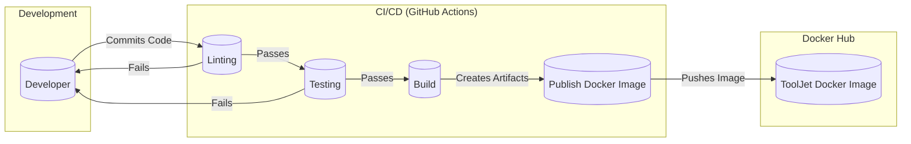

Okay, let's create a design document for the ToolJet project based on the provided GitHub repository.

# BUSINESS POSTURE

ToolJet is an open-source, low-code platform for building and deploying internal tools.  The business priorities appear to be:

*   Rapid Application Development: Enable users (developers and potentially non-developers) to quickly build and deploy internal tools.
*   Extensibility: Allow integration with a wide variety of data sources (databases, APIs, cloud services).
*   Customization: Provide options for customizing the UI and functionality of built applications.
*   Self-Hosting and Cloud Offering: Offer both self-hosted (open-source) and cloud-hosted deployment options, catering to different customer needs and security requirements.
*   Community Growth: Foster a strong open-source community for contributions, support, and feature development.
*   Monetization: Likely through a combination of a cloud-hosted offering, enterprise features, and support contracts.

Business Goals:

*   Become a leading low-code platform for internal tools.
*   Attract a large user base (both open-source and paying customers).
*   Establish a sustainable business model.

Most Important Business Risks:

*   Data Breaches: Unauthorized access to sensitive data stored or accessed by ToolJet applications. This is critical because ToolJet connects to various data sources.
*   Application Vulnerabilities: Security flaws in the ToolJet platform itself or in the applications built with it, leading to exploits.
*   Supply Chain Attacks: Compromise of third-party dependencies or the ToolJet build process.
*   Denial of Service: Attacks that make ToolJet or the applications built with it unavailable.
*   Compliance Violations: Failure to meet relevant data privacy and security regulations (e.g., GDPR, HIPAA, SOC 2).
*   Reputation Damage: Security incidents or data breaches could severely damage ToolJet's reputation and user trust.
*   Intellectual Property Theft: Unauthorized access to ToolJet's source code or proprietary algorithms.

# SECURITY POSTURE

Existing Security Controls (based on the GitHub repository and common practices):

*   security control: Authentication: User authentication is implemented, likely using a combination of email/password, social logins (Google, GitHub, etc.), and potentially SSO integration. (Evidence: `server/app/auth` directory, documentation).
*   security control: Authorization: Role-Based Access Control (RBAC) or similar mechanisms to control user permissions within the platform and built applications. (Evidence: Documentation, likely implemented in the server-side code).
*   security control: Input Validation: Server-side validation of user inputs to prevent common web vulnerabilities like XSS and SQL injection. (Evidence: Best practices, likely implemented in API endpoints and data processing logic).
*   security control: Dependency Management: Use of package managers (npm, yarn) to manage dependencies and potentially tools for vulnerability scanning. (Evidence: `package.json`, `yarn.lock` files).
*   security control: Secure Development Practices: Code reviews, linting, and potentially static analysis tools are used to identify and fix security issues. (Evidence: `.eslintrc.js`, presence of CI/CD pipelines).
*   security control: HTTPS: Encryption in transit using HTTPS for both the ToolJet platform and the applications built with it. (Evidence: Standard practice, deployment configurations).
*   security control: Database Security: Secure configuration of databases, including access controls, encryption at rest (likely), and regular backups. (Evidence: Deployment documentation, best practices).
*   security control: API Security: Secure handling of API keys and secrets, potentially using environment variables or a secrets management solution. (Evidence: Documentation, `.env.example` file).
*   security control: Rate Limiting: Protection against brute-force attacks and denial-of-service by limiting API requests. (Evidence: Potentially implemented in the server-side code or using a reverse proxy/API gateway).
*   security control: Audit Logging: Logging of user actions and system events for security monitoring and auditing. (Evidence: Likely implemented in the server-side code).
*   security control: Containerization: Use of Docker for packaging and deploying ToolJet, improving consistency and potentially security. (Evidence: `Dockerfile`, `docker-compose.yml`).

Accepted Risks:

*   accepted risk: The open-source nature of the project means that vulnerabilities may be discovered and exploited before they are patched.
*   accepted risk: Reliance on third-party dependencies introduces the risk of supply chain attacks.
*   accepted risk: Self-hosted deployments may not be configured securely by users, leading to vulnerabilities.
*   accepted risk: The low-code nature of the platform may lead to users building applications with security flaws if they are not careful.

Recommended Security Controls (High Priority):

*   Implement a comprehensive Web Application Firewall (WAF) to protect against common web attacks.
*   Integrate Static Application Security Testing (SAST) and Dynamic Application Security Testing (DAST) tools into the CI/CD pipeline.
*   Implement Software Composition Analysis (SCA) to identify and manage vulnerabilities in third-party dependencies.
*   Develop a formal vulnerability disclosure program and bug bounty program.
*   Implement regular security audits and penetration testing.
*   Provide detailed security documentation and best practices for users building applications with ToolJet.
*   Offer security training and resources for users.
*   Implement a robust secrets management solution (e.g., HashiCorp Vault).
*   Consider implementing multi-factor authentication (MFA).

Security Requirements:

*   Authentication:
    *   Support for strong passwords and password policies.
    *   Option for multi-factor authentication (MFA).
    *   Secure session management (e.g., using HTTP-only cookies, secure cookies, session timeouts).
    *   Protection against brute-force attacks.
    *   Integration with external identity providers (e.g., SAML, OAuth 2.0).

*   Authorization:
    *   Fine-grained access control based on roles and permissions.
    *   Ability to define custom roles and permissions.
    *   Least privilege principle: Users should only have access to the resources they need.

*   Input Validation:
    *   Server-side validation of all user inputs.
    *   Whitelist validation (allow only known good input) rather than blacklist validation (block known bad input).
    *   Protection against common web vulnerabilities (XSS, SQL injection, CSRF, etc.).
    *   Secure handling of file uploads.

*   Cryptography:
    *   Use of strong, industry-standard cryptographic algorithms (e.g., AES, RSA, SHA-256).
    *   Secure storage of sensitive data (e.g., passwords, API keys) using hashing and salting.
    *   Encryption of data in transit (HTTPS) and at rest (database encryption).
    *   Proper key management practices.

# DESIGN

## C4 CONTEXT

```mermaid
graph LR
    subgraph ToolJet System
        tooljet[("ToolJet")]
    end

    user(("User"))
    db[(("External Databases"))]
    api[("External APIs")]
    smtp[("SMTP Server")]
    cloud[("Cloud Services")]

    user -- "Builds and uses internal tools" --> tooljet
    tooljet -- "Connects to" --> db
    tooljet -- "Connects to" --> api
    tooljet -- "Sends emails via" --> smtp
    tooljet -- "Connects to" --> cloud

```

C4 Context Element List:

*   Element:
    *   Name: User
    *   Type: Person
    *   Description: A person who interacts with ToolJet to build and/or use internal tools.
    *   Responsibilities: Building applications, configuring data sources, using applications, managing users (if administrator).
    *   Security controls: Authentication, Authorization, Session Management.

*   Element:
    *   Name: ToolJet
    *   Type: Software System
    *   Description: The ToolJet low-code platform.
    *   Responsibilities: Providing a UI for building applications, managing data sources, executing application logic, handling user authentication and authorization.
    *   Security controls: Input Validation, Output Encoding, Authentication, Authorization, Session Management, Cryptography, Error Handling, Logging, API Security, Rate Limiting.

*   Element:
    *   Name: External Databases
    *   Type: External System
    *   Description: Databases that ToolJet applications connect to (e.g., PostgreSQL, MySQL, MongoDB).
    *   Responsibilities: Storing and retrieving data for ToolJet applications.
    *   Security controls: Access Controls, Encryption at Rest, Network Security, Auditing.

*   Element:
    *   Name: External APIs
    *   Type: External System
    *   Description: APIs that ToolJet applications connect to (e.g., REST APIs, GraphQL APIs).
    *   Responsibilities: Providing data and functionality to ToolJet applications.
    *   Security controls: Authentication, Authorization, Input Validation, Rate Limiting.

*   Element:
    *   Name: SMTP Server
    *   Type: External System
    *   Description: An SMTP server used by ToolJet to send emails (e.g., notifications, password resets).
    *   Responsibilities: Sending emails.
    *   Security controls: Authentication, Encryption (TLS/SSL).

*   Element:
    *   Name: Cloud Services
    *   Type: External System
    *   Description: Cloud services that ToolJet applications connect to (e.g., AWS S3, Google Cloud Storage).
    *   Responsibilities: Providing cloud-based services to ToolJet applications.
    *   Security controls: Authentication, Authorization, Encryption, Access Controls.

## C4 CONTAINER

```mermaid
graph LR
    subgraph ToolJet System
        client[("Web Browser")]
        server[("ToolJet Server")]
        db[(("ToolJet Database"))]
        plugins[("Plugins")]
        jobs[("Job Queue/Runner")]

        client -- "HTTPS" --> server
        server -- "SQL" --> db
        server -- "Various Protocols" --> plugins
        server -- "Queue" --> jobs
        jobs -- "Various Protocols" --> plugins
    end

        user(("User"))
        extdb[(("External Databases"))]
        extapi[("External APIs")]
        extsmtp[("SMTP Server")]
        extcloud[("Cloud Services")]

    user -- "Uses" --> client
    server -- "Connects to" --> extdb
    server -- "Connects to" --> extapi
    server -- "Sends emails via" --> extsmtp
    server -- "Connects to" --> extcloud
    jobs -- "Connects to" --> extdb
    jobs -- "Connects to" --> extapi
    jobs -- "Connects to" --> extcloud

```

C4 Container Element List:

*   Element:
    *   Name: Web Browser
    *   Type: Container (Client)
    *   Description: The user's web browser, where the ToolJet UI runs.
    *   Responsibilities: Rendering the ToolJet UI, handling user interactions, making API requests to the ToolJet Server.
    *   Security controls: Browser Security Features (e.g., same-origin policy, CSP), HTTPS.

*   Element:
    *   Name: ToolJet Server
    *   Type: Container (Server - Node.js/Express)
    *   Description: The main ToolJet server application, handling API requests, business logic, and data access.
    *   Responsibilities: Handling API requests, executing application logic, managing data sources, user authentication and authorization, interacting with the ToolJet Database and external systems.
    *   Security controls: Input Validation, Output Encoding, Authentication, Authorization, Session Management, Cryptography, Error Handling, Logging, API Security, Rate Limiting.

*   Element:
    *   Name: ToolJet Database
    *   Type: Container (Database - PostgreSQL)
    *   Description: The database used by ToolJet to store its own data (e.g., user accounts, application definitions, configurations).
    *   Responsibilities: Storing and retrieving ToolJet's internal data.
    *   Security controls: Access Controls, Encryption at Rest, Network Security, Auditing.

*   Element:
    *   Name: Plugins
    *   Type: Container (Various)
    *   Description: Connectors to external data sources and services (e.g., databases, APIs, cloud services).
    *   Responsibilities: Providing a standardized interface for connecting to external systems.
    *   Security controls: Authentication, Authorization, Secure Communication (e.g., HTTPS), Input Validation.

*   Element:
    *   Name: Job Queue/Runner
    *   Type: Container (Background Jobs)
    *   Description: A system for running background tasks (e.g., scheduled jobs, long-running operations).
    *   Responsibilities: Executing background tasks asynchronously.
    *   Security controls: Authentication, Authorization, Input Validation, Secure Communication.

*   Element:
    *   Name: User
    *   Type: Person
    *   Description: A person who interacts with ToolJet to build and/or use internal tools.
    *   Responsibilities: Building applications, configuring data sources, using applications, managing users (if administrator).
    *   Security controls: Authentication, Authorization, Session Management.

*   Element:
    *   Name: External Databases
    *   Type: External System
    *   Description: Databases that ToolJet applications connect to (e.g., PostgreSQL, MySQL, MongoDB).
    *   Responsibilities: Storing and retrieving data for ToolJet applications.
    *   Security controls: Access Controls, Encryption at Rest, Network Security, Auditing.

*   Element:
    *   Name: External APIs
    *   Type: External System
    *   Description: APIs that ToolJet applications connect to (e.g., REST APIs, GraphQL APIs).
    *   Responsibilities: Providing data and functionality to ToolJet applications.
    *   Security controls: Authentication, Authorization, Input Validation, Rate Limiting.

*   Element:
    *   Name: SMTP Server
    *   Type: External System
    *   Description: An SMTP server used by ToolJet to send emails (e.g., notifications, password resets).
    *   Responsibilities: Sending emails.
    *   Security controls: Authentication, Encryption (TLS/SSL).

*   Element:
    *   Name: Cloud Services
    *   Type: External System
    *   Description: Cloud services that ToolJet applications connect to (e.g., AWS S3, Google Cloud Storage).
    *   Responsibilities: Providing cloud-based services to ToolJet applications.
    *   Security controls: Authentication, Authorization, Encryption, Access Controls.

## DEPLOYMENT

Possible Deployment Solutions:

1.  Self-Hosted (Docker Compose):  The most common and documented approach. Uses Docker Compose to orchestrate the ToolJet Server, PostgreSQL database, and other services.
2.  Self-Hosted (Kubernetes):  A more scalable and resilient option for larger deployments. Uses Kubernetes to manage the ToolJet containers.
3.  Cloud-Hosted (ToolJet Cloud):  ToolJet's own cloud offering, likely using a managed Kubernetes service (e.g., AWS EKS, Google GKE, Azure AKS).
4.  One-Click Deployments: Deployments to platforms like Heroku, DigitalOcean, etc., using pre-configured setups.

Chosen Solution (for detailed description): Self-Hosted (Docker Compose)

```mermaid
graph LR
    subgraph "Local Machine/Server"
        subgraph "Docker Host"
            subgraph "tooljet_network"
                server[("ToolJet Server")]
                db[(("PostgreSQL"))]
                jobs[("Job Runner")]
            end
        end
    end

    client[("Web Browser")]

    client -- "HTTPS" --> server

```

Deployment Element List:

*   Element:
    *   Name: Web Browser
    *   Type: Client
    *   Description: The user's web browser.
    *   Responsibilities: Accessing the ToolJet UI.
    *   Security controls: Browser Security Features, HTTPS.

*   Element:
    *   Name: Docker Host
    *   Type: Infrastructure Node
    *   Description: The physical or virtual machine where Docker is running.
    *   Responsibilities: Hosting the Docker containers.
    *   Security controls: Operating System Security, Firewall, Network Security.

*   Element:
    *   Name: tooljet_network
    *   Type: Network
    *   Description: Docker network that will be created for ToolJet containers.
    *   Responsibilities: Internal communication between ToolJet containers.
    *   Security controls: Network isolation.

*   Element:
    *   Name: ToolJet Server
    *   Type: Container (Node.js/Express)
    *   Description: The ToolJet server application running inside a Docker container.
    *   Responsibilities: Handling API requests, business logic, data access.
    *   Security controls: All server-side security controls mentioned previously.

*   Element:
    *   Name: PostgreSQL
    *   Type: Container (Database)
    *   Description: The PostgreSQL database running inside a Docker container.
    *   Responsibilities: Storing ToolJet's data.
    *   Security controls: Database Security Controls (access controls, encryption, etc.).

*   Element:
    *   Name: Job Runner
    *   Type: Container
    *   Description: Runs background jobs.
    *   Responsibilities: Executing background tasks asynchronously.
    *   Security controls: Authentication, Authorization, Input Validation, Secure Communication.

## BUILD

The ToolJet build process appears to use a combination of npm/yarn for dependency management and CI/CD pipelines (likely GitHub Actions, based on the repository structure) for automation.



Build Process Description:

1.  Developer commits code changes to the GitHub repository.
2.  A CI/CD pipeline (GitHub Actions) is triggered.
3.  Linting: Code is checked for style and potential errors using tools like ESLint.
4.  Testing: Unit tests and integration tests are run to ensure code quality and functionality.
5.  Build: The ToolJet server and client applications are built, creating production-ready artifacts.
6.  Publish Docker Image: A Docker image is built and pushed to a container registry (likely Docker Hub).

Security Controls in Build Process:

*   security control: Linting: Identifies potential code quality and security issues early in the development process.
*   security control: Automated Testing: Ensures that code changes do not introduce new vulnerabilities or break existing security features.
*   security control: Dependency Management: Uses package managers (npm, yarn) to manage dependencies and potentially tools for vulnerability scanning (e.g., `npm audit`, `yarn audit`).
*   security control: CI/CD Pipeline: Automates the build and deployment process, reducing the risk of manual errors and ensuring consistency.
*   security control: (Recommended) Software Composition Analysis (SCA): Integrate SCA tools into the CI/CD pipeline to identify and manage vulnerabilities in third-party dependencies.
*   security control: (Recommended) Static Application Security Testing (SAST): Integrate SAST tools into the CI/CD pipeline to scan the source code for vulnerabilities.

# RISK ASSESSMENT

Critical Business Processes to Protect:

*   Application Building: The process of creating and configuring internal tools within ToolJet.
*   Data Source Connection: The process of connecting ToolJet to external data sources and APIs.
*   Application Deployment: The process of deploying and running built applications.
*   User Management: The process of managing user accounts, roles, and permissions.
*   Data Access: The process of accessing and manipulating data from connected data sources.

Data to Protect and Sensitivity:

*   ToolJet Configuration Data: Database credentials, API keys, and other sensitive configuration information. (High Sensitivity)
*   User Account Data: Usernames, passwords (hashed and salted), email addresses, roles, and permissions. (High Sensitivity)
*   Application Data: Data stored within ToolJet applications, which may include business data, customer data, or other sensitive information. (Variable Sensitivity - depends on the specific application)
*   Data Source Data: Data accessed from connected databases and APIs. (Variable Sensitivity - depends on the data source)
*   Audit Logs: Logs of user actions and system events. (Medium Sensitivity)

# QUESTIONS & ASSUMPTIONS

Questions:

*   What specific compliance requirements (e.g., GDPR, HIPAA, SOC 2) does ToolJet need to meet? This will influence the security controls that need to be implemented.
*   What is the expected scale of ToolJet deployments (number of users, applications, data volume)? This will impact the choice of deployment architecture and security measures.
*   What is the threat model for ToolJet? What are the most likely attack vectors and threat actors?
*   What level of security expertise is expected from ToolJet users (both self-hosted and cloud-hosted)? This will influence the design of security features and documentation.
*   Are there any specific security features or integrations that are planned for the future?
*   What is the process for handling security vulnerabilities discovered in ToolJet?
*   Is there a dedicated security team or individual responsible for ToolJet security?

Assumptions:

*   BUSINESS POSTURE: ToolJet aims to be a secure platform, but prioritizes ease of use and rapid development. A balance between security and usability is assumed.
*   SECURITY POSTURE: The existing security controls are implemented correctly and effectively. Regular security updates and patches are applied.
*   DESIGN: The provided diagrams are a reasonable representation of the ToolJet architecture. The actual implementation may have additional components or complexities. The deployment model described (Docker Compose) is the most common and will be the focus for threat modeling.
*   The Job Queue/Runner uses a secure communication channel with the server and plugins.
*   External systems (databases, APIs, etc.) are secured by their respective owners. ToolJet is responsible for securely connecting to these systems, but not for their overall security.
*   Users are responsible for securing their own credentials and for building secure applications within ToolJet.
*   The build process is secure and protected against unauthorized access.