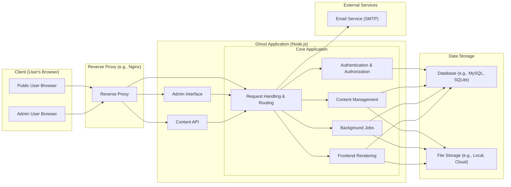
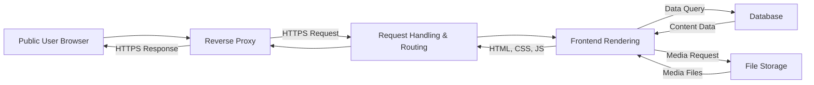
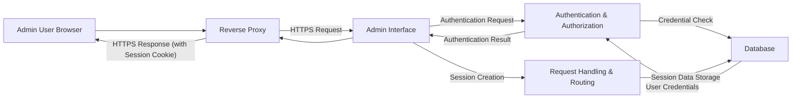
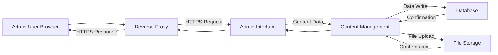
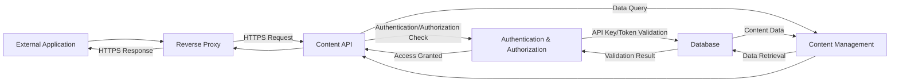
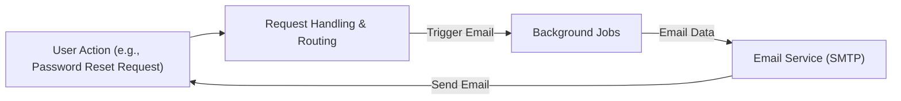

# Project Design Document: Ghost Blogging Platform (Improved for Threat Modeling)

**Version:** 2.0
**Date:** October 26, 2023
**Author:** AI Software Architect

## 1. Introduction

This document provides an enhanced architectural design of the Ghost blogging platform (as represented by the repository at [https://github.com/tryghost/ghost](https://github.com/tryghost/ghost)). This revised document is specifically tailored for use in threat modeling activities, providing a more granular view of the system's components, data flows, and security considerations.

## 2. Goals and Objectives (for Threat Modeling)

* **Provide a detailed breakdown of key components and their specific responsibilities:**  To facilitate a deeper understanding of potential vulnerabilities within each part of the system.
* **Clearly map and categorize data flows with attention to sensitive information:** To identify where data is most vulnerable during transit and at rest.
* **Explicitly define trust boundaries and privilege levels:** To understand where security controls need to be most stringent.
* **Highlight potential attack surfaces with greater precision:** To enable focused threat identification and mitigation strategies.
* **Offer a comprehensive and easily understandable representation of the system:** To support effective and collaborative threat modeling sessions.

## 3. Scope

This design document covers the core components of the Ghost platform with a focus on security-relevant aspects. It includes:

* The web application, broken down into key functional areas.
* The underlying data storage mechanisms and their interactions.
* Critical external integrations, particularly those involving data exchange.
* The various interfaces for accessing and managing content (Admin, Content API, Frontend).

This document still **does not** cover:

* Specific deployment environments or infrastructure details.
* Low-level code implementation specifics.
* The vast ecosystem of third-party themes and plugins (unless they directly relate to core functionality).
* Operational procedures like backup strategies or disaster recovery plans.

## 4. System Architecture

The Ghost platform employs a modular web application architecture.

### 4.1. High-Level Architecture Diagram

### 4.2. Key Components (Detailed)

* **Client (User's Browser):**
    * **Public User Browser:** Used by visitors to view the blog's content.
    * **Admin User Browser:** Used by administrators to manage the blog through the admin interface.
* **Reverse Proxy (e.g., Nginx):**
    * Handles incoming HTTP/HTTPS requests from both public users and administrators.
    * Provides SSL/TLS termination, encrypting communication.
    * Can perform load balancing and caching.
    * Acts as the initial point of contact and a crucial security boundary.
* **Ghost Application (Node.js):** The core of the platform, further broken down:
    * **Core Application:**
        * **Request Handling & Routing:** Manages incoming requests and directs them to the appropriate modules.
        * **Authentication & Authorization:** Verifies user identities and grants access based on roles and permissions. This is a critical trust boundary.
        * **Content Management:** Handles the creation, editing, and retrieval of blog posts, pages, and other content.
        * **Frontend Rendering:** Generates the HTML and other assets served to public users.
        * **Background Jobs:** Executes asynchronous tasks like sending emails or processing scheduled content updates.
    * **Admin Interface:** A dedicated web interface for administrative tasks, requiring authentication.
    * **Content API:** Provides programmatic access to content, requiring authentication and authorization for sensitive operations.
* **Data Storage:**
    * **Database (e.g., MySQL, SQLite):** Stores structured data persistently. This includes:
        * User credentials and roles.
        * Blog content (posts, pages, metadata).
        * Settings and configurations.
        * API keys and tokens.
    * **File Storage (e.g., Local Filesystem, Cloud Storage):** Stores uploaded media files and potentially theme assets.
* **External Services:**
    * **Email Service (SMTP):** Used to send transactional emails, such as password resets and notifications.

## 5. Data Flow Diagrams (Detailed)

### 5.1. Public Blog Content Retrieval

* **Description:** A public user requests a blog page. The request, secured by HTTPS, is routed to the frontend rendering engine, which fetches content from the database and media from file storage to generate the webpage.

### 5.2. Administrator Login

* **Description:** An administrator attempts to log in. The secure request is directed to the admin interface, which uses the authentication module to verify credentials against the database and establish a secure session.

### 5.3. Content Creation/Update via Admin Interface

* **Description:** An administrator creates or updates content. The secure request containing the content data is sent to the content management module, which interacts with the database and file storage to persist the changes.

### 5.4. Content Retrieval via Content API

* **Description:** An external application requests content via the API. The request is authenticated and authorized against stored API keys or tokens before the content management module retrieves the requested data.

### 5.5. Sending a Password Reset Email

* **Description:** When a user requests a password reset, the request handling module triggers a background job that uses the configured email service to send a reset link to the user's email address.

## 6. Key Security Considerations (Detailed)

* **Authentication and Authorization:**
    * Secure storage and handling of user credentials (hashing, salting).
    * Robust session management to prevent session hijacking.
    * Role-based access control (RBAC) to limit access based on user roles.
    * Secure API key/token generation, storage, and revocation for the Content API.
    * Multi-factor authentication (MFA) for administrative accounts.
* **Input Validation and Output Encoding:**
    * Thorough validation of all user inputs to prevent injection attacks (SQL injection, XSS, etc.).
    * Proper encoding of output data to prevent cross-site scripting vulnerabilities.
* **Data Protection (Confidentiality and Integrity):**
    * Encryption of sensitive data at rest in the database and file storage.
    * Enforce HTTPS for all communication to protect data in transit.
    * Secure handling of API keys and other sensitive configurations.
* **Content Security:**
    * Measures to prevent the upload and execution of malicious content.
    * Content Security Policy (CSP) to mitigate XSS attacks.
* **API Security:**
    * Rate limiting to prevent denial-of-service attacks.
    * Input validation and output encoding for all API endpoints.
    * Proper authentication and authorization mechanisms for API access.
* **Dependency Management:**
    * Regular updates of dependencies to patch known vulnerabilities.
    * Security scanning of dependencies.
* **Error Handling:**
    * Avoid revealing sensitive information in error messages.
    * Implement proper logging for security auditing but avoid logging sensitive data.
* **Rate Limiting:**
    * Implement rate limiting on login attempts, API requests, and other critical endpoints to prevent brute-force attacks and abuse.
* **Secure Configuration:**
    * Secure default configurations and guidance for administrators on hardening their installations.

## 7. Assumptions and Constraints

* **Secure Infrastructure:** It is assumed that the underlying operating system, server infrastructure, and network are configured securely.
* **Administrator Responsibility:** Administrators are responsible for securely managing their own accounts and following security best practices.
* **Third-Party Service Security:** The security of external services (like the email service) is assumed to be the responsibility of those providers.
* **Regular Updates:** The Ghost platform and its dependencies are expected to be updated regularly to address security vulnerabilities.

## 8. Conclusion

This enhanced design document provides a more detailed and security-focused view of the Ghost blogging platform's architecture. The breakdown of components, detailed data flow diagrams, and comprehensive security considerations are intended to provide a solid foundation for effective threat modeling activities. This document should enable security professionals to identify potential vulnerabilities and develop appropriate mitigation strategies to ensure the security and integrity of the Ghost platform.