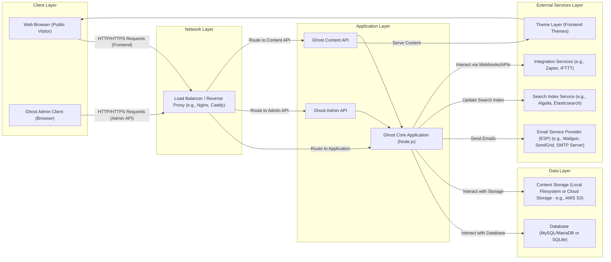

## Project Design Document: Ghost Blogging Platform (Improved)

**Project Name:** Ghost

**Project Repository:** [https://github.com/tryghost/ghost](https://github.com/tryghost/ghost)

**Document Version:** 1.1

**Date:** October 26, 2023

**Author:** AI Software Architect

**1. Introduction**

This document provides an enhanced architectural overview of the Ghost blogging platform, focusing on details relevant for security analysis and threat modeling. It elaborates on the key components, their interactions, data flows, and technologies, providing a more granular understanding of the system's architecture and potential attack vectors.

**2. Goals**

*   Provide a detailed and precise description of the Ghost architecture, suitable for in-depth security analysis.
*   Clearly identify the responsibilities and functionalities of each major component.
*   Illustrate the data flow for critical operations with greater clarity.
*   Document the specific technologies and frameworks used by each component where relevant.
*   Serve as a robust foundation for identifying and analyzing potential security threats and vulnerabilities.

**3. Target Audience**

*   Security engineers and architects responsible for threat modeling and security assessments.
*   Development team members involved in the design, development, and maintenance of Ghost.
*   Operations and infrastructure teams responsible for deploying and managing Ghost instances.
*   Anyone requiring a deep understanding of the Ghost platform's architecture from a security perspective.

**4. System Overview**

Ghost is a modern, open-source headless CMS built on Node.js, primarily designed for professional publishing. Its architecture emphasizes a clear separation of concerns, with distinct components handling content management, API access, and presentation. The platform offers features like a rich editor, membership management, subscription capabilities, and extensive integration options.

**5. Architectural Diagram**

**6. Component Description**

*   **Web Browser (Public Visitor):** The standard web browser used by visitors to access and view published content served by the Ghost platform.
*   **Ghost Admin Client (Browser):** A single-page application (SPA) built with JavaScript frameworks, providing the administrative interface for content creation, user management, and configuration.
*   **Load Balancer / Reverse Proxy (e.g., Nginx, Caddy):**  Handles incoming HTTP/HTTPS traffic, distributing requests across Ghost application instances for scalability and high availability. It also performs SSL termination, request routing, and may provide caching and security features like WAF (Web Application Firewall).
*   **Ghost Core Application (Node.js):** The central component of Ghost, responsible for:
    *   Request handling and routing.
    *   Business logic for content management, user authentication, and authorization.
    *   Orchestrating interactions between other components.
    *   Managing background tasks and scheduled jobs.
    *   Implementing core features like membership and subscriptions.
*   **Ghost Admin API:** A RESTful API used by the Ghost Admin Client to manage the platform. It requires authentication and authorization for all operations.
*   **Ghost Content API:** A public or protected API that allows external applications and themes to access published content. It can be configured for public access or require API keys for authentication.
*   **Database (MySQL/MariaDB or SQLite):** Stores persistent data, including:
    *   User accounts (administrators, authors, members).
    *   Content (posts, pages, tags, settings).
    *   Membership and subscription information.
    *   API keys and integration configurations.
*   **Content Storage (Local Filesystem or Cloud Storage - e.g., AWS S3):** Stores uploaded media assets like images, videos, and other files. Cloud storage offers scalability and durability.
*   **Email Service Provider (ESP) (e.g., Mailgun, SendGrid, SMTP Server):** Used for sending transactional emails (password resets, signup confirmations) and marketing emails (newsletters). Configuration details, including API keys or SMTP credentials, are stored within Ghost.
*   **Search Index Service (e.g., Algolia, Elasticsearch):** An optional external service that provides full-text search capabilities for the published content, improving search performance and relevance.
*   **Integration Services (e.g., Zapier, IFTTT):** Allows Ghost to connect with other applications and automate workflows through webhooks or API integrations.
*   **Theme Layer (Frontend Themes):**  Consists of customizable templates (using Handlebars.js) and assets (CSS, JavaScript) that define the visual presentation of the published content to website visitors.

**7. Data Flow (Detailed)**

*   **Public Visitor Accessing a Blog Post:**
    *   A visitor's web browser sends an HTTP/HTTPS request to the Load Balancer.
    *   The Load Balancer routes the request to a Ghost Core Application instance.
    *   The Ghost Core Application, based on the URL, determines the requested content.
    *   The Ghost Core Application queries the Database to retrieve the post data and associated metadata.
    *   If the post includes media, the Ghost Core Application retrieves URLs for these assets from the Database (pointing to Content Storage).
    *   The Ghost Core Application uses the appropriate Theme Layer templates to render the HTML content.
    *   The rendered HTML, along with references to CSS and JavaScript assets from the Theme Layer, is sent back through the Load Balancer to the visitor's browser.
    *   The browser then makes separate requests for the CSS, JavaScript, and media assets.

*   **Admin User Creating/Editing a Post:**
    *   An authenticated admin user interacts with the Ghost Admin Client in their browser.
    *   The Admin Client sends authenticated API requests to the Load Balancer, targeting the Ghost Admin API.
    *   The Load Balancer routes the requests to a Ghost Admin API instance (which is part of the Ghost Core Application).
    *   The Ghost Admin API authenticates and authorizes the user based on their session or API key.
    *   For creating/editing content, the Ghost Admin API interacts with the Database to store or update post data, including title, content, and metadata.
    *   If media is uploaded, the Ghost Admin API interacts with Content Storage to store the files and updates the Database with the file paths or URLs.
    *   The Ghost Admin API sends a response back to the Admin Client, indicating success or failure.

*   **User Registration/Login (Membership Feature):**
    *   A user interacts with the frontend theme's registration/login forms.
    *   The browser sends an HTTP/HTTPS request to the Load Balancer.
    *   The Load Balancer routes the request to a Ghost Core Application instance.
    *   The Ghost Core Application processes the registration/login request, interacting with the Database to create a new user account or verify existing credentials.
    *   For registration, user details are stored securely in the Database (password hashing is crucial).
    *   Upon successful login, the Ghost Core Application creates a session (typically using cookies) to maintain the user's authenticated state.
    *   The Ghost Core Application sends a response back to the user's browser, potentially setting session cookies.

*   **Sending a Newsletter to Members:**
    *   An authenticated admin user initiates a newsletter send through the Ghost Admin Client.
    *   The Admin Client sends an authenticated API request to the Load Balancer, targeting the Ghost Admin API.
    *   The Ghost Admin API retrieves the list of active members from the Database.
    *   The Ghost Core Application composes the email content based on the newsletter draft.
    *   The Ghost Core Application uses the configured Email Service Provider (ESP) to send emails to the retrieved member list, using API calls or SMTP.

**8. Key Technologies (Detailed)**

*   **Programming Language:** JavaScript (Node.js)
*   **Backend Framework:** Express.js (provides routing, middleware, and request/response handling)
*   **Frontend Framework (Admin Client):** Ember.js (used for building the interactive admin interface)
*   **Templating Engine (Themes):** Handlebars.js (for dynamic content rendering in frontend themes)
*   **Database ORM:** Bookshelf.js (provides an abstraction layer for database interactions)
*   **Database Drivers:** Knex.js (a query builder used by Bookshelf.js to interact with different database systems)
*   **Authentication & Authorization:**  Custom implementations and potentially Passport.js for handling different authentication strategies. JSON Web Tokens (JWT) are likely used for API authentication.
*   **Package Manager:** npm or yarn (for managing project dependencies)
*   **Operating System (Typical Production):** Linux-based distributions (e.g., Ubuntu, Debian)
*   **Web Servers/Reverse Proxies:** Nginx (highly common), Caddy
*   **Cloud Providers (Optional):** AWS, Google Cloud Platform, Azure (for hosting and storage)
*   **Containerization (Optional):** Docker (for packaging and deploying the application), Kubernetes (for orchestration)
*   **Search Integration Libraries:**  Libraries specific to the chosen search service (e.g., Algolia's JavaScript client).

**9. Security Considerations (Expanded)**

This section expands on potential security considerations, providing more specific examples:

*   **Authentication and Authorization:**
    *   **Threat:** Brute-force attacks on login forms, weak password policies, insecure storage of credentials, privilege escalation.
    *   **Mitigation:** Strong password policies, multi-factor authentication (MFA), rate limiting on login attempts, secure password hashing (e.g., bcrypt), role-based access control (RBAC).
*   **Input Validation:**
    *   **Threat:** Cross-Site Scripting (XSS), SQL Injection, Command Injection, Path Traversal.
    *   **Mitigation:**  Sanitize user inputs on both the client and server-side, use parameterized queries for database interactions, avoid direct execution of user-provided commands, validate file uploads.
*   **Data Protection:**
    *   **Threat:** Data breaches, unauthorized access to sensitive information, data tampering.
    *   **Mitigation:** Encryption at rest (database, content storage), encryption in transit (HTTPS), secure storage of API keys and secrets (e.g., using environment variables or dedicated secret management services).
*   **Session Management:**
    *   **Threat:** Session hijacking, session fixation.
    *   **Mitigation:** Securely configure session cookies (HttpOnly, Secure flags), use short session timeouts, regenerate session IDs after login, protect against Cross-Site Request Forgery (CSRF).
*   **Cross-Site Scripting (XSS):**
    *   **Threat:** Malicious scripts injected into web pages, leading to data theft, session hijacking, or defacement.
    *   **Mitigation:** Implement Content Security Policy (CSP), sanitize user-generated content before rendering, use templating engines that automatically escape output.
*   **Cross-Site Request Forgery (CSRF):**
    *   **Threat:** Unauthorized actions performed on behalf of an authenticated user.
    *   **Mitigation:** Implement CSRF tokens, use SameSite cookie attribute.
*   **Dependency Management:**
    *   **Threat:** Exploiting known vulnerabilities in third-party libraries and dependencies.
    *   **Mitigation:** Regularly update dependencies, use vulnerability scanning tools, implement a secure software development lifecycle.
*   **Rate Limiting:**
    *   **Threat:** Denial-of-Service (DoS) attacks, brute-force attacks.
    *   **Mitigation:** Implement rate limiting on API endpoints and critical functionalities.
*   **Content Security Policy (CSP):**
    *   **Threat:**  Mitigating XSS attacks by controlling the resources the browser is allowed to load.
    *   **Mitigation:**  Define a strict CSP policy and enforce it.
*   **Email Security:**
    *   **Threat:** Email spoofing, phishing attacks.
    *   **Mitigation:** Use SPF, DKIM, and DMARC records for domain authentication, securely manage ESP API keys or SMTP credentials.
*   **API Security:**
    *   **Threat:** Unauthorized access to administrative functions or sensitive data via the Admin API, data scraping via the Content API.
    *   **Mitigation:** Implement strong authentication (e.g., JWT), authorization, rate limiting, input validation for both APIs. Consider API gateways for enhanced security.
*   **File Upload Security:**
    *   **Threat:** Uploading malicious files (e.g., malware, scripts), path traversal vulnerabilities.
    *   **Mitigation:** Validate file types and sizes, sanitize filenames, store uploaded files outside the webroot, use virus scanning.

**10. Deployment Considerations (Security Focused)**

The chosen deployment method significantly impacts the security posture:

*   **Self-Hosted:** Requires manual configuration and management of all security aspects, including server hardening, firewall configuration, and software updates. This offers maximum control but also the greatest responsibility.
*   **Platform-as-a-Service (PaaS):**  The PaaS provider handles some infrastructure security aspects, but application-level security remains the responsibility of the Ghost instance owner. Understanding the PaaS provider's security model is crucial.
*   **Containerized Deployment (Docker/Kubernetes):**  Provides isolation and portability but requires careful configuration of container images and orchestration platform security. Vulnerabilities in base images or misconfigurations can introduce risks.
*   **Managed Ghost Hosting:**  The hosting provider handles infrastructure and application security to varying degrees. It's important to understand the provider's security practices and SLAs.

**11. Future Considerations**

*   Detailed threat model diagrams and descriptions for specific attack scenarios.
*   Security hardening guidelines for different deployment environments.
*   Integration with security information and event management (SIEM) systems for monitoring and alerting.
*   Regular security audits and penetration testing.

This improved design document provides a more detailed and security-focused view of the Ghost blogging platform's architecture, facilitating more effective threat modeling and security assessments.