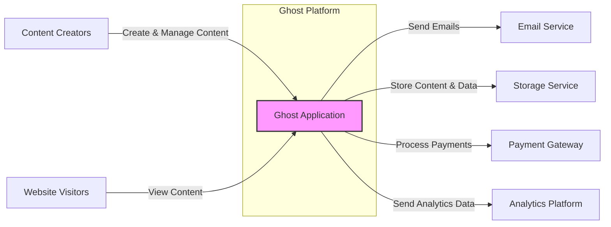
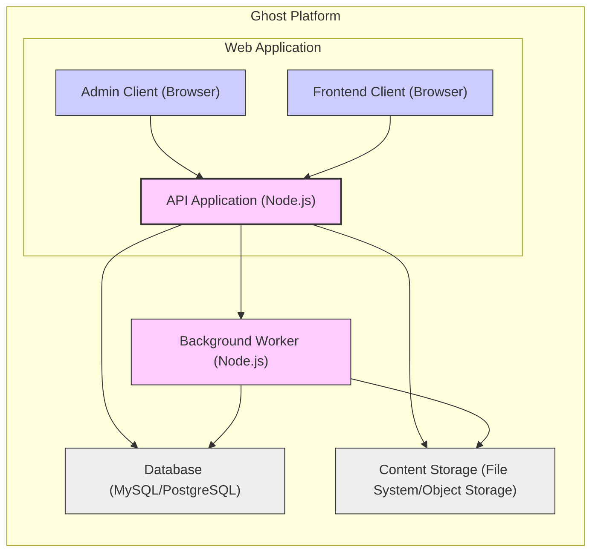
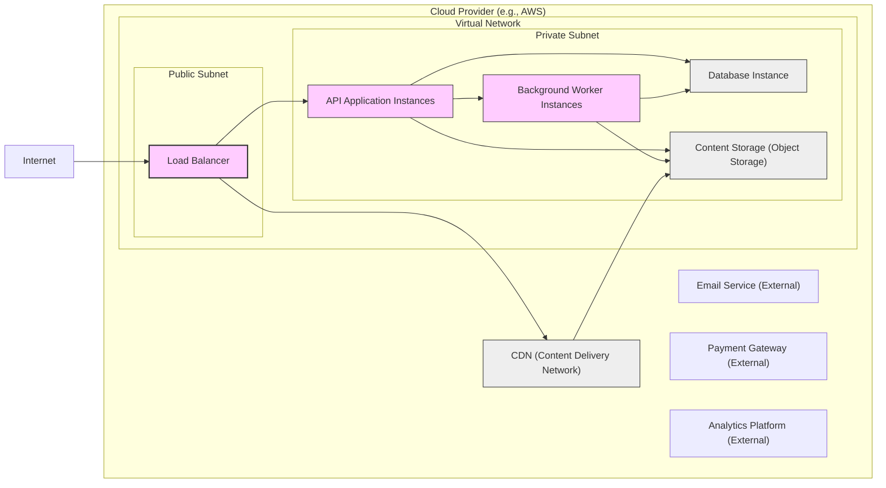

# BUSINESS POSTURE

Ghost is an open-source publishing platform focused on providing tools for creators and businesses to build and manage online publications.

Business Priorities and Goals:
- Provide a user-friendly platform for content creation and publishing.
- Offer a customizable and extensible platform through themes and integrations.
- Support various content formats and media types.
- Enable monetization options for creators through subscriptions and memberships.
- Maintain a stable, reliable, and performant platform.
- Foster a strong community around the platform.

Business Risks:
- Data breaches and data loss impacting user trust and platform reputation.
- Platform downtime leading to loss of revenue and user dissatisfaction.
- Security vulnerabilities exploited by malicious actors.
- Lack of scalability to handle growing user base and content volume.
- Dependence on community contributions for maintenance and feature development.

# SECURITY POSTURE

Existing Security Controls:
- security control: Regular security audits and penetration testing (based on common industry practices for open-source projects).
- security control: Secure software development lifecycle (likely follows common practices for open-source projects, including code reviews and vulnerability scanning).
- security control: HTTPS enforced for all communication (standard web application security practice).
- security control: Input validation and sanitization to prevent common web vulnerabilities (likely implemented within the application code).
- security control: Authentication and authorization mechanisms to control access to the platform and content (implemented within the application code).
- security control: Password hashing and secure storage (likely using bcrypt or similar algorithms).
- security control: Rate limiting to mitigate brute-force attacks (likely implemented at the application or infrastructure level).
- security control: Regular updates and patching of dependencies and the platform itself (part of open-source project maintenance).

Accepted Risks:
- accepted risk: Potential vulnerabilities in third-party dependencies.
- accepted risk: Risk of community-contributed themes and integrations introducing security issues.
- accepted risk: Reliance on community for timely security vulnerability disclosures and patches.

Recommended Security Controls:
- security control: Implement a Software Composition Analysis (SCA) tool in the build pipeline to automatically identify and manage vulnerabilities in dependencies.
- security control: Introduce static application security testing (SAST) tools in the development and build pipeline to identify potential security vulnerabilities in the codebase.
- security control: Implement a bug bounty program to incentivize external security researchers to find and report vulnerabilities.
- security control: Enhance security awareness training for developers and contributors, focusing on secure coding practices.
- security control: Implement robust logging and monitoring for security events and anomalies.

Security Requirements:
- Authentication:
    - requirement: Secure authentication mechanisms for users (administrators, authors, subscribers).
    - requirement: Multi-factor authentication (MFA) should be supported for administrators and authors.
    - requirement: Password complexity requirements and account lockout policies should be enforced.
- Authorization:
    - requirement: Role-based access control (RBAC) to manage permissions for different user roles (e.g., administrator, editor, author, subscriber).
    - requirement: Granular permissions to control access to specific features and content.
    - requirement: Secure API authorization for external integrations.
- Input Validation:
    - requirement: Comprehensive input validation and sanitization for all user inputs to prevent injection attacks (e.g., XSS, SQL injection).
    - requirement: Use of parameterized queries or ORM to prevent SQL injection.
    - requirement: Content Security Policy (CSP) to mitigate XSS attacks.
- Cryptography:
    - requirement: Use of TLS/SSL for all communication to protect data in transit.
    - requirement: Secure storage of sensitive data (e.g., passwords, API keys) using strong encryption algorithms.
    - requirement: Proper handling of cryptographic keys and secrets.

# DESIGN

## C4 CONTEXT

Context Diagram Elements:

- Element:
    - Name: "Ghost Application"
    - Type: Software System
    - Description: The Ghost publishing platform itself, providing content creation, management, and delivery functionalities.
    - Responsibilities:
        - Content creation and management.
        - User authentication and authorization.
        - Content delivery to website visitors.
        - Integration with external services.
    - Security controls:
        - Input validation and sanitization.
        - Authentication and authorization mechanisms.
        - HTTPS enforcement.
        - Regular security updates and patching.

- Element:
    - Name: "Content Creators"
    - Type: Person
    - Description: Users who create, edit, and manage content within the Ghost platform (e.g., bloggers, journalists, editors).
    - Responsibilities:
        - Creating and managing content.
        - Configuring platform settings.
        - Managing user accounts.
    - Security controls:
        - Strong password management.
        - Multi-factor authentication (recommended).
        - Awareness of phishing and social engineering attacks.

- Element:
    - Name: "Website Visitors"
    - Type: Person
    - Description: End-users who access and view content published on the Ghost platform through a web browser.
    - Responsibilities:
        - Viewing published content.
        - Interacting with website features (e.g., comments, subscriptions).
    - Security controls:
        - Browser security features.
        - Awareness of phishing and malicious websites.

- Element:
    - Name: "Email Service"
    - Type: External System
    - Description: Third-party email service provider used by Ghost to send emails (e.g., transactional emails, newsletters).
    - Responsibilities:
        - Sending emails on behalf of the Ghost platform.
        - Managing email delivery and bounce rates.
    - Security controls:
        - API key management and secure storage.
        - SPF, DKIM, and DMARC configuration for email authentication.

- Element:
    - Name: "Storage Service"
    - Type: External System
    - Description: Cloud storage service used by Ghost to store content assets, media files, and database backups (e.g., AWS S3, Google Cloud Storage).
    - Responsibilities:
        - Secure storage of data.
        - Data backup and recovery.
        - Data access control.
    - Security controls:
        - Access control lists (ACLs) and IAM policies.
        - Encryption at rest and in transit.
        - Regular security audits and compliance certifications.

- Element:
    - Name: "Payment Gateway"
    - Type: External System
    - Description: Third-party payment processing service used by Ghost to handle subscriptions and payments (e.g., Stripe, PayPal).
    - Responsibilities:
        - Secure payment processing.
        - Handling payment transactions and subscriptions.
        - PCI DSS compliance.
    - Security controls:
        - API key management and secure storage.
        - Secure communication protocols (HTTPS).
        - Tokenization and encryption of payment data.

- Element:
    - Name: "Analytics Platform"
    - Type: External System
    - Description: Third-party analytics service used by Ghost to track website traffic and user behavior (e.g., Google Analytics, Plausible Analytics).
    - Responsibilities:
        - Collecting and processing website analytics data.
        - Providing insights into website traffic and user behavior.
    - Security controls:
        - Data privacy and anonymization.
        - Compliance with data privacy regulations (e.g., GDPR, CCPA).
        - Secure data transmission (HTTPS).

## C4 CONTAINER

Container Diagram Elements:

- Element:
    - Name: "Admin Client (Browser)"
    - Type: Client Application
    - Description: JavaScript application running in a web browser, used by content creators to manage the Ghost platform (admin interface).
    - Responsibilities:
        - User interface for content creation and management.
        - Communication with the API Application.
        - User authentication and session management.
    - Security controls:
        - Browser-based security controls (CSP, XSS protection).
        - Secure session management (HTTP-only cookies, CSRF protection).
        - Input validation on the client-side.

- Element:
    - Name: "Frontend Client (Browser)"
    - Type: Client Application
    - Description: JavaScript application running in a web browser, used to display the published content to website visitors (frontend website).
    - Responsibilities:
        - Rendering website content.
        - User interface for website visitors.
        - Communication with the API Application (for dynamic content).
    - Security controls:
        - Browser-based security controls (CSP, XSS protection).
        - Secure handling of user data (if any).
        - Input validation on the client-side (for user interactions).

- Element:
    - Name: "API Application (Node.js)"
    - Type: Server Application
    - Description: Backend application built with Node.js, providing the core logic and API endpoints for the Ghost platform.
    - Responsibilities:
        - Handling API requests from clients (Admin Client, Frontend Client).
        - Business logic and data processing.
        - Authentication and authorization.
        - Data access and management (Database, Content Storage).
        - Background task processing (Background Worker).
    - Security controls:
        - Input validation and sanitization.
        - Authentication and authorization mechanisms.
        - Secure API design and implementation.
        - Rate limiting and DDoS protection.
        - Regular security updates and patching of Node.js and dependencies.

- Element:
    - Name: "Database (MySQL/PostgreSQL)"
    - Type: Data Store
    - Description: Relational database used to store structured data for the Ghost platform (e.g., posts, users, settings).
    - Responsibilities:
        - Persistent storage of structured data.
        - Data integrity and consistency.
        - Data backup and recovery.
    - Security controls:
        - Database access control and user permissions.
        - Encryption at rest and in transit (if supported by the database).
        - Regular database security updates and patching.
        - Database hardening and security configuration.

- Element:
    - Name: "Content Storage (File System/Object Storage)"
    - Type: Data Store
    - Description: Storage system used to store unstructured content assets (e.g., images, media files, themes). Can be a local file system or cloud object storage.
    - Responsibilities:
        - Persistent storage of unstructured data.
        - Data access and retrieval.
    - Security controls:
        - Access control lists (ACLs) and file permissions.
        - Encryption at rest and in transit (if using object storage).
        - Regular security audits and vulnerability scanning.

- Element:
    - Name: "Background Worker (Node.js)"
    - Type: Server Application
    - Description: Node.js application responsible for handling asynchronous and background tasks (e.g., sending emails, processing scheduled jobs).
    - Responsibilities:
        - Asynchronous task processing.
        - Scheduled job execution.
        - Communication with other containers (API Application, Database, Content Storage).
    - Security controls:
        - Secure task processing and queue management.
        - Input validation for task parameters.
        - Logging and monitoring of background tasks.
        - Same security controls as API Application regarding Node.js and dependencies.

## DEPLOYMENT

Deployment Architecture Option: Cloud-based Deployment (e.g., AWS, Google Cloud, Azure)

Deployment Diagram Elements (Cloud-based Deployment):

- Element:
    - Name: "Load Balancer"
    - Type: Infrastructure Component
    - Description: Distributes incoming traffic across multiple API Application instances for high availability and scalability.
    - Responsibilities:
        - Traffic distribution and load balancing.
        - SSL termination.
        - Health checks for application instances.
    - Security controls:
        - DDoS protection.
        - Web Application Firewall (WAF) (optional).
        - Access logs and monitoring.

- Element:
    - Name: "API Application Instances"
    - Type: Compute Instance (e.g., EC2, Compute Engine)
    - Description: Multiple instances of the API Application running on virtual machines or containers.
    - Responsibilities:
        - Handling API requests.
        - Application logic execution.
    - Security controls:
        - Security hardening of operating system and runtime environment.
        - Regular security patching.
        - Instance-level firewalls and security groups.
        - Intrusion detection and prevention systems (IDS/IPS) (optional).

- Element:
    - Name: "Background Worker Instances"
    - Type: Compute Instance (e.g., EC2, Compute Engine)
    - Description: Multiple instances of the Background Worker application running on virtual machines or containers.
    - Responsibilities:
        - Background task processing.
        - Scheduled job execution.
    - Security controls:
        - Same as API Application Instances.

- Element:
    - Name: "Database Instance"
    - Type: Managed Database Service (e.g., RDS, Cloud SQL)
    - Description: Managed database service providing a scalable and reliable database environment.
    - Responsibilities:
        - Database management and maintenance.
        - Data storage and retrieval.
        - Data backup and recovery.
    - Security controls:
        - Database access control and user permissions.
        - Encryption at rest and in transit.
        - Automated backups and disaster recovery.
        - Database monitoring and auditing.

- Element:
    - Name: "Content Storage (Object Storage)"
    - Type: Cloud Storage Service (e.g., S3, Cloud Storage)
    - Description: Cloud object storage service for storing content assets.
    - Responsibilities:
        - Scalable and durable object storage.
        - Content delivery via CDN.
    - Security controls:
        - Access control lists (ACLs) and IAM policies.
        - Encryption at rest and in transit.
        - Versioning and data lifecycle management.

- Element:
    - Name: "CDN (Content Delivery Network)"
    - Type: Content Delivery Network
    - Description: Caches and delivers static content (e.g., images, CSS, JavaScript) to improve performance and reduce latency for website visitors.
    - Responsibilities:
        - Content caching and delivery.
        - Reduced latency and improved website performance.
        - DDoS protection (in some CDN services).
    - Security controls:
        - HTTPS delivery.
        - Origin protection.
        - Web Application Firewall (WAF) (optional).

- Element:
    - Name: "Email Service (External)"
    - Type: External Service
    - Description: Third-party email service provider.
    - Responsibilities:
        - Email sending.
    - Security controls:
        - API key management.
        - SPF, DKIM, DMARC configuration.

- Element:
    - Name: "Payment Gateway (External)"
    - Type: External Service
    - Description: Third-party payment processing service.
    - Responsibilities:
        - Payment processing.
    - Security controls:
        - API key management.
        - Secure communication protocols.

- Element:
    - Name: "Analytics Platform (External)"
    - Type: External Service
    - Description: Third-party analytics service.
    - Responsibilities:
        - Website analytics.
    - Security controls:
        - Data privacy and anonymization.
        - Secure data transmission.

## BUILD

```mermaid
flowchart LR
    A["Developer"] -->|Code Changes, Commit, Push| B["Version Control (GitHub)"]
    B -->|Webhook Trigger| C["CI/CD Pipeline (GitHub Actions)"]
    subgraph "CI/CD Pipeline"
        C --> D["Build Stage"]
        D -->|Build Artifacts| E["Test Stage"]
        E -->|Test Results| F["Security Scan Stage (SAST, SCA)"]
        F -->|Scan Results| G["Publish Stage"]
        G -->|Release Artifacts| H["Artifact Repository"]
    end
    H -->|Deployment Automation| I["Deployment Environment"]

    style C fill:#fcf,stroke:#333,stroke-width:2px
```

Build Process Description:

The build process for Ghost is likely automated using a CI/CD pipeline, such as GitHub Actions, given it's hosted on GitHub.

Build Process Elements:

- Element:
    - Name: "Developer"
    - Type: Person
    - Description: Software developers who write and maintain the Ghost codebase.
    - Responsibilities:
        - Writing and committing code changes.
        - Performing local testing.
        - Code reviews (likely).
    - Security controls:
        - Secure coding practices.
        - Code review process.
        - Local development environment security.

- Element:
    - Name: "Version Control (GitHub)"
    - Type: Software System
    - Description: GitHub repository hosting the Ghost source code and managing version control.
    - Responsibilities:
        - Source code management.
        - Version history tracking.
        - Collaboration and code review workflows.
    - Security controls:
        - Access control and permissions for repository access.
        - Branch protection rules.
        - Audit logs for repository activities.

- Element:
    - Name: "CI/CD Pipeline (GitHub Actions)"
    - Type: Automation System
    - Description: Automated CI/CD pipeline triggered by code changes in the GitHub repository, responsible for building, testing, scanning, and publishing the Ghost application.
    - Responsibilities:
        - Automated build process.
        - Automated testing (unit, integration, etc.).
        - Automated security scanning (SAST, SCA).
        - Artifact publishing.
        - Deployment automation (potentially).
    - Security controls:
        - Secure pipeline configuration and access control.
        - Secret management for API keys and credentials.
        - Isolation of build environments.
        - Audit logs for pipeline execution.

- Element:
    - Name: "Build Stage"
    - Type: Pipeline Stage
    - Description: Stage in the CI/CD pipeline responsible for compiling the code, packaging dependencies, and creating build artifacts.
    - Responsibilities:
        - Code compilation and packaging.
        - Dependency management.
        - Artifact creation.
    - Security controls:
        - Secure build environment.
        - Dependency vulnerability scanning (SCA).

- Element:
    - Name: "Test Stage"
    - Type: Pipeline Stage
    - Description: Stage in the CI/CD pipeline responsible for running automated tests to ensure code quality and functionality.
    - Responsibilities:
        - Unit testing.
        - Integration testing.
        - End-to-end testing (potentially).
    - Security controls:
        - Test environment security.
        - Security testing (DAST - potentially in later stages or separate pipeline).

- Element:
    - Name: "Security Scan Stage (SAST, SCA)"
    - Type: Pipeline Stage
    - Description: Stage in the CI/CD pipeline responsible for performing static application security testing (SAST) and software composition analysis (SCA) to identify potential vulnerabilities.
    - Responsibilities:
        - Static code analysis (SAST).
        - Dependency vulnerability scanning (SCA).
        - Reporting security vulnerabilities.
    - Security controls:
        - SAST and SCA tool configuration and management.
        - Vulnerability reporting and tracking.

- Element:
    - Name: "Publish Stage"
    - Type: Pipeline Stage
    - Description: Stage in the CI/CD pipeline responsible for publishing build artifacts to an artifact repository.
    - Responsibilities:
        - Artifact publishing.
        - Versioning and release management.
    - Security controls:
        - Secure artifact repository access control.
        - Artifact integrity verification (e.g., signing).

- Element:
    - Name: "Artifact Repository"
    - Type: Data Store
    - Description: Repository for storing build artifacts (e.g., container images, packages).
    - Responsibilities:
        - Secure storage of build artifacts.
        - Artifact versioning and management.
    - Security controls:
        - Access control and permissions.
        - Artifact integrity verification.

- Element:
    - Name: "Deployment Environment"
    - Type: Infrastructure
    - Description: Target environment where the Ghost application is deployed (e.g., cloud environment, on-premises servers).
    - Responsibilities:
        - Running the Ghost application.
        - Providing runtime environment.
    - Security controls:
        - Infrastructure security controls (as described in Deployment section).

# RISK ASSESSMENT

Critical Business Processes:
- Content publishing and delivery: Ensuring content is available to website visitors without interruption.
- User authentication and authorization: Protecting access to the platform and content management features.
- Payment processing (if monetization features are used): Securely handling financial transactions.
- Data storage and backup: Protecting content and user data from loss or corruption.

Data Sensitivity:
- User credentials (passwords, email addresses): Highly sensitive, requiring strong protection.
- Content data (posts, media files): Sensitive, as loss or unauthorized access can impact reputation and business operations.
- Payment information (if collected): Highly sensitive, requiring PCI DSS compliance if applicable.
- Website analytics data: Less sensitive, but still important to protect user privacy.

# QUESTIONS & ASSUMPTIONS

Questions:
- What specific security audits and penetration testing are performed for Ghost?
- What SAST and SCA tools are currently used in the development and build pipeline?
- Is there a bug bounty program in place for Ghost?
- What is the process for handling security vulnerability disclosures and patching?
- What specific logging and monitoring mechanisms are in place for security events?
- What are the data retention policies for user data and content?
- What is the disaster recovery plan for Ghost?

Assumptions:
- BUSINESS POSTURE: Ghost prioritizes user experience, content creation, and platform stability. Security is a significant concern for maintaining user trust and platform reputation.
- SECURITY POSTURE: Ghost follows common secure development practices for open-source projects. HTTPS is enforced, and basic input validation and authentication are implemented. There is room for improvement in automated security scanning and proactive vulnerability management.
- DESIGN: Ghost follows a typical three-tier web application architecture with a frontend, backend API, and database. Deployment is flexible and can be cloud-based or self-hosted. The build process is automated using CI/CD principles.