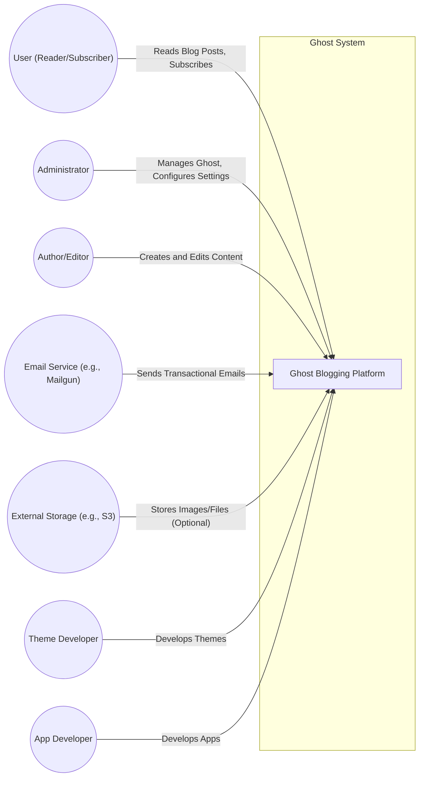
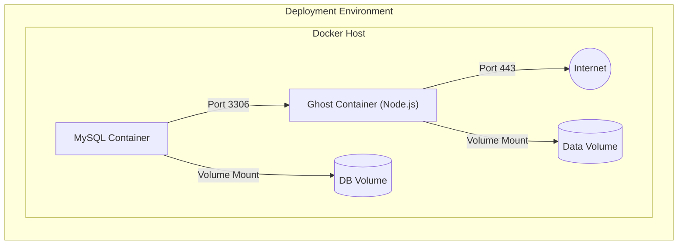
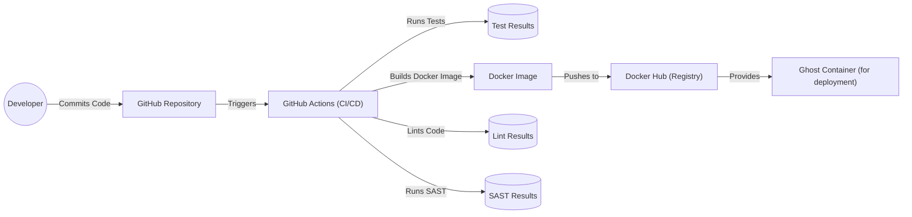

Okay, let's create a design document for the Ghost blogging platform based on the provided GitHub repository.

# BUSINESS POSTURE

Ghost is a popular open-source content management system (CMS) focused on blogging and online publishing.  Its primary business goals revolve around providing a user-friendly, performant, and customizable platform for creators.  It operates under a dual-license model: open-source (MIT License) for self-hosting and a paid "Pro" service (Ghost(Pro)) for managed hosting.  This suggests a balance between community contribution and revenue generation.

Business Priorities:

*   User Experience:  Provide a clean, intuitive interface for both content creators and readers.
*   Performance:  Ensure fast loading times and a smooth user experience.
*   Customization:  Allow users to tailor the look and feel of their blogs through themes and integrations.
*   Extensibility: Enable developers to extend functionality via apps and APIs.
*   Monetization (for Ghost(Pro)):  Maintain a reliable and scalable hosting infrastructure to support paying customers.
*   Community Growth: Foster a vibrant community of users and contributors.

Business Risks:

*   Data Breaches:  Unauthorized access to user data (emails, passwords, content) could severely damage reputation and user trust.  This is critical for both self-hosted and Ghost(Pro) users.
*   Service Downtime (especially for Ghost(Pro)):  Interruptions in service directly impact paying customers and revenue.
*   Malicious Content:  Users might exploit the platform to host illegal or harmful content, creating legal and reputational risks.
*   Spam and Abuse:  Comment sections and other user-generated content areas are vulnerable to spam and abuse.
*   Competition:  The CMS market is competitive, requiring continuous innovation and improvement to maintain market share.
*   Supply Chain Attacks: Compromise of third-party dependencies used by Ghost could introduce vulnerabilities.
*   Theme/Plugin Vulnerabilities:  Poorly coded themes or plugins (especially from third-party sources) could expose security flaws.

# SECURITY POSTURE

Existing Security Controls (based on the GitHub repository and general knowledge of Ghost):

*   security control: Input Validation: Ghost uses input validation techniques to prevent common web vulnerabilities like Cross-Site Scripting (XSS) and SQL Injection. Implemented in core code and libraries.
*   security control: Authentication:  User authentication is handled via email/password, with support for password hashing (likely bcrypt or similar).  Ghost(Pro) likely offers additional authentication options. Implemented in core authentication modules.
*   security control: Authorization:  Role-based access control (RBAC) restricts user actions based on their assigned roles (e.g., author, editor, administrator). Implemented in core authorization modules.
*   security control: CSRF Protection:  Ghost employs measures to prevent Cross-Site Request Forgery (CSRF) attacks. Implemented in core middleware.
*   security control: Content Security Policy (CSP):  Ghost utilizes CSP headers to mitigate XSS and other code injection attacks. Implemented in server configuration and response headers.
*   security control: HTTPS:  Ghost strongly encourages (and Ghost(Pro) enforces) the use of HTTPS to encrypt communication between the server and clients. Implemented in server configuration.
*   security control: Regular Updates:  The Ghost team releases regular updates to address security vulnerabilities and improve performance. Implemented through release process and update mechanisms.
*   security control: Dependency Management: Ghost uses package managers (like npm) to manage dependencies and track known vulnerabilities. Implemented in build process and dependency management tools.
*   security control: Code Reviews: The Ghost project likely employs code reviews to identify potential security issues before they are merged into the codebase. Implemented in development workflow.

Accepted Risks:

*   accepted risk: Self-Hosted Security Responsibility: Users who self-host Ghost are responsible for securing their own server infrastructure, including operating system updates, firewall configuration, and database security.
*   accepted risk: Third-Party Theme/Plugin Risk:  While Ghost provides a platform for themes and plugins, the security of these extensions is ultimately the responsibility of their developers. Users are advised to use trusted sources.

Recommended Security Controls:

*   security control: Two-Factor Authentication (2FA):  Implement 2FA for user accounts, especially for administrators, to add an extra layer of security.
*   security control: Audit Logging:  Implement comprehensive audit logging to track user actions and system events, aiding in incident investigation and security monitoring.
*   security control: Rate Limiting:  Implement rate limiting on API endpoints and login attempts to mitigate brute-force attacks and denial-of-service (DoS) attempts.
*   security control: Security Scanning: Integrate automated security scanning tools (SAST, DAST, SCA) into the development and deployment pipeline.
*   security control: Intrusion Detection/Prevention System (IDS/IPS): For Ghost(Pro), implement an IDS/IPS to monitor network traffic and detect/prevent malicious activity.

Security Requirements:

*   Authentication:
    *   All user accounts must be protected by strong passwords.
    *   Password hashing must use a strong, industry-standard algorithm (e.g., bcrypt).
    *   Support for 2FA should be implemented.
    *   Session management must be secure, using unique session IDs and appropriate timeouts.

*   Authorization:
    *   RBAC must be enforced consistently throughout the application.
    *   Users should only have access to the resources and actions necessary for their roles.
    *   Privilege escalation vulnerabilities must be prevented.

*   Input Validation:
    *   All user input must be validated and sanitized to prevent XSS, SQL Injection, and other injection attacks.
    *   A whitelist approach to input validation should be preferred over a blacklist approach.
    *   Output encoding should be used to prevent stored XSS.

*   Cryptography:
    *   All sensitive data (passwords, API keys, etc.) must be stored securely using strong encryption.
    *   HTTPS must be enforced for all communication between the client and server.
    *   Cryptographic libraries must be kept up-to-date.

*   Data Protection:
    *   User data must be protected in accordance with relevant privacy regulations (e.g., GDPR).
    *   Data backups must be performed regularly and stored securely.
    *   Data retention policies must be defined and enforced.

# DESIGN

## C4 CONTEXT



C4 Context Element Descriptions:

*   Element:
    *   Name: User (Reader/Subscriber)
    *   Type: Person
    *   Description: A person who reads blog posts and may subscribe to updates.
    *   Responsibilities: View content, subscribe to newsletters, leave comments (if enabled).
    *   Security controls: None (client-side).

*   Element:
    *   Name: Administrator
    *   Type: Person
    *   Description: A person who manages the Ghost installation and configures settings.
    *   Responsibilities: Install/upgrade Ghost, manage users, configure settings, manage themes and plugins.
    *   Security controls: Strong password, 2FA (recommended), secure session management.

*   Element:
    *   Name: Author/Editor
    *   Type: Person
    *   Description: A person who creates and edits content within Ghost.
    *   Responsibilities: Write blog posts, upload images, manage content.
    *   Security controls: Strong password, 2FA (recommended), secure session management, RBAC.

*   Element:
    *   Name: Ghost Blogging Platform
    *   Type: Software System
    *   Description: The core Ghost application, including the admin interface, API, and rendering engine.
    *   Responsibilities: Content management, user authentication, API access, theme rendering.
    *   Security controls: Input validation, authentication, authorization, CSRF protection, CSP, HTTPS.

*   Element:
    *   Name: Email Service (e.g., Mailgun)
    *   Type: External System
    *   Description: A third-party service used to send transactional emails (e.g., password resets, subscription confirmations).
    *   Responsibilities: Sending emails on behalf of Ghost.
    *   Security controls: API key authentication, secure communication (HTTPS).

*   Element:
    *   Name: External Storage (e.g., S3)
    *   Type: External System
    *   Description: An optional external storage service used to store images and other files.
    *   Responsibilities: Storing and serving files.
    *   Security controls: Access control lists (ACLs), secure communication (HTTPS).

*   Element:
    *   Name: Theme Developer
    *   Type: Person
    *   Description: A person who develops themes for Ghost.
    *   Responsibilities: Create theme files (templates, CSS, JavaScript).
    *   Security controls: None (responsibility of the developer to follow secure coding practices).

*   Element:
    *   Name: App Developer
    *   Type: Person
    *   Description: A person who develops apps to extend Ghost's functionality.
    *   Responsibilities: Create app code and integrate with the Ghost API.
    *   Security controls: None (responsibility of the developer to follow secure coding practices).

## C4 CONTAINER

```mermaid
graph LR
    subgraph Ghost Blogging Platform
        AdminAPI["Admin API (Node.js)"] -- Provides API for Admin Interface --> GhostDatabase[(Database (SQLite/MySQL))]
        ContentAPI["Content API (Node.js)"] -- Provides API for Public Content --> GhostDatabase
        Frontend["Frontend (Ember.js)"] -- Serves Admin Interface --> AdminAPI
        RenderingEngine["Rendering Engine (Node.js)"] -- Renders Blog Content --> ContentAPI
        EmailWorker["Email Worker (Node.js)"] -- Sends Emails --> EmailService(("Email Service"))
        StorageAdapter["Storage Adapter (Node.js)"] -- Handles File Storage --> LocalStorage[(Local Filesystem)]
        StorageAdapter -- Handles File Storage --> ExternalStorage(("External Storage (e.g., S3)"))
    end

```

C4 Container Element Descriptions:

*   Element:
    *   Name: Admin API (Node.js)
    *   Type: Container (Node.js Application)
    *   Description: Provides the API for the Ghost admin interface.
    *   Responsibilities: User authentication, content management, settings management.
    *   Security controls: Authentication, authorization, input validation, CSRF protection, rate limiting.

*   Element:
    *   Name: Content API (Node.js)
    *   Type: Container (Node.js Application)
    *   Description: Provides the API for accessing public content (blog posts, pages, etc.).
    *   Responsibilities: Serving content to readers, handling subscriptions.
    *   Security controls: Input validation, rate limiting.

*   Element:
    *   Name: Frontend (Ember.js)
    *   Type: Container (JavaScript Application)
    *   Description: The client-side JavaScript application for the Ghost admin interface.
    *   Responsibilities: Rendering the admin UI, interacting with the Admin API.
    *   Security controls: Client-side validation (limited security value).

*   Element:
    *   Name: Rendering Engine (Node.js)
    *   Type: Container (Node.js Application)
    *   Description: Renders blog content based on the selected theme.
    *   Responsibilities: Generating HTML pages from templates and data.
    *   Security controls: Output encoding, CSP.

*   Element:
    *   Name: Email Worker (Node.js)
    *   Type: Container (Node.js Application)
    *   Description: Handles sending transactional emails.
    *   Responsibilities: Queuing and sending emails via the configured email service.
    *   Security controls: Secure communication with the email service.

*   Element:
    *   Name: Storage Adapter (Node.js)
    *   Type: Container (Node.js Application)
    *   Description: Handles file storage, either locally or using an external service.
    *   Responsibilities: Uploading, storing, and retrieving files.
    *   Security controls: Access control, secure communication with external storage.

*   Element:
    *   Name: Ghost Database (SQLite/MySQL)
    *   Type: Container (Database)
    *   Description: Stores Ghost's data, including users, posts, settings, etc.
    *   Responsibilities: Data persistence.
    *   Security controls: Database user authentication, access control, encryption at rest (recommended).

*   Element:
    *   Name: Local Filesystem
    *   Type: Container (Filesystem)
    *   Description: Local file storage on the server.
    *   Responsibilities: Storing files if not using external storage.
    *   Security controls: File system permissions.

## DEPLOYMENT

Possible Deployment Solutions:

1.  Self-Hosted (Bare Metal/VM):  Ghost is installed directly on a server managed by the user.
2.  Self-Hosted (Docker):  Ghost is deployed as a Docker container.
3.  Cloud Provider (e.g., AWS, Google Cloud, Azure):  Ghost is deployed on a cloud platform using VMs, containers, or managed services.
4.  Ghost(Pro):  Ghost is hosted on the official Ghost(Pro) managed hosting platform.

Chosen Deployment Solution (for detailed description):  Self-Hosted (Docker)



Deployment Element Descriptions:

*   Element:
    *   Name: Docker Host
    *   Type: Infrastructure Node (Server)
    *   Description: The server that runs the Docker engine.
    *   Responsibilities: Running Docker containers.
    *   Security controls: Operating system security, firewall, SSH access control.

*   Element:
    *   Name: Ghost Container (Node.js)
    *   Type: Container (Docker Container)
    *   Description: The Docker container running the Ghost application.
    *   Responsibilities: Running the Ghost application.
    *   Security controls: Container isolation, limited privileges, regular image updates.

*   Element:
    *   Name: MySQL Container
    *   Type: Container (Docker Container)
    *   Description: The Docker container running the MySQL database.
    *   Responsibilities: Running the MySQL database.
    *   Security controls: Container isolation, limited privileges, regular image updates, strong database password.

*   Element:
    *   Name: Data Volume
    *   Type: Storage (Docker Volume)
    *   Description: A persistent Docker volume used to store Ghost's data (e.g., images, themes).
    *   Responsibilities: Persisting data across container restarts.
    *   Security controls: File system permissions.

*   Element:
    *   Name: DB Volume
    *   Type: Storage (Docker Volume)
    *   Description: A persistent Docker volume used to store the MySQL database files.
    *   Responsibilities: Persisting data across container restarts.
    *   Security controls: File system permissions.

*   Element:
    *   Name: Internet
    *   Type: External Entity
    *   Description: The public internet.
    *   Responsibilities: Providing access to the Ghost blog.
    *   Security controls: None (client-side).

## BUILD

Ghost uses a combination of tools and processes for building and publishing the application.



Build Process Description:

1.  Developers commit code to the GitHub repository.
2.  GitHub Actions (CI/CD) is triggered by commits and pull requests.
3.  GitHub Actions runs automated tests (unit tests, integration tests).
4.  GitHub Actions builds a Docker image for Ghost.
5.  The Docker image is pushed to Docker Hub (a container registry).
6.  The Docker image can then be used for deployment.
7.  Linters (e.g., ESLint) are used to enforce code style and identify potential issues.
8.  Static Application Security Testing (SAST) tools are (or should be) used to scan the codebase for security vulnerabilities.

Security Controls in Build Process:

*   security control: Automated Testing:  Automated tests help ensure code quality and prevent regressions.
*   security control: Dependency Management:  npm is used to manage dependencies and identify known vulnerabilities.
*   security control: Code Review:  Code reviews are performed to identify potential security issues.
*   security control: Linting:  Linters help enforce code style and identify potential errors.
*   security control: SAST (recommended):  SAST tools scan the codebase for security vulnerabilities.
*   security control: Docker Image Scanning (recommended):  Scan Docker images for vulnerabilities before deployment.
*   security control: Supply Chain Security (recommended): Implement measures to verify the integrity of third-party dependencies (e.g., software bill of materials (SBOM), code signing).

# RISK ASSESSMENT

Critical Business Processes:

*   Content Creation and Publishing:  The core functionality of Ghost is enabling users to create and publish content.
*   User Management:  Managing user accounts, roles, and permissions.
*   Subscription Management (if enabled):  Handling user subscriptions and payments.
*   Website Availability:  Ensuring the blog is accessible to readers.
*   Data Backup and Recovery: Protecting against data loss.

Data Sensitivity:

*   User Data:
    *   Email Addresses:  Personally Identifiable Information (PII), subject to privacy regulations.
    *   Passwords:  Highly sensitive, must be protected with strong hashing.
    *   IP Addresses:  PII, may be subject to privacy regulations.
    *   Subscription Information (if applicable):  Potentially sensitive financial information.

*   Content Data:
    *   Blog Posts:  May contain sensitive information depending on the content.
    *   Drafts:  Potentially sensitive unpublished content.
    *   Images/Files:  May contain sensitive information depending on the content.

*   System Data:
    *   Configuration Files:  May contain sensitive information like API keys and database credentials.
    *   Logs:  May contain sensitive information like IP addresses and user activity.

# QUESTIONS & ASSUMPTIONS

Questions:

*   What specific security scanning tools (SAST, DAST, SCA) are currently used in the Ghost development process?
*   What is the current process for handling security vulnerabilities reported by external researchers?
*   What are the specific security requirements for Ghost(Pro) beyond those for self-hosted installations?
*   What are the data retention policies for user data and content?
*   Are there any specific compliance requirements (e.g., GDPR, CCPA) that need to be considered?
*   What level of detail is required for the component-level C4 diagrams?

Assumptions:

*   BUSINESS POSTURE:  Ghost prioritizes user experience, performance, and security, balancing open-source principles with the need for revenue generation through Ghost(Pro).
*   SECURITY POSTURE:  Ghost employs standard web security practices, but there is room for improvement, particularly in areas like 2FA, audit logging, and security scanning.
*   DESIGN:  The provided diagrams represent a reasonable approximation of Ghost's architecture, but may not capture all the nuances of the system. The deployment model focuses on a Docker-based self-hosted setup, which is a common and recommended approach.