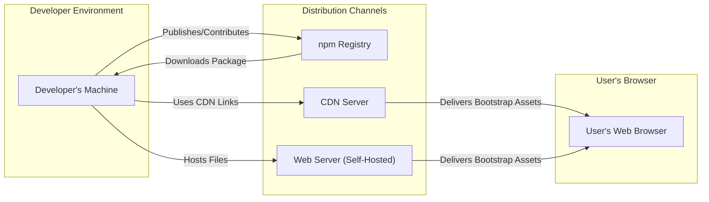

# Project Design Document: Bootstrap Front-End Framework

**Version:** 1.1
**Date:** October 26, 2023
**Author:** AI Software Architect

## 1. Introduction

This document provides a detailed design overview of the Bootstrap front-end framework, as represented by the codebase available at [https://github.com/twbs/bootstrap](https://github.com/twbs/bootstrap). This document aims to provide a comprehensive understanding of the framework's architecture, components, and data flow, which will serve as the foundation for subsequent threat modeling activities. The focus is on the technical aspects relevant to security analysis.

## 2. Goals and Objectives

The primary technical goals of Bootstrap are to:

*   Provide a well-structured and maintainable CSS framework for styling HTML content.
*   Offer a library of reusable JavaScript components to enhance user interface interactivity.
*   Implement a responsive grid system for adaptable layouts across various devices.
*   Deliver a consistent visual style and user experience across different browsers.
*   Facilitate rapid front-end development through pre-built components and utilities.

## 3. System Architecture

Bootstrap is fundamentally a client-side framework, consisting of static assets (CSS and JavaScript files) that are integrated into web projects. It does not inherently possess a server-side component for its core functionality.

### 3.1. High-Level Architecture Diagram

### 3.2. Key Components

Bootstrap comprises the following essential components:

*   **Compiled CSS:**
    *   Pre-built CSS files (`bootstrap.css`, `bootstrap.min.css`) containing styles for all components and utilities.
    *   Includes the responsive grid system, typography settings, and component styling.
    *   Can be customized through Sass variables and custom stylesheets.
*   **Compiled JavaScript:**
    *   Pre-built JavaScript files (`bootstrap.js`, `bootstrap.min.js`) providing interactivity for components like modals, dropdowns, and carousels.
    *   Often relies on Popper.js for dynamic positioning of elements like tooltips and popovers.
    *   Uses event listeners and DOM manipulation to implement component behavior.
*   **Source Sass Files:**
    *   The source code of the CSS framework, written in Sass (`.scss` files).
    *   Organized into logical modules (e.g., `_variables.scss`, `_grid.scss`, `_buttons.scss`).
    *   Allows developers to customize the framework by modifying variables and recompiling the CSS.
*   **Source JavaScript Files:**
    *   The source code of the JavaScript components, typically written in vanilla JavaScript or ES modules.
    *   Organized into modules for individual components.
*   **Documentation Files:**
    *   HTML, CSS, and JavaScript files that constitute the official Bootstrap documentation.
    *   Provides guidance on usage, customization, and API references.
*   **Build System Configuration:**
    *   Files like `package.json`, `webpack.config.js`, or similar, defining the build process, dependencies, and scripts for compiling Sass and bundling JavaScript.

### 3.3. Data Flow

The typical data flow when utilizing Bootstrap involves these stages:

1. **Development Phase:**
    *   Developers integrate Bootstrap into their projects by:
        *   Linking to pre-compiled CSS and JavaScript files hosted on a CDN.
        *   Installing the Bootstrap package via a package manager (npm, yarn) and including it in their build process.
        *   Downloading the source files and compiling them as part of their project's build.
2. **Build/Deployment Phase:**
    *   If using source files, the Sass is compiled into CSS, and JavaScript modules are bundled.
    *   The web application, including the Bootstrap CSS and JavaScript assets, is deployed to a web server or CDN.
3. **User Request Phase:**
    *   A user requests a web page from the server.
4. **Server Response Phase:**
    *   The server sends the HTML document to the user's browser. This HTML document includes links or script tags referencing the Bootstrap CSS and JavaScript files.
5. **Asset Retrieval Phase:**
    *   The user's browser requests the Bootstrap CSS and JavaScript files from the specified location (CDN or the application's server).
6. **Browser Rendering Phase:**
    *   The browser parses the HTML, applies the styles from the Bootstrap CSS, and executes the Bootstrap JavaScript.
    *   Bootstrap's JavaScript components may manipulate the DOM based on user interactions or initial page load.

### 3.4. Deployment Models

Bootstrap offers several deployment options:

*   **Content Delivery Network (CDN) Linking:** Referencing Bootstrap's pre-compiled CSS and JavaScript files hosted on a public CDN (e.g., jsDelivr, cdnjs). This is convenient for quick setup and leverages browser caching.
*   **Self-Hosting from Web Server:** Downloading Bootstrap's compiled or source files and serving them directly from the same web server hosting the application. This provides more control over the assets but requires managing updates.
*   **Package Manager Integration:** Installing Bootstrap as a dependency using npm or yarn. This integrates Bootstrap into the project's build process, allowing for customization and management of dependencies.

## 4. Component Details

This section provides a more granular view of Bootstrap's key components.

### 4.1. CSS Framework Details

*   **Core Styles:** Provides baseline styling for HTML elements (e.g., typography, links, code).
*   **Grid System:** A responsive layout system based on flexbox or CSS Grid, allowing for the creation of flexible and adaptable layouts. Includes classes for defining rows, columns, and breakpoints.
*   **Utilities:** A collection of single-purpose classes for common styling tasks, such as spacing (`m-*`, `p-*`), display (`d-*`), flexbox utilities (`d-flex`, `justify-content-*`), and text manipulation (`text-*`).
*   **Components:** Reusable UI elements like buttons, forms, navigation bars, modals, carousels, and alerts, each with pre-defined styles and structural HTML.
*   **Theming:**  Customization is primarily achieved through Sass variables, allowing developers to modify colors, fonts, spacing, and other design tokens.

### 4.2. JavaScript Components Details

*   **Modals:**  Creates dialog boxes for displaying alerts, confirmations, or other content. Relies on JavaScript for toggling visibility and handling interactions.
*   **Dropdowns:** Implements interactive dropdown menus triggered by button clicks or other events. Uses Popper.js for positioning.
*   **Navbars:**  Creates navigation menus with responsive behavior, often including dropdowns and togglable content.
*   **Carousels:**  Implements slideshow components for cycling through images or content.
*   **Tooltips and Popovers:** Displays informative text on hover or click. Heavily relies on Popper.js for accurate positioning relative to the triggering element.
*   **Scrollspy:**  Automatically updates navigation links based on the user's scroll position within the page.

### 4.3. Documentation Details

*   **Structure:** Organized into sections covering getting started, layout, components, utilities, and customization.
*   **Examples:** Includes live examples demonstrating the usage of various components and features.
*   **API Reference:** Provides detailed information about the available classes, JavaScript methods, and data attributes for each component.
*   **Search Functionality:** Allows users to quickly find information within the documentation.

### 4.4. Build System Details

*   **Package Management (npm/yarn):** Used for managing dependencies (including Popper.js) and running build scripts.
*   **Sass Compilation:** Uses a Sass compiler (e.g., Dart Sass) to transform Sass (`.scss`) files into CSS.
*   **JavaScript Bundling (Webpack/Parcel):**  Bundles JavaScript modules into optimized files for browser delivery, often including minification and tree-shaking.
*   **Linters and Formatters:**  May include configuration for code quality tools like ESLint and Stylelint.
*   **Testing Framework (e.g., Jest):** Includes tests to verify the functionality of JavaScript components.

## 5. Security Considerations

Several security considerations are relevant when using Bootstrap:

*   **Cross-Site Scripting (XSS) via Misuse:** If developers use Bootstrap components to render user-supplied data without proper sanitization, it can lead to XSS vulnerabilities. For example, displaying unsanitized HTML within a modal's content.
*   **Supply Chain Attacks on CDN:** If the CDN hosting Bootstrap is compromised, malicious code could be injected into the delivered files, affecting all websites using that CDN version.
*   **Dependency Vulnerabilities (Popper.js):** Bootstrap's JavaScript components often rely on Popper.js. Vulnerabilities in Popper.js could be exploited through Bootstrap components that utilize it (e.g., tooltips, popovers, dropdowns).
*   **Subresource Integrity (SRI) Bypass:** If SRI hashes are not used or are incorrectly implemented when including Bootstrap from a CDN, it weakens the protection against compromised CDN assets.
*   **Content Security Policy (CSP) Configuration:**  Using Bootstrap's inline styles or JavaScript without a properly configured CSP can introduce security risks. Developers need to ensure their CSP allows the necessary Bootstrap functionality.
*   **Accessibility Issues as Security Concerns:** While primarily a usability issue, lack of accessibility can sometimes be exploited or used in social engineering attacks. Ensuring proper semantic HTML and ARIA attributes within Bootstrap components is important.
*   **CSS Injection Attacks:** While less common, vulnerabilities in a browser's CSS parsing or the way Bootstrap's CSS is structured could potentially be exploited for malicious purposes.
*   **Version Management:** Using outdated versions of Bootstrap can expose applications to known vulnerabilities that have been patched in newer releases.

## 6. Potential Threats

Based on the architecture and security considerations, potential threats to be explored during threat modeling include:

*   **Compromised CDN Serving Malicious Bootstrap Assets:** Attackers could replace legitimate Bootstrap files on a CDN with malicious versions to inject scripts or modify the appearance of target websites.
*   **XSS Vulnerabilities in Applications Using Bootstrap Components:** Developers might incorrectly use Bootstrap components, allowing attackers to inject malicious scripts through user input.
*   **Exploitation of Popper.js Vulnerabilities via Bootstrap Components:** Attackers could leverage vulnerabilities in Popper.js to execute malicious code or perform actions within the context of the user's browser through Bootstrap's tooltip or popover functionality.
*   **Man-in-the-Middle Attacks on CDN Delivery:** Attackers intercepting the delivery of Bootstrap assets from a CDN could inject malicious code if HTTPS is not enforced or if certificate validation is bypassed.
*   **CSS-Based Attacks:**  While less likely, potential vulnerabilities in browser CSS parsing or specific Bootstrap CSS rules could be exploited for UI redressing or information disclosure.
*   **Denial of Service (DoS) through Resource Exhaustion:**  While not a direct vulnerability in Bootstrap, excessively large or inefficient custom CSS built on top of Bootstrap could potentially lead to client-side DoS.
*   **Social Engineering Attacks Leveraging UI Consistency:** Attackers might create fake login pages or other malicious content that closely resembles legitimate interfaces built with Bootstrap, tricking users into providing sensitive information.

## 7. Conclusion

This document provides an enhanced and detailed design overview of the Bootstrap front-end framework, emphasizing aspects relevant to security analysis and threat modeling. It outlines the architecture, key components, data flow, and specific security considerations. This information serves as a solid foundation for identifying and mitigating potential security risks associated with the integration and usage of Bootstrap in web applications.
