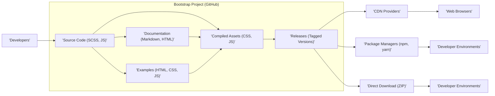
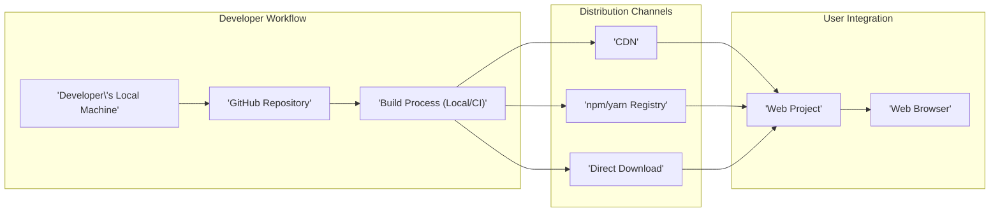

# Project Design Document: Bootstrap

**Version:** 1.1
**Date:** October 26, 2023
**Author:** AI Software Architect

## 1. Introduction

This document provides an enhanced design overview of the Bootstrap project, as hosted on GitHub at [https://github.com/twbs/bootstrap](https://github.com/twbs/bootstrap). Building upon the initial design, this version offers further clarity and detail, specifically tailored for threat modeling activities. It outlines the key components, architecture, data flow, and dependencies of the project with a stronger emphasis on potential security implications.

## 2. Goals and Non-Goals

**Goals:**

* Provide a comprehensive and detailed architectural overview of the Bootstrap project, suitable for security analysis.
* Clearly identify key components and their specific functionalities, highlighting potential attack surfaces.
* Precisely describe the data flow within the project and its distribution channels, emphasizing points of interaction and potential manipulation.
* Outline the various deployment models and typical usage scenarios, considering the security implications of each.
* Explicitly highlight potential areas of security concern from an architectural perspective, serving as a starting point for threat identification.

**Non-Goals:**

* Provide a granular, line-by-line code-level security audit of the Bootstrap codebase.
* Analyze the security posture of specific websites that implement and utilize the Bootstrap library.
* Detail the infrastructure and security measures of the Bootstrap documentation website itself.
* Provide an exhaustive breakdown of the Bootstrap build process internals beyond a high-level understanding relevant to supply chain security.
* Present a formal risk assessment or a prioritized list of vulnerabilities.

## 3. Target Audience

This document is primarily intended for:

* Security engineers tasked with performing threat modeling and security assessments of the Bootstrap project and its ecosystem.
* Software architects seeking a deeper understanding of Bootstrap's structure, components, and potential security vulnerabilities.
* Developers contributing to the Bootstrap library who need to be aware of security considerations in their code.

## 4. Architectural Overview

Bootstrap is a foundational front-end framework focused on enabling responsive and mobile-first web development. It offers a collection of CSS and JavaScript-based design templates for common UI elements and layouts.

**Key Architectural Components:**

* **Source Code (SCSS, JS):** The fundamental building blocks of Bootstrap, written in SCSS for styling and JavaScript for interactive components. This includes core styles, utility classes, and component logic.
* **Documentation (Markdown, HTML):**  Comprehensive guides and references explaining the usage of Bootstrap's features and components. Built from Markdown and rendered into HTML, it serves as the primary resource for developers.
* **Examples (HTML, CSS, JS):** Practical demonstrations showcasing the implementation of Bootstrap components and layouts in various scenarios. These act as templates and learning resources.
* **Compiled Assets (CSS, JS):** The production-ready, distributable versions of Bootstrap, generated through the build process. This includes minified and non-minified CSS and JavaScript files.
* **Releases (Tagged Versions):**  Specific, immutable snapshots of the compiled assets, documentation, and examples, marked with Git tags to denote stable versions.

**Data Flow:**

1. **Development and Contribution:** Developers create and modify code (SCSS, JS, Markdown) locally and contribute these changes to the central GitHub repository through pull requests.
2. **Compilation and Build:** The source SCSS and JavaScript files undergo a build process (typically using Node.js, npm/yarn, and build scripts) to produce the compiled CSS and JavaScript assets.
3. **Documentation Generation:** Markdown files are processed using static site generators to create the HTML documentation.
4. **Release Packaging:** Compiled assets, documentation, and example files are packaged and associated with specific release versions, tagged within the Git repository.
5. **Distribution through Channels:** Released versions are disseminated through various channels:
    * **CDN Providers:**  Compiled CSS and JavaScript files are hosted on CDNs for widespread and efficient delivery to web browsers.
    * **Package Managers:** Bootstrap is published as a package on npm and yarn registries, enabling developers to integrate it into their projects as a dependency.
    * **Direct Download:** Users can download ZIP archives containing the compiled assets, documentation, and examples directly from the GitHub releases page or other sources.
6. **Integration and Usage:** Web developers incorporate Bootstrap into their web projects by linking to CDN-hosted files, installing via package managers, or including downloaded files.
7. **Rendering in Browsers:** When a user accesses a web page, their browser downloads the HTML, CSS (including Bootstrap's styles), and JavaScript (including Bootstrap's scripts) to render the user interface.

## 5. Component Breakdown

This section provides a more detailed breakdown of the key components, highlighting potential security considerations for each:

* **CSS Framework:**
    * **Purpose:** Provides pre-defined styles, a responsive grid system, utility classes, and theming capabilities to standardize the visual presentation of web applications.
    * **Implementation:** Primarily written in SCSS, compiled to standard CSS. Relies on a clear class-naming convention.
    * **Key Features:** Responsive grid, typography styles, component styling (buttons, forms, navigation bars, etc.), utility classes (spacing, display, flex, etc.).
    * **Security Considerations:** While primarily declarative, malicious or unintended CSS can lead to visual misrepresentation or denial-of-service through resource exhaustion if overly complex. Theming vulnerabilities could expose unexpected visual elements.
* **JavaScript Components:**
    * **Purpose:** Adds dynamic and interactive behavior to certain Bootstrap components (e.g., modals, dropdowns, carousels, tooltips).
    * **Implementation:** Written in plain JavaScript (ES modules). Often manipulates the Document Object Model (DOM).
    * **Key Features:** Event handling, DOM manipulation, component initialization and control, dependency on Popper.js for positioning.
    * **Security Considerations:**  JavaScript components are a significant attack surface. Vulnerabilities here could lead to Cross-Site Scripting (XSS) attacks, where malicious scripts are injected and executed in a user's browser. Improper handling of user input or insecure DOM manipulation are key risks.
* **Documentation:**
    * **Purpose:** Provides instructions, examples, and API references for using Bootstrap.
    * **Implementation:** Written in Markdown and rendered into static HTML files. May include embedded code snippets and interactive demos.
    * **Key Features:** Search functionality, version switching, component demos, API documentation.
    * **Security Considerations:**  While static, the documentation site itself could be a target for defacement. Insecurely embedded iframes or scripts in documentation examples could pose a risk to users viewing the documentation.
* **Examples:**
    * **Purpose:** Demonstrates practical applications of Bootstrap components and layouts.
    * **Implementation:** HTML, CSS, and JavaScript files showcasing different use cases.
    * **Key Features:** Variety of layout examples, component combinations, starting points for developers.
    * **Security Considerations:**  Examples should be carefully reviewed to avoid showcasing insecure coding practices or inadvertently including vulnerabilities that developers might copy.

## 6. Data Flow Diagram (Detailed)

**Detailed Data Flow Explanation:**

1. **Developer Contribution (DA -> DB):** Developers work on their local machines, writing and modifying source code (SCSS, JS, Markdown). These changes are then committed and pushed to the central GitHub repository, often through pull requests and code review processes.
2. **Build and Compilation (DB -> DC):**  Upon code changes being merged into the main branch (or on a scheduled basis), an automated build process is triggered. This process, often running on a Continuous Integration (CI) server, compiles the SCSS into CSS, bundles the JavaScript modules, and generates the documentation from Markdown files.
3. **Distribution to Channels (DC -> DD, DE, DF):** The compiled and generated artifacts are then distributed through various channels to reach end-users and developers:
    * **CDN (DC -> DD):** Compiled CSS and JavaScript files are uploaded to Content Delivery Networks. CDNs provide geographically distributed servers, ensuring fast and reliable delivery of Bootstrap assets to users worldwide.
    * **Package Managers (DC -> DE):** The Bootstrap package, containing the compiled assets, is published to public package registries like npm and yarn. This allows developers to easily integrate Bootstrap into their projects using dependency management tools.
    * **Direct Download (DC -> DF):**  ZIP archives containing the compiled CSS, JavaScript, documentation, and example files are made available for direct download from the GitHub releases page or potentially other mirrors.
4. **User Integration (DD/DE/DF -> DG):** Web developers integrate Bootstrap into their web projects using one of the distribution methods:
    * **CDN Linking (DD -> DG):** Developers include `<link>` and `<script>` tags in their HTML files, pointing to the Bootstrap CSS and JavaScript files hosted on a CDN.
    * **Package Manager Installation (DE -> DG):** Developers use npm or yarn to install Bootstrap as a project dependency. Their build process then typically copies or bundles the necessary Bootstrap files into their project's distribution.
    * **Manual Inclusion (DF -> DG):** Developers download the ZIP archive and manually copy the required CSS and JavaScript files into their project's directory structure.
5. **Rendering in Web Browsers (DG -> DH):** When a user accesses the web project in their browser, the browser requests and downloads the necessary HTML, CSS (including Bootstrap's styles), and JavaScript (including Bootstrap's scripts). The browser then parses and renders the HTML, applying Bootstrap's styles and executing its JavaScript to create the interactive user interface.

## 7. Security Considerations (Architectural Level)

This section expands on the potential security considerations, providing more specific examples and potential impact:

* **Supply Chain Attacks:**
    * **Dependency Vulnerabilities:** Bootstrap relies on external libraries like Popper.js. Vulnerabilities in these dependencies could be exploited by attackers if not promptly patched. This highlights the importance of dependency scanning and management.
    * **Compromised Build Process:** If the build pipeline is compromised (e.g., through compromised CI/CD credentials or malicious dependencies), attackers could inject malicious code into the compiled CSS or JavaScript files, affecting all users who download or use those versions.
    * **CDN Compromise:** If a CDN serving Bootstrap files is compromised, attackers could replace legitimate files with malicious ones, leading to widespread attacks on websites using that CDN. Using Subresource Integrity (SRI) hashes can mitigate this risk.
    * **Package Registry Compromise:** If the npm or yarn registry is compromised, attackers could publish a malicious package with the same or a similar name to Bootstrap, tricking developers into installing it.
* **Cross-Site Scripting (XSS):**
    * **JavaScript Component Vulnerabilities:**  Bugs in Bootstrap's JavaScript components that handle user input or manipulate the DOM could be exploited to inject and execute arbitrary JavaScript code in a user's browser. For example, an improperly sanitized attribute value could lead to XSS.
    * **Documentation and Example Vulnerabilities:**  While less direct, vulnerabilities in the documentation website or within example code could be leveraged to attack users viewing the documentation or developers copying insecure code patterns.
* **Content Security Policy (CSP) Compatibility:**
    * **Inline Styles and Scripts:**  If Bootstrap relies heavily on inline styles or `unsafe-eval` in its JavaScript (though it generally strives to avoid this), it can make it harder for website developers to implement strict CSP, potentially weakening their overall security posture.
* **Denial of Service (DoS):**
    * **Complex CSS Selectors:** While less likely, extremely complex CSS selectors could, in theory, consume excessive browser resources, potentially leading to performance issues or even a denial of service for users with less powerful devices.
* **Information Disclosure:**
    * **Accidental Inclusion of Sensitive Data:**  Although unlikely in the core framework, carelessly created examples or outdated documentation might inadvertently expose sensitive information or insecure configurations.
* **Subresource Integrity (SRI) Misuse or Absence:**
    * **Lack of SRI:** If developers don't use SRI hashes when including Bootstrap files from CDNs, they are vulnerable to CDN compromise attacks.
    * **Incorrect SRI:** Using incorrect or outdated SRI hashes renders the protection ineffective.

## 8. Deployment Model

Bootstrap's deployment focuses on making its compiled assets accessible to web browsers. Key deployment models include:

* **CDN (Content Delivery Network):**  This is a common approach where developers link to Bootstrap's CSS and JavaScript files hosted on public CDNs like cdnjs, jsDelivr, or Cloudflare. This offers benefits like caching and reduced server load. Security considerations include the potential for CDN compromise, which SRI helps mitigate.
* **Package Managers (npm, yarn):** Developers install Bootstrap as a dependency using package managers. This integrates Bootstrap into the project's build process, allowing for better version control and potentially local hosting of assets. Security considerations include the risk of supply chain attacks through compromised packages.
* **Direct Download and Local Hosting:** Developers download the compiled files and host them directly on their web servers. This provides maximum control but requires managing updates and ensuring proper security measures on the hosting server.

## 9. Dependencies

Bootstrap relies on several key dependencies:

* **Popper.js:**  A crucial dependency for the proper positioning of tooltips, popovers, and dropdown menus. Security vulnerabilities in Popper.js directly impact Bootstrap's security.
* **Development Dependencies:** The build process utilizes various development dependencies managed by npm or yarn, including:
    * **Sass:** For compiling SCSS to CSS. Compromises here could lead to malicious CSS.
    * **Autoprefixer:** For adding vendor prefixes to CSS.
    * **Webpack:** A module bundler for JavaScript.
    * **Node.js and npm/yarn:** The runtime environment and package managers for the build process. Security of these tools is critical.

## 10. Future Considerations

* **Proactive Security Audits:** Regular, independent security audits of the Bootstrap codebase and its dependencies are essential for identifying and addressing potential vulnerabilities before they can be exploited.
* **Robust Dependency Management:** Implementing strong dependency management practices, including regular updates, vulnerability scanning, and potentially using tools like Dependabot, is crucial.
* **Secure Coding Practices in Documentation and Examples:**  Ensuring that all documentation and example code adheres to secure coding principles and avoids showcasing vulnerable patterns.
* **Enhanced CSP Guidance:** Providing comprehensive guidance and best practices for using Bootstrap in a way that is fully compatible with strict Content Security Policies.
* **Promotion of SRI:**  Actively encouraging and educating developers on the importance of using Subresource Integrity hashes when including Bootstrap files from CDNs.
* **Security-Focused Build Process:**  Continuously reviewing and hardening the build process to prevent supply chain attacks.

This enhanced design document provides a more detailed and security-focused overview of the Bootstrap project's architecture. It aims to serve as a valuable resource for threat modeling and security analysis, highlighting potential attack surfaces and areas of concern.