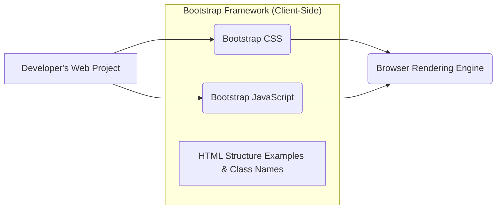
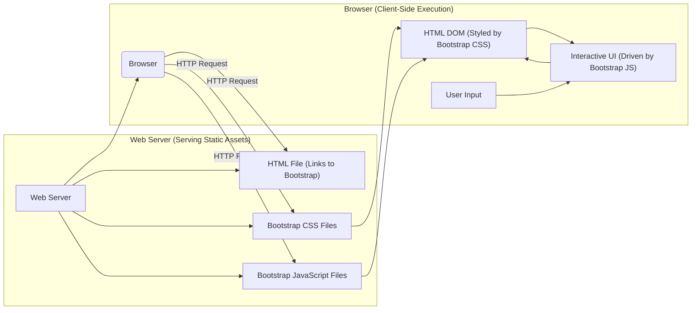
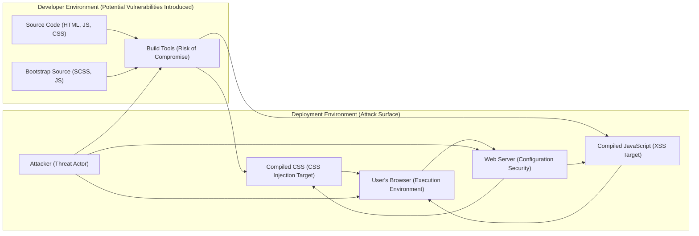
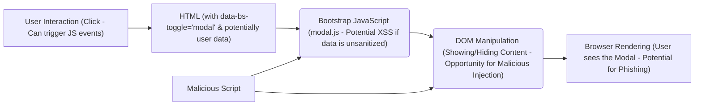

# Project Design Document: Bootstrap Front-End Framework (Improved for Threat Modeling)

**Project Name:** Bootstrap

**Project Repository:** https://github.com/twbs/bootstrap

**Version:**  (Based on the latest release at the time of writing - please refer to the GitHub repository for the most up-to-date version)

**Date:** October 26, 2023

**Author:** Gemini (AI Language Model)

## 1. Introduction

This document provides an enhanced design overview of the Bootstrap front-end framework, specifically tailored for threat modeling activities. It details the architecture, key components, and data flows, highlighting potential areas of security concern. This document aims to equip security analysts with the necessary information to identify and assess potential vulnerabilities associated with the integration and use of Bootstrap in web applications.

## 2. Goals and Objectives (Security Perspective)

From a security standpoint, understanding Bootstrap's goals and objectives helps identify potential misuse or unintended consequences:

*   **Rapid Web Development:** While beneficial, this can sometimes lead to developers overlooking security best practices when quickly integrating components.
*   **Consistent User Interface:**  A standardized UI can be a target for attackers looking for common vulnerabilities across multiple applications using Bootstrap.
*   **Cross-Browser Compatibility:**  Addressing compatibility can sometimes introduce complex code that might have unforeseen security implications.
*   **Extensibility and Customization:**  Customization points can be potential injection vectors if not handled carefully.

## 3. Architectural Overview (Threat Focus)

Bootstrap operates primarily on the client-side, making the user's browser the main execution environment. This means potential threats often involve manipulating the client-side environment or exploiting vulnerabilities in how Bootstrap interacts with the browser and other client-side code.

Key architectural aspects relevant to security:

*   **CSS Styling:**  While primarily for presentation, malicious CSS could potentially be injected to alter the appearance and potentially trick users (e.g., phishing).
*   **JavaScript Functionality:**  JavaScript components handle user interactions and DOM manipulation, making them a prime target for XSS attacks if not used correctly.
*   **Reliance on HTML Structure:** Bootstrap's functionality is heavily dependent on specific HTML class names and attributes. Incorrect or malicious HTML can break functionality or introduce vulnerabilities.

## 4. Component Breakdown (Security Implications)

Understanding the components helps pinpoint potential attack surfaces:

*   **CSS Files (`bootstrap.css`, `bootstrap.min.css`):**
    *   **Threat:** CSS injection vulnerabilities in the developer's application could be used to override Bootstrap styles for malicious purposes (e.g., hiding elements, displaying fake content).
    *   **Threat:**  While less direct, excessively large CSS files could contribute to denial-of-service by increasing page load times.
*   **JavaScript Files (`bootstrap.js`, `bootstrap.min.js`, individual `js/` modules):**
    *   **Threat:**  XSS vulnerabilities could arise if developers pass unsanitized user input to Bootstrap's JavaScript components or if vulnerabilities exist within Bootstrap's JavaScript code itself (though less likely in stable releases).
    *   **Threat:**  Manipulation of JavaScript logic could lead to unintended behavior or bypass security checks in the developer's application.
*   **HTML Structure and Examples (Documentation):**
    *   **Threat:**  While not directly a vulnerability in Bootstrap, insecure coding practices demonstrated in examples could be copied by developers, leading to vulnerabilities in their applications.
*   **Dependencies (e.g., Popper.js):**
    *   **Threat:** Vulnerabilities in dependencies can indirectly affect applications using Bootstrap. It's crucial to keep dependencies updated.
    *   **Threat:**  Supply chain attacks targeting dependencies could introduce malicious code.

## 5. Data Flow (Security Perspective)

The client-side nature of Bootstrap means data flow primarily involves the browser retrieving static assets and JavaScript manipulating the DOM. Security concerns arise from how user data interacts with these components.

Key security considerations in the data flow:

*   **Static Asset Delivery:** Ensure secure delivery of Bootstrap files (HTTPS) to prevent tampering. Use Subresource Integrity (SRI) hashes.
*   **DOM Manipulation:**  Be cautious about how Bootstrap's JavaScript manipulates the DOM, especially when dealing with user-provided data. Ensure proper sanitization to prevent XSS.
*   **User Input Handling:**  Validate and sanitize all user input before it interacts with Bootstrap components to prevent injection attacks.

## 6. Integration Points (Security Implications)

Different integration methods introduce varying security considerations:

*   **Direct Inclusion ( `<link>` and `<script>` tags):**
    *   **Risk:**  Typos in the URLs can lead to loading incorrect or malicious files.
    *   **Risk:**  Reliance on the availability and security of the hosting server for the Bootstrap files.
*   **Package Managers (npm, Yarn):**
    *   **Risk:**  Supply chain attacks targeting the Bootstrap package or its dependencies. Verify package integrity and use reputable sources.
    *   **Risk:**  Vulnerabilities in the package manager itself could be exploited.
*   **Content Delivery Networks (CDNs):**
    *   **Benefit:**  Potential performance improvements and caching.
    *   **Risk:**  Reliance on the CDN provider's security. If the CDN is compromised, applications using it are also at risk. Use SRI hashes to mitigate this.
*   **Sass Customization (Build Process):**
    *   **Risk:**  Vulnerabilities in the build tools or dependencies used in the customization process could introduce malicious code.
    *   **Risk:**  Incorrectly configured build processes might expose sensitive information.

## 7. Deployment Model (Security Considerations)

How Bootstrap is deployed impacts the attack surface:

*   **Serving Static Files from a Web Server:**
    *   **Consideration:** Ensure proper file permissions and access controls on the server hosting the Bootstrap files.
    *   **Consideration:**  Configure the web server to serve static files with appropriate security headers (e.g., `Content-Security-Policy`, `Strict-Transport-Security`).
*   **Using a CDN:**
    *   **Consideration:**  While convenient, you rely on the CDN's security. Use SRI hashes as a safeguard.
*   **Bundling with Application Assets:**
    *   **Consideration:**  Increases the application's bundle size but provides more control over the included files. Ensure the bundling process itself is secure.

## 8. Security Considerations (Detailed)

This section expands on potential threats, providing more specific examples:

*   **Cross-Site Scripting (XSS):**
    *   **Example:** An attacker could inject malicious JavaScript code into a form field that is then displayed using a Bootstrap modal without proper sanitization, leading to code execution in other users' browsers.
    *   **Example:**  Manipulating HTML attributes that Bootstrap's JavaScript relies on to trigger unintended actions or execute malicious scripts.
*   **Supply Chain Attacks:**
    *   **Example:** A compromised dependency of Bootstrap (e.g., a vulnerable version of Popper.js) could introduce vulnerabilities into applications using Bootstrap.
    *   **Example:**  A malicious actor could potentially compromise the Bootstrap package on a package manager and inject malicious code.
*   **Content Security Policy (CSP) Bypasses:**
    *   **Example:**  If CSP is not configured correctly, attackers might find ways to inject malicious scripts that leverage Bootstrap's functionality or existing scripts.
*   **Subresource Integrity (SRI) Failures:**
    *   **Example:** If SRI hashes are not used or are incorrect, a compromised CDN could serve malicious Bootstrap files without the browser detecting the change.
*   **Denial of Service (DoS):**
    *   **Example:**  While less direct, a large number of complex Bootstrap components on a single page could potentially impact performance and contribute to client-side DoS.
*   **Accessibility Issues as Vulnerabilities:**
    *   **Example:**  Improper use of ARIA attributes or semantic HTML with Bootstrap components could make the application unusable for users with disabilities, which can be considered a security vulnerability in terms of access control and inclusivity.
*   **Third-Party Integration Vulnerabilities:**
    *   **Example:** Conflicts or vulnerabilities arising from the interaction between Bootstrap's JavaScript and other third-party JavaScript libraries.
*   **CSS Injection Attacks:**
    *   **Example:**  Injecting malicious CSS to overlay fake login forms or hide legitimate content, tricking users into providing sensitive information.

## 9. Diagrams

### 9.1. High-Level Architecture (Security Focused)

### 9.2. Bootstrap Component Interaction (Modal - Security Perspective)

## 10. Recommendations for Secure Usage

*   **Keep Bootstrap Updated:** Regularly update to the latest version to benefit from security patches.
*   **Use SRI Hashes:** Implement Subresource Integrity for CDN-hosted Bootstrap files.
*   **Sanitize User Input:**  Thoroughly sanitize all user-provided data before it interacts with Bootstrap components or is rendered in the DOM.
*   **Implement Content Security Policy (CSP):** Configure a strict CSP to mitigate XSS attacks.
*   **Regular Security Audits:** Conduct regular security assessments and penetration testing of applications using Bootstrap.
*   **Secure Build Processes:** Ensure the security of your build pipeline and dependencies.
*   **Educate Developers:** Train developers on secure coding practices when using front-end frameworks like Bootstrap.
*   **Careful with Customizations:**  Thoroughly review and test any custom JavaScript or CSS that interacts with Bootstrap.

This improved design document provides a more security-focused perspective on the Bootstrap framework, aiding in the identification and mitigation of potential threats.