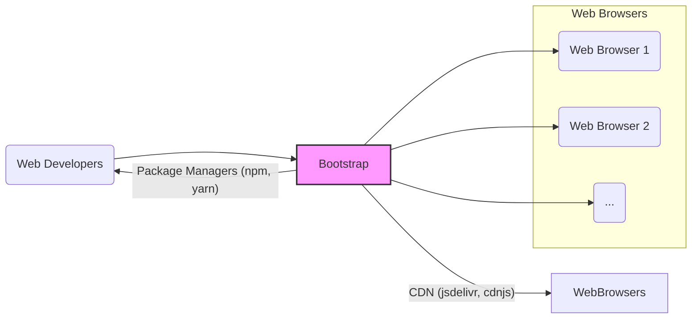
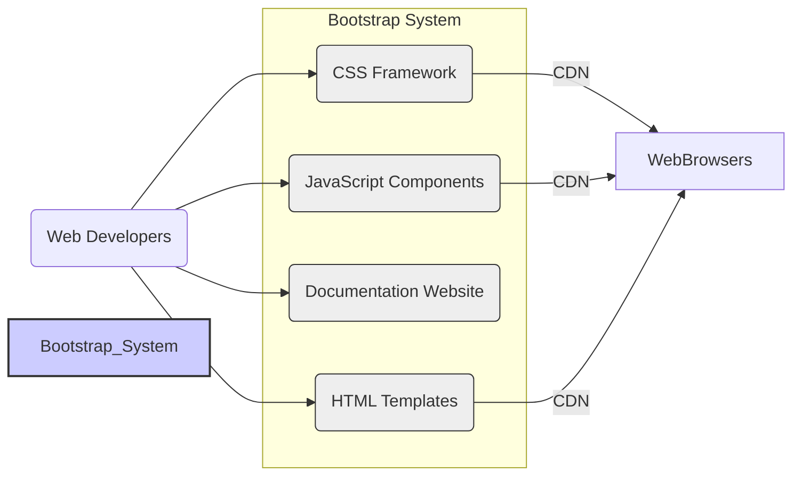
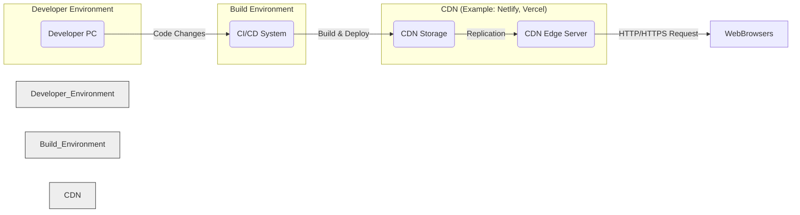
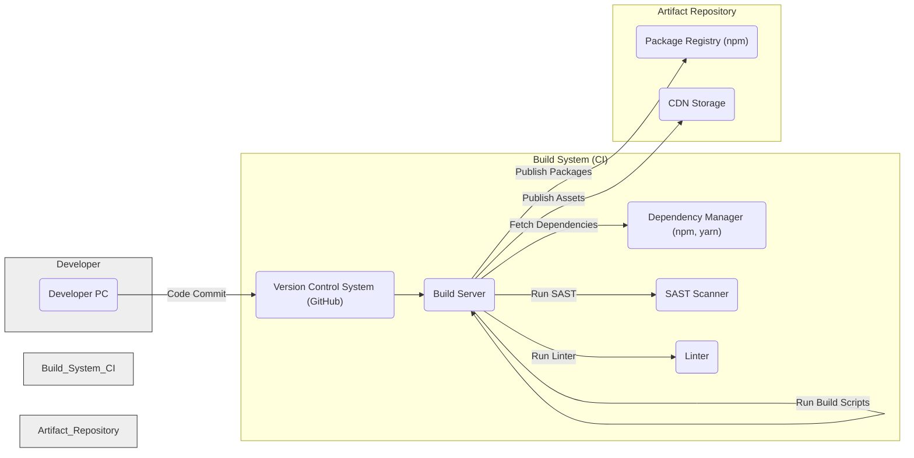

# BUSINESS POSTURE

The Bootstrap project aims to provide a free and open-source CSS framework directed at responsive, mobile-first front-end web development. It offers a collection of HTML, CSS, and JavaScript components and tools that enable developers to rapidly prototype and build web applications and websites with consistent design and layout across different browsers and devices.

Business Priorities and Goals:
- Provide a widely adopted, user-friendly, and well-documented front-end framework.
- Enable rapid web development and prototyping.
- Ensure cross-browser compatibility and responsiveness.
- Foster a strong community around the framework for continuous improvement and support.
- Maintain the framework as open-source and freely accessible.

Business Risks:
- Security vulnerabilities within the framework could impact a vast number of websites and applications using Bootstrap.
- Lack of timely security updates and patches could lead to widespread exploitation of vulnerabilities.
- Changes in web standards or browser technologies could render parts of the framework obsolete or insecure.
- Dependency on community contributions for security fixes might lead to delays or inconsistencies.

# SECURITY POSTURE

Existing Security Controls:
- security control: Open-source development model allowing for community review of code. Implemented through GitHub repository and public contributions.
- security control: Reliance on community reporting for identifying potential vulnerabilities. Implemented through GitHub issue tracker and community forums.
- accepted risk:  Potential for vulnerabilities to exist in the codebase due to the complexity and scale of the framework.
- accepted risk:  Reliance on community for security contributions may lead to slower response times compared to dedicated security teams.

Recommended Security Controls:
- security control: Implement automated security scanning tools (SAST, DAST, dependency scanning) in the CI/CD pipeline to proactively identify vulnerabilities.
- security control: Establish a formal vulnerability disclosure and response process with defined SLAs for addressing security issues.
- security control: Conduct periodic security audits by external security experts to review the codebase and identify potential weaknesses.
- security control: Provide security guidelines and best practices for developers using Bootstrap to mitigate common security pitfalls in web application development.

Security Requirements:
- Authentication: Not directly applicable to Bootstrap framework itself, as it's a front-end library. Authentication is the responsibility of applications built using Bootstrap.
- Authorization: Not directly applicable to Bootstrap framework itself. Authorization is the responsibility of applications built using Bootstrap.
- Input Validation: Bootstrap components rely on developers to implement proper input validation in their applications. Bootstrap itself provides tools for form validation, but it's not enforced automatically. Developers must be educated on the importance of validating user inputs on both client and server-side when using Bootstrap forms and components.
- Cryptography: Bootstrap does not directly implement cryptographic functions. If applications built with Bootstrap require cryptography, developers must use secure and well-vetted cryptographic libraries and implement them correctly within their application logic. Bootstrap's role is limited to providing the UI elements and layout for applications that might incorporate cryptography.

# DESIGN

## C4 CONTEXT

Context Diagram Elements:

- Element:
  - Name: Web Developers
  - Type: Person
  - Description: Individuals who use Bootstrap to build websites and web applications.
  - Responsibilities:  Download, integrate, and customize Bootstrap framework into their projects. Report issues and contribute to the project.
  - Security controls:  Responsible for securely integrating Bootstrap into their applications and following security best practices in their own code.

- Element:
  - Name: Bootstrap
  - Type: Software System
  - Description: The Bootstrap front-end framework, consisting of CSS, JavaScript, and HTML templates.
  - Responsibilities: Provide reusable UI components and layout structures for web development. Ensure cross-browser compatibility and responsiveness. Maintain code quality and address reported issues.
  - Security controls:  Code reviews, community contributions, potential future implementation of automated security scanning, vulnerability response process.

- Element:
  - Name: Web Browsers
  - Type: Software System
  - Description:  Various web browsers (Chrome, Firefox, Safari, Edge, etc.) used by end-users to access websites and applications built with Bootstrap.
  - Responsibilities: Render web pages and execute JavaScript code. Enforce browser security policies.
  - Security controls: Browser security features (CSP, XSS protection, etc.), sandboxing, regular updates.

- Element:
  - Name: Package Managers (npm, yarn)
  - Type: Software System
  - Description: Tools used by developers to manage project dependencies, including downloading and updating Bootstrap packages.
  - Responsibilities: Provide a platform for distributing and managing JavaScript packages, including Bootstrap. Ensure package integrity and availability.
  - Security controls: Package signing, vulnerability scanning of packages, repository security.

- Element:
  - Name: CDN (jsdelivr, cdnjs)
  - Type: Software System
  - Description: Content Delivery Networks that host and distribute Bootstrap files to end-users' browsers.
  - Responsibilities:  Provide fast and reliable delivery of Bootstrap assets globally. Ensure content integrity and availability.
  - Security controls: HTTPS delivery, CDN security measures, content integrity checks.

## C4 CONTAINER

Container Diagram Elements:

- Element:
  - Name: CSS Framework
  - Type: Container
  - Description:  The core CSS files of Bootstrap, providing styling and layout capabilities.
  - Responsibilities: Define the visual appearance and responsive behavior of Bootstrap components and grids.
  - Security controls:  CSS code review, potential future automated CSS linting and security checks.

- Element:
  - Name: JavaScript Components
  - Type: Container
  - Description: JavaScript files providing interactive components and functionalities like modals, dropdowns, carousels, etc.
  - Responsibilities:  Implement dynamic behavior and interactivity for Bootstrap components.
  - Security controls: JavaScript code review, potential future automated JavaScript security scanning, secure coding practices.

- Element:
  - Name: Documentation Website
  - Type: Container
  - Description:  Website providing documentation, examples, and guides for using Bootstrap.
  - Responsibilities:  Educate developers on how to use Bootstrap effectively and securely. Provide up-to-date information and best practices.
  - Security controls:  Web application security best practices for the documentation website itself (e.g., input validation, output encoding, secure authentication for admin functions if any).

- Element:
  - Name: HTML Templates
  - Type: Container
  - Description:  Pre-built HTML templates and examples showcasing Bootstrap components and layouts.
  - Responsibilities:  Provide starting points and examples for developers to quickly build web pages using Bootstrap.
  - Security controls:  Review of HTML templates to avoid introducing client-side vulnerabilities (e.g., XSS).

## DEPLOYMENT

Bootstrap itself is not deployed as a standalone application. It is a library that is included within web applications. Therefore, the deployment context is the deployment of web applications that *use* Bootstrap.

Deployment Architecture (Example - Static Website hosted on CDN):

Deployment Diagram Elements (for a static website using Bootstrap hosted on CDN):

- Element:
  - Name: Developer PC
  - Type: Infrastructure
  - Description:  Developer's local machine where they write code and develop web applications using Bootstrap.
  - Responsibilities:  Code development, local testing, version control.
  - Security controls:  Developer workstation security practices (OS hardening, antivirus, etc.).

- Element:
  - Name: CI/CD System
  - Type: Infrastructure
  - Description:  Continuous Integration and Continuous Deployment system (e.g., GitHub Actions, Jenkins) that automates the build and deployment process.
  - Responsibilities:  Automated building, testing, and deployment of web applications.
  - Security controls:  Secure CI/CD pipeline configuration, access control, secrets management, build environment security.

- Element:
  - Name: CDN Storage
  - Type: Infrastructure
  - Description:  Storage backend of the CDN where website files (including Bootstrap assets if served via CDN by the application) are stored.
  - Responsibilities:  Store website files and make them available for CDN edge servers.
  - Security controls:  Access control, data encryption at rest, integrity checks.

- Element:
  - Name: CDN Edge Server
  - Type: Infrastructure
  - Description:  Edge servers of the CDN distributed geographically to serve content to end-users with low latency.
  - Responsibilities:  Cache and serve website content to end-users. Handle HTTP/HTTPS requests.
  - Security controls:  CDN security features (DDoS protection, WAF), HTTPS termination, secure caching policies.

- Element:
  - Name: Web Browsers
  - Type: Infrastructure
  - Description: End-users' web browsers accessing the deployed website.
  - Responsibilities: Render the website and execute client-side code.
  - Security controls: Browser security features.

## BUILD

Build Process Description:

1. Developer writes code on their local Developer PC.
2. Developer commits code changes to the Version Control System (VCS) like GitHub.
3. Build Server (part of CI system) detects code changes in VCS.
4. Build Server fetches project dependencies using Dependency Manager (npm, yarn).
5. Build Server executes build scripts to compile CSS (Sass), bundle JavaScript, generate documentation, etc.
6. Build Server runs SAST (Static Application Security Testing) scanner to identify potential security vulnerabilities in the code.
7. Build Server runs Linter to enforce code quality and style guidelines.
8. Build Server publishes build artifacts:
    - Packages (JavaScript modules, CSS files) are published to a Package Registry (like npm).
    - Static assets (CSS, JS, fonts, etc.) are published to CDN Storage for CDN distribution.

Build Process Security Controls:

- security control: Version Control System (VCS) for tracking code changes and collaboration. Implemented using GitHub.
- security control: Secure Build Server environment. Implemented within CI infrastructure.
- security control: Dependency Management to control and track external libraries. Implemented using npm/yarn and `package-lock.json`/`yarn.lock`.
- security control: Potential future implementation of SAST scanner to automatically detect code vulnerabilities during build.
- security control: Linter to enforce code quality and potentially catch some basic security issues. Implemented using linters configured in the build process.
- security control: Package signing when publishing to package registries (if applicable and implemented).
- security control: Access control to build system and artifact repositories to prevent unauthorized modifications.

# RISK ASSESSMENT

Critical Business Processes:
- Maintaining the integrity and availability of the Bootstrap framework.
- Ensuring the framework is free from vulnerabilities that could be exploited in applications using it.
- Providing a reliable and trustworthy source of front-end components for web developers.

Data to Protect:
- Source code of the Bootstrap framework. Sensitivity: Publicly available, but integrity is critical.
- Build artifacts (CSS, JavaScript files, documentation). Sensitivity: Publicly available, but integrity and availability are critical.
- Documentation content. Sensitivity: Publicly available, but integrity and availability are critical.

Data Sensitivity:
- Publicly available data, but integrity is paramount to maintain trust and prevent supply chain attacks. Compromised source code or build artifacts could lead to widespread vulnerabilities in applications using Bootstrap.

# QUESTIONS & ASSUMPTIONS

Questions:
- What is the current process for handling reported security vulnerabilities in Bootstrap?
- Are there any automated security scanning tools currently used in the Bootstrap development or build process?
- Is there a formal security audit plan for the Bootstrap project?
- What security training is provided to contributors and maintainers of the Bootstrap project?

Assumptions:
- The Bootstrap project values the security and integrity of the framework.
- The project relies heavily on community contributions for code development and issue reporting, including security-related issues.
- The project aims to provide a stable and reliable framework for web developers.
- The project intends to remain open-source and freely accessible.