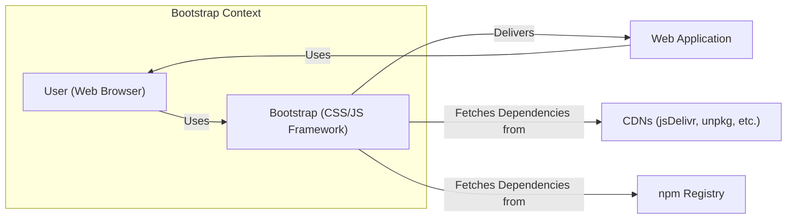
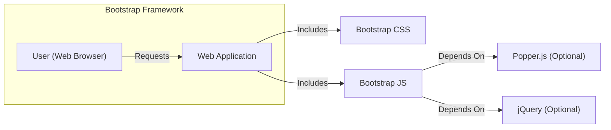
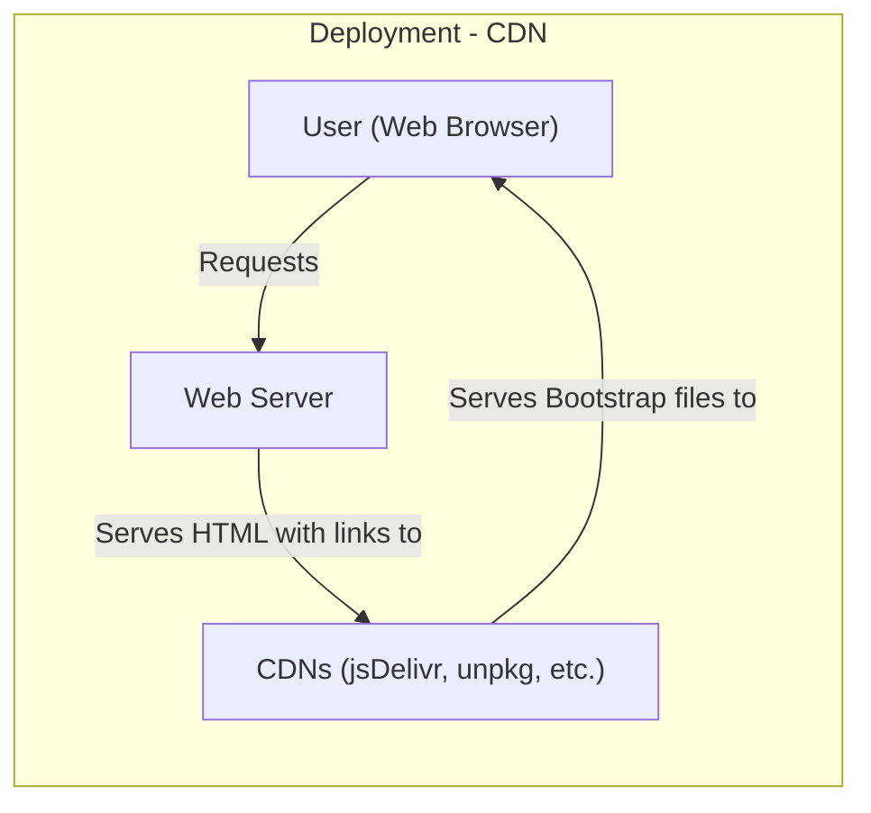
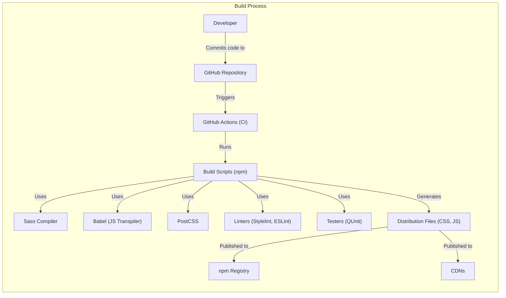

Okay, let's create a design document for the Bootstrap project, focusing on aspects relevant to threat modeling.

# BUSINESS POSTURE

Bootstrap is a widely-used, open-source front-end framework. Its primary business goal is to provide a consistent, responsive, and accessible set of components and styles for web development.  It aims to accelerate development, improve cross-browser compatibility, and promote best practices in web design.  It's not a product sold directly, but rather a tool that enhances the value of countless other websites and applications.  Its reputation and adoption are key to its continued success.

Business Priorities:

*   Maintainability and ease of contribution: As an open-source project, Bootstrap relies on community contributions.  The codebase must be understandable and well-structured.
*   Backward compatibility:  Major releases should strive to minimize breaking changes, as many projects depend on Bootstrap's stability.
*   Performance:  Bootstrap's CSS and JavaScript should be optimized to minimize page load times.
*   Accessibility:  Bootstrap should adhere to accessibility standards (WCAG) to ensure websites built with it are usable by everyone.
*   Cross-browser and cross-device compatibility:  Bootstrap must function correctly across a wide range of browsers and devices.
*   Security: While primarily a front-end framework, security considerations are crucial to prevent vulnerabilities that could be exploited in applications using Bootstrap.

Most Important Business Risks:

*   Reputational damage due to security vulnerabilities:  If a significant vulnerability is found in Bootstrap, it could affect a vast number of websites, leading to negative publicity and loss of trust.
*   Loss of community support:  If the project becomes difficult to contribute to, or if maintainers are unresponsive, the community may move to alternative frameworks.
*   Inability to keep up with evolving web standards:  If Bootstrap fails to adapt to new browser features and web technologies, it could become obsolete.
*   Introduction of breaking changes that disrupt existing implementations: This can lead to significant rework for developers using Bootstrap, damaging its reputation for stability.

# SECURITY POSTURE

Existing Security Controls:

*   security control: Code Reviews: Pull requests are reviewed by maintainers before merging. (Visible in the GitHub repository's pull request process).
*   security control: Static Analysis: Likely use of linters and static analysis tools to identify potential code quality and security issues. (Implied by contribution guidelines and project structure).
*   security control: Dependency Management: Careful management of dependencies to minimize the risk of supply chain attacks. (Visible in `package.json` and `package-lock.json`).
*   security control: Content Security Policy (CSP) Recommendations: Documentation provides guidance on using CSP to mitigate XSS risks. (Found in Bootstrap's documentation).
*   security control: Sanitization of user input (in JavaScript components): Some JavaScript components that handle user input include sanitization to prevent XSS. (Visible in the source code of components like Tooltips and Popovers).
*   security control: Regular Updates: The project is actively maintained, with regular releases that include bug fixes and security patches. (Visible in the release history).

Accepted Risks:

*   accepted risk: Reliance on Third-Party Libraries: Bootstrap depends on libraries like jQuery (although this is being phased out) and Popper.js. Vulnerabilities in these libraries could impact Bootstrap.
*   accepted risk: Client-Side Security Limitations: As a front-end framework, Bootstrap cannot directly address server-side security vulnerabilities. It relies on developers to implement appropriate security measures on the backend.
*   accepted risk: Potential for Misconfiguration: Developers can misuse Bootstrap components or override default styles in ways that introduce security vulnerabilities.

Recommended Security Controls:

*   security control: Automated Security Scanning: Integrate automated security scanning tools (e.g., Snyk, Dependabot) into the CI/CD pipeline to detect vulnerabilities in dependencies and code.
*   security control: Subresource Integrity (SRI): Encourage the use of SRI tags when including Bootstrap from CDNs to ensure that the files haven't been tampered with.
*   security control: Comprehensive Security Testing: Expand testing to include more focused security tests, such as fuzzing and penetration testing of JavaScript components.

Security Requirements:

*   Authentication: Not directly applicable, as Bootstrap is a front-end framework and does not handle authentication.
*   Authorization: Not directly applicable, as Bootstrap is a front-end framework and does not handle authorization.
*   Input Validation:
    *   JavaScript components that handle user input (e.g., Tooltips, Popovers, Modals) must properly sanitize the input to prevent XSS vulnerabilities.
    *   Forms built with Bootstrap should utilize appropriate input types and validation attributes to minimize the risk of invalid or malicious data being submitted.
*   Cryptography:
    *   Bootstrap itself does not handle cryptographic operations. However, if used in conjunction with HTTPS (which it should be), it benefits from the transport layer security provided by TLS.
    *   Documentation should emphasize the importance of using HTTPS.
*   Output Encoding:
    *   Bootstrap's JavaScript components should properly encode output to prevent XSS vulnerabilities.

# DESIGN

## C4 CONTEXT

Element Descriptions:

*   Element: User
    *   Name: User
    *   Type: Person
    *   Description: A person using a web browser to access a web application built with Bootstrap.
    *   Responsibilities: Interacts with the web application's UI.
    *   Security controls: Browser security settings, extensions, and user awareness.

*   Element: Bootstrap
    *   Name: Bootstrap
    *   Type: Software System
    *   Description: The Bootstrap CSS/JS framework.
    *   Responsibilities: Provides styling, layout, and interactive components for web applications.
    *   Security controls: Code reviews, static analysis, dependency management, sanitization of user input, CSP recommendations.

*   Element: Web Application
    *   Name: Web Application
    *   Type: Software System
    *   Description: A web application that utilizes Bootstrap for its front-end.
    *   Responsibilities: Provides functionality to the user.
    *   Security controls: Implemented by the application developers (not directly part of Bootstrap).

*   Element: CDNs
    *   Name: CDNs
    *   Type: External System
    *   Description: Content Delivery Networks (e.g., jsDelivr, unpkg) that host Bootstrap files.
    *   Responsibilities: Serve Bootstrap files to users' browsers.
    *   Security controls: CDN provider's security measures, Subresource Integrity (SRI) (recommended).

*   Element: npm Registry
    *   Name: npm Registry
    *   Type: External System
    *   Description: The npm package registry, from which Bootstrap and its dependencies can be downloaded.
    *   Responsibilities: Provides a repository for JavaScript packages.
    *   Security controls: npm's security measures, package signing (optional).

## C4 CONTAINER

Since Bootstrap is a front-end framework, the "container" level is essentially an elaboration of the "system" level.  It's not a complex distributed system with multiple deployable units.

Element Descriptions:

*   Element: Web Application
    *   Name: Web Application
    *   Type: Container
    *   Description: The web application that integrates Bootstrap.
    *   Responsibilities: Provides the overall application logic and functionality.
    *   Security controls: Implemented by the application developers.

*   Element: Bootstrap CSS
    *   Name: Bootstrap CSS
    *   Type: Container
    *   Description: The compiled CSS file containing Bootstrap's styles.
    *   Responsibilities: Provides styling and layout for the web application.
    *   Security controls: Code reviews, static analysis.

*   Element: Bootstrap JS
    *   Name: Bootstrap JS
    *   Type: Container
    *   Description: The compiled JavaScript file containing Bootstrap's interactive components.
    *   Responsibilities: Provides interactive functionality (e.g., modals, tooltips, dropdowns).
    *   Security controls: Code reviews, static analysis, input sanitization, CSP recommendations.

*   Element: Popper.js
    *   Name: Popper.js
    *   Type: Container
    *   Description: A library used for positioning tooltips and popovers (optional dependency).
    *   Responsibilities: Provides positioning logic.
    *   Security controls: Relies on Popper.js's own security measures and Bootstrap's secure usage of it.

*   Element: jQuery
    *   Name: jQuery
    *   Type: Container
    *   Description: A JavaScript library that Bootstrap has historically depended on (being phased out, optional dependency).
    *   Responsibilities: Provides DOM manipulation and utility functions.
    *   Security controls: Relies on jQuery's own security measures and Bootstrap's secure usage of it.

## DEPLOYMENT

Bootstrap can be deployed in several ways:

1.  **Via CDN:** Including Bootstrap files directly from a Content Delivery Network (e.g., jsDelivr, unpkg). This is the simplest method.
2.  **Local Installation (npm/Yarn):** Downloading Bootstrap using a package manager (npm or Yarn) and including the files in the project's build process.
3.  **Manual Download:** Downloading the compiled CSS and JavaScript files from the Bootstrap website and manually placing them in the project.
4.  **Source Files and Build:** Downloading the source files and building Bootstrap from source using its build tools.

We'll describe deployment via CDN, as it's a common and straightforward approach.

Element Descriptions:

*   Element: User
    *   Name: User
    *   Type: Node
    *   Description: The user's web browser.
    *   Responsibilities: Makes requests to the web server and renders the web page.
    *   Security controls: Browser security settings.

*   Element: Web Server
    *   Name: Web Server
    *   Type: Node
    *   Description: The server hosting the web application.
    *   Responsibilities: Serves the HTML, CSS, and JavaScript files to the user's browser.
    *   Security controls: Server-side security measures (firewalls, intrusion detection systems, etc.).

*   Element: CDNs
    *   Name: CDNs
    *   Type: Node
    *   Description: Content Delivery Networks that host Bootstrap files.
    *   Responsibilities: Serve Bootstrap files to users' browsers.
    *   Security controls: CDN provider's security measures, Subresource Integrity (SRI) (recommended).

## BUILD

Bootstrap's build process involves compiling Sass to CSS, transpiling JavaScript, and creating various distribution files. It uses Node.js and npm for managing dependencies and running build scripts.

Security Controls in Build Process:

*   security control: Dependency Management: `package.json` and `package-lock.json` define dependencies and their versions, helping to prevent the use of vulnerable packages.
*   security control: Linters: Stylelint (for CSS) and ESLint (for JavaScript) are used to enforce coding standards and identify potential security issues.
*   security control: Testing: QUnit is used for JavaScript unit testing, which can help catch bugs that might lead to vulnerabilities.
*   security control: GitHub Actions: The CI/CD pipeline (GitHub Actions) automates the build process, ensuring that tests and linters are run consistently.
*   security control: (Recommended) Automated Security Scanning: Tools like Snyk or Dependabot can be integrated into the CI/CD pipeline to automatically scan for vulnerabilities in dependencies.

# RISK ASSESSMENT

Critical Business Processes:

*   Website rendering and functionality: Bootstrap is critical for ensuring that websites built with it are displayed correctly and function as intended across different browsers and devices.
*   User experience: Bootstrap contributes to a consistent and accessible user experience.
*   Development efficiency: Bootstrap accelerates web development by providing pre-built components and styles.

Data Protection:

*   Bootstrap itself does not directly handle sensitive data. However, it's a *component* in systems that *do* handle sensitive data. Therefore, vulnerabilities in Bootstrap (particularly XSS) could be leveraged to *indirectly* compromise sensitive data handled by the *application* using Bootstrap.
*   Data Sensitivity: While Bootstrap doesn't handle data directly, the *applications* using it might handle data of varying sensitivity levels, from publicly available information to highly confidential data (PII, financial data, etc.). The sensitivity of the data handled by the *application* dictates the overall risk.

# QUESTIONS & ASSUMPTIONS

Questions:

*   What specific static analysis tools are used beyond linters?
*   Are there any plans to implement more comprehensive security testing (e.g., fuzzing)?
*   What is the process for handling reported security vulnerabilities?
*   Is there a formal security policy or secure development lifecycle document?
*   How is the transition away from jQuery being managed from a security perspective?
*   Are there any specific security audits performed on Bootstrap's codebase?

Assumptions:

*   BUSINESS POSTURE: The primary goal is to provide a stable, reliable, and widely-used front-end framework. Security is a high priority, but not at the expense of usability and maintainability.
*   SECURITY POSTURE: The maintainers follow secure coding practices and are responsive to security reports. There is an implicit secure development lifecycle, even if not formally documented.
*   DESIGN: Developers using Bootstrap are responsible for implementing appropriate server-side security measures. Bootstrap is used primarily in a standard web application context, served over HTTPS. The build process is automated and reliable.