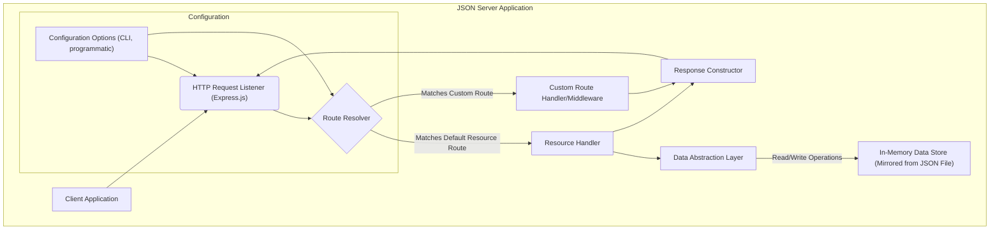

## Project Design Document: JSON Server (Improved)

**1. Introduction**

This document provides an enhanced design overview of the `json-server` project (available at [https://github.com/typicode/json-server](https://github.com/typicode/json-server)). This improved version aims to offer greater clarity and detail regarding the architecture, components, and data flow, specifically tailored for effective threat modeling and security analysis.

**2. Project Overview**

*   **Project Name:** JSON Server
*   **Project Repository:** [https://github.com/typicode/json-server](https://github.com/typicode/json-server)
*   **Project Description:** `json-server` is a lightweight, zero-configuration REST API mocking tool designed for rapid prototyping, frontend development, and testing. It enables developers to quickly simulate a full-fledged RESTful backend by serving data from a JSON file, eliminating the need for writing boilerplate server-side code.
*   **Primary Goal:** To significantly reduce the time and effort required to set up a mock backend API for development and testing purposes, facilitating parallel frontend and backend development.
*   **Key Features:**
    *   Automatic generation of RESTful endpoints based on the structure of a JSON data file.
    *   Support for standard HTTP methods: GET (read), POST (create), PUT (update entire resource), PATCH (update partial resource), and DELETE (delete resource).
    *   Built-in support for common API features like filtering (using query parameters), sorting (`_sort`, `_order`), pagination (`_page`, `_limit`), and full-text search (`q`).
    *   Ability to define custom routes and middleware functions for extending functionality or simulating specific backend behaviors.
    *   Simple command-line interface (CLI) for easy startup and configuration.
    *   In-memory data storage by default, with optional persistence through the JSON file.

**3. System Architecture**

The `json-server` application employs a modular architecture centered around an Express.js web server. It processes incoming HTTP requests, routes them based on defined endpoints, interacts with the data layer, and constructs HTTP responses.

**4. Component Description**

*   **Client Application:** Any software application (e.g., web browser, mobile application, API testing tool, another service) that initiates HTTP requests to interact with the `json-server` API.
*   **HTTP Request Listener (Express.js):** The entry point of the application, responsible for listening on a specified port for incoming HTTP requests. Express.js provides the underlying framework for handling these requests.
*   **Route Resolver:** This component analyzes the incoming request's HTTP method and URL path to determine the intended resource and operation. It matches the request against both the automatically generated RESTful routes based on the JSON data and any user-defined custom routes.
*   **Resource Handler:**  Handles requests targeting the default RESTful resources. It interprets the HTTP method (GET, POST, PUT, PATCH, DELETE) and performs the corresponding CRUD operation on the data. This component orchestrates interactions with the Data Abstraction Layer.
*   **Custom Route Handler/Middleware:** Allows developers to define specific logic for custom endpoints. Middleware functions can intercept requests and responses, performing tasks like authentication checks, request logging, or data transformation. Custom route handlers provide complete control over the response for a given route.
*   **Data Abstraction Layer:**  Provides an interface for interacting with the underlying data store. This layer abstracts away the specifics of data storage and retrieval, allowing the Resource Handler to perform operations without directly interacting with the JSON file or in-memory store.
*   **In-Memory Data Store (Mirrored from JSON File):** The primary data storage mechanism. `json-server` loads the data from the specified JSON file into memory upon startup. Modifications are typically made to this in-memory representation and then optionally persisted back to the JSON file.
*   **Response Constructor:** Responsible for building the HTTP response to be sent back to the client. This includes setting the HTTP status code, headers (e.g., `Content-Type`), and the response body (typically JSON).
*   **Configuration Options (CLI, programmatic):**  Allows users to configure various aspects of `json-server`, such as the port number, the path to the JSON data file, and the definition of custom routes and middleware. Configuration can be provided via command-line arguments or programmatically when embedding `json-server`.

**5. Data Flow**

A typical request-response cycle in `json-server` follows these steps:

1. A **Client Application** sends an HTTP request to a specific endpoint exposed by `json-server`.
2. The **HTTP Request Listener (Express.js)** receives the request.
3. The **Route Resolver** analyzes the request method and URL.
    *   If the URL matches a default resource route (e.g., `/posts`, `/comments/1`), the request is directed to the **Resource Handler**.
    *   If the URL matches a custom route defined by the user, the request is directed to the corresponding **Custom Route Handler/Middleware**.
4. For default resource routes, the **Resource Handler** determines the appropriate CRUD operation based on the HTTP method.
5. The **Resource Handler** interacts with the **Data Abstraction Layer** to perform the requested operation (e.g., retrieve a list of resources, create a new resource, update an existing resource, delete a resource). This interaction involves reading from or writing to the **In-Memory Data Store**.
6. For custom routes, the **Custom Route Handler/Middleware** executes its defined logic, which may involve interacting with the Data Abstraction Layer, external services, or simply generating a specific response.
7. The **Response Constructor** builds the HTTP response, including the appropriate status code (e.g., 200 OK, 201 Created, 404 Not Found), headers, and the response body (usually JSON data).
8. The **HTTP Request Listener** sends the constructed response back to the **Client Application**.

**6. Security Considerations (For Threat Modeling)**

This section expands on potential security vulnerabilities and threats relevant to `json-server`.

*   **Absence of Built-in Authentication and Authorization:**  `json-server` lacks any built-in mechanisms for verifying the identity of clients or controlling access to resources.
    *   **Threat Examples:**
        *   **Unauthorized Data Access:** Any client can read any data served by the API.
        *   **Data Manipulation:** Malicious actors can create, update, or delete data without proper authorization.
        *   **Mass Data Extraction:** Attackers can easily retrieve large amounts of data.
*   **Vulnerability to Cross-Site Scripting (XSS):** If custom routes or middleware directly reflect user-provided input in the response without proper encoding, XSS vulnerabilities can arise.
    *   **Threat Examples:**
        *   **Session Hijacking:** Attackers can inject scripts to steal user session cookies.
        *   **Credential Theft:** Malicious scripts can capture user credentials entered on the page.
        *   **Defacement:** Attackers can alter the appearance or content of the web page.
*   **Susceptibility to Cross-Site Request Forgery (CSRF):** Without CSRF protection, if a user with an active session (if external authentication is used) visits a malicious site, that site can make unauthorized requests to the `json-server` API on the user's behalf.
    *   **Threat Examples:**
        *   **Unintended Data Modification:** Attackers can trick authenticated users into performing actions like deleting or modifying data.
*   **Potential for Data Injection through Custom Routes:** If custom route handlers or middleware process user input and use it in database queries (if integrated with an external database, which is outside the core scope but possible), SQL or NoSQL injection vulnerabilities could occur.
    *   **Threat Examples:**
        *   **Data Breach:** Attackers can gain unauthorized access to sensitive data.
        *   **Data Corruption:** Malicious queries can alter or delete data.
*   **Risk of Denial of Service (DoS) Attacks:**  While `json-server` is simple, a large volume of requests can still overwhelm the server, especially if the JSON data file is large or if custom middleware performs computationally intensive tasks.
    *   **Threat Examples:**
        *   **Service Unavailability:** Legitimate users are unable to access the API.
        *   **Resource Exhaustion:** The server's resources (CPU, memory) are consumed, potentially affecting other applications on the same server.
*   **Exposure of Sensitive Information in the JSON Data File:** The `db.json` file itself might contain sensitive data. If the server or the file system is not properly secured, this data could be exposed.
    *   **Threat Examples:**
        *   **Direct File Access:** Attackers could potentially access the `db.json` file directly if the server is misconfigured.
        *   **Information Disclosure:** Sensitive data intended for internal use could be exposed to unauthorized parties.
*   **Vulnerabilities in Dependencies:**  `json-server` relies on Node.js packages. Security vulnerabilities in these dependencies could be exploited if not regularly updated.
    *   **Threat Examples:**  Wide range of potential vulnerabilities depending on the affected dependency.
*   **Configuration Weaknesses:**  Leaving the server running on default ports without proper firewall rules or exposing it directly to the public internet can create significant security risks.
    *   **Threat Examples:** Increased attack surface, easier exploitation of other vulnerabilities.
*   **Insufficient Logging and Monitoring:** The default logging might not provide enough detail for security auditing or incident response.
    *   **Threat Examples:** Difficulty in detecting attacks, tracing malicious activity, and recovering from security incidents.

**7. Deployment Considerations**

*   `json-server` is primarily intended for local development and prototyping.
*   It can be easily deployed using Node.js and npm.
*   For development, it's typically run directly from the command line.
*   For more persistent deployments (e.g., for internal testing or demos), it can be run within a container (like Docker) or as a service.
*   **Crucially, it is generally NOT recommended to deploy `json-server` directly to production environments facing the public internet due to its inherent lack of security features.**
*   If used in non-production but shared environments, network segmentation and access controls are essential.

**8. Technology Stack**

*   **Node.js:** The JavaScript runtime environment that powers `json-server`.
*   **Express.js:** A fast, unopinionated, minimalist web framework for Node.js, used for routing, middleware, and handling HTTP requests and responses.
*   **Lowdb (or similar):** While `json-server` primarily operates in-memory, it might leverage libraries like Lowdb (or its underlying mechanisms) for reading and writing data to the JSON file.
*   **Chokidar:** A robust file system watcher used to detect changes in the JSON data file and automatically reload the server.

**9. Future Enhancements (Security Focus)**

While `json-server` prioritizes simplicity, incorporating optional security features could enhance its usability in a wider range of scenarios:

*   **Optional Basic Authentication Middleware:** Provide a built-in or easily configurable middleware option for simple username/password-based authentication.
*   **Rate Limiting Middleware:** Implement middleware to limit the number of requests from a single IP address within a given time frame, mitigating DoS attacks.
*   **Input Sanitization/Validation Middleware:** Offer middleware to sanitize or validate incoming request data to prevent basic injection attacks.
*   **HTTPS Configuration Guidance:** Provide clear documentation or options for easily configuring `json-server` to run over HTTPS using tools like `mkcert` or `Let's Encrypt`.
*   **Content Security Policy (CSP) Header Configuration:** Allow users to configure CSP headers to mitigate XSS vulnerabilities by controlling the sources from which the browser is allowed to load resources.
*   **CORS Configuration Options:** Provide more granular control over Cross-Origin Resource Sharing (CORS) to restrict which domains can access the API.
*   **Security Headers Middleware:** Include options for setting common security-related HTTP headers like `X-Frame-Options`, `X-Content-Type-Options`, and `Referrer-Policy`.
*   **Pluggable Authentication/Authorization:** Design an architecture that allows developers to easily integrate their own authentication and authorization logic.

This improved design document provides a more detailed and security-focused overview of `json-server`, offering a stronger foundation for comprehensive threat modeling and risk assessment.
