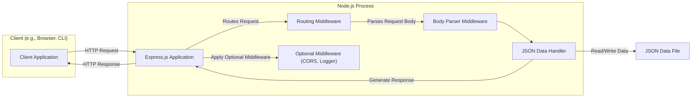
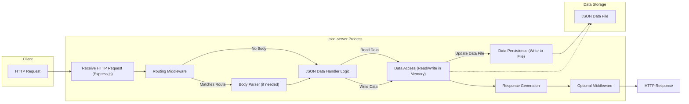

## Project Design Document: json-server (Improved)

**1. Introduction**

This document provides an enhanced and more detailed design overview of the `json-server` project, an open-source Node.js package available at [https://github.com/typicode/json-server](https://github.com/typicode/json-server). This document aims to provide a clear and comprehensive understanding of the system's architecture, internal components, and data flow, specifically tailored for subsequent threat modeling activities. `json-server` is a lightweight tool designed to rapidly prototype and mock RESTful APIs by serving data from a JSON file, requiring minimal to no coding. Its primary use cases are in frontend development, rapid prototyping, and testing.

**2. Goals and Objectives**

*   Deliver a refined and more detailed architectural overview of `json-server`.
*   Provide a deeper understanding of the internal components and their interactions within the `json-server` process.
*   Offer a more granular description of the data flow, including specific steps and data transformations.
*   Thoroughly highlight potential security vulnerabilities and areas of concern to facilitate effective threat modeling.
*   Serve as a comprehensive and accurate reference for understanding the technical workings and security posture of the system.

**3. System Architecture**

The `json-server` architecture revolves around a Node.js process that leverages the Express.js framework to interpret a provided JSON file as a data source and dynamically expose RESTful endpoints corresponding to the structure of that data.

**4. Data Flow (Detailed)**

The data flow within `json-server` involves a series of well-defined steps, starting with a client request and culminating in a server response:

*   **Client Initiates HTTP Request:** A client application sends an HTTP request targeting a specific resource endpoint exposed by `json-server`. This request includes the HTTP method (GET, POST, PUT, PATCH, DELETE), headers, and potentially a request body (for write operations).
*   **Request Reception by Express.js:** The Node.js process running `json-server`, built upon Express.js, receives the incoming HTTP request.
*   **Routing Middleware Evaluation:** The Express.js routing middleware analyzes the request's URL path and HTTP method. It compares these against the routes dynamically generated based on the structure of the JSON data file (e.g., `/posts`, `/comments/1`).
*   **Body Parsing (if applicable):** For requests with a body (POST, PUT, PATCH), the Body Parser middleware extracts and parses the data from the request body, typically in JSON format. This parsed data is made available for further processing.
*   **JSON Data Handler Logic:** The core logic of `json-server` takes over. Based on the matched route and HTTP method, it performs the corresponding operation on the in-memory representation of the JSON data.
    *   **GET Requests:** The handler retrieves the requested data (a single resource or a collection) from the JSON data.
    *   **POST Requests:** The handler creates a new resource in the JSON data, typically assigning a unique ID if not provided in the request.
    *   **PUT/PATCH Requests:** The handler updates an existing resource in the JSON data with the provided data. PUT usually replaces the entire resource, while PATCH performs a partial update.
    *   **DELETE Requests:** The handler removes the specified resource from the JSON data.
*   **Data Persistence:** After any write operation (POST, PUT, PATCH, DELETE), `json-server` writes the updated in-memory representation of the JSON data back to the JSON data file. This ensures data persistence across server restarts.
*   **Response Generation:** The JSON Data Handler constructs an HTTP response.
    *   For successful GET requests, the response body contains the requested JSON data.
    *   For successful POST requests, the response typically includes the newly created resource with its assigned ID and a 201 Created status code.
    *   For successful PUT/PATCH requests, the response may include the updated resource and a 200 OK status code.
    *   For successful DELETE requests, the response typically has a 204 No Content status code.
    *   Error responses (e.g., 404 Not Found) are generated if a requested resource does not exist.
*   **Optional Middleware Processing:** Before sending the response, any configured optional middleware (like CORS or logging middleware) processes the request and response. For example, CORS middleware adds necessary headers to control cross-origin access.
*   **HTTP Response to Client:** The Express.js application sends the generated HTTP response back to the client application.

**5. Components (Detailed)**

A more granular breakdown of the components within `json-server`:

*   **Node.js Runtime Environment:** Provides the execution environment for the JavaScript code of `json-server`.
*   **Express.js Framework:** The underlying web application framework that handles request routing, middleware management, and response handling.
*   **Routing Middleware:**  The core of `json-server`'s API generation. It dynamically creates routes based on the keys in the root level of the JSON data (e.g., an array named "posts" will create routes like `/posts`, `/posts/:id`). It maps incoming requests to the appropriate handler functions.
*   **Body Parser Middleware (e.g., `express.json()`):**  Parses the body of incoming requests with JSON payloads, making the data accessible in the `req.body` object. This is crucial for handling POST, PUT, and PATCH requests.
*   **JSON Data Handler:**  The internal logic responsible for performing CRUD operations on the in-memory representation of the JSON data. This component interprets the request method and target resource to perform the appropriate action (read, create, update, delete).
*   **LowDB (or similar in-memory database):** While not explicitly a separate component exposed to the user, `json-server` internally uses a lightweight in-memory database (often implemented with libraries like LowDB or similar approaches) to hold the JSON data. This allows for efficient data manipulation before persisting changes to the file.
*   **File System Access:**  `json-server` directly interacts with the file system to read the initial JSON data file and to persist changes back to it.
*   **CORS Middleware (Optional - `cors` package):** If configured, this middleware adds HTTP headers that tell browsers to give a web application running at one origin, access to selected resources from a different origin.
*   **Logger Middleware (Optional - e.g., `morgan`):**  Provides logging of HTTP requests, which can be useful for debugging and monitoring.
*   **Static File Server Middleware (Optional - `express.static()`):** Allows `json-server` to serve static files (HTML, CSS, JavaScript, images) from a specified directory.

**6. Security Considerations (Elaborated)**

The inherent design of `json-server`, while convenient for development, introduces several security considerations, especially if deployed in non-isolated environments:

*   **Absence of Authentication and Authorization:**  This is a critical vulnerability. Any client capable of reaching the `json-server` instance can perform any CRUD operation on the data. This can lead to unauthorized data access, modification, and deletion. **Mitigation (External):**  In scenarios where some level of security is needed (even for development), consider placing `json-server` behind a reverse proxy or API gateway that handles authentication and authorization.
*   **Direct Data File Access and Modification:** The JSON data file serves as the single source of truth. If an attacker gains write access to the file system where this file resides (through vulnerabilities in the server, OS, or misconfigurations), they can directly manipulate the data, bypassing `json-server`'s logic. **Mitigation (Operational):**  Restrict file system permissions on the JSON data file to the `json-server` process user only. Avoid storing sensitive information directly in the JSON file if possible.
*   **Limited Input Validation:** `json-server` performs basic validation but might not be robust against all forms of malicious input. Exploiting insufficient validation could lead to unexpected behavior, data corruption, or even denial-of-service. **Mitigation (Code Level - Not in `json-server` itself):** If extending or building upon `json-server`'s functionality, implement thorough input validation and sanitization.
*   **Potential for Cross-Site Scripting (XSS) if Serving Static Content:** If the static file serving capability is used, and user-provided content is served without proper sanitization, XSS vulnerabilities can arise, allowing attackers to inject malicious scripts into the client's browser. **Mitigation (Best Practice):** Avoid serving user-generated content directly through `json-server`. If necessary, implement strict content security policies and output encoding.
*   **CORS Misconfiguration:** Incorrectly configured CORS middleware can allow unintended cross-origin access, potentially exposing the API to malicious websites. **Mitigation (Configuration):** Carefully configure CORS settings to allow only trusted origins. Avoid using wildcard (`*`) for the `Access-Control-Allow-Origin` header in production-like environments.
*   **Denial of Service (DoS) Vulnerability:** Without rate limiting or other protective measures, an attacker can overwhelm the `json-server` instance with a large number of requests, leading to service disruption. **Mitigation (External):** Implement rate limiting at the network level or using a reverse proxy.
*   **Dependency Vulnerabilities:**  `json-server` relies on Node.js packages. Vulnerabilities in these dependencies can introduce security risks. **Mitigation (Maintenance):** Regularly update `json-server` and its dependencies to patch known vulnerabilities. Use tools like `npm audit` or `yarn audit` to identify and address vulnerabilities.
*   **Lack of HTTPS by Default:**  `json-server` does not enforce HTTPS by default, meaning communication between the client and server is unencrypted, making it susceptible to eavesdropping and man-in-the-middle attacks. **Mitigation (Deployment):**  Deploy `json-server` behind an HTTPS-terminating reverse proxy (like Nginx or Apache) or use a service like Let's Encrypt to enable HTTPS.

**7. Deployment Considerations (Emphasized)**

`json-server` is primarily intended for the following use cases:

*   **Local Development:**  The most common and recommended use case. Developers use it to quickly mock backend APIs during frontend development, allowing them to work independently of the actual backend.
*   **Rapid Prototyping:**  Ideal for quickly creating functional prototypes and demonstrating API interactions without the overhead of building a full-fledged backend.
*   **Testing Environments:** Useful for setting up mock APIs for integration tests and end-to-end tests.

**Critical Warning:**  **`json-server` is explicitly NOT designed for and should NOT be used in production environments.** Its lack of built-in security features, scalability limitations, and single-point-of-failure nature make it unsuitable for handling real-world production traffic and sensitive data. Exposing a `json-server` instance directly to the internet without significant security measures is highly discouraged and poses significant security risks.

**8. Assumptions and Constraints**

*   This design document is based on the standard functionality of `json-server` as documented in its official repository.
*   It assumes a typical deployment scenario where `json-server` is executed as a standalone Node.js process.
*   The security considerations are based on the default configuration of `json-server` without any additional security measures implemented within the `json-server` application itself.
*   The document does not delve into the specific implementation details of the underlying libraries used by `json-server`, focusing on the architectural and functional aspects.

This improved design document provides a more in-depth understanding of the `json-server` project, highlighting its architecture, data flow, and, crucially, its security considerations. This detailed information is essential for conducting a comprehensive threat model and understanding the potential risks associated with its use, particularly in environments beyond local development.