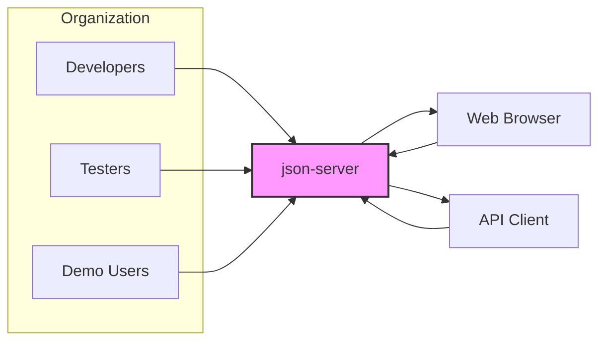
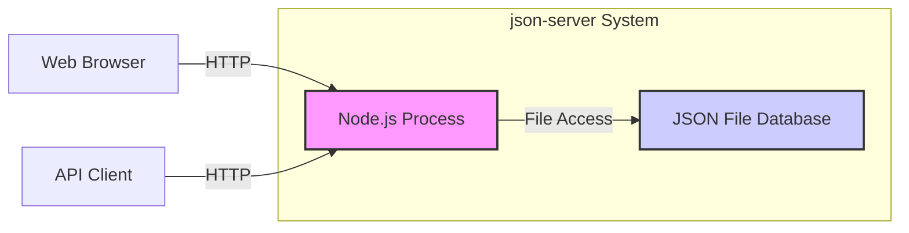

# BUSINESS POSTURE

This project, json-server, aims to provide a quick and easy way to create a full fake REST API from a JSON file. It is designed to facilitate frontend development, rapid prototyping, testing, and demonstrations by eliminating the need for a real backend during these phases.

Business Priorities:
- Rapid Development: Enable developers to quickly set up a mock API and start frontend development without waiting for backend implementation.
- Ease of Use: Provide a simple and intuitive tool that requires minimal configuration and coding.
- Cost-Effectiveness: Reduce development time and resources by providing a ready-to-use API mocking solution.

Business Risks:
- Misuse in Production: If json-server is mistakenly or intentionally used in a production environment, it could expose sensitive data and become a single point of failure due to its simplified nature and lack of production-grade security features.
- Data Exposure: The JSON database file, if not properly secured, could be accessed or modified by unauthorized users, leading to data breaches or manipulation.
- Security Vulnerabilities: As a rapid development tool, json-server might not have undergone rigorous security testing and could contain vulnerabilities that could be exploited.

# SECURITY POSTURE

Existing Security Controls:
- security control: As a development tool, json-server inherently relies on the security of the environment it is deployed in. If used locally or within a secured development network, the network security controls provide a baseline level of protection.
- security control: The project is open-source and hosted on GitHub, allowing for community review and potential identification of security vulnerabilities through public scrutiny.
- accepted risk:  Lack of built-in authentication and authorization mechanisms. json-server is designed for open access in development environments.
- accepted risk:  Reliance on the security of the underlying Node.js runtime environment and any dependencies.

Recommended Security Controls:
- security control: Input validation should be implemented if json-server is used in environments where untrusted input might be provided, even for development purposes, to prevent potential injection attacks.
- security control: Rate limiting could be considered if json-server is exposed on a network to mitigate potential denial-of-service attacks, even in development scenarios.
- security control: If used in shared development environments, consider network segmentation to isolate json-server instances and limit access.
- security control: Regularly update json-server and its dependencies to patch any discovered security vulnerabilities.

Security Requirements:
- Authentication: For most development use cases, authentication is not a primary requirement. However, if json-server is used in environments where access control is needed, even for development or staging, an authentication mechanism should be considered. This could be implemented as middleware or a proxy in front of json-server.
- Authorization: Similar to authentication, authorization is generally not a core requirement for typical json-server usage. If specific access control is needed based on user roles or permissions, an authorization mechanism should be implemented externally.
- Input Validation: Json-server relies on the data provided in the JSON file and through API requests. Input validation is crucial to prevent injection attacks, especially if the data is used in any dynamic operations or if custom routes are implemented. This should be applied to both request parameters and the JSON database file itself if it's dynamically generated or modified.
- Cryptography: For typical development use, encryption of the JSON database file at rest is usually not a requirement. However, if sensitive data is used, encryption at rest should be considered. Transport Layer Security (TLS/HTTPS) should be used if json-server is accessed over a network, especially if sensitive data is being transmitted, even in development or staging environments.

# DESIGN

## C4 CONTEXT



Context Diagram Elements:

- Element:
    - Name: Developers
    - Type: User
    - Description: Software developers who use json-server to mock APIs during frontend development.
    - Responsibilities: Define API endpoints and data structures in the JSON database, use json-server to simulate backend API behavior, test frontend applications against the mock API.
    - Security controls: Developers are expected to use json-server in development environments and not expose it to production or untrusted networks without additional security measures.

- Element:
    - Name: Testers
    - Type: User
    - Description: Quality assurance engineers and testers who use json-server to create predictable API responses for testing frontend applications.
    - Responsibilities: Utilize json-server to set up specific API scenarios for testing, verify frontend application behavior against controlled API responses.
    - Security controls: Testers operate in testing environments, and security considerations are similar to developers, focusing on preventing unintended exposure of test environments.

- Element:
    - Name: Demo Users
    - Type: User
    - Description: Individuals who use json-server for demonstrations or proof-of-concept projects to showcase frontend functionality without a fully built backend.
    - Responsibilities: Use json-server to provide a functional API backend for demos, present frontend applications with working API interactions.
    - Security controls: Demo environments should be isolated and not expose sensitive data. Security is less critical than in production but still relevant to prevent unauthorized access or modification during demonstrations.

- Element:
    - Name: json-server
    - Type: Software System
    - Description: A Node.js package that creates a full fake REST API from a JSON file. It serves as a mock backend for development, testing, and demos.
    - Responsibilities: Read data from a JSON file, expose REST API endpoints based on the JSON structure, handle HTTP requests (GET, POST, PUT, DELETE, PATCH), provide responses in JSON format.
    - Security controls: Relies on the security of the Node.js environment.  No built-in security features like authentication or authorization. Security is primarily the responsibility of the deployment environment and user practices.

- Element:
    - Name: Web Browser
    - Type: External System
    - Description: Web browsers used by developers, testers, and demo users to access frontend applications that interact with json-server.
    - Responsibilities: Send HTTP requests to json-server through frontend applications, render web pages and display data received from json-server.
    - Security controls: Web browser security is managed by the user and browser vendors.  Security considerations for json-server interaction are focused on secure communication (HTTPS) if needed and preventing client-side vulnerabilities in frontend applications.

- Element:
    - Name: API Client
    - Type: External System
    - Description: Tools like curl, Postman, or custom scripts used to directly interact with the json-server API for testing or development purposes.
    - Responsibilities: Send HTTP requests to json-server for API testing, data manipulation, and exploration.
    - Security controls: API client security depends on the tool used and user practices. Security considerations for json-server interaction are focused on secure communication (HTTPS) if needed and preventing unintended data exposure through API clients.

## C4 CONTAINER



Container Diagram Elements:

- Element:
    - Name: Node.js Process
    - Type: Container - Process
    - Description: The Node.js runtime environment executing the json-server application. It handles HTTP requests, routes them to the appropriate handlers, and interacts with the JSON File Database.
    - Responsibilities: Run the json-server application, expose HTTP endpoints, parse requests, route requests, read and write data to the JSON File Database, format responses.
    - Security controls: Security depends on the Node.js runtime environment, including OS-level security, Node.js version, and dependencies. Input validation should be implemented within the application logic if needed. Consider using security linters and static analysis tools for Node.js code.

- Element:
    - Name: JSON File Database
    - Type: Container - Data Store
    - Description: A JSON file that stores the data served by json-server. It acts as the database for the mock API.
    - Responsibilities: Persistently store data in JSON format, provide data to the Node.js Process when requested, allow data modifications by the Node.js Process.
    - Security controls: File system permissions control access to the JSON file.  Encryption at rest can be considered if sensitive data is stored. Regular backups should be implemented to prevent data loss. Ensure the file is not publicly accessible if deployed in a shared environment.

## DEPLOYMENT

Deployment Solution: Local Development Environment

```mermaid
flowchart LR
    subgraph "Developer Machine"
        subgraph "Operating System"
            NP["Node.js Process"]
            JF["JSON File Database"]
        end
    end
    DM["Developer"]

    DM -- Runs --> NP
    NP -- Accesses --> JF

    style NP fill:#f9f,stroke:#333,stroke-width:2px
    style JF fill:#ccf,stroke:#333,stroke-width:2px
    style "Operating System" fill:#eee,stroke:#333,stroke-dasharray: 5 5
    style "Developer Machine" fill:#ddd,stroke:#333,stroke-width:2px
```

Deployment Diagram Elements:

- Element:
    - Name: Developer Machine
    - Type: Infrastructure - Physical Machine
    - Description: The personal computer or laptop used by a developer to run json-server during development.
    - Responsibilities: Provide the hardware and operating system environment for running Node.js and storing the JSON database file.
    - Security controls: Security is managed by the developer and the organization's IT policies for developer machines. This includes OS security updates, endpoint protection, and physical security.

- Element:
    - Name: Operating System
    - Type: Infrastructure - Operating System
    - Description: The operating system (e.g., Windows, macOS, Linux) installed on the developer machine, providing the environment for Node.js and file system access.
    - Responsibilities: Manage system resources, provide file system access, run Node.js processes, enforce user permissions.
    - Security controls: OS-level security controls, including user authentication, access control lists, security patches, and firewall.

- Element:
    - Name: Node.js Process
    - Type: Software - Process
    - Description:  Instance of the Node.js process running json-server, deployed on the developer's operating system.
    - Responsibilities: Execute json-server application code, handle API requests, interact with the JSON File Database.
    - Security controls: Inherits security from the underlying OS and Node.js environment. Application-level security considerations like input validation should be implemented if necessary.

- Element:
    - Name: JSON File Database
    - Type: Data Store - File
    - Description: The JSON file storing the mock API data, located on the developer's local file system.
    - Responsibilities: Persistently store API data, allow read and write access by the Node.js Process.
    - Security controls: File system permissions on the developer's machine control access to the JSON file. Data at rest encryption can be considered if sensitive data is used, although typically not required in local development.

## BUILD

```mermaid
flowchart LR
    subgraph "Developer Workstation"
        DEV["Developer"]
        SRC["Source Code (JSON, JS)"]
    end
    subgraph "Build System (Local or CI)"
        BM["Build Machine"]
        NPM["npm install"]
        ARTIFACT["Build Artifacts (json-server package)"]
    end

    DEV -- Writes Code --> SRC
    SRC -- Commits --> BM
    BM -- Runs --> NPM
    NPM -- Creates --> ARTIFACT

    style DEV fill:#ccf,stroke:#333,stroke-width:2px
    style SRC fill:#eee,stroke:#333,stroke-dasharray: 5 5
    style BM fill:#eee,stroke:#333,stroke-dasharray: 5 5
    style NPM fill:#f9f,stroke:#333,stroke-width:2px
    style ARTIFACT fill:#ccf,stroke:#333,stroke-width:2px
    style "Developer Workstation" fill:#ddd,stroke:#333,stroke-width:2px
    style "Build System (Local or CI)" fill:#ddd,stroke:#333,stroke-width:2px
```

Build Process Description:

1. Developer writes code: Developers create or modify the JSON database file and potentially any custom JavaScript files for json-server (though typically not needed for basic usage).
2. Source Code: The JSON file and any JavaScript files are the source code for the json-server setup.
3. Commit: Developers commit the source code to a version control system (e.g., Git).
4. Build Machine: A build machine, which could be the developer's local machine or a CI/CD system, is used for the build process.
5. npm install: The `npm install json-server` command is executed on the build machine. This command downloads the json-server package and its dependencies from the npm registry.
6. Build Artifacts: The result of the build process is the `json-server` package and its dependencies installed in the `node_modules` directory. This directory and the JSON database file are the build artifacts needed to run json-server.

Build Security Controls:
- Supply Chain Security: Rely on npm registry for package distribution. Verify package integrity using `npm audit` and `npm verify-integrity`. Consider using a private npm registry for more control over dependencies.
- Build Automation: The build process is typically automated using `npm install`. For more complex setups, CI/CD pipelines can be used.
- Security Checks during Build:
    - Dependency Scanning: Use `npm audit` to scan for known vulnerabilities in dependencies.
    - Software Composition Analysis (SCA): Integrate SCA tools into the build process to analyze dependencies for security risks and license compliance.
    - Static Analysis Security Testing (SAST): While less applicable to json-server itself (as it's a package), if custom JavaScript code is added, SAST tools should be used to analyze it for vulnerabilities.
- Secure Build Environment: Ensure the build machine is secure, with up-to-date software and restricted access, to prevent tampering with the build process.

# RISK ASSESSMENT

Critical Business Processes:
- Software Development Lifecycle: json-server supports rapid prototyping and frontend development, which are crucial phases in the software development lifecycle. Disruptions or security issues with json-server in these phases could slow down development and testing.
- Demonstrations and Proof of Concepts: json-server is used for demos and POCs, which are important for showcasing product functionality and securing stakeholder buy-in. Security breaches or data leaks during demos could negatively impact business reputation and opportunities.

Data Sensitivity:
- Data sensitivity depends entirely on the data stored in the JSON database file.
- If the JSON file contains:
    - Publicly available data: Low sensitivity. Security risks are minimal, primarily focused on availability and integrity.
    - Internal, non-sensitive company data: Medium sensitivity. Data breach could lead to minor internal information disclosure.
    - Sensitive personal data, confidential business data, or secrets: High sensitivity. Data breach could lead to significant financial, reputational, and legal damage.

It is crucial to classify the data used with json-server and apply appropriate security controls based on its sensitivity. For development and testing with non-sensitive data, the inherent risks are low. However, if sensitive data is used even in development or demo environments, stronger security measures are necessary.

# QUESTIONS & ASSUMPTIONS

Questions:
- What type of data will be used with json-server? Is it sensitive, internal, or public data?
- In what environments will json-server be deployed? (Local development, shared development, staging, demo, production - although production use is discouraged).
- Are there any specific security requirements or compliance standards that need to be met?
- Will custom routes or middleware be implemented with json-server, potentially introducing more complex security considerations?
- Is there a need for access control or audit logging for json-server usage?

Assumptions:
- Primary Use Case: json-server is primarily used for local development and testing purposes.
- Non-Production Environment: It is assumed that json-server is not intended for production deployment and will not handle production traffic or sensitive production data.
- Security Focus: Security is considered important but secondary to ease of use and rapid development for the intended use cases.
- Data Sensitivity: For the purpose of this document, it is assumed that json-server will be used with non-sensitive or anonymized data in typical development and testing scenarios. If sensitive data is used, additional security measures beyond the default setup are required and should be explicitly addressed.