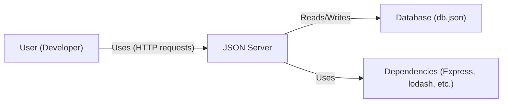
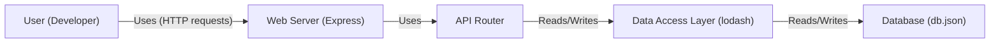
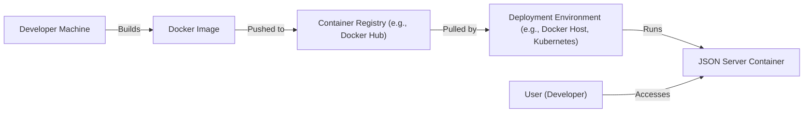
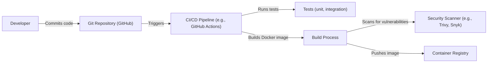

Okay, let's create a design document for the `json-server` project, keeping in mind its purpose and potential security implications.

# BUSINESS POSTURE

Business Priorities and Goals:

*   Provide a simple, fast, and easy-to-use tool for developers to create mock REST APIs.
*   Minimize setup and configuration time, allowing developers to focus on front-end development.
*   Offer a lightweight solution that doesn't require complex infrastructure or dependencies.
*   Support common REST API operations (GET, POST, PUT, PATCH, DELETE).
*   Allow customization of data and routes.

Most Important Business Risks:

*   Data Exposure: If used with sensitive data (even mock data), there's a risk of unintentional exposure if the server is publicly accessible without proper access controls.
*   Abuse as an Attack Vector: A publicly accessible `json-server` instance could be used as a launching point for attacks against other systems, or to host malicious content.
*   Resource Exhaustion: Without proper rate limiting or resource management, a `json-server` instance could be vulnerable to denial-of-service attacks.
*   Supply Chain Attacks: Vulnerabilities in `json-server` or its dependencies could be exploited.
*   Misconfiguration: Incorrect configuration (e.g., exposing the server to the public internet unintentionally) could lead to security breaches.

# SECURITY POSTURE

Existing Security Controls:

*   security control: Limited built-in security features. `json-server` primarily focuses on functionality, not robust security. It's designed for development and testing, not production.
*   security control: Runs locally by default (localhost). This limits exposure to the local machine. (Implemented in the code and documentation).
*   security control: Supports CORS (Cross-Origin Resource Sharing) configuration, allowing developers to control which origins can access the API. (Documented in the README).
*   security control: Can be extended with middleware, potentially allowing for the addition of custom security logic (e.g., authentication). (Documented in the README).

Accepted Risks:

*   accepted risk: The project maintainers explicitly state that `json-server` is not intended for production use with sensitive data.
*   accepted risk: Authentication and authorization are not built-in features. Users are expected to implement these themselves if needed, using middleware or external tools.
*   accepted risk: Rate limiting and other denial-of-service protections are not included by default.
*   accepted risk: Input validation is minimal. Users are responsible for validating data if necessary.

Recommended Security Controls:

*   security control: Implement strong input validation to prevent injection vulnerabilities, even if the data is mocked.
*   security control: Add authentication and authorization middleware if the server will be exposed to any network beyond the local machine.
*   security control: Implement rate limiting to prevent abuse and denial-of-service attacks.
*   security control: Regularly update `json-server` and its dependencies to patch security vulnerabilities.
*   security control: Consider using a reverse proxy (e.g., Nginx, Apache) in front of `json-server` to handle TLS termination, authentication, and other security concerns.
*   security control: If deploying to a cloud environment, use appropriate network security controls (e.g., security groups, network ACLs) to restrict access.

Security Requirements:

*   Authentication: If the server is used in an environment where access needs to be restricted, authentication should be implemented. This could involve API keys, JWT tokens, or other authentication mechanisms. The specific mechanism should be chosen based on the sensitivity of the data and the threat model.
*   Authorization: If different users or roles have different levels of access, authorization should be implemented. This could involve role-based access control (RBAC) or other authorization schemes.
*   Input Validation: All input from clients should be validated to prevent injection attacks and ensure data integrity. This includes validating query parameters, request bodies, and headers.
*   Cryptography: If sensitive data is being transmitted, TLS/SSL should be used to encrypt the communication channel. If sensitive data is stored, it should be encrypted at rest.
*   CORS: Configure CORS properly to prevent unauthorized cross-origin requests.

# DESIGN

## C4 CONTEXT

Element Descriptions:

*   Element:
    *   Name: User (Developer)
    *   Type: Person
    *   Description: A developer interacting with the mock REST API provided by JSON Server.
    *   Responsibilities: Sends HTTP requests to the server, receives responses, and uses the data in their application.
    *   Security controls: None directly implemented by the user. Relies on the security controls implemented by JSON Server and any surrounding infrastructure.

*   Element:
    *   Name: JSON Server
    *   Type: Software System
    *   Description: The core application that provides the mock REST API.
    *   Responsibilities: Handles HTTP requests, manages data in the database file, provides a simple API for creating and manipulating resources.
    *   Security controls: Limited built-in security. CORS configuration, middleware support.

*   Element:
    *   Name: Database (db.json)
    *   Type: File
    *   Description: A JSON file that stores the mock data.
    *   Responsibilities: Persists data between server restarts.
    *   Security controls: File system permissions (if applicable). Encryption at rest (if implemented externally).

*   Element:
    *   Name: Dependencies (Express, lodash, etc.)
    *   Type: Third-party Libraries
    *   Description: External libraries used by JSON Server.
    *   Responsibilities: Provide underlying functionality (e.g., HTTP server, utility functions).
    *   Security controls: Rely on the security of the libraries themselves. Regular updates are crucial.

## C4 CONTAINER

Element Descriptions:

*   Element:
    *   Name: User (Developer)
    *   Type: Person
    *   Description: A developer interacting with the mock REST API.
    *   Responsibilities: Sends HTTP requests, receives responses.
    *   Security controls: None directly implemented by the user.

*   Element:
    *   Name: Web Server (Express)
    *   Type: Web Server
    *   Description: The underlying web server framework that handles HTTP requests and responses.
    *   Responsibilities: Receives incoming requests, routes them to the appropriate handlers, sends responses back to the client.
    *   Security controls: Can be configured with TLS/SSL. Can be extended with middleware for authentication, authorization, etc.

*   Element:
    *   Name: API Router
    *   Type: Component
    *   Description: Handles the routing of requests to the correct data access logic based on the URL.
    *   Responsibilities: Maps URLs to specific data operations (GET, POST, PUT, DELETE).
    *   Security controls: Can be used to implement route-specific security checks (e.g., authentication for certain routes).

*   Element:
    *   Name: Data Access Layer (lodash)
    *   Type: Library
    *   Description: Provides functions for interacting with the JSON data.
    *   Responsibilities: Reads and writes data to the db.json file. Provides utility functions for manipulating JSON data.
    *   Security controls: Relies on the security of the lodash library.

*   Element:
    *   Name: Database (db.json)
    *   Type: File
    *   Description: The JSON file that stores the mock data.
    *   Responsibilities: Persists data.
    *   Security controls: File system permissions. Encryption at rest (if implemented externally).

## DEPLOYMENT

Possible Deployment Solutions:

1.  Local Machine: Running `json-server` directly on the developer's machine.
2.  Docker Container: Packaging `json-server` and its dependencies into a Docker container.
3.  Cloud VM: Deploying `json-server` to a virtual machine in a cloud environment (e.g., AWS EC2, Google Compute Engine, Azure VM).
4.  Serverless Function: Using a serverless function (e.g., AWS Lambda, Google Cloud Functions, Azure Functions) to host `json-server`. This is less common but possible.

Chosen Solution (Docker Container):

Element Descriptions:

*    Element:
    *   Name: Developer Machine
    *   Type: Infrastructure
    *   Description: The developer's local machine where the code is written and the Docker image is built.
    *   Responsibilities: Building the Docker image.
    *   Security controls: Local machine security.

*    Element:
    *   Name: Docker Image
    *   Type: Artifact
    *   Description: A packaged version of `json-server` and its dependencies.
    *   Responsibilities: Contains all the necessary files to run `json-server`.
    *   Security controls: Image signing (if implemented). Vulnerability scanning of the image.

*    Element:
    *   Name: Container Registry (e.g., Docker Hub)
    *   Type: Service
    *   Description: A repository for storing and distributing Docker images.
    *   Responsibilities: Storing the Docker image.
    *   Security controls: Access controls to the registry. Vulnerability scanning of images.

*    Element:
    *   Name: Deployment Environment (e.g., Docker Host, Kubernetes)
    *   Type: Infrastructure
    *   Description: The environment where the Docker container will be run.
    *   Responsibilities: Running the Docker container.
    *   Security controls: Network security controls (firewalls, security groups). Host security. Container runtime security.

*    Element:
    *   Name: JSON Server Container
    *   Type: Container
    *   Description: The running instance of the `json-server` Docker image.
    *   Responsibilities: Serving the mock REST API.
    *   Security controls: Container isolation. Resource limits.

*    Element:
    *   Name: User (Developer)
    *   Type: Person
    *   Description: The developer accessing the running `json-server` instance.
    *   Responsibilities: Sending requests to the server.
    *   Security controls: None directly implemented by the user.

## BUILD

Build Process Description:

1.  Developer commits code to the Git repository (GitHub).
2.  A CI/CD pipeline (e.g., GitHub Actions) is triggered.
3.  The pipeline runs tests (unit, integration).
4.  The pipeline builds a Docker image.
5.  A security scanner (e.g., Trivy, Snyk) scans the Docker image for vulnerabilities.
6.  If the scan is successful and tests pass, the image is pushed to a container registry.

Security Controls:

*   security control: Automated builds ensure consistency and repeatability.
*   security control: CI/CD pipeline enforces security checks (tests, vulnerability scans).
*   security control: Security scanners identify vulnerabilities in the Docker image and its dependencies.
*   security control: Using signed commits.
*   security control: Using signed and verified base images for Docker.

# RISK ASSESSMENT

Critical Business Processes:

*   Rapid Prototyping: The primary business process is enabling developers to quickly prototype and test front-end applications without needing a fully functional backend.
*   Mock API Development: Creating and managing mock APIs for development and testing purposes.

Data and Sensitivity:

*   Mock Data: The data used by `json-server` is typically mock data, which may not be sensitive. However, if developers use real or realistic data, the sensitivity increases.
*   Configuration Data: The `db.json` file and any configuration files may contain information about the structure of the API, which could be considered sensitive in some contexts.
*   No User Data (Typically): `json-server` itself doesn't typically handle user data, as it's a mock server. However, if developers misuse it to store user data, then that data becomes sensitive.

# QUESTIONS & ASSUMPTIONS

Questions:

*   Will `json-server` be exposed to any network beyond the developer's local machine?
*   Will `json-server` be used with any data that could be considered sensitive, even if it's mock data?
*   What is the expected load on the `json-server` instance? (This helps determine the need for rate limiting.)
*   Are there any specific compliance requirements (e.g., GDPR, HIPAA) that need to be considered, even for mock data?
*   What level of logging and monitoring is required?

Assumptions:

*   BUSINESS POSTURE: The primary use case is for local development and testing, not for production deployments.
*   SECURITY POSTURE: Developers are aware of the security limitations of `json-server` and will take appropriate precautions if using it in a more exposed environment.
*   DESIGN: The `db.json` file is the primary data store, and no external databases are used. The deployment will use a Docker container for consistency and portability. The build process will include security scanning.