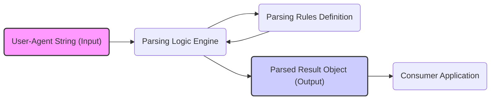

# Project Design Document: ua-parser-js

**Version:** 1.1
**Date:** October 26, 2023
**Author:** AI Software Architect

## 1. Introduction

This document provides an enhanced design overview of the `ua-parser-js` project, a crucial JavaScript library for accurately parsing User-Agent strings. This detailed design serves as a robust foundation for understanding the project's architecture, internal components, and data flow, which is essential for conducting comprehensive threat modeling and identifying potential security vulnerabilities. Accurate parsing of User-Agent strings is vital for various web applications, and any flaws in this process can have security implications.

The primary objective of `ua-parser-js` is to reliably and efficiently extract structured information from diverse User-Agent strings. This includes details about the user's browser, operating system, device type, and rendering engine. This information is leveraged for a wide range of purposes, including web analytics, tailoring content based on browser capabilities, and identifying potential compatibility issues.

## 2. Goals and Objectives

*   **Highly Accurate Parsing:**  The paramount goal is to achieve a high degree of accuracy in identifying and extracting information from a broad spectrum of User-Agent strings, encompassing various browsers, operating systems, and device types, including less common and emerging ones.
*   **Optimal Performance:** The library must be designed for efficiency and performance to minimize any overhead on applications that integrate it, ensuring a smooth user experience.
*   **Ease of Maintenance:** The codebase should be structured for clarity and ease of understanding, facilitating future updates, bug fixes, and contributions from the community.
*   **Flexible Extensibility:** The design should readily accommodate the addition of new parsing rules and the ability to adapt to evolving User-Agent patterns without requiring significant architectural changes.
*   **Cross-Platform Compatibility:** As a JavaScript library, it must function consistently and reliably across various JavaScript execution environments, including web browsers and server-side environments like Node.js.
*   **Security Focus:**  The design must minimize potential security vulnerabilities associated with parsing untrusted input, such as those arising from maliciously crafted User-Agent strings.

## 3. Architecture Overview

The `ua-parser-js` library employs a rule-based parsing mechanism. It relies on a defined set of regular expressions and associated logic to identify patterns within the User-Agent string and extract the relevant information.

*   **User-Agent String (Input):** The library receives a raw User-Agent string as its primary input. This string is typically sourced from the `navigator.userAgent` property in a web browser or from HTTP request headers in a server-side context.
*   **Parsing Logic Engine:** This is the core component responsible for processing the input User-Agent string against the defined parsing rules. It iterates through the rules, attempting to find matches.
*   **Parsing Rules Definition:** This component holds the collection of regular expressions and their corresponding extraction logic. These rules are meticulously crafted to identify specific patterns indicative of different browsers, operating systems, and devices.
*   **Parsed Result Object (Output):** Upon successful parsing, the library generates a structured JavaScript object containing the extracted information. This object typically includes properties detailing the browser name and version, operating system name and version, device type and model, and the rendering engine used.
*   **Consumer Application:**  External JavaScript applications or other libraries integrate `ua-parser-js` to utilize the parsed User-Agent information for their specific functionalities.

## 4. Detailed Design

### 4.1. Core Components

*   **`UAParser` Class:** This is the primary class of the library, serving as the entry point for parsing operations.
    *   **Initialization:** It manages the loading and configuration of the parsing rules.
    *   **Parsing Methods:** It exposes methods, such as `parse()`, for initiating the parsing process on a given User-Agent string.
    *   **Rule Management (Internal):**  Internally, it handles the organization and application of the parsing rules.
*   **Parsing Rules (Data Structure):** These rules are the knowledge base of the library, defining how to interpret User-Agent strings.
    *   **Structure:** Typically defined as an array of objects or a JSON structure. Each rule contains:
        *   A regular expression (`regex`) to match against the User-Agent string.
        *   A set of properties to extract (e.g., `browser.name`, `os.version`).
        *   Logic for extracting and mapping the matched groups from the regular expression to the corresponding properties.
    *   **Categorization:** Rules are often categorized (e.g., browser rules, OS rules, device rules) to improve organization and parsing efficiency.
*   **Regular Expression Engine (JavaScript Built-in):** The library leverages the built-in regular expression engine of the JavaScript environment to perform pattern matching.
*   **Result Object Factory:** This component is responsible for creating and populating the structured object that holds the parsed User-Agent information.
    *   It ensures a consistent structure for the output object.
    *   It maps the extracted information from the parsing rules to the appropriate properties of the result object.

### 4.2. Data Flow (Detailed)

1. A consumer application invokes the `parse()` method of the `UAParser` class, providing the User-Agent string to be analyzed.
2. The `parse()` method internally accesses the loaded parsing rules.
3. The parsing logic engine iterates through the categorized parsing rules (e.g., starting with browser rules).
4. For each rule, the associated regular expression is applied to the input User-Agent string using the JavaScript regular expression engine's `exec()` or `match()` methods.
5. If a match is found:
    *   The captured groups from the regular expression match are extracted.
    *   The extraction logic associated with the matching rule is executed to map these captured groups to specific properties of the result object (e.g., browser name, version).
    *   The corresponding properties in the result object are populated with the extracted values.
6. The process continues, potentially moving to other categories of rules (e.g., OS rules, device rules) to extract further information. The order of rule application can be significant.
7. Once a sufficient number of rules have been evaluated or a satisfactory level of information has been extracted, the populated result object is returned to the calling consumer application.

### 4.3. Configuration and Extensibility

*   **External Rule Files:** Parsing rules are typically defined in external files (often JSON or JavaScript files). This separation of concerns allows for easier updates and maintenance of the rules without modifying the core library code.
*   **Custom Rule Injection:** The library may provide mechanisms for users to inject their own custom parsing rules or override existing ones. This allows for adapting the library to handle specific or unusual User-Agent patterns.
*   **Predefined Rule Sets:** The library often ships with a comprehensive set of predefined rules covering a wide range of common User-Agent strings.

## 5. Security Considerations (For Threat Modeling)

This section outlines potential security considerations that are crucial for a thorough threat modeling exercise.

*   **Regular Expression Denial of Service (ReDoS):**
    *   **Threat:** Maliciously crafted User-Agent strings could exploit vulnerabilities in poorly written regular expressions, causing excessive backtracking and consuming significant CPU resources, leading to denial of service.
    *   **Mitigation Strategies:** Careful review and optimization of regular expressions, potentially using techniques to limit backtracking. Implementing timeouts for regex execution.
*   **Input Validation and Handling of Malformed Input:**
    *   **Threat:** Unexpected or malformed User-Agent strings could cause errors or unexpected behavior in the parsing logic, potentially leading to vulnerabilities.
    *   **Mitigation Strategies:** Implementing robust error handling and validation to gracefully handle unexpected input. Avoiding assumptions about the format of the User-Agent string.
*   **Information Disclosure through Error Messages:**
    *   **Threat:** Verbose error messages during parsing could inadvertently reveal sensitive information about the library's internal workings or the server environment.
    *   **Mitigation Strategies:** Implementing generic error handling and avoiding the display of detailed error messages to end-users.
*   **Security of Rule Definition Files:**
    *   **Threat:** If custom rule definition files are allowed, vulnerabilities could arise if these files are not properly sanitized or validated, potentially leading to code injection if the rules are interpreted dynamically.
    *   **Mitigation Strategies:**  Strict validation of custom rule files. Limiting the ability to inject arbitrary code through custom rules.
*   **Dependency Chain Security:**
    *   **Threat:** While `ua-parser-js` appears to be self-contained, if future versions introduce dependencies, the security of those dependencies must be considered.
    *   **Mitigation Strategies:**  Regularly auditing and updating dependencies to address known vulnerabilities.
*   **Potential for Logic Errors in Parsing Rules:**
    *   **Threat:** Incorrectly written parsing rules could lead to misidentification of browsers, operating systems, or devices, potentially leading to incorrect application behavior or security decisions based on flawed information.
    *   **Mitigation Strategies:**  Thorough testing and validation of parsing rules. Community review and contribution to rule definitions.

## 6. Assumptions and Constraints

*   **General Adherence to User-Agent Conventions:** The library assumes that the input User-Agent strings generally follow established conventions. Highly unusual or deliberately obfuscated strings might not be parsed accurately.
*   **Availability of JavaScript Regular Expression Engine:** The core functionality relies on the availability and correct operation of the JavaScript regular expression engine in the execution environment.
*   **Accuracy Dependent on Rule Definitions:** The accuracy and completeness of the parsing are directly dependent on the quality and comprehensiveness of the defined parsing rules. New or emerging User-Agent patterns will require updates to these rules.
*   **No External Network Requests:** The core parsing functionality is assumed to be self-contained and does not rely on external network requests during the parsing process.

## 7. Future Considerations

*   **Automated Rule Update Mechanism:** Exploring the possibility of an automated mechanism for updating parsing rules to keep pace with new browser and device releases.
*   **Performance Benchmarking and Optimization:** Continuously monitoring and optimizing the performance of the parsing logic and regular expressions to ensure efficiency.
*   **Modular Architecture:** Further modularizing the codebase to enhance maintainability and facilitate the addition of new features or parsing strategies.
*   **Enhanced Testing and Validation Framework:** Implementing a more comprehensive testing framework, including tests against a wider range of User-Agent strings and edge cases.
*   **Community Contributions and Rule Management:**  Streamlining the process for community contributions to the parsing rules and improving the management and validation of these contributions.

This enhanced design document provides a more in-depth understanding of the `ua-parser-js` project, specifically focusing on aspects relevant to security and threat modeling. This detailed information will be invaluable for identifying potential vulnerabilities and implementing appropriate security measures.
