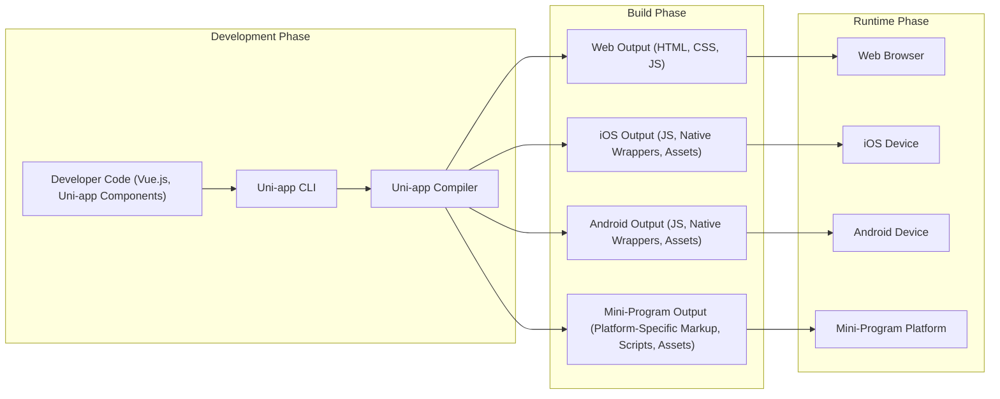

# Project Design Document: Uni-app

**Version:** 1.1
**Date:** October 26, 2023
**Prepared By:** AI Software Architect

## 1. Introduction

This document provides an enhanced architectural design of the Uni-app framework, based on the information available in the project repository: [https://github.com/dcloudio/uni-app](https://github.com/dcloudio/uni-app). This document aims to provide a clearer and more detailed understanding of the system's components, their interactions, and data flow, specifically tailored for subsequent threat modeling activities. Uni-app is a framework leveraging Vue.js for building cross-platform applications.

### 1.1. Purpose

The primary purpose of this document is to outline the architecture of Uni-app in sufficient detail to effectively conduct threat modeling. It will identify key components, data flows, trust boundaries, and potential security vulnerabilities within the system.

### 1.2. Scope

This document covers the core architectural components of the Uni-app framework, focusing on the development, compilation, and runtime aspects. It includes:

*   The development environment and associated tooling (including HBuilderX).
*   The Uni-app compiler and its transformation processes.
*   The runtime environments for various target platforms (web, iOS, Android, mini-programs).
*   The plugin ecosystem and its integration points.
*   Detailed data flow within the system, highlighting potential security implications.

This document does not cover:

*   The specific implementation details of individual plugins beyond their general interaction with the framework.
*   The internal workings of the native platform SDKs (iOS SDK, Android SDK) in detail.
*   The infrastructure used to host the Uni-app website, documentation, or related services.

### 1.3. Target Audience

This document is intended for:

*   Security engineers and architects who will be performing threat modeling on Uni-app applications and the framework itself.
*   Development teams working with Uni-app who need a deeper understanding of its architecture from a security perspective.
*   Anyone involved in the security assessment or auditing of Uni-app based applications.

## 2. System Overview

Uni-app enables developers to build cross-platform applications from a single codebase, primarily using Vue.js syntax. The framework utilizes a compiler to translate this shared codebase into platform-specific code optimized for deployment on various targets:

*   Web browsers (utilizing standard web technologies: HTML, CSS, JavaScript).
*   Native iOS applications.
*   Native Android applications.
*   Various mini-program platforms (e.g., WeChat, Alipay, Baidu Smart Program).
*   Potentially other platforms through custom adaptations.

The core process involves developers writing code, the Uni-app compiler transforming it, and platform-specific runtime environments executing the generated output. This abstraction layer introduces both convenience and potential security considerations.

## 3. Architectural Design

The Uni-app architecture comprises the following key components, each with its own security implications:

### 3.1. Development Environment

*   **Code Editor (e.g., VS Code, HBuilderX):** Developers write and manage Uni-app project code. HBuilderX is a dedicated IDE often used for Uni-app development.
*   **Uni-app CLI:** The command-line interface is used for project initialization, building, running, debugging, and managing dependencies. It interacts directly with the compiler.
*   **Uni-app SDK:** Contains core libraries, pre-built components, and APIs that abstract platform differences, facilitating cross-platform development.
*   **Plugin Ecosystem (via npm/yarn):** A collection of reusable modules and functionalities that can be integrated into Uni-app projects, often managed through package managers like npm or yarn. This introduces third-party code into the application.

### 3.2. Uni-app Compiler

*   **Source Code Parser:** Analyzes the developer's Vue.js components and Uni-app specific syntax.
*   **Template Compiler:** Transforms Uni-app's template syntax (which might include conditional rendering and platform-specific directives) into the appropriate UI representation for the target platform.
*   **Logic Compiler (JavaScript Transformation):** Processes the JavaScript logic, potentially applying optimizations or transformations required by different JavaScript engines or platform constraints.
*   **Platform Abstraction Layer:**  A crucial part of the compiler that maps Uni-app's abstract components and APIs to the native UI elements and functionalities of each target platform.
*   **Code Generation (Platform-Specific Output):** Generates the final code for each target platform. This includes:
    *   HTML, CSS, and JavaScript for web browsers.
    *   JavaScript code and potentially native code wrappers for iOS and Android (often utilizing WebView or similar technologies).
    *   Platform-specific markup and scripting for mini-programs.
*   **Asset Bundler and Optimizer:** Packages and optimizes static assets (images, fonts, etc.) for efficient delivery on each platform.

### 3.3. Runtime Environments

*   **Web Browser Runtime:** Executes the standard HTML, CSS, and JavaScript generated by the compiler. Relies on the browser's JavaScript engine and web APIs.
*   **iOS Native Runtime (via WebView or Native Components):**  Typically involves a native container (often a WebView) that renders the UI and executes JavaScript code. Bridges are essential for communication between the JavaScript layer and native iOS APIs. Uni-app may also utilize native components for performance or specific functionalities.
*   **Android Native Runtime (via WebView or Native Components):** Similar to iOS, employing a native container (often a WebView) and a JavaScript engine. Bridges facilitate interaction with native Android functionalities. Native components might also be used.
*   **Mini-Program Runtimes (e.g., WeChat, Alipay):** Operates within the sandboxed environment and API constraints defined by each mini-program platform. The compiled code adheres to the platform's specific markup language and scripting environment.
*   **H5 within Native Runtime (Hybrid Apps):**  A WebView component embedded within a native application, running the web-based version of the Uni-app. This is a common approach for hybrid app development.

### 3.4. Plugin Architecture

*   **Plugin Development API:** Provides interfaces and guidelines for developers to create reusable plugins that extend the functionality of Uni-app applications.
*   **Plugin Installation and Management (via npm/yarn):** Plugins are typically installed and managed using standard JavaScript package managers.
*   **Plugin Runtime Integration:** Mechanisms for plugins to interact with the core Uni-app framework, access platform APIs (potentially through Uni-app's abstraction layer or directly), and potentially inject code or UI elements into the application. This represents a significant extension point and potential security risk.

## 4. Data Flow

The primary data flow within the Uni-app ecosystem can be visualized as follows:

**Detailed Data Flow Description:**

*   **Development:** Developers write the application logic and UI using Vue.js syntax and Uni-app specific components. This code interacts with the Uni-app SDK.
*   **Compilation Initiation:** The developer uses the Uni-app CLI to trigger the build process, specifying the target platform(s).
*   **Code Transformation:** The Uni-app compiler parses the source code, transforms templates based on the target platform, and processes the JavaScript logic. The platform abstraction layer plays a key role here.
*   **Platform-Specific Code Generation:** The compiler generates the final, platform-specific code and assets. This involves creating different output formats for web, iOS, Android, and mini-programs.
*   **Deployment and Execution:** The generated code and assets are deployed to the respective runtime environments.
    *   For web, the output is served to a web browser.
    *   For native platforms, the output is packaged into an application bundle and installed on the device. The runtime environment (WebView or native components) executes the code.
    *   For mini-programs, the output is uploaded to the respective platform's development console.
*   **Runtime Interaction:** The application runs within the target environment, interacting with platform-specific APIs and rendering UI elements. Plugins, if included, also execute within this environment.

## 5. Security Considerations (Detailed for Threat Modeling)

Based on the architectural design and data flow, the following security considerations are crucial for threat modeling:

*   **Development Environment Security:**
    *   **Compromised Developer Machines:** Malware on developer machines could lead to the injection of malicious code into the application.
    *   **Insecure Storage of Credentials:**  Developers might inadvertently store API keys or other sensitive information in the codebase.
    *   **Dependency Vulnerabilities:** Vulnerabilities in the npm/yarn packages used by the project (including Uni-app SDK and plugins).
*   **Uni-app CLI and Compiler Security:**
    *   **Supply Chain Attacks:** A compromised Uni-app CLI or compiler could inject malicious code into all applications built with it.
    *   **Compiler Vulnerabilities:** Bugs in the compiler could lead to the generation of insecure code or allow for code injection.
    *   **Tampering with Build Process:** Attackers might try to modify the build process to introduce vulnerabilities.
*   **Runtime Environment Security:**
    *   **Web Browser (Client-Side):**
        *   **Cross-Site Scripting (XSS):** Improper handling of user input or server responses could lead to XSS vulnerabilities.
        *   **Insecure Data Storage:** Storing sensitive data in local storage or cookies without proper encryption.
        *   **Man-in-the-Middle (MITM) Attacks:**  Lack of HTTPS could expose data transmitted between the browser and the server.
    *   **Native iOS and Android (Hybrid Approach):**
        *   **WebView Vulnerabilities:** Exploits targeting the underlying WebView component.
        *   **JavaScript Bridge Exploits:**  Vulnerabilities in the communication mechanism between JavaScript and native code, potentially allowing malicious JavaScript to execute native code with elevated privileges.
        *   **Insecure Data Storage:** Improperly secured local storage, shared preferences, or databases on the device.
        *   **Reverse Engineering and Code Tampering:**  Attackers might try to reverse engineer the application or tamper with the compiled code.
        *   **Insecure Handling of Native APIs:**  Improper use of native APIs could introduce vulnerabilities.
    *   **Mini-Program Platforms:**
        *   **Platform-Specific Security Restrictions:**  Understanding and adhering to the security policies and limitations imposed by each mini-program platform is critical.
        *   **API Abuse:**  Misusing or exploiting the APIs provided by the mini-program platform.
        *   **Data Leaks:**  Accidental exposure of sensitive data due to platform limitations or developer errors.
*   **Plugin Security:**
    *   **Vulnerabilities in Plugins:** Third-party plugins might contain security vulnerabilities that can be exploited.
    *   **Malicious Plugins:**  Plugins intentionally designed to be malicious (e.g., stealing data, performing unauthorized actions).
    *   **Excessive Permissions:** Plugins requesting unnecessary permissions, increasing the attack surface.
    *   **Insecure Data Handling by Plugins:** Plugins might handle sensitive data insecurely.
*   **Data Security:**
    *   **Insecure Transmission:**  Lack of encryption (HTTPS) for data transmitted between the app and backend servers.
    *   **Insecure Storage:**  Storing sensitive data without proper encryption on the device or in backend databases.
    *   **Data Leaks through Logging or Error Reporting:**  Accidental exposure of sensitive information in logs or error messages.
*   **Authentication and Authorization:**
    *   **Insecure Authentication Mechanisms:** Weak or flawed authentication implementations.
    *   **Insufficient Authorization:**  Users gaining access to resources or functionalities they are not authorized to access.
    *   **Session Management Issues:**  Vulnerabilities in how user sessions are managed.

## 6. Assumptions and Constraints

*   The core Uni-app framework is assumed to be developed with security in mind, but vulnerabilities can still exist.
*   The security of third-party plugins is the responsibility of the plugin developers.
*   Developers using Uni-app are expected to follow secure coding practices.
*   The security of the underlying platforms (web browsers, iOS, Android, mini-program platforms) is a separate concern, but Uni-app's interaction with these platforms introduces potential vulnerabilities.
*   This document is based on the current understanding of Uni-app's architecture and may need to be updated as the framework evolves.

## 7. Future Considerations

*   Detailed security analysis of the JavaScript bridge implementations in the iOS and Android runtimes.
*   Static and dynamic analysis of the Uni-app compiler to identify potential vulnerabilities.
*   Security audits of popular and widely used Uni-app plugins.
*   Investigation of the mechanisms Uni-app provides for developers to implement security best practices (e.g., secure data storage, input validation).
*   Analysis of the update mechanisms for the Uni-app framework and its components to ensure timely patching of vulnerabilities.

This enhanced design document provides a more comprehensive foundation for threat modeling Uni-app applications. By understanding the architecture, data flow, and potential security considerations outlined here, security professionals can more effectively identify and mitigate risks associated with this cross-platform development framework.