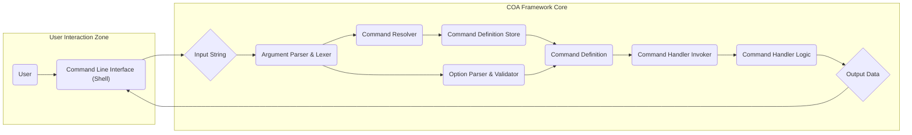
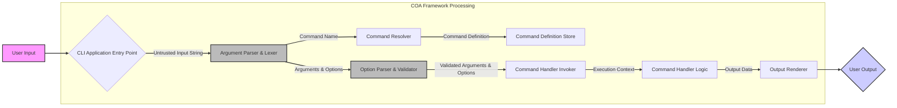

# Project Design Document: Command-line Application Toolkit (COA) - Improved

**Project Repository:** [https://github.com/veged/coa](https://github.com/veged/coa)

**1. Introduction**

This document provides an enhanced design overview of the Command-line Application Toolkit (COA) project. COA is a Node.js framework designed to streamline the development of command-line interface (CLI) applications. This document details the architectural components, data flow with a focus on security boundaries, and technologies involved. It serves as a crucial artifact for subsequent threat modeling activities, providing the necessary context and detail for identifying potential vulnerabilities.

**2. Goals and Objectives**

The primary goals of COA are to:

*   Offer a declarative and intuitive method for defining CLI commands, subcommands, and options.
*   Automate argument parsing, validation, and type coercion from user input.
*   Provide built-in mechanisms for generating help messages and command discovery.
*   Facilitate asynchronous operations and complex command logic within CLI applications.
*   Promote modularity, reusability, and maintainability in CLI application development.

**3. High-Level Architecture**

The COA framework employs a modular architecture centered around command definitions and a central dispatcher. User input is processed through a series of stages to ultimately execute the appropriate command handler.

**4. Detailed Design**

This section elaborates on the individual components and their interactions, with an emphasis on data flow and potential security considerations.

*   **User:** The actor interacting with the CLI application by providing commands, arguments, and options through the shell.

*   **Command Line Interface (Shell):** The terminal or shell environment where the user executes the CLI application. This is the initial entry point for user input.

*   **Input String:** The raw text string entered by the user in the shell. This is the initial untrusted data.

*   **Argument Parser & Lexer:** This component is responsible for the initial processing of the `Input String`. It performs lexical analysis to break the input into tokens (command name, arguments, options). Security consideration: This is a critical point for input validation to prevent command injection or unexpected behavior due to malformed input.

*   **Command Resolver:**  This component takes the identified command name from the parser and looks it up in the `Command Definition Store`.

*   **Command Definition Store:** A registry holding the definitions of all available commands, subcommands, and their associated metadata (arguments, options, handlers). This could be implemented as in-memory data structures or loaded from configuration files.

*   **Command Definition:**  A structured representation of a specific command. It includes:
    *   Command name and aliases.
    *   Description and help text.
    *   Definitions of expected arguments (name, type, validation rules).
    *   Definitions of available options (flags and parameters) with types, defaults, validation rules, and potential security implications (e.g., sensitive data).
    *   Reference to the `Command Handler Logic`.

*   **Option Parser & Validator:** This component processes the options provided by the user based on the `Command Definition`. It extracts option values, performs type coercion, and enforces validation rules defined in the `Command Definition`. Security consideration: Robust validation here is crucial to prevent injection attacks via options and to ensure data integrity.

*   **Command Handler Invoker:**  Once the command and its arguments/options are parsed and validated, this component is responsible for invoking the appropriate `Command Handler Logic`.

*   **Command Handler Logic:** This is the application-specific code that implements the functionality of a particular command. It receives the parsed and validated arguments and options. Security consideration: This is where the core application logic resides, and vulnerabilities within this logic are a primary concern. Access control and secure handling of sensitive data are critical here.

*   **Output Data:** The data generated by the `Command Handler Logic` that needs to be presented back to the user. Security consideration:  Care must be taken to avoid leaking sensitive information in the output.

**5. Data Flow with Security Boundaries**

The following diagram illustrates the data flow, highlighting potential security boundaries:

**6. Technology Stack**

*   **Programming Language:** JavaScript (Node.js)
*   **Core Framework:** COA (Command-line Application Toolkit)
*   **Package Manager:** npm or yarn
*   **Operating System:** Platform independent (where Node.js is supported)

**7. Deployment Model**

COA applications are typically deployed as:

*   Globally installed command-line tools accessible from the system's PATH.
*   Locally installed dependencies within a larger Node.js project.
*   Packaged executables for specific operating systems using tools like `pkg`.

**8. Key Components for Threat Modeling (Detailed)**

This section expands on the components critical for threat modeling:

*   **Argument Parser & Lexer:**
    *   **Threats:** Command injection, denial of service through resource exhaustion (e.g., extremely long input strings).
    *   **Considerations:** Input sanitization, whitelisting allowed characters, limiting input length.
*   **Option Parser & Validator:**
    *   **Threats:** Option injection, type confusion, exploitation of default values, insecure handling of sensitive options (e.g., passwords).
    *   **Considerations:** Strict type checking, validation against allowed values, secure storage and handling of sensitive option data, preventing the introduction of unexpected options.
*   **Command Handler Logic:**
    *   **Threats:** Application-specific vulnerabilities (e.g., SQL injection if interacting with databases, arbitrary file access, remote code execution if handling external input), insecure API interactions.
    *   **Considerations:** Secure coding practices, input validation within the handler, output encoding, principle of least privilege for resource access.
*   **Command Definition Store:**
    *   **Threats:** Tampering with command definitions to alter behavior or introduce malicious commands, unauthorized access to sensitive command metadata.
    *   **Considerations:** Secure storage and access control for command definitions, integrity checks to prevent modification.
*   **Configuration Loading (If Applicable):**
    *   **Threats:**  Loading malicious configuration files, exposure of sensitive configuration data.
    *   **Considerations:** Secure storage and access control for configuration files, validation of configuration data, avoiding storing sensitive information in plain text.
*   **External Interactions (If Applicable):**
    *   **Threats:**  Man-in-the-middle attacks, insecure API communication, injection vulnerabilities in external systems.
    *   **Considerations:** Using secure protocols (HTTPS), validating external responses, secure authentication and authorization.

**9. Security Considerations (Specific)**

Building upon the general considerations, here are more specific security aspects relevant to COA applications:

*   **Input Sanitization:**  Thoroughly sanitize all user-provided input before processing.
*   **Output Encoding:** Encode output appropriately to prevent cross-site scripting (XSS) if the CLI output is used in a web context (less common but possible).
*   **Secure Credential Handling:** Avoid storing credentials directly in the application code or configuration files. Use secure methods like environment variables or dedicated credential management systems.
*   **Dependency Vulnerabilities:** Regularly audit and update dependencies to patch known security vulnerabilities.
*   **Error Handling and Logging:** Implement robust error handling that doesn't expose sensitive information. Maintain secure and informative logs.
*   **Permissions and Access Control:** Ensure the CLI application runs with the minimum necessary privileges.

**10. Future Considerations**

Potential future enhancements to COA could include:

*   More sophisticated input validation and sanitization utilities.
*   Built-in support for secure credential management.
*   Enhanced logging and auditing capabilities.
*   Formalized security testing guidelines and tools for COA-based applications.

This improved design document provides a more detailed and security-focused overview of the COA project's architecture and components. It should serve as a more effective foundation for conducting thorough threat modeling and identifying potential security vulnerabilities.
