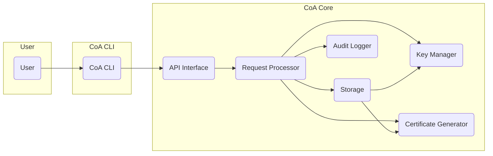
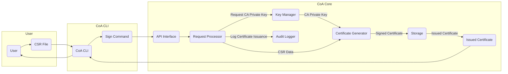
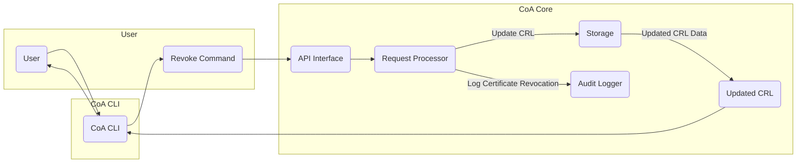

# Project Design Document: Certificate Authority (CoA)

**Project Repository:** https://github.com/veged/coa

**Version:** 1.1
**Date:** October 26, 2023
**Author:** AI Software Architect

## 1. Introduction

This document provides an enhanced and detailed design overview of the Certificate Authority (CoA) project. This design will serve as the foundation for subsequent threat modeling activities. The primary goal of CoA is to offer a straightforward, secure, and dependable system for the management and issuance of digital certificates. This document elaborates on the system's architecture, key components, data flow for critical operations, and crucial security considerations.

## 2. Goals and Objectives

*   Provide a user-friendly command-line interface (CLI) for comprehensive management of the certificate authority.
*   Enable the generation of Certificate Signing Requests (CSRs) with various options.
*   Facilitate the signing of CSRs to issue digital certificates with configurable validity periods and extensions.
*   Support a range of key types (e.g., RSA, ECDSA) and signing algorithms (e.g., SHA256, SHA512).
*   Securely store private keys, employing industry best practices.
*   Offer flexible options for certificate revocation, including CRL generation.
*   Maintain a detailed and auditable log of all significant operations performed within the system.

## 3. System Architecture

The CoA system is designed with a modular architecture, promoting separation of concerns for improved maintainability, scalability, and security.

### 3.1. High-Level Architecture

*   **User:** Interacts with the certificate authority system through the command-line interface (CoA CLI).
*   **CoA CLI:** The command-line interface acts as the primary point of interaction, providing access to all CoA functionalities.
*   **CoA Core:** The central component encapsulating the core logic and functionalities of the certificate authority.
    *   **API Interface:**  Provides a well-defined interface for communication between the CLI and the core logic. This could be implemented using REST or gRPC.
    *   **Request Processor:**  Receives requests from the API Interface, orchestrates the necessary steps, and coordinates interactions between other core components.
    *   **Key Manager:**  Responsible for the secure generation, storage, retrieval, and lifecycle management of cryptographic keys.
    *   **Certificate Generator:**  Handles the creation and signing of digital certificates based on provided CSRs and CA configurations.
    *   **Storage:**  Persistently stores critical data, including private keys (encrypted), issued certificates, and revocation lists.
    *   **Audit Logger:**  Records a comprehensive audit trail of significant actions performed within the system for security and compliance purposes.

### 3.2. Detailed Component Breakdown

*   **CoA CLI:**
    *   Parses commands entered by the user, interpreting the intended action.
    *   Validates user input to ensure it conforms to expected formats and constraints.
    *   Communicates with the CoA Core API, sending requests and receiving responses.
    *   Formats and displays output to the user in a clear and understandable manner.
*   **API Interface:**
    *   Exposes a set of well-defined endpoints for different CoA functionalities (e.g., certificate issuance, revocation, key generation).
    *   Handles request routing, directing incoming requests to the appropriate handler within the Request Processor.
    *   Implements authentication and authorization mechanisms (if required) to control access to sensitive operations.
    *   Translates requests from the CLI into actionable commands for the Request Processor.
*   **Request Processor:**
    *   Receives validated requests from the API Interface.
    *   Performs business logic validation to ensure the request is valid in the current system state.
    *   Coordinates the execution of the requested operation by interacting with other core components (Key Manager, Certificate Generator, Storage, Audit Logger).
    *   Manages the state of ongoing operations and handles potential errors or exceptions.
*   **Key Manager:**
    *   Generates new private keys for the CA and potentially for end-entity certificates, supporting various key types and algorithms.
    *   Securely stores private keys, employing encryption at rest using strong encryption algorithms.
    *   Retrieves private keys securely for signing operations, potentially involving secure enclaves or memory locking.
    *   May support integration with Hardware Security Modules (HSMs) or Cloud KMS for enhanced security and compliance requirements (future consideration).
*   **Certificate Generator:**
    *   Receives Certificate Signing Requests (CSRs) as input.
    *   Validates the CSR to ensure it conforms to standards and policies.
    *   Retrieves the CA's private key securely from the Key Manager.
    *   Signs the CSR using the CA's private key, applying the configured signing algorithm.
    *   Generates the final digital certificate, including relevant extensions and validity periods.
    *   Stores the issued certificate in the Storage component.
*   **Storage:**
    *   Persists the CA's private key in an encrypted format.
    *   Stores issued certificates, potentially with metadata for tracking and management.
    *   Maintains Certificate Revocation Lists (CRLs), updating them as certificates are revoked.
    *   Potentially stores audit logs, depending on the chosen audit logging strategy.
    *   The specific storage mechanism (e.g., file system with encryption, dedicated database) is an implementation detail that can be chosen based on performance and security requirements.
*   **Audit Logger:**
    *   Records significant events with relevant details, such as:
        *   CA key generation and rotation.
        *   Certificate issuance, renewal, and revocation.
        *   Configuration changes to the CA.
        *   Failed authentication attempts (if implemented).
    *   Provides a mechanism for securely storing and reviewing audit logs, ensuring their integrity and non-repudiation.

## 4. Data Flow

### 4.1. Certificate Issuance

1. The **User** generates a **CSR File** using a tool like `openssl`.
2. The **User** executes the **CoA CLI** with the **Sign Command**, providing the path to the CSR file.
3. The **CoA CLI** sends a certificate signing request to the **API Interface**.
4. The **API Interface** routes the request to the **Request Processor**.
5. The **Request Processor** requests the CA's private key from the **Key Manager**.
6. The **Key Manager** securely provides the **CA Private Key** to the **Certificate Generator**.
7. The **Request Processor** forwards the **CSR Data** to the **Certificate Generator**.
8. The **Certificate Generator** signs the CSR, producing the **Signed Certificate**, and stores it in **Storage**.
9. The **Storage** component provides the **Issued Certificate** back to the **Request Processor**.
10. The **Request Processor** instructs the **Audit Logger** to record the certificate issuance event.
11. The **Issued Certificate** is returned to the **CoA CLI**.
12. The **CoA CLI** presents the **Issued Certificate** to the **User**.

### 4.2. Certificate Revocation

1. The **User** uses the **CoA CLI** with the **Revoke Command**, specifying the certificate to be revoked (e.g., by serial number).
2. The **CoA CLI** sends a certificate revocation request to the **API Interface**.
3. The **API Interface** forwards the request to the **Request Processor**.
4. The **Request Processor** instructs the **Storage** component to update the **CRL** by adding the revoked certificate's information.
5. The **Request Processor** instructs the **Audit Logger** to record the certificate revocation event.
6. The **Storage** component generates or updates the **Updated CRL Data**.
7. The **Updated CRL** (or a notification of its update) is returned to the **CoA CLI**.
8. The **CoA CLI** may then distribute the updated **CRL** as needed.

## 5. Security Considerations

*   **Private Key Protection:** The CA's private key is the paramount security asset. Robust measures are required for its generation, storage, and usage. This includes:
    *   Generating keys using cryptographically secure random number generators.
    *   Storing keys encrypted at rest using strong, industry-standard encryption algorithms.
    *   Restricting access to the private key to only authorized components and processes.
    *   Considering the use of Hardware Security Modules (HSMs) or Cloud KMS for enhanced physical and logical security.
*   **Access Control and Authentication:** Implement strong authentication and authorization mechanisms to control access to CoA functionalities. This may involve:
    *   Authenticating users interacting with the CLI.
    *   Authorizing actions based on user roles or permissions.
    *   Securing the API Interface to prevent unauthorized access.
*   **Secure Communication:** Ensure secure communication channels between the CLI and the CoA Core, especially if the API is exposed over a network. This can be achieved using:
    *   TLS/HTTPS for encrypting communication.
    *   Mutual authentication to verify the identity of both the client and the server.
*   **Input Validation and Sanitization:**  Thoroughly validate and sanitize all user inputs to prevent common vulnerabilities such as:
    *   Injection attacks (e.g., command injection).
    *   Cross-site scripting (XSS) if a web interface is introduced.
    *   Denial-of-service (DoS) attacks through malformed input.
*   **Comprehensive Audit Logging:** Maintain detailed and tamper-proof audit logs to track all significant actions. This is crucial for:
    *   Security monitoring and incident response.
    *   Compliance with regulatory requirements.
    *   Identifying potential security breaches or misconfigurations.
*   **Certificate Revocation Management:** Implement a reliable and efficient certificate revocation mechanism, such as:
    *   Generating and publishing Certificate Revocation Lists (CRLs) at regular intervals.
    *   Considering support for Online Certificate Status Protocol (OCSP) for real-time certificate validation.
*   **Dependency Management:** Securely manage external dependencies to mitigate risks associated with vulnerable third-party libraries. This includes:
    *   Keeping dependencies up-to-date with security patches.
    *   Using dependency scanning tools to identify known vulnerabilities.
*   **Regular Security Assessments:** Conduct periodic security audits and penetration testing to proactively identify and address potential weaknesses in the system's design and implementation.
*   **Secure Defaults and Configuration:**  Employ secure default configurations for all security-sensitive parameters, such as:
    *   Strong cryptographic algorithms and key lengths.
    *   Appropriate certificate validity periods.
    *   Secure storage settings.

## 6. Deployment Considerations

*   **Standalone Server Deployment:** A straightforward deployment model where all CoA components are deployed on a single, dedicated server. Suitable for development, testing, and small-scale, isolated environments.
*   **Containerized Deployment:** Packaging CoA components into containers (e.g., Docker) facilitates consistent deployments across different environments and simplifies management. Orchestration tools like Kubernetes can be used for managing containerized deployments.
*   **Cloud-Based Deployment:** Deploying CoA on cloud platforms (e.g., AWS, Azure, GCP) offers scalability, high availability, and access to cloud-specific security services. Different components can be deployed as separate services within the cloud environment.
*   **Distributed Deployment:** For high-availability and scalability, components can be deployed across multiple servers. This requires careful consideration of network communication, data synchronization, and load balancing.

## 7. Future Considerations

*   **Web-Based Management Interface:** Develop a user-friendly web interface to complement the CLI, providing an alternative way to manage the certificate authority.
*   **Online Certificate Status Protocol (OCSP) Support:** Implement OCSP to provide real-time certificate status information, offering a more efficient alternative to CRLs in some scenarios.
*   **Hardware Security Module (HSM) Integration:**  Integrate with HSMs to provide a higher level of security for the CA's private key, meeting stringent compliance requirements.
*   **Automated Certificate Renewal:** Implement mechanisms for automatically renewing certificates before they expire, reducing administrative overhead and preventing service disruptions.
*   **Policy-Based Certificate Issuance:** Introduce a policy engine to enforce specific rules and constraints on certificate issuance, ensuring compliance with organizational policies.
*   **Support for Different Certificate Profiles:** Allow the creation of certificates with varying extensions and attributes based on predefined profiles, catering to different use cases.
*   **Integration with Identity Providers:** Integrate with existing identity providers (e.g., LDAP, Active Directory) for user authentication and authorization.

This enhanced design document provides a more detailed and comprehensive overview of the CoA project. It serves as a solid foundation for understanding the system's architecture, data flow, and security considerations, making it a valuable resource for the subsequent threat modeling process.