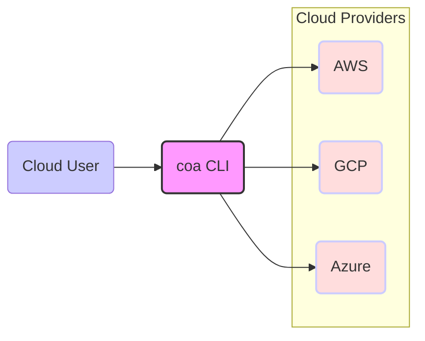

# BUSINESS POSTURE

- Business Priorities and Goals:
 - Goal: Provide a command-line tool to simplify and automate cloud operations across multiple cloud providers (AWS, GCP, Azure).
 - Priority: Enhance cloud efficiency, reduce operational overhead, and improve cloud security posture for users.
 - Goal: Enable users to gain better visibility into their cloud environments, especially regarding cost and security.
 - Priority: Offer a user-friendly and extensible tool that can be easily adopted and integrated into existing workflows.

- Business Risks:
 - Risk: Misconfiguration or misuse of the tool leading to unintended changes or security vulnerabilities in the cloud environments.
 - Risk: Lack of user adoption due to complexity, insufficient documentation, or lack of desired features.
 - Risk: Security vulnerabilities in the tool itself could be exploited to compromise user cloud environments.
 - Risk: Dependency on external cloud provider APIs and services, which could change or become unavailable, impacting the tool's functionality.
 - Risk: Open-source nature of the project might lead to slower development or lack of dedicated support compared to commercial alternatives.

# SECURITY POSTURE

- Existing Security Controls:
 - security control: Code hosted on GitHub, leveraging GitHub's security features for repository access control and vulnerability scanning. (Implemented: GitHub platform)
 - security control: Open-source project, allowing community review and contribution to identify and fix security issues. (Implemented: Open-source development model)
 - security control: Use of standard libraries and frameworks, potentially benefiting from their inherent security features and community scrutiny. (Implemented: Codebase - needs further investigation)
 - accepted risk: Reliance on user's cloud provider credentials and permissions, assuming users follow best practices for credential management.
 - accepted risk: Potential vulnerabilities in dependencies, requiring regular updates and dependency scanning.

- Recommended Security Controls:
 - security control: Implement automated security scanning (SAST/DAST) in the CI/CD pipeline to detect vulnerabilities early in the development process.
 - security control: Conduct regular dependency vulnerability scanning and updates to mitigate risks from vulnerable libraries.
 - security control: Implement input validation and sanitization to prevent injection attacks.
 - security control: Implement secure credential management practices within the tool, avoiding hardcoding or insecure storage of credentials.
 - security control: Provide clear documentation and guidance on secure usage of the tool, including least privilege principles and secure credential handling.

- Security Requirements:
 - Authentication:
  - Requirement: The tool itself does not require user authentication as it is a command-line tool executed in the user's environment.
  - Requirement: Authentication to cloud providers is handled by the respective cloud provider SDKs and CLIs, leveraging existing cloud authentication mechanisms (e.g., IAM roles, service accounts, API keys).
 - Authorization:
  - Requirement: The tool should respect and enforce the authorization policies defined in the target cloud environments.
  - Requirement: Users must have appropriate permissions in their cloud accounts to perform actions using the tool.
  - Requirement: The tool should not escalate user privileges or bypass existing authorization controls.
 - Input Validation:
  - Requirement: All user inputs, including command-line arguments and configuration files, must be thoroughly validated to prevent injection attacks (e.g., command injection, argument injection).
  - Requirement: Input validation should be performed on both the client-side (within the tool) and potentially on the server-side if the tool interacts with any backend services (currently not evident).
 - Cryptography:
  - Requirement: Sensitive data, such as cloud provider credentials or API keys, should be handled securely and potentially encrypted at rest if stored locally by the tool.
  - Requirement: Communication with cloud provider APIs should be encrypted using HTTPS.
  - Requirement: Consider using cryptographic signatures to verify the integrity of downloaded components or updates if applicable.

# DESIGN

## C4 CONTEXT



- Context Diagram Elements:
 - Element:
  - Name: Cloud User
  - Type: Person
  - Description: A cloud engineer, DevOps engineer, or system administrator who uses the coa CLI tool to manage and operate cloud resources.
  - Responsibilities: Uses the coa CLI to perform cloud operations, analyze costs, and manage security configurations across different cloud providers.
  - Security controls: Manages their own cloud provider credentials and access keys securely. Responsible for understanding and applying the principle of least privilege when using the tool.
 - Element:
  - Name: coa CLI
  - Type: Software System
  - Description: Command-line interface tool for cloud operations automation, supporting AWS, GCP, and Azure.
  - Responsibilities: Provides a unified interface for interacting with multiple cloud providers, automating tasks, and providing insights into cloud environments.
  - Security controls: Input validation, secure handling of cloud provider credentials (delegated to cloud SDKs), and adherence to cloud provider security best practices.
 - Element:
  - Name: AWS
  - Type: Software System
  - Description: Amazon Web Services cloud platform, providing various cloud services and APIs.
  - Responsibilities: Provides infrastructure, services, and APIs for compute, storage, networking, security, and more.
  - Security controls: AWS IAM for access control, VPCs for network isolation, encryption services, and various security monitoring and logging tools.
 - Element:
  - Name: GCP
  - Type: Software System
  - Description: Google Cloud Platform, offering a suite of cloud computing services.
  - Responsibilities: Provides infrastructure, services, and APIs similar to AWS, including compute, storage, networking, and security services.
  - Security controls: GCP IAM for access control, VPC networks, encryption services, and Google Cloud Security Command Center.
 - Element:
  - Name: Azure
  - Type: Software System
  - Description: Microsoft Azure cloud platform, providing a wide range of cloud services.
  - Responsibilities: Offers infrastructure, services, and APIs comparable to AWS and GCP.
  - Security controls: Azure Active Directory for identity and access management, virtual networks, Azure Key Vault for secrets management, and Azure Security Center.

## C4 CONTAINER

```mermaid
graph LR
    subgraph Cloud User Environment
        U1("Cloud User"):::person --> CLI("coa CLI"):::container
    end
    subgraph coa CLI Container
        CLI --> CMD("Command Parser"):::container
        CLI --> CFG("Configuration Manager"):::container
        CLI --> PLG("Plugins"):::container
        PLG --> AWS_SDK["AWS SDK"]:::container
        PLG --> GCP_SDK["GCP SDK"]:::container
        PLG --> Azure_SDK["Azure SDK"]:::container
        CMD --> CFG
        CMD --> PLG
    end
    AWS_SDK --> AWS_API[/"AWS APIs"/]::software_system
    GCP_SDK --> GCP_API[/"GCP APIs"/]::software_system
    Azure_SDK --> Azure_API[/"Azure APIs"/]::software_system

    style CLI fill:#f9f,stroke:#333,stroke-width:2px
    classDef person fill:#ccf
    classDef container fill:#fdd,stroke:#ccf,stroke-width:2px
    classDef software_system fill:#fdd,stroke:#ccf,stroke-width:2px
```

- Container Diagram Elements:
 - Element:
  - Name: coa CLI
  - Type: Container
  - Description: The main command-line application written in Go, responsible for orchestrating cloud operations.
  - Responsibilities: Accepts user commands, parses arguments, manages configuration, loads plugins, and interacts with cloud provider SDKs.
  - Security controls: Input validation, secure configuration management, plugin isolation (if applicable), and secure logging.
 - Element:
  - Name: Command Parser
  - Type: Container
  - Description: Component within the coa CLI responsible for parsing user commands and arguments.
  - Responsibilities: Interprets user input, validates command syntax, and extracts parameters for further processing.
  - Security controls: Input validation to prevent command injection and argument injection attacks.
 - Element:
  - Name: Configuration Manager
  - Type: Container
  - Description: Component within the coa CLI that handles configuration loading, parsing, and management.
  - Responsibilities: Loads configuration files (e.g., YAML, JSON), validates configuration settings, and provides configuration data to other components.
  - Security controls: Secure storage of configuration files, validation of configuration parameters, and potentially encryption of sensitive configuration data.
 - Element:
  - Name: Plugins
  - Type: Container
  - Description: Extensible plugin system allowing users to add new functionalities and cloud provider support.
  - Responsibilities: Provides a modular architecture for extending the tool's capabilities, supports loading and executing plugins.
  - Security controls: Plugin isolation to prevent malicious plugins from compromising the core application or user environment, plugin signature verification (optional), and clear documentation on plugin development security best practices.
 - Element:
  - Name: AWS SDK
  - Type: Container
  - Description: AWS Software Development Kit for Go, used to interact with AWS APIs.
  - Responsibilities: Provides libraries and functionalities to authenticate and interact with AWS services.
  - Security controls: Leverages AWS SDK's built-in security features, including secure API communication and credential management.
 - Element:
  - Name: GCP SDK
  - Type: Container
  - Description: Google Cloud Client Libraries for Go, used to interact with GCP APIs.
  - Responsibilities: Provides libraries and functionalities to authenticate and interact with GCP services.
  - Security controls: Leverages GCP SDK's built-in security features, including secure API communication and credential management.
 - Element:
  - Name: Azure SDK
  - Type: Container
  - Description: Azure SDK for Go, used to interact with Azure APIs.
  - Responsibilities: Provides libraries and functionalities to authenticate and interact with Azure services.
  - Security controls: Leverages Azure SDK's built-in security features, including secure API communication and credential management.
 - Element:
  - Name: AWS APIs
  - Type: Software System
  - Description: Amazon Web Services Application Programming Interfaces.
  - Responsibilities: Provide access to AWS cloud services and functionalities.
  - Security controls: AWS IAM for authentication and authorization, API Gateway for access control and monitoring, and HTTPS for secure communication.
 - Element:
  - Name: GCP APIs
  - Type: Software System
  - Description: Google Cloud Platform Application Programming Interfaces.
  - Responsibilities: Provide access to GCP cloud services and functionalities.
  - Security controls: GCP IAM for authentication and authorization, Cloud Endpoints for API management, and HTTPS for secure communication.
 - Element:
  - Name: Azure APIs
  - Type: Software System
  - Description: Microsoft Azure Application Programming Interfaces.
  - Responsibilities: Provide access to Azure cloud services and functionalities.
  - Security controls: Azure Active Directory for authentication and authorization, Azure API Management, and HTTPS for secure communication.

## DEPLOYMENT

- Deployment Options:
 - Option 1: Local execution on user's workstation (most common).
 - Option 2: Execution within a CI/CD pipeline (for automated cloud operations).
 - Option 3: Containerized deployment (e.g., Docker) for consistent environment.

- Detailed Deployment (Option 1: Local execution on user's workstation):

```mermaid
graph LR
    subgraph User Workstation
        WS[/"User Workstation"/]::deployment_node --> OS[/"Operating System"/]::deployment_node
        OS --> CLI[/"coa CLI executable"/]::container
        CLI --> CloudCred[/"Cloud Credentials"/]::deployment_node
    end
    CLI --> AWS[/"AWS APIs"/]::software_system
    CLI --> GCP[/"GCP APIs"/]::software_system
    CLI --> Azure[/"Azure APIs"/]::software_system

    classDef deployment_node fill:#cce,stroke:#888,stroke-width:2px
    classDef container fill:#fdd,stroke:#ccf,stroke-width:2px
    classDef software_system fill:#fdd,stroke:#ccf,stroke-width:2px
```

- Deployment Diagram Elements (Option 1: Local execution on user's workstation):
 - Element:
  - Name: User Workstation
  - Type: Deployment Node
  - Description: User's local computer (laptop, desktop) where the coa CLI is executed.
  - Responsibilities: Provides the runtime environment for the coa CLI, including operating system and necessary libraries.
  - Security controls: User workstation security controls (OS hardening, antivirus, firewall), user access control, and physical security.
 - Element:
  - Name: Operating System
  - Type: Deployment Node
  - Description: Operating system (e.g., macOS, Linux, Windows) installed on the user workstation.
  - Responsibilities: Provides core system functionalities, including process management, file system access, and network communication.
  - Security controls: OS security features (user access control, patching, security configurations), and potentially host-based intrusion detection/prevention systems.
 - Element:
  - Name: coa CLI executable
  - Type: Container
  - Description: The compiled and packaged coa CLI application, deployed as an executable file on the user's workstation.
  - Responsibilities: Executes user commands, interacts with cloud provider APIs, and manages cloud resources.
  - Security controls: Application-level security controls (input validation, secure coding practices), and potentially application sandboxing or process isolation.
 - Element:
  - Name: Cloud Credentials
  - Type: Deployment Node
  - Description: Configuration files or environment variables storing cloud provider credentials (API keys, access keys, etc.) used by the coa CLI to authenticate with cloud providers.
  - Responsibilities: Provides authentication information for accessing cloud provider APIs.
  - Security controls: Secure storage of credentials (e.g., using OS-level credential managers, encrypted files), restricted access to credential files, and adherence to least privilege principles for assigned permissions.
 - Element:
  - Name: AWS APIs, GCP APIs, Azure APIs
  - Type: Software System
  - Description: Cloud provider APIs as described in the Container Diagram.
  - Responsibilities: Provide cloud services and functionalities.
  - Security controls: Cloud provider security controls as described in the Container Diagram.

## BUILD

```mermaid
graph LR
    subgraph Developer Workstation
        DEV[/"Developer"/]::person --> CODE[/"Source Code (GitHub)"/]::storage
    end
    CODE --> GH_ACTIONS[/"GitHub Actions"/]::ci_cd
    GH_ACTIONS --> BUILD_ENV[/"Build Environment"/]::deployment_node
    BUILD_ENV --> COMPILE[/"Compiler & Build Tools"/]::container
    BUILD_ENV --> TEST[/"Automated Tests"/]::container
    BUILD_ENV --> SAST[/"SAST Scanner"/]::container
    BUILD_ENV --> ARTIFACTS[/"Build Artifacts"/]::storage
    ARTIFACTS --> DISTRO[/"Distribution (GitHub Releases)"/]::storage

    classDef person fill:#ccf
    classDef storage fill:#cce,stroke:#888,stroke-width:2px
    classDef ci_cd fill:#bbe,stroke:#888,stroke-width:2px
    classDef deployment_node fill:#cce,stroke:#888,stroke-width:2px
    classDef container fill:#fdd,stroke:#ccf,stroke-width:2px
```

- Build Process Elements:
 - Element:
  - Name: Developer
  - Type: Person
  - Description: Software developer contributing to the coa CLI project.
  - Responsibilities: Writes code, performs local testing, and commits code changes to the GitHub repository.
  - Security controls: Secure development practices, code review, and adherence to coding standards.
 - Element:
  - Name: Source Code (GitHub)
  - Type: Storage
  - Description: GitHub repository hosting the source code of the coa CLI project.
  - Responsibilities: Version control, code collaboration, and source code storage.
  - Security controls: GitHub access control, branch protection, and vulnerability scanning.
 - Element:
  - Name: GitHub Actions
  - Type: CI/CD
  - Description: GitHub's built-in CI/CD service used for automating the build, test, and release process.
  - Responsibilities: Automates the build pipeline, runs tests, performs security scans, and publishes build artifacts.
  - Security controls: Secure CI/CD pipeline configuration, access control to workflows and secrets, and audit logging.
 - Element:
  - Name: Build Environment
  - Type: Deployment Node
  - Description: Virtual environment or containerized environment used by GitHub Actions to execute the build process.
  - Responsibilities: Provides a consistent and isolated environment for building and testing the software.
  - Security controls: Secure build environment configuration, dependency management, and isolation from other environments.
 - Element:
  - Name: Compiler & Build Tools
  - Type: Container
  - Description: Go compiler and other necessary build tools used to compile the source code into executable binaries.
  - Responsibilities: Compiles the source code, links libraries, and creates executable artifacts.
  - Security controls: Use of trusted and verified build tools, and secure build process configuration.
 - Element:
  - Name: Automated Tests
  - Type: Container
  - Description: Automated test suite (unit tests, integration tests) executed during the build process.
  - Responsibilities: Verifies the functionality and correctness of the code, detects regressions, and ensures code quality.
  - Security controls: Comprehensive test coverage, secure test data management, and regular test execution.
 - Element:
  - Name: SAST Scanner
  - Type: Container
  - Description: Static Application Security Testing (SAST) tool used to scan the source code for potential security vulnerabilities.
  - Responsibilities: Identifies potential security flaws in the code, such as injection vulnerabilities, insecure configurations, and coding errors.
  - Security controls: Regularly updated SAST rules, integration into the CI/CD pipeline, and remediation of identified vulnerabilities.
 - Element:
  - Name: Build Artifacts
  - Type: Storage
  - Description: Compiled binaries and other build outputs (e.g., documentation, configuration files).
  - Responsibilities: Stores the build artifacts for distribution and release.
  - Security controls: Secure storage of build artifacts, access control, and integrity verification (e.g., checksums, signatures).
 - Element:
  - Name: Distribution (GitHub Releases)
  - Type: Storage
  - Description: GitHub Releases used to distribute the compiled binaries to users.
  - Responsibilities: Provides a platform for users to download and install the coa CLI tool.
  - Security controls: GitHub Releases security features, integrity verification of releases (e.g., checksums, signatures), and release signing (optional).

# RISK ASSESSMENT

- Critical Business Processes:
 - Protecting user cloud environments from misconfiguration or unintended actions caused by the tool.
 - Ensuring the integrity and security of the tool itself to prevent it from becoming a vulnerability vector.
 - Maintaining user trust and confidence in the tool's reliability and security.

- Data Sensitivity:
 - Cloud Provider Credentials (High Sensitivity): The tool handles cloud provider credentials (API keys, access keys, service account keys) which are highly sensitive and must be protected to prevent unauthorized access to cloud environments.
 - Cloud Resource Metadata (Medium Sensitivity): The tool accesses and processes metadata about cloud resources (e.g., resource names, configurations, costs). This data is less sensitive than credentials but still needs to be protected to prevent information disclosure or unauthorized modification.
 - User Configuration Data (Low to Medium Sensitivity): User-provided configuration files might contain sensitive information depending on the specific configurations.

# QUESTIONS & ASSUMPTIONS

- Questions:
 - What is the intended user base for this tool (individual developers, small teams, large enterprises)? This will influence the risk appetite and security requirements.
 - Are there any specific compliance requirements (e.g., SOC 2, GDPR, HIPAA) that the tool needs to adhere to?
 - What is the expected frequency of use and the criticality of the operations performed by the tool?
 - Are there any plans to introduce backend services or persistent data storage in the future?
 - What are the current security practices of the development team and the organization using this tool?

- Assumptions:
 - BUSINESS POSTURE:
  - The primary goal is to provide a useful and efficient tool for cloud operations automation.
  - Security is a high priority, but usability and functionality are also important.
  - The tool is intended to be used by users with varying levels of cloud security expertise.
 - SECURITY POSTURE:
  - Users are expected to have basic cloud security knowledge and follow best practices for credential management.
  - The tool is currently in an early stage of development, and security controls might be evolving.
  - The open-source nature of the project is considered a security benefit through community review.
 - DESIGN:
  - The tool is primarily designed for command-line usage and local execution.
  - The plugin architecture is intended to be extensible and adaptable to different cloud providers and use cases.
  - The build process is automated using GitHub Actions.