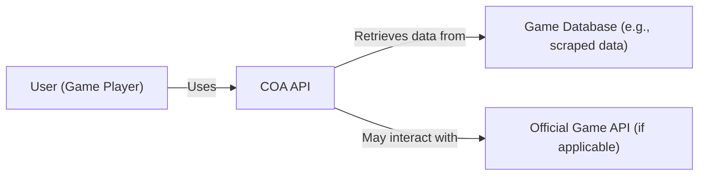
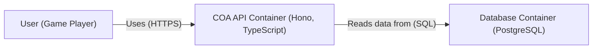
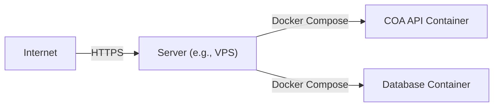
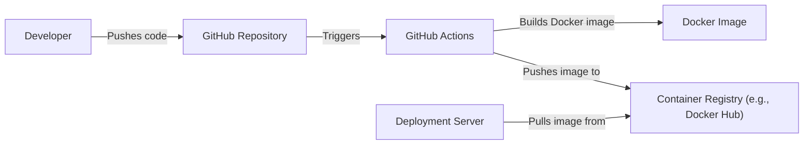

Okay, let's create a detailed design document for the `coa` project, focusing on aspects relevant for threat modeling.

# BUSINESS POSTURE

The `coa` project (Chronicles of Arcadia Knowledge API) appears to be a backend service providing an API for accessing game data related to the Chronicles of Arcadia game.  It's likely a fan-made project, possibly serving a small community.  Given its nature, we can infer the following:

Priorities and Goals:

*   Provide accurate and up-to-date game data to users.
*   Maintain a stable and responsive API service.
*   Ensure the service is easily maintainable and extensible.
*   Potentially foster a community around the project.

Business Risks:

*   Data breaches: Unauthorized access to the game data, potentially including scraped or proprietary information.
*   Service disruption: Downtime or performance issues impacting user experience.
*   Data integrity issues: Inaccurate or corrupted data being served to users.
*   Legal issues: Potential copyright or terms-of-service violations related to the game data.
*   Maintainer burnout: Given it's likely a volunteer-driven project, the risk of abandonment due to lack of resources or time is significant.
*   Reputation damage: Negative user experience or security incidents could harm the project's reputation within the community.

# SECURITY POSTURE

Based on the provided GitHub repository, we can identify the following existing security controls and accepted risks:

Existing Security Controls:

*   security control: Input validation: The project uses Zod for schema validation, which helps prevent invalid data from entering the system. Implemented in route handlers and data models.
*   security control: Dependency management: The project uses `pnpm` for dependency management, which can help with tracking and updating dependencies. Implemented via `pnpm-lock.yaml`.
*   security control: Code linting: ESLint is used to enforce code style and potentially catch some security-related issues. Implemented via `.eslintrc.cjs`.
*   security control: Containerization: Docker is used for containerization, providing some isolation and consistency across environments. Implemented via `Dockerfile`.
*   security control: API framework: Uses Hono, a fast web framework. Implemented via project dependencies.
*   security control: ORM: Uses Drizzle ORM, a type-safe SQL. Implemented via project dependencies.

Accepted Risks:

*   accepted risk: Limited error handling: The error handling appears basic, potentially leading to unhandled exceptions or information leakage in error messages.
*   accepted risk: Lack of authentication/authorization: The API appears to be publicly accessible without any authentication or authorization mechanisms.
*   accepted risk: No rate limiting: There's no apparent rate limiting, making the API vulnerable to denial-of-service (DoS) attacks.
*   accepted risk: No input sanitization beyond schema validation: While Zod provides schema validation, there might be a need for additional input sanitization to prevent cross-site scripting (XSS) or other injection vulnerabilities, especially if data is displayed in a web UI.
*   accepted risk: No HTTPS: The provided configuration doesn't mention HTTPS, suggesting the API might be served over plain HTTP, exposing data to eavesdropping.
*   accepted risk: No database connection security: Database connection details (host, username, password) are likely stored in environment variables, but there's no mention of secure storage or rotation of these credentials.
*   accepted risk: No monitoring or logging: There's no indication of monitoring or logging, making it difficult to detect and respond to security incidents.
*   accepted risk: Single point of failure: The deployment seems to rely on a single server, creating a single point of failure.
*   accepted risk: No data backups: There is no mention of database backups.

Recommended Security Controls:

*   Implement authentication and authorization: Determine if the API should be public or require user authentication. If authentication is needed, implement a secure authentication mechanism (e.g., API keys, JWT). Implement authorization to control access to specific resources.
*   Implement rate limiting: Protect the API from DoS attacks by implementing rate limiting.
*   Enhance error handling: Implement robust error handling to prevent information leakage and provide meaningful error messages to users.
*   Implement HTTPS: Enforce HTTPS to encrypt communication between clients and the API server.
*   Secure database connection: Use secure mechanisms for storing and managing database credentials (e.g., secrets management services).
*   Implement monitoring and logging: Implement comprehensive logging and monitoring to detect and respond to security incidents and performance issues.
*   Implement data backups: Implement regular database backups to protect against data loss.
*   Consider input sanitization: Evaluate the need for additional input sanitization beyond schema validation, especially if data is displayed in a web UI.

Security Requirements:

*   Authentication: Currently, no authentication is implemented.  A decision needs to be made whether the API should be publicly accessible or require authentication.
*   Authorization: Currently, no authorization is implemented. If authentication is implemented, authorization rules should be defined to control access to specific API endpoints and data.
*   Input Validation: Zod is used for schema validation. This should be reviewed to ensure all input fields are properly validated and constrained.
*   Cryptography: HTTPS should be enforced for all communication.  If sensitive data is stored, appropriate encryption at rest should be considered. Database connection should be encrypted.

# DESIGN

## C4 CONTEXT

Element Description:

*   Element:
    *   Name: User (Game Player)
    *   Type: Person
    *   Description: A player of Chronicles of Arcadia who uses a client application to access game data.
    *   Responsibilities: Accesses game data via the COA API.
    *   Security controls: None (client-side security is outside the scope of this project).

*   Element:
    *   Name: COA API
    *   Type: Software System
    *   Description: The backend API service providing access to Chronicles of Arcadia game data.
    *   Responsibilities: Provides an API for retrieving game data, handles requests, validates input, interacts with the database.
    *   Security controls: Input validation (Zod), Dependency management (pnpm), Code linting (ESLint), Containerization (Docker).

*   Element:
    *   Name: Game Database
    *   Type: Software System
    *   Description: A database containing game data, likely populated by scraping or other data collection methods.
    *   Responsibilities: Stores game data, provides data to the COA API.
    *   Security controls: Database security controls (access control, encryption, etc. - to be defined).

*   Element:
    *   Name: Official Game API (if applicable)
    *   Type: Software System
    *   Description: The official API provided by the game developers (if one exists and is used).
    *   Responsibilities: Provides official game data.
    *   Security controls: Managed by the game developers (outside the scope of this project).

## C4 CONTAINER

Element Description:

*   Element:
    *   Name: User (Game Player)
    *   Type: Person
    *   Description: A player of Chronicles of Arcadia who uses a client application to access game data.
    *   Responsibilities: Accesses game data via the COA API.
    *   Security controls: None (client-side security is outside the scope of this project).

*   Element:
    *   Name: COA API Container (Hono, TypeScript)
    *   Type: Container: Web Application
    *   Description: The main application container running the Hono API server and handling requests.
    *   Responsibilities: Handles API requests, validates input, interacts with the database, returns data to users.
    *   Security controls: Input validation (Zod), Dependency management (pnpm), Code linting (ESLint).

*   Element:
    *   Name: Database Container (PostgreSQL)
    *   Type: Container: Database
    *   Description: The PostgreSQL database container storing the game data.
    *   Responsibilities: Stores game data, provides data to the COA API.
    *   Security controls: Database security controls (access control, encryption, etc. - to be defined).

## DEPLOYMENT

Possible deployment solutions:

1.  Single server deployment (using Docker Compose).
2.  Cloud-based deployment (e.g., AWS, Google Cloud, Azure) using managed services (e.g., ECS, Kubernetes, Cloud Run).
3.  Serverless deployment (e.g., AWS Lambda, Google Cloud Functions) for the API, with a managed database service (e.g., RDS, Cloud SQL).

Chosen solution (for detailed description): Single server deployment (using Docker Compose). This is likely the simplest and most cost-effective option for a small, fan-made project.

Element Description:

*    Element:
    *   Name: Internet
    *   Type: Infrastructure Node
    *   Description: The global network.
    *   Responsibilities: Routes traffic to the server.
    *   Security controls: None (within the scope of this project).

*    Element:
    *   Name: Server (e.g., VPS)
    *   Type: Infrastructure Node
    *   Description: A virtual private server hosting the application.
    *   Responsibilities: Runs the Docker containers.
    *   Security controls: Firewall, SSH access control, OS hardening.

*   Element:
    *   Name: COA API Container
    *   Type: Container Instance
    *   Description: Instance of COA API Container.
    *   Responsibilities: Handles API requests.
    *   Security controls: Input validation, etc. (as defined in the Container diagram).

*   Element:
    *   Name: Database Container
    *   Type: Container Instance
    *   Description: Instance of Database Container.
    *   Responsibilities: Stores and serves game data.
    *   Security controls: Database access control, etc. (as defined in the Container diagram).

## BUILD

The project uses `pnpm` for dependency management and includes a `Dockerfile` for building a container image.  A simple CI/CD pipeline could be implemented using GitHub Actions.

Build Process Steps:

1.  Developer pushes code changes to the GitHub repository.
2.  GitHub Actions workflow is triggered.
3.  The workflow checks out the code.
4.  The workflow installs dependencies using `pnpm install`.
5.  The workflow runs linters (ESLint) and tests (if any).
6.  The workflow builds the Docker image using `docker build`.
7.  The workflow tags the image with a version number (e.g., based on the commit hash or tag).
8.  The workflow pushes the image to a container registry (e.g., Docker Hub, GitHub Container Registry).
9.  The deployment server pulls the latest image from the container registry.
10. The deployment server restarts the containers using Docker Compose.

Security Controls in Build Process:

*   security control: Dependency management: `pnpm` helps manage dependencies and their versions.
*   security control: Code linting: ESLint helps enforce code style and potentially catch some security issues.
*   security control: Containerization: Docker provides isolation and consistency.
*   security control: CI/CD pipeline: GitHub Actions automates the build and deployment process, reducing manual errors.
*   security control: Container registry: Using a container registry (e.g., Docker Hub, GitHub Container Registry) provides a central location for storing and managing images.

# RISK ASSESSMENT

Critical Business Processes:

*   Providing access to game data: The core function of the API is to provide users with access to game data.  Disruption of this service would be the primary business impact.
*   Maintaining data accuracy: Providing incorrect or outdated data would negatively impact the user experience and the project's reputation.

Data Sensitivity:

*   Game data: The sensitivity of the game data depends on its nature.  If it's publicly available information, the sensitivity is low.  If it includes scraped data or proprietary information, the sensitivity is higher.  It's unlikely to contain personally identifiable information (PII) unless user accounts are integrated.
*   Database credentials: These are highly sensitive and must be protected.
*   API keys (if implemented): These would be sensitive and require protection.

# QUESTIONS & ASSUMPTIONS

Questions:

*   Is there any intention to monetize this project? This impacts the risk appetite.
*   What is the expected user base size? This impacts scalability and performance requirements.
*   Is there any existing infrastructure or are we starting from scratch?
*   What is the source of the game data? Is it scraped, obtained from an official API, or manually entered?
*   Are there any legal considerations regarding the use of the game data?
*   Is there a plan for long-term maintenance and support?
*   What level of uptime is required/desired?

Assumptions:

*   BUSINESS POSTURE: The project is a non-commercial, fan-made project with a small user base. The risk appetite is relatively high, prioritizing functionality and ease of development over strict security controls.
*   SECURITY POSTURE: The project is in its early stages, and security is not the primary focus. There is a willingness to accept some risks to get the project up and running quickly.
*   DESIGN: The architecture is simple and straightforward, using common technologies (Node.js, Hono, PostgreSQL, Docker). The deployment environment is likely a single server.