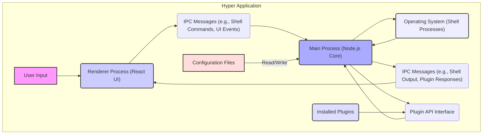
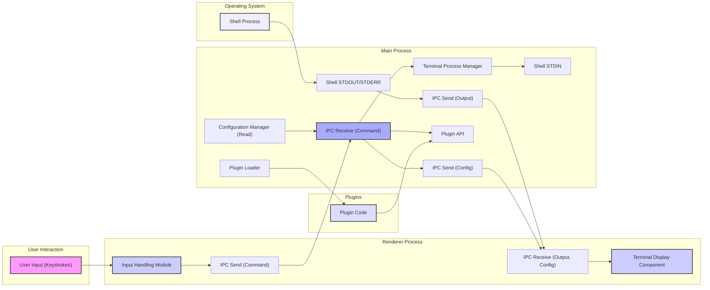

## Project Design Document: Hyper Terminal Emulator (Improved)

**1. Introduction**

This document provides an enhanced and more detailed design overview of the Hyper terminal emulator project (https://github.com/vercel/hyper). Building upon the previous version, this iteration aims to provide an even clearer articulation of the system's architecture, components, and data flow, specifically tailored for comprehensive threat modeling activities. The increased level of detail will facilitate a more granular identification of potential security vulnerabilities and attack vectors.

**2. Goals**

*   Provide a highly detailed and accurate representation of the Hyper terminal emulator's architecture and components.
*   Elaborate on the data flow within the application, including specific data types and transformations.
*   Identify key technologies, dependencies, and their potential security implications.
*   Serve as a robust and comprehensive foundation for conducting a thorough and effective threat model.

**3. High-Level Architecture**

Hyper's architecture is centered around a separation of concerns, leveraging web technologies within a native desktop application framework. The core layers interact to provide the terminal emulation experience.

*   **Presentation Layer (Renderer Process):**  Focuses on the user interface rendering, event handling, and visual presentation of the terminal. Built primarily with React and associated web technologies.
*   **Application Logic Layer (Main Process):**  Manages the application lifecycle, core functionalities like terminal process management, plugin handling, and communication between the renderer and the operating system. Built using Node.js.
*   **Operating System Interface:**  Provides the necessary bridge to interact with the host OS, managing processes, file system access, and network operations.
*   **Plugin Ecosystem:**  An integral part of Hyper, allowing for extensibility and customization through user-installed plugins.

**4. Component Details**

This section provides a more granular breakdown of the key components within Hyper:

*   **Renderer Process (React UI):**
    *   **Terminal Display Component:**  Renders the actual terminal output, handling text formatting, colors, and potentially GPU acceleration.
    *   **Input Handling Module:**  Captures keyboard events, translates key presses into character codes or special sequences, and manages input buffering.
    *   **Settings Panel:**  Provides the user interface for configuring Hyper's settings, including theme selection, font adjustments, and shell path configuration.
    *   **Plugin Manager:**  Allows users to browse, install, update, and manage installed plugins, potentially fetching plugin information from remote sources.
    *   **Communication Bridge (Renderer-side):**  Handles sending and receiving messages to/from the Main Process via Electron's IPC mechanism.

*   **Main Process (Node.js Core):**
    *   **Application Lifecycle Manager:**  Manages the startup, shutdown, and overall lifecycle of the Hyper application.
    *   **Terminal Process Manager:**  Responsible for spawning, managing, and terminating shell processes (e.g., bash, zsh, PowerShell), handling process signals and communication.
    *   **Inter-Process Communication (IPC) Router:**  Routes messages received from the Renderer Process to the appropriate handlers within the Main Process.
    *   **Plugin Loader and Controller:**  Discovers, loads, initializes, and manages installed plugins, providing them with access to the Plugin API.
    *   **Configuration Manager (Main-side):**  Handles reading and writing Hyper's configuration settings to persistent storage (e.g., a JSON file).
    *   **Update Checker:**  Periodically checks for new versions of Hyper, potentially downloading and installing updates.
    *   **Plugin API Implementation:**  Provides the interface through which plugins can interact with Hyper's core functionalities.

*   **Plugins:**
    *   **Themes:**  Plugins that modify the visual appearance of the terminal, including colors, fonts, and UI elements.
    *   **Enhancements:**  Plugins that add new features or functionalities to the terminal, such as custom commands, integrations with external services, or enhanced UI elements.
    *   **Shell Integrations:**  Plugins that interact directly with the shell process or modify its behavior.
    *   **Local Plugins:** Plugins installed directly by the user.
    *   **Remote Plugins:** Plugins potentially fetched from online repositories.

*   **Operating System (Shell Processes):**
    *   **Command Interpreter:**  The actual shell (e.g., bash, zsh) responsible for parsing and executing commands.
    *   **Standard Streams (STDIN, STDOUT, STDERR):**  The communication channels between Hyper and the shell process for input and output.

**5. Data Flow (Detailed)**

This section elaborates on the data flow within Hyper, including the types of data being exchanged:

*   **User Input Flow:**
    *   **Keystrokes (Character Codes, Special Keys):** The user types in the terminal window.
    *   **Input Events (KeyboardEvent):** The Renderer Process captures these events.
    *   **Shell Command Strings:** The Input Handling Module translates events into command strings.
    *   **IPC Message (Type: 'command', Payload: { command: string }):** The Renderer sends the command string to the Main Process.

*   **Command Execution Flow:**
    *   **IPC Message (Type: 'command', Payload: { command: string }):** The Main Process receives the command.
    *   **Command String:** The Terminal Process Manager forwards the command string to the shell process via STDIN.

*   **Terminal Output Flow:**
    *   **Raw Output (Text, ANSI Escape Codes):** The shell process sends output to the Main Process via STDOUT and STDERR.
    *   **Data Buffers:** The Main Process receives the raw output.
    *   **IPC Message (Type: 'output', Payload: { data: string }):** The Main Process sends chunks of output data to the Renderer Process.
    *   **Renderable Output (Formatted Text):** The Terminal Display Component in the Renderer Process formats and renders the output.

*   **Plugin Interaction Flow:**
    *   **Plugin API Calls (Functions, Events):** Plugins invoke functions provided by the Plugin API in the Main Process.
    *   **IPC Messages (Custom Types):** Plugins might send custom IPC messages to the Renderer Process to modify the UI or trigger actions.
    *   **Data Payloads (JSON, Strings, Buffers):** Data exchanged between plugins and the Main Process or Renderer Process.

*   **Configuration Loading Flow:**
    *   **Configuration File (JSON):** On startup, the Main Process reads the configuration file from disk.
    *   **Configuration Data (JavaScript Objects):** The Configuration Manager parses the JSON data.
    *   **IPC Message (Type: 'config-update', Payload: { config: object }):** The Main Process sends the configuration data to the Renderer Process.

*   **Plugin Loading Flow:**
    *   **Plugin Files (JavaScript):** The Plugin Loader discovers plugin files in designated directories.
    *   **Plugin Code (JavaScript Modules):** The Plugin Loader loads and executes the plugin code.
    *   **Plugin Registration (API Calls):** Plugins register their functionalities and event listeners with the Plugin API.

**6. Security Considerations (Detailed)**

This section expands on the initial security considerations, providing more specific examples and potential attack vectors:

*   **Cross-Site Scripting (XSS) Vulnerabilities:**
    *   **Malicious Shell Output:**  If the shell executes a command that produces output containing malicious JavaScript, and this output is not properly sanitized by the Renderer Process, it could lead to XSS.
    *   **Plugin-Introduced XSS:**  A poorly written or malicious plugin could inject arbitrary HTML or JavaScript into the terminal display.
    *   **Configuration Injection:** If configuration settings are not properly validated, malicious configuration could inject scripts.

*   **Command Injection Vulnerabilities:**
    *   **Unsanitized User Input:** If user input is directly passed to the shell without proper sanitization or validation, attackers could inject arbitrary commands.
    *   **Plugin-Driven Command Injection:** A malicious plugin could construct and execute arbitrary shell commands.

*   **Electron Security Considerations:**
    *   **`nodeIntegration`:** If `nodeIntegration` is enabled in the Renderer Process without careful consideration, it could allow malicious scripts to access Node.js APIs and compromise the system.
    *   **Context Isolation:**  Lack of proper context isolation could allow scripts in the Renderer Process to access privileged resources.
    *   **Remote Code Execution (RCE) via Vulnerable Dependencies:**  Vulnerabilities in Electron or its dependencies could be exploited for RCE.

*   **Plugin Security Risks:**
    *   **Malicious Plugins:**  Plugins could be designed to steal data, execute arbitrary code, or compromise the user's system.
    *   **Vulnerable Plugins:**  Even well-intentioned plugins might contain security vulnerabilities that could be exploited.
    *   **Lack of Sandboxing:**  Without proper sandboxing, plugins have broad access to Hyper's APIs and the underlying system.

*   **Inter-Process Communication (IPC) Security:**
    *   **Message Spoofing:**  Malicious actors could potentially intercept or forge IPC messages to execute commands or manipulate the application state.
    *   **Data Tampering:**  IPC messages could be intercepted and modified in transit.

*   **Update Mechanism Vulnerabilities:**
    *   **Man-in-the-Middle (MITM) Attacks:**  If the update process is not secured with HTTPS and proper signature verification, attackers could inject malicious updates.

*   **Local File Access Vulnerabilities:**
    *   **Path Traversal:**  Vulnerabilities could allow attackers to access or manipulate files outside of the intended directories.
    *   **Configuration File Manipulation:**  Attackers could try to modify the configuration file to inject malicious settings or scripts.

**7. Technologies Used**

*   **Electron:**  Cross-platform desktop application framework.
*   **Node.js:**  JavaScript runtime environment for the Main Process.
*   **React:**  JavaScript library for building the Renderer Process UI.
*   **JavaScript (ES6+):**  Primary programming language.
*   **HTML:**  Markup language for the UI.
*   **CSS:**  Styling language for the UI.
*   **Likely utilizes various npm packages for specific functionalities (e.g., `node-pty` for terminal process management).**

**8. Deployment**

Hyper is deployed as a standalone desktop application for macOS, Windows, and Linux. Distribution typically involves:

*   **Downloadable Installers:**  Platform-specific installers (e.g., `.dmg`, `.exe`, `.deb`).
*   **Potentially through package managers on Linux distributions.**

**9. Future Considerations**

*   Implementation of a robust plugin sandboxing mechanism to limit plugin access and potential damage.
*   Introduction of a more granular permission system for plugins, allowing users to control what resources plugins can access.
*   Strengthening the security of the IPC channel through encryption and authentication.
*   Regular security audits, penetration testing, and vulnerability scanning.
*   Consideration of code signing for releases to ensure authenticity and integrity.
*   Implementation of Content Security Policy (CSP) in the Renderer Process to mitigate XSS risks.

This improved design document provides a more detailed and nuanced understanding of the Hyper terminal emulator's architecture and data flow. The enhanced security considerations offer a more comprehensive starting point for conducting a thorough threat model, enabling the identification of a wider range of potential vulnerabilities and attack vectors.
