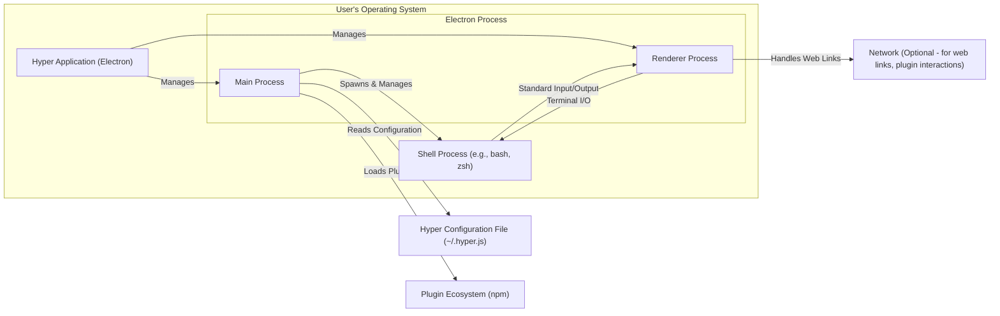

# Project Design Document: Hyper Terminal

**Version:** 1.1
**Date:** October 26, 2023
**Author:** AI Architecture Expert

## 1. Introduction

This document provides an enhanced design overview of the Hyper terminal project, focusing on aspects relevant to security. It details the system's architecture, key components, data flow with specific examples, and more granular security considerations. This document is intended to serve as a robust foundation for subsequent threat modeling activities.

## 2. Project Overview

Hyper is a cross-platform, extensible terminal emulator built using web technologies. Its core goals are to provide a visually appealing and highly customizable terminal experience across different operating systems. Key features include:

*   Cross-platform compatibility (macOS, Linux, Windows)
*   Highly customizable through themes and a plugin ecosystem
*   Support for split panes and multiple terminal sessions
*   GPU-accelerated rendering for improved performance
*   Seamless integration with native shell environments

## 3. System Architecture

The architecture of Hyper involves several interacting components within the user's operating system. The following diagram illustrates the high-level relationships:

## 4. Component Descriptions

*   **Hyper Application (Electron):**
    *   The top-level container for the Hyper application, built using the Electron framework.
    *   Encapsulates the main and renderer processes.
*   **Electron Process:**
    *   **Main Process:**
        *   The entry point of the Electron application.
        *   Responsible for creating and managing the renderer process.
        *   Handles application lifecycle events.
        *   Manages the loading of the Hyper configuration file.
        *   Spawns and manages the underlying shell process.
        *   Loads and manages plugins.
        *   Interacts with the operating system's native APIs.
    *   **Renderer Process:**
        *   Responsible for rendering the user interface using web technologies (React, HTML, CSS).
        *   Receives terminal output from the shell process and displays it.
        *   Captures user input and sends it to the shell process.
        *   Handles the execution of plugin UI components.
        *   Manages the display of web content (e.g., when opening links).
*   **Shell Process (e.g., bash, zsh):**
    *   The command-line interpreter responsible for executing user commands.
    *   Hyper communicates with this process through standard input, standard output, and standard error streams.
    *   The specific shell is determined by the user's system settings or Hyper's configuration.
*   **Hyper Configuration File (~/.hyper.js):**
    *   A JavaScript file containing user-specific settings for Hyper.
    *   Loaded by the main process on application startup.
    *   Customizations include themes, fonts, shell settings, and plugin configurations.
    *   Can potentially contain sensitive information depending on user configurations and plugin usage.
*   **Plugin Ecosystem (npm):**
    *   A system for extending Hyper's functionality through installable packages.
    *   Plugins are typically installed from npm (Node Package Manager).
    *   Plugins can modify the terminal's behavior, add new features, or integrate with external services.
    *   Plugins have access to Node.js APIs and can interact with the Hyper application.
*   **Network (Optional):**
    *   Network interaction occurs primarily in the following scenarios:
        *   Opening web links clicked within the terminal (handled by the renderer process).
        *   Plugins making network requests to external services.
        *   Potentially for checking for updates to Hyper itself or its plugins.

## 5. Data Flow

Data flows through Hyper in several key pathways:

*   **User Input to Shell:**
    *   User types a command in the Hyper window (Renderer Process).
    *   Keystrokes are captured by the Renderer Process.
    *   Input is sent from the Renderer Process to the Main Process.
    *   The Main Process forwards the input to the Shell Process via its standard input stream.
    *   *Example:* Typing `ls -l` and pressing Enter.
*   **Shell Output to User:**
    *   The Shell Process executes the command.
    *   Output (stdout and stderr) is sent to the Main Process.
    *   The Main Process forwards the output to the Renderer Process.
    *   The Renderer Process renders the output in the terminal window.
    *   *Example:* The listing of files and directories after executing `ls -l`.
*   **Configuration Loading:**
    *   On startup, the Main Process reads and parses the `~/.hyper.js` file.
    *   Configuration data is used to initialize the application and inform the Renderer Process.
    *   *Example:* Reading the configured theme or font settings.
*   **Plugin Loading and Execution:**
    *   The Main Process loads and initializes plugins specified in the configuration file.
    *   Plugins can interact with both the Main and Renderer Processes.
    *   Plugins can modify data flowing through the system or initiate their own data flows.
    *   *Example:* A plugin that automatically highlights syntax in the terminal output.
*   **Web Link Handling:**
    *   User clicks on a URL in the terminal output (Renderer Process).
    *   The Renderer Process instructs the operating system to open the URL in the default browser.
    *   *Example:* Clicking on `https://example.com`.

## 6. Security Considerations

Hyper presents several security considerations that need careful evaluation:

*   **Plugin Security Risks:**
    *   Plugins are arbitrary JavaScript code executed within the application's context, potentially gaining access to system resources.
    *   Malicious plugins could perform actions like:
        *   Reading or modifying files.
        *   Executing arbitrary commands.
        *   Stealing sensitive information.
        *   Making unauthorized network requests.
    *   Vulnerabilities in plugin dependencies (npm packages) can also introduce security risks.
*   **Configuration File Vulnerabilities:**
    *   The `~/.hyper.js` file can contain sensitive information, such as API keys or custom scripts.
    *   Insufficient file permissions could allow unauthorized modification, leading to malicious code injection.
*   **Shell Command Injection:**
    *   While Hyper itself doesn't directly execute arbitrary commands provided by external sources, vulnerabilities in plugins or improper handling of shell output could potentially lead to command injection.
    *   Care must be taken to sanitize or escape any user-provided input that is passed to the shell.
*   **Electron Security Concerns:**
    *   As an Electron application, Hyper is susceptible to common Electron security vulnerabilities, including:
        *   Cross-Site Scripting (XSS) if web content is not handled securely.
        *   Remote Code Execution (RCE) if vulnerabilities exist in the Node.js or Chromium components.
        *   Insecure inter-process communication (IPC) between the main and renderer processes.
*   **Network Security Implications:**
    *   Opening arbitrary web links from the terminal can expose users to phishing attacks or malicious websites.
    *   Plugins making network requests should adhere to secure coding practices to prevent vulnerabilities like SSRF (Server-Side Request Forgery).
*   **Data Exposure:**
    *   Terminal output can contain sensitive information (e.g., passwords, API keys).
    *   Care should be taken to prevent unintended exposure of this data, both within the application and externally.
*   **Update Mechanism Security:**
    *   The process for updating Hyper and its plugins needs to be secure to prevent the installation of malicious updates.
    *   Integrity checks and secure channels should be used.
*   **Input Validation and Sanitization:**
    *   Hyper and its plugins should implement robust input validation and sanitization to prevent various injection attacks.
*   **Error Handling and Logging:**
    *   Detailed error messages displayed to the user could reveal sensitive information.
    *   Logging mechanisms should be secure and prevent unauthorized access or modification.

## 7. Deployment Model

Hyper is typically deployed as a standalone desktop application installed directly on the user's operating system. Common installation methods include:

*   `.dmg` files for macOS
*   `.deb` or `.rpm` packages for Linux distributions
*   `.exe` installers for Windows

## 8. Technology Stack

*   **Frontend:**
    *   Electron (Chromium + Node.js)
    *   React
    *   HTML
    *   CSS (including styled-components)
*   **Backend (within Electron):**
    *   Node.js
*   **Configuration:**
    *   JavaScript (`~/.hyper.js`)
*   **Plugins:**
    *   JavaScript (primarily npm packages)

## 9. Future Considerations

*   **Enhanced Plugin Sandboxing:** Implementing stronger sandboxing for plugins to restrict their access to system resources and APIs. This would mitigate the risks associated with malicious or vulnerable plugins.
*   **Regular Security Audits:** Conducting periodic security audits of the core Hyper application and popular, widely-used plugins to proactively identify and address potential vulnerabilities.
*   **Content Security Policy (CSP):** Implementing a strict Content Security Policy for the renderer process to mitigate the risk of XSS attacks.
*   **Secure Defaults and User Prompts:** Enforcing more secure default configurations and providing users with clear warnings or prompts when potentially risky configurations or plugin installations are detected.
*   **Plugin Review Process:** Establishing a community-driven or official review process for plugins to identify and flag potentially malicious or insecure code.
*   **Improved Input Sanitization:** Implementing more comprehensive input sanitization techniques throughout the application, especially when handling data passed to the shell or used in network requests.

This improved design document provides a more detailed and security-focused overview of the Hyper terminal project. The specific threats and vulnerabilities identified here will be crucial for conducting a thorough and effective threat modeling exercise.
