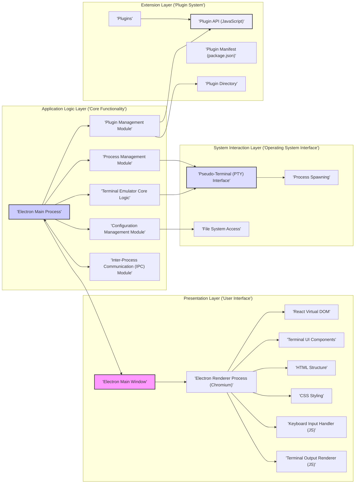

## Project Design Document: Hyper Terminal Emulator (Improved)

**Project Name:** Hyper

**Project Repository:** https://github.com/vercel/hyper

**Document Version:** 1.1

**Date:** October 26, 2023

**Author:** Gemini (AI Language Model)

**1. Introduction**

This document provides an enhanced and more detailed design overview of the Hyper terminal emulator project. It aims to provide a comprehensive understanding of the system's architecture, components, data flow, and key functionalities, specifically tailored for effective threat modeling. This document will serve as a robust foundation for identifying potential security vulnerabilities and informing mitigation strategies.

**2. Goals**

*   Provide a clear, comprehensive, and granular description of the Hyper terminal emulator's architecture and components.
*   Elaborate on the data flow within the application, including specific data types and transformations.
*   Identify key functionalities and their interactions with a focus on security-relevant aspects.
*   Serve as a robust and detailed basis for threat modeling and security analysis, enabling the identification of potential attack vectors and vulnerabilities.

**3. High-Level Architecture**

Hyper is a cross-platform terminal emulator built using web technologies, leveraging the Electron framework to provide a native application experience. The core architecture can be conceptually divided into the following distinct layers:

*   **Presentation Layer (User Interface):** Responsible for rendering the visual aspects of the terminal, handling user interactions, and displaying output. This layer is primarily implemented using web technologies.
*   **Application Logic Layer (Core Functionality):** Manages the core terminal emulation logic, including process management, configuration, and plugin handling. This layer bridges the UI and the operating system.
*   **System Interaction Layer (Operating System Interface):** Provides the necessary interfaces for interacting with the host operating system, such as managing pseudo-terminals and accessing the file system.
*   **Extension Layer (Plugin System):** Enables users to extend Hyper's functionality through a plugin architecture, allowing for customization and integration with external services.

**4. Component Details**

This section provides a more granular breakdown of the key components within each architectural layer:

**4.1. Presentation Layer (User Interface):**

*   **Electron Main Window:** The primary application window managed by the Electron framework, serving as the container for the UI.
*   **Electron Renderer Process:** The Chromium rendering engine instance responsible for executing the UI code (JavaScript, HTML, CSS) and rendering the terminal interface.
    *   **React Virtual DOM:**  React's virtual DOM implementation for efficient UI updates and rendering.
    *   **Terminal UI Components:** Reusable React components that constitute the terminal interface:
        *   `Terminal`: The core component responsible for displaying terminal output and handling input.
        *   `Tab`: Represents an individual terminal session within the tab bar.
        *   `TabBar`: Manages and displays the open terminal tabs.
        *   `Menu`:  The application's menu bar, providing access to application-level functions.
        *   `SettingsModal`:  A modal window for configuring Hyper's settings.
    *   **HTML Structure:** The semantic HTML elements that define the structure of the UI.
    *   **CSS Styling:**  Cascading Style Sheets used to define the visual appearance of the UI elements.
    *   **Keyboard Input Handler:** JavaScript code that listens for keyboard events and translates them into terminal input sequences.
    *   **Terminal Output Renderer:** JavaScript code responsible for receiving terminal output (including ANSI escape codes) and rendering it within the `Terminal` component. This involves:
        *   ANSI Escape Code Parser: Interprets ANSI escape sequences for text formatting (colors, styles).
        *   Text Buffer:  Manages the displayed text content of the terminal.

**4.2. Application Logic Layer (Core Functionality):**

*   **Electron Main Process:** The Node.js process that controls the application lifecycle, manages renderer processes, and handles operating system interactions.
    *   **App Module:** Electron's `app` module for controlling the application's event lifecycle.
    *   **BrowserWindow Module:** Electron's `BrowserWindow` module for creating and managing application windows.
*   **Terminal Emulator Core Logic:**  The core functionality for emulating a terminal:
    *   **PTY Management:**  Handles the creation, management, and destruction of pseudo-terminal (PTY) pairs.
    *   **Data Piping:**  Manages the flow of data between the renderer process and the PTY.
    *   **Signal Handling:**  Handles signals sent to the terminal process (e.g., SIGINT, SIGTERM).
    *   **Terminal Session Management:**  Manages the state of individual terminal sessions.
*   **Process Management Module:** Responsible for:
    *   Spawning shell processes.
    *   Monitoring process status.
    *   Terminating processes.
*   **Configuration Management Module:**
    *   **Configuration File Reader/Writer:**  Handles reading and writing the application's configuration file (typically `~/.hyper.js`).
    *   **Configuration Validation:**  Ensures the configuration data is valid.
    *   **Configuration Merging:**  Merges default configurations with user-defined settings.
*   **Plugin Management Module:**
    *   **Plugin Loader:**  Discovers and loads installed plugins.
    *   **Plugin API Handler:**  Provides the interface for plugins to interact with Hyper's core functionality.
    *   **Plugin Communication:**  Manages communication between the main process and plugin code running in the renderer process.
*   **Inter-Process Communication (IPC) Module:**
    *   **Electron IPC Channels:** Utilizes Electron's `ipcMain` and `ipcRenderer` modules for communication between the main and renderer processes.
    *   **Message Handling:**  Routes and processes messages exchanged between processes.

**4.3. System Interaction Layer (Operating System Interface):**

*   **Pseudo-Terminal (PTY) Interface (Node.js `node-pty` or similar):**
    *   **PTY Forking:**  Uses system calls to create new PTY pairs.
    *   **Data Read/Write:**  Provides methods for reading data from and writing data to the PTY.
    *   **Resize Handling:**  Allows resizing the PTY when the terminal window is resized.
*   **File System Access (Node.js `fs` module):**
    *   **Configuration File Access:** Reading and writing the `~/.hyper.js` configuration file.
    *   **Plugin File Access:** Accessing plugin files within the plugin directory.
    *   **Potential Access based on Terminal Commands:**  Indirect file system access based on commands executed within the terminal.
*   **Process Spawning (Node.js `child_process` module):**
    *   **Shell Process Creation:**  Spawns the user's default shell or a configured shell.

**4.4. Extension Layer (Plugin System):**

*   **Plugin API (JavaScript):** A well-defined set of JavaScript interfaces that plugins can use to extend Hyper's functionality. This includes APIs for:
    *   UI Customization: Adding new UI elements or modifying existing ones.
    *   Themeing:  Modifying the visual appearance of the terminal.
    *   Input/Output Interception:  Intercepting and modifying terminal input and output.
    *   New Command Registration:  Registering custom commands that can be executed in the terminal.
    *   Configuration Extension: Adding new configuration options.
*   **Plugin Manifest (`package.json`):**  A standard Node.js `package.json` file that describes the plugin, its dependencies, and entry point.
*   **Plugin Directory:** A designated directory where Hyper searches for and loads plugins.
*   **Plugin Isolation (Renderer Process Sandbox):** Plugins primarily run within the renderer process's JavaScript environment, which has some level of sandboxing provided by Chromium. However, plugins can still interact with the DOM and make network requests.

**5. Data Flow (Detailed)**

The following outlines the detailed data flow within Hyper, including data types and transformations:

1. **User Input (Keyboard Event):**
    *   Data Type: KeyboardEvent (browser event).
    *   Location: Renderer Process.
2. **Input Processing (JavaScript):**
    *   Action: JavaScript code in the renderer process intercepts the `KeyboardEvent`.
    *   Transformation: Translates the `KeyboardEvent` into a terminal input sequence (e.g., character codes, control sequences).
    *   Data Type: String or Buffer representing the terminal input sequence.
3. **IPC to Main Process (Electron IPC):**
    *   Action: The input sequence is sent from the renderer process to the main process using Electron's IPC mechanism.
    *   Data Type: String or Buffer.
    *   Channel: A designated IPC channel for terminal input.
4. **PTY Write (Node.js `node-pty`):**
    *   Action: The main process writes the received input sequence to the master side of the PTY.
    *   Data Type: Buffer.
5. **Shell Execution (Operating System):**
    *   Action: The operating system forwards the input to the shell process connected to the slave side of the PTY.
    *   Data Type: Stream of bytes.
6. **Command Execution (Shell):**
    *   Action: The shell interprets and executes the command.
7. **Output Generation (Shell):**
    *   Data Type: Stream of bytes, potentially including ANSI escape codes for formatting.
8. **PTY Read (Node.js `node-pty`):**
    *   Action: The main process reads the output from the master side of the PTY.
    *   Data Type: Buffer.
9. **IPC to Renderer Process (Electron IPC):**
    *   Action: The output is sent back to the renderer process via IPC.
    *   Data Type: Buffer or String.
    *   Channel: A designated IPC channel for terminal output.
10. **Output Processing (JavaScript):**
    *   Action: JavaScript code in the renderer process receives the output.
    *   Transformation: The output is processed to interpret ANSI escape codes and prepare it for rendering.
    *   Data Type: String with embedded formatting information.
11. **Rendering (React):**
    *   Action: The processed output is used to update the React components in the `Terminal` view.
    *   Data Type: Virtual DOM representation of the terminal output.
12. **Display to User (Chromium):**
    *   Action: Chromium renders the updated UI, displaying the terminal output to the user.

**Configuration Data Flow (Detailed):**

1. **User Modifies Settings (UI Interaction):**
    *   Data Type: User input events (e.g., button clicks, text changes).
    *   Location: Renderer Process (SettingsModal component).
2. **Configuration Update (Renderer Process):**
    *   Action: JavaScript code updates the in-memory representation of the application's configuration.
    *   Data Type: JavaScript object representing the configuration.
3. **IPC to Main Process (Electron IPC):**
    *   Action: The updated configuration object is sent to the main process.
    *   Data Type: JavaScript object (serialized via JSON).
    *   Channel: A designated IPC channel for configuration updates.
4. **Configuration Save (Main Process):**
    *   Action: The main process writes the received configuration object to the configuration file (`~/.hyper.js`).
    *   Data Type: String (JSON representation of the configuration).
5. **Configuration Load (Startup - Main Process):**
    *   Action: On application startup, the main process reads the configuration file.
    *   Data Type: String (JSON representation of the configuration).
6. **Configuration Parsing (Main Process):**
    *   Action: The main process parses the configuration string into a JavaScript object.
    *   Data Type: JavaScript object representing the configuration.
7. **IPC to Renderer Process (Electron IPC):**
    *   Action: The configuration object is sent to the renderer process.
    *   Data Type: JavaScript object (serialized via JSON).
    *   Channel: A designated IPC channel for initial configuration.
8. **Configuration Application (Renderer Process):**
    *   Action: The renderer process applies the received configuration, updating the UI and application behavior.

**Plugin Data Flow (Detailed):**

1. **Plugin Discovery and Loading (Main Process):**
    *   Action: On startup, the main process scans the plugin directory for valid plugins (identified by `package.json`).
    *   Data Type: File system paths.
2. **Plugin Initialization (Main Process):**
    *   Action: The main process loads the plugin's main JavaScript file.
    *   Data Type: JavaScript code.
3. **Plugin Registration (Main Process via Plugin API):**
    *   Action: Plugins use the Plugin API to register their contributions (e.g., UI components, commands, settings).
    *   Data Type: JavaScript objects representing plugin contributions.
4. **Plugin Code Execution (Renderer Process):**
    *   Action: Plugin UI components and other renderer-side logic are executed within the renderer process.
    *   Data Type: JavaScript code.
5. **Plugin Interaction with Hyper Core (Plugin API):**
    *   Action: Plugins interact with Hyper's core functionality through the provided Plugin API, sending and receiving data.
    *   Data Type: Varies depending on the API function.
6. **Plugin Data Storage (Optional):**
    *   Action: Plugins may store data locally (e.g., using browser storage APIs).
    *   Data Type: Varies depending on the storage mechanism.
7. **Plugin Network Requests (Optional):**
    *   Action: Plugins may make network requests to external services.
    *   Data Type: HTTP requests and responses.

**6. Security Considerations (Detailed for Threat Modeling)**

This section expands on potential security concerns, providing more specific examples and considerations for threat modeling:

*   **Cross-Site Scripting (XSS) Vulnerabilities:**
    *   **Terminal Output Injection:** Malicious commands executed in the terminal could output specially crafted ANSI escape codes or JavaScript code that, if not properly sanitized, could be interpreted and executed by the renderer process, leading to XSS.
    *   **Plugin-Introduced XSS:** Vulnerabilities in plugins could allow them to inject malicious scripts into the UI.
    *   **Configuration Injection:** If the configuration file is not parsed securely, malicious actors could inject scripts through configuration settings.
*   **Command Injection Vulnerabilities:**
    *   **Exploiting PTY Interaction:**  Vulnerabilities in how Hyper interacts with the PTY could potentially allow attackers to inject commands that are executed by the shell.
    *   **Plugin-Introduced Command Injection:** Malicious plugins could execute arbitrary commands on the user's system.
*   **Plugin Security Risks:**
    *   **Malicious Plugins:** Users could install plugins that intentionally perform malicious actions, such as stealing data, installing malware, or performing denial-of-service attacks.
    *   **Vulnerable Plugins:** Legitimate plugins could contain security vulnerabilities that could be exploited by attackers.
    *   **Unrestricted API Access:** If the Plugin API provides overly permissive access to Hyper's core functionality, it could be abused by malicious plugins.
*   **Inter-Process Communication (IPC) Security:**
    *   **Message Spoofing:** Attackers could potentially intercept or forge IPC messages between the main and renderer processes to execute arbitrary code or manipulate application state.
    *   **Data Tampering:**  Malicious actors could attempt to modify data being transmitted via IPC.
*   **Privilege Escalation Vulnerabilities:**
    *   **Exploiting Node.js APIs:** Vulnerabilities in Hyper's Node.js code or its dependencies could potentially be exploited to gain elevated privileges.
    *   **Plugin-Based Privilege Escalation:** Malicious plugins could attempt to exploit system vulnerabilities to escalate privileges.
*   **Supply Chain Security Risks:**
    *   **Compromised Dependencies:** Hyper and its plugins rely on numerous third-party libraries. Vulnerabilities in these dependencies could introduce security risks.
    *   **Malicious Packages:**  Attackers could potentially inject malicious code into the dependencies used by Hyper or its plugins.
*   **Data Exposure Risks:**
    *   **Sensitive Information in Terminal Output:**  Accidental or intentional display of sensitive information (passwords, API keys) in the terminal output could lead to exposure.
    *   **Data Leaks through Plugins:** Malicious or vulnerable plugins could exfiltrate sensitive data.
*   **Denial of Service (DoS) Vulnerabilities:**
    *   **Resource Exhaustion:** Malicious input or plugin behavior could cause Hyper to consume excessive resources (CPU, memory), leading to a denial of service.
    *   **Crash Exploits:**  Vulnerabilities could be exploited to cause the application to crash.
*   **Insecure Configuration:**
    *   **World-Writable Configuration File:** If the configuration file has insecure permissions, attackers could modify it to inject malicious code or change application behavior.
    *   **Exposure of Sensitive Information in Configuration:** Storing sensitive information directly in the configuration file could lead to its exposure.

**7. Technologies Used**

*   **Electron:** Framework for building cross-platform desktop applications with web technologies (Chromium and Node.js).
*   **Chromium:** The open-source browser engine that powers the renderer process, providing HTML rendering, JavaScript execution, and security sandboxing.
*   **Node.js:** The JavaScript runtime environment used by Electron's main process for application logic and operating system interactions.
*   **React:** A JavaScript library for building user interfaces, used for creating Hyper's UI components.
*   **HTML:** Markup language for structuring the user interface.
*   **CSS:** Stylesheet language for styling the user interface.
*   **JavaScript:** The primary programming language used for the UI, core logic, and plugin development.
*   **Node-Pty (or similar):** A Node.js library for creating and interacting with pseudo-terminals.

**8. Future Considerations**

*   Detailed sequence diagrams illustrating the interaction between components for specific functionalities.
*   Inclusion of specific security controls and mitigations implemented within the application (e.g., input sanitization, content security policy).
*   A more in-depth analysis of the Plugin API's security model and potential vulnerabilities.
*   Consideration of security best practices for Electron applications.
*   Regular security audits and penetration testing.

This improved document provides a more granular and detailed design overview of the Hyper terminal emulator, specifically tailored to facilitate comprehensive threat modeling. It highlights potential security concerns and provides a solid foundation for identifying and mitigating vulnerabilities.