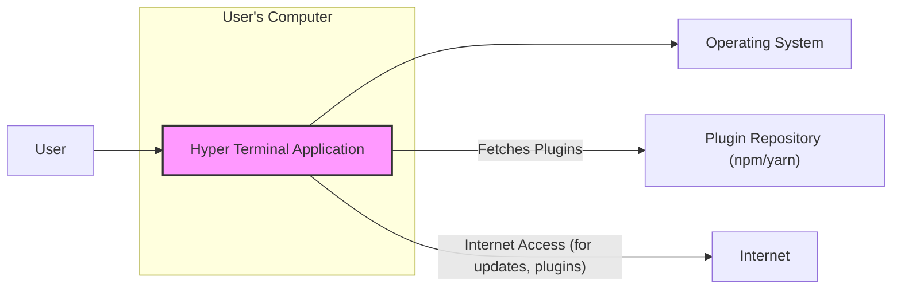
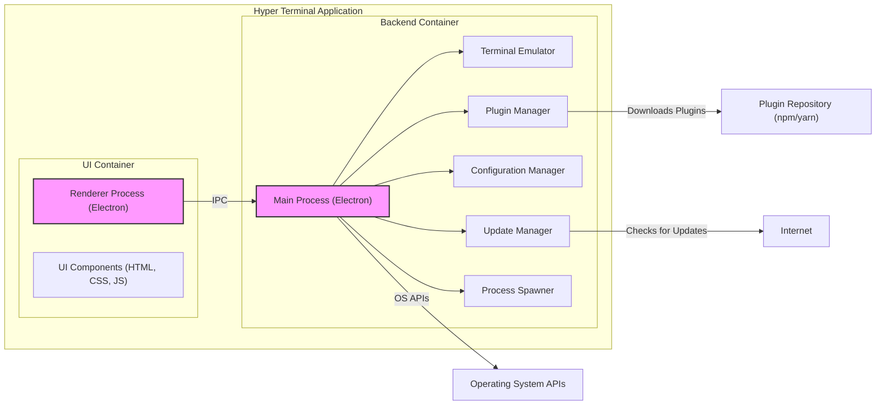
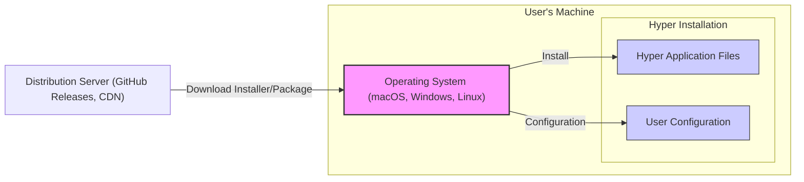

# BUSINESS POSTURE

The Hyper project is a terminal application built with web technologies (HTML, JavaScript, CSS). It aims to provide a beautiful and extensible terminal experience for developers and users who prefer a modern, customizable interface over traditional terminal emulators.

Business Priorities and Goals:
- Provide a visually appealing and user-friendly terminal application.
- Offer extensibility through plugins to enhance functionality and customization.
- Ensure cross-platform compatibility (macOS, Windows, Linux).
- Maintain good performance and responsiveness for a smooth user experience.
- Foster an open-source community around the project.

Business Risks:
- Security vulnerabilities in the terminal application could lead to command injection or privilege escalation, compromising user systems.
- Data breaches could occur if sensitive information is exposed or logged by the terminal or its plugins.
- Availability issues or instability could disrupt user workflows and damage reputation.
- Supply chain attacks targeting dependencies or the build process could introduce malicious code.
- Lack of user trust due to security concerns could hinder adoption.

# SECURITY POSTURE

Existing Security Controls:
- security control: Code review process is likely in place as it is an open-source project on GitHub, although the extent and rigor are unknown. (Location: GitHub repository - pull request reviews)
- security control: Dependency management using `package.json` and `yarn.lock` helps track and manage project dependencies. (Location: GitHub repository - `package.json`, `yarn.lock`)
- security control: Regular updates of dependencies are likely to address known vulnerabilities in libraries. (Assumption based on common practice in JavaScript projects)
- accepted risk: Reliance on Node.js and its ecosystem, which has a history of security vulnerabilities.
- accepted risk: Plugin system introduces potential security risks if plugins are not vetted or sandboxed properly.

Recommended Security Controls:
- security control: Implement automated security scanning (SAST/DAST) in the CI/CD pipeline to detect vulnerabilities in code and dependencies.
- security control: Regularly audit dependencies for known vulnerabilities and update them promptly.
- security control: Implement a robust plugin security model with sandboxing or permission controls to limit plugin access to system resources.
- security control: Perform penetration testing and security audits to identify and address potential vulnerabilities.
- security control: Implement input validation and output encoding to prevent command injection and cross-site scripting (XSS) vulnerabilities, especially in plugin APIs and terminal rendering.
- security control: Secure update mechanism to ensure that updates are authentic and not tampered with.

Security Requirements:
- Authentication: Not directly applicable to the core terminal application itself, but might be relevant for plugin authentication or integration with external services.
- Authorization: Plugin system should implement authorization to control what resources and APIs plugins can access. User permissions within the operating system will govern command execution.
- Input Validation: All user inputs, especially commands and plugin inputs, must be validated to prevent command injection and other injection attacks.
- Cryptography:  Consider using cryptography for secure storage of configuration data or secrets, and for secure communication if the terminal interacts with remote services or plugins. Securely handle any credentials if stored or passed through the application.

# DESIGN

## C4 CONTEXT

Context Diagram Elements:

- Name: Hyper Terminal Application
  - Type: Software System
  - Description: A cross-platform terminal emulator built with web technologies, providing a customizable and extensible command-line interface.
  - Responsibilities:
    - Emulating a terminal interface.
    - Executing user commands within the operating system.
    - Rendering terminal output.
    - Loading and managing plugins.
    - Providing a customizable user interface.
  - Security controls:
    - Input validation on user commands.
    - Plugin security model.
    - Secure update mechanism.
    - Code review and security testing.

- Name: User
  - Type: Person
  - Description: A developer or user who interacts with the Hyper Terminal Application to execute commands and manage their system.
  - Responsibilities:
    - Providing commands to the terminal.
    - Configuring terminal settings and plugins.
    - Managing their system through the terminal interface.
  - Security controls:
    - Operating system user account controls.
    - Awareness of secure command practices.

- Name: Operating System
  - Type: Software System
  - Description: The underlying operating system (macOS, Windows, Linux) that provides the environment for the Hyper Terminal Application to run and execute commands.
  - Responsibilities:
    - Executing commands issued by the Hyper Terminal Application.
    - Managing system resources and permissions.
    - Providing system APIs for the terminal to interact with.
  - Security controls:
    - Operating system security features (firewall, access controls, etc.).
    - Kernel security.
    - System updates and patching.

- Name: Plugin Repository (npm/yarn)
  - Type: External System
  - Description: Online repositories like npm or yarn where Hyper Terminal Application fetches and installs plugins.
  - Responsibilities:
    - Hosting and distributing JavaScript packages (plugins).
    - Providing package management tools (npm, yarn).
  - Security controls:
    - Package repository security measures.
    - Package signing and verification (npm provenance, yarn berry).

- Name: Internet
  - Type: Network
  - Description: The internet network that the Hyper Terminal Application may use for downloading updates, plugins, or accessing online resources.
  - Responsibilities:
    - Providing network connectivity.
    - Enabling communication with external systems.
  - Security controls:
    - Network security controls (firewall, network monitoring).
    - Secure communication protocols (HTTPS).

## C4 CONTAINER

Container Diagram Elements:

- Name: Renderer Process (Electron)
  - Type: Container - Process
  - Description: An Electron renderer process responsible for rendering the user interface of the terminal using HTML, CSS, and JavaScript.
  - Responsibilities:
    - Rendering the terminal UI.
    - Handling user interactions in the UI.
    - Communicating with the Main Process via IPC.
    - Displaying terminal output.
  - Security controls:
    - Input sanitization for displayed output.
    - Content Security Policy (CSP) to mitigate XSS.
    - Principle of least privilege for renderer process.

- Name: UI Components (HTML, CSS, JS)
  - Type: Container - Code
  - Description: The HTML, CSS, and JavaScript code that defines the user interface of the terminal, including themes, layouts, and interactive elements.
  - Responsibilities:
    - Defining the visual appearance and behavior of the terminal UI.
    - Handling UI logic and events.
  - Security controls:
    - Secure coding practices for JavaScript.
    - Regular updates of UI libraries and frameworks.

- Name: Main Process (Electron)
  - Type: Container - Process
  - Description: An Electron main process that manages the application lifecycle, backend logic, and communication between the renderer process and the operating system.
  - Responsibilities:
    - Managing application lifecycle.
    - Interacting with the operating system APIs.
    - Managing terminal emulation, plugins, configuration, and updates.
    - Spawning child processes for command execution.
    - Handling inter-process communication (IPC) with the renderer process.
  - Security controls:
    - Input validation for IPC messages.
    - Principle of least privilege for main process.
    - Secure handling of system APIs.

- Name: Terminal Emulator
  - Type: Container - Component
  - Description: A component within the Main Process responsible for emulating a terminal, handling terminal input and output, and interacting with the operating system's terminal interface.
  - Responsibilities:
    - Emulating terminal behavior (e.g., ANSI escape codes).
    - Handling terminal input and output streams.
    - Interfacing with the operating system's PTY/TTY.
  - Security controls:
    - Input validation for terminal input.
    - Output sanitization to prevent terminal escape sequence injection.

- Name: Plugin Manager
  - Type: Container - Component
  - Description: A component within the Main Process that manages the loading, installation, updating, and execution of plugins.
  - Responsibilities:
    - Discovering and loading plugins.
    - Managing plugin dependencies.
    - Providing plugin APIs.
    - Enforcing plugin security policies.
  - Security controls:
    - Plugin sandboxing or permission model.
    - Plugin signature verification.
    - Secure plugin update mechanism.

- Name: Configuration Manager
  - Type: Container - Component
  - Description: A component within the Main Process that manages the terminal's configuration settings, including themes, preferences, and plugin configurations.
  - Responsibilities:
    - Loading and saving configuration data.
    - Providing configuration APIs.
    - Managing user preferences.
  - Security controls:
    - Secure storage of configuration data (consider encryption for sensitive data).
    - Input validation for configuration settings.

- Name: Update Manager
  - Type: Container - Component
  - Description: A component within the Main Process that handles checking for and downloading updates for the Hyper Terminal Application.
  - Responsibilities:
    - Checking for new versions.
    - Downloading updates.
    - Applying updates securely.
  - Security controls:
    - Secure update channel (HTTPS).
    - Update signature verification.
    - Rollback mechanism in case of update failure.

- Name: Process Spawner
  - Type: Container - Component
  - Description: A component within the Main Process responsible for spawning child processes to execute user commands.
  - Responsibilities:
    - Creating and managing child processes.
    - Handling command execution.
    - Managing process permissions.
  - Security controls:
    - Command sanitization and validation before execution.
    - Principle of least privilege for spawned processes.
    - Input validation for command arguments.

## DEPLOYMENT

Deployment Architecture: Desktop Application Distribution

Deployment Diagram Elements:

- Name: Operating System (macOS, Windows, Linux)
  - Type: Infrastructure - Operating System
  - Description: The user's operating system where Hyper is installed and executed. Different OS platforms require specific installation packages.
  - Responsibilities:
    - Providing the runtime environment for Hyper.
    - Managing file system and process execution.
    - Providing user account and permission management.
  - Security controls:
    - Operating system security features.
    - User account controls.
    - File system permissions.

- Name: Hyper Application Files
  - Type: Infrastructure - Filesystem
  - Description: The directory containing the installed Hyper application files, including executables, libraries, and resources.
  - Responsibilities:
    - Storing application code and resources.
    - Providing executable files for launching Hyper.
  - Security controls:
    - File system permissions to protect application files from unauthorized modification.
    - Code signing of executables to ensure authenticity.

- Name: User Configuration
  - Type: Infrastructure - Filesystem
  - Description: Directory or files where user-specific configuration settings for Hyper are stored.
  - Responsibilities:
    - Storing user preferences, themes, and plugin configurations.
    - Persisting user settings across sessions.
  - Security controls:
    - File system permissions to protect user configuration data.
    - Potentially encryption for sensitive configuration data.

- Name: Distribution Server (GitHub Releases, CDN)
  - Type: Infrastructure - Server
  - Description: Servers used to host and distribute Hyper installation packages (e.g., GitHub Releases, or a dedicated CDN).
  - Responsibilities:
    - Hosting installer files for different platforms.
    - Providing download access to users.
    - Ensuring availability of installation packages.
  - Security controls:
    - Server security hardening.
    - HTTPS for secure download.
    - Integrity checks (checksums, signatures) for installer packages.

## BUILD

Build Process Diagram:

```mermaid
flowchart LR
  A["Developer"] --> B["Code Repository (GitHub)"];
  B --> C["CI/CD System (GitHub Actions)"];
  C --> D["Build Environment"];
  D --> E["Compilation & Packaging"];
  E --> F["Security Checks (SAST, Linting)"];
  F --> G["Code Signing"];
  G --> H["Artifact Repository (GitHub Releases)"];
  H --> I["Distribution Server (CDN)"];
  style A fill:#ccf,stroke:#333,stroke-width:1px
  style B fill:#ccf,stroke:#333,stroke-width:1px
  style C fill:#f9f,stroke:#333,stroke-width:2px
  style D fill:#ccf,stroke:#333,stroke-width:1px
  style E fill:#ccf,stroke:#333,stroke-width:1px
  style F fill:#ccf,stroke:#333,stroke-width:1px
  style G fill:#ccf,stroke:#333,stroke-width:1px
  style H fill:#ccf,stroke:#333,stroke-width:1px
  style I fill:#ccf,stroke:#333,stroke-width:1px
```

Build Process Description:

1. Developer: Developers write code and commit changes to the code repository.
2. Code Repository (GitHub): Source code is stored and managed in a GitHub repository.
3. CI/CD System (GitHub Actions): GitHub Actions is used as the CI/CD system to automate the build, test, and release process.
4. Build Environment: A clean and controlled build environment is set up for each build.
5. Compilation & Packaging: Code is compiled, and the application is packaged into distributable formats for different operating systems (e.g., `.dmg`, `.exe`, `.deb`, `.rpm`).
6. Security Checks (SAST, Linting): Automated security checks, including Static Application Security Testing (SAST) and linting, are performed to identify potential vulnerabilities and code quality issues.
7. Code Signing: Executables and installers are signed with a digital signature to ensure authenticity and prevent tampering.
8. Artifact Repository (GitHub Releases): Build artifacts (installers, packages) are stored in GitHub Releases.
9. Distribution Server (CDN): Artifacts are distributed via a CDN for faster and more reliable downloads by users.

Build Process Security Controls:

- security control: Use of a CI/CD system (GitHub Actions) for automated and repeatable builds.
- security control: Clean build environments to prevent build contamination.
- security control: Automated security checks (SAST, linting) integrated into the build pipeline.
- security control: Dependency scanning to identify vulnerable dependencies.
- security control: Code signing of executables and installers to ensure integrity and authenticity.
- security control: Secure storage of signing keys and certificates.
- security control: Access control to the build pipeline and artifact repository.
- security control: Audit logging of build process activities.

# RISK ASSESSMENT

Critical Business Processes:
- Providing a functional and stable terminal application to users.
- Maintaining user trust and reputation of the project.
- Ensuring the security of user systems when using the terminal.
- Extensibility and plugin ecosystem functionality.
- Secure and reliable update mechanism.

Data Sensitivity:
- User configuration data (potentially including API keys or tokens if stored in configuration, though unlikely for core terminal). Sensitivity: Medium - Confidentiality and Integrity.
- Command history (may contain sensitive commands or information). Sensitivity: Medium - Confidentiality and Integrity.
- Plugin code and dependencies. Sensitivity: High - Integrity and Availability (supply chain risk).
- Application code itself. Sensitivity: High - Integrity and Availability.

Data to Protect and Sensitivity:
- Application Code: High sensitivity - Integrity, Availability. Tampering could lead to malicious functionality.
- User Configuration Data: Medium sensitivity - Confidentiality, Integrity. Could contain user preferences or potentially sensitive settings.
- Command History: Medium sensitivity - Confidentiality, Integrity. May contain sensitive commands or information.
- Plugins and Dependencies: High sensitivity - Integrity, Availability. Supply chain attacks are a significant risk.
- Build Artifacts (Installers): High sensitivity - Integrity, Availability. Tampering could lead to distribution of malware.

# QUESTIONS & ASSUMPTIONS

Questions:
- What is the plugin security model in detail? Are plugins sandboxed? What permissions do plugins have?
- Is there a formal security audit or penetration testing performed on the project?
- What is the process for handling security vulnerabilities reported by the community or found internally?
- Are there any specific security considerations for handling user credentials or sensitive data within plugins or the core application?
- What is the update mechanism in detail? How is the integrity and authenticity of updates verified?

Assumptions:
- Code review is performed for pull requests, but the depth and rigor are unknown.
- Dependency updates are performed regularly to address known vulnerabilities.
- The project relies on standard security practices for Electron and Node.js applications.
- The build process uses GitHub Actions for CI/CD.
- Distribution is primarily through GitHub Releases and potentially a CDN.
- Users are expected to download and install the application on their local machines.
- The project is open-source and community-driven.