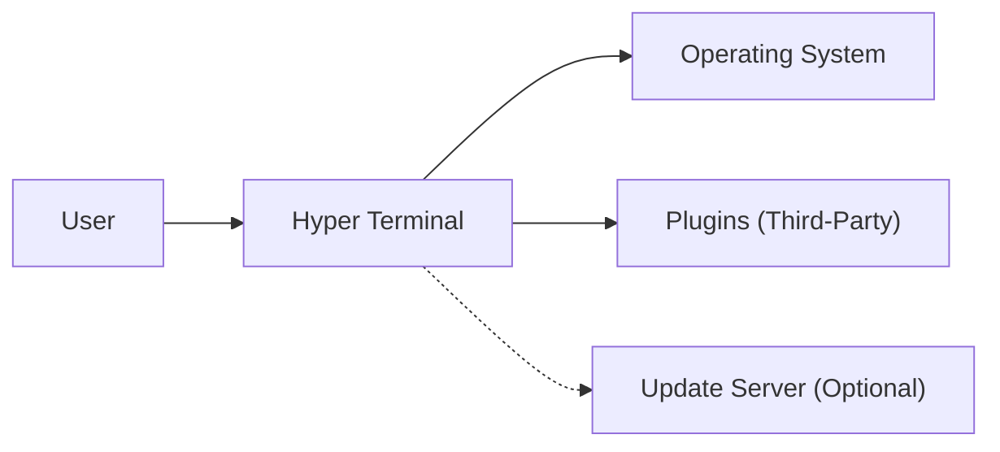
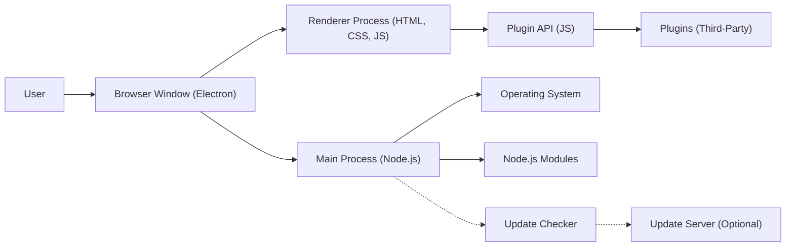
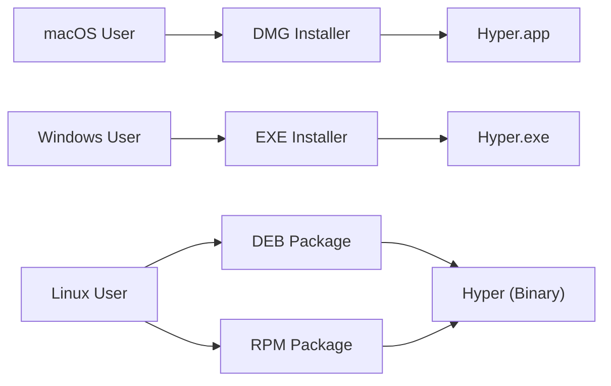
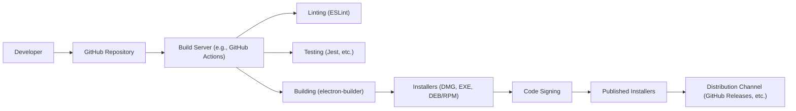

Okay, let's create a design document for the Hyper project (https://github.com/vercel/hyper), focusing on aspects relevant for threat modeling.

# BUSINESS POSTURE

Hyper is a terminal emulator built on web technologies (HTML, CSS, JavaScript).  It's designed to be extensible and customizable, prioritizing user experience and developer convenience.  It's an open-source project, likely aiming to build a community and potentially integrate with other Vercel products/services in the future (though this is speculative).  The primary goal is to provide a beautiful and functional terminal application.

Business Priorities:

*   User Adoption:  Attract a large user base by offering a superior terminal experience.
*   Extensibility:  Enable users and developers to easily customize and extend the terminal's functionality.
*   Community Growth:  Foster a vibrant community around the project for contributions, support, and feedback.
*   Performance:  Provide a fast and responsive terminal experience, despite being built on web technologies.
*   Cross-Platform Compatibility:  Support major operating systems (macOS, Windows, Linux).

Business Risks:

*   Security Vulnerabilities:  Given its reliance on web technologies and a plugin architecture, security vulnerabilities (especially those related to plugins) pose a significant risk.  Compromised plugins or core vulnerabilities could lead to arbitrary code execution on the user's system.
*   Performance Bottlenecks:  Poor performance could deter users, especially those accustomed to native terminal applications.
*   Maintenance Overhead:  Maintaining a complex project with a large number of dependencies and a plugin ecosystem can be challenging.
*   Competition:  The terminal emulator market has established players, making it difficult to gain significant market share.
*   Reputation Damage: Security incidents or negative user experiences could damage the reputation of the project and potentially Vercel.

# SECURITY POSTURE

Existing Security Controls:

*   security control: Code Reviews: Pull requests on GitHub are subject to code review before merging. (Implicit in the GitHub workflow).
*   security control: Dependency Management: Uses package managers (npm/yarn) to manage dependencies, allowing for updates and vulnerability patching. (Standard practice for Node.js projects).
*   security control: Electron Security Best Practices: Likely follows some Electron security best practices, given Vercel's expertise, but this needs verification. (Assumed based on Vercel's reputation).
*   security control: Content Security Policy (CSP): May implement CSP to mitigate XSS risks, but this needs to be confirmed in the codebase. (Recommended for Electron applications).
*   security control: Node Integration Disabled: `nodeIntegration` is likely disabled in the Electron configuration to prevent renderer processes from accessing Node.js APIs directly. (Needs verification).
*   security control: Context Isolation: `contextIsolation` is likely enabled in Electron configuration. (Needs verification).

Accepted Risks:

*   accepted risk: Third-Party Plugin Risks: The plugin architecture inherently introduces risk, as Vercel cannot guarantee the security of all third-party plugins. Users install plugins at their own risk.
*   accepted risk: Dependency Vulnerabilities: While dependencies are managed, there's always a risk of vulnerabilities in third-party libraries.  Regular updates are crucial.
*   accepted risk: Zero-Day Exploits:  Vulnerabilities in underlying technologies (Chromium, Node.js) could be exploited before patches are available.

Recommended Security Controls:

*   security control: Plugin Signing/Verification: Implement a mechanism to verify the authenticity and integrity of plugins, such as code signing.
*   security control: Sandboxing: Explore sandboxing techniques for plugins to further isolate them from the main process and the user's system.
*   security control: Regular Security Audits: Conduct regular security audits, including penetration testing and code reviews, focusing on the core application and the plugin API.
*   security control: Vulnerability Disclosure Program: Establish a clear process for reporting and handling security vulnerabilities.
*   security control: Automated Security Scanning: Integrate static and dynamic analysis tools into the build process to identify potential vulnerabilities.

Security Requirements:

*   Authentication:
    *   Not directly applicable to the core terminal application itself, but relevant for any potential integration with external services (e.g., cloud-based configuration syncing).
    *   If external services are integrated, use secure authentication protocols (e.g., OAuth 2.0).

*   Authorization:
    *   Plugin Permissions: Implement a permission system for plugins, limiting their access to system resources and user data.  Users should be prompted to grant permissions to plugins.
    *   File System Access: Carefully control access to the file system, limiting plugins to only necessary directories.

*   Input Validation:
    *   Terminal Input: Sanitize user input to prevent command injection vulnerabilities.
    *   Plugin API: Validate all input passed to the plugin API to prevent malicious plugins from exploiting vulnerabilities.
    *   Configuration Files: Validate configuration files to prevent injection of malicious code or settings.

*   Cryptography:
    *   Secure Communication: If any network communication is involved (e.g., fetching updates, plugin metadata), use secure protocols (HTTPS).
    *   Data Storage: If sensitive data is stored locally (e.g., API keys, configuration), encrypt it at rest.

# DESIGN

## C4 CONTEXT

Element Descriptions:

*   Element:
    *   Name: User
    *   Type: Person
    *   Description: A person who interacts with the Hyper terminal.
    *   Responsibilities: Provides input, views output, configures the terminal, installs plugins.
    *   Security controls: N/A (External to the system)

*   Element:
    *   Name: Hyper Terminal
    *   Type: Software System
    *   Description: The Hyper terminal application itself.
    *   Responsibilities: Renders the terminal interface, handles user input, manages plugins, interacts with the operating system.
    *   Security controls: Input validation, plugin permission system (planned), CSP (potential), Node integration disabled (potential), context isolation (potential).

*   Element:
    *   Name: Operating System
    *   Type: Software System
    *   Description: The underlying operating system (macOS, Windows, Linux).
    *   Responsibilities: Provides system resources, manages processes, handles file system access.
    *   Security controls: OS-level security features (e.g., ASLR, DEP), user permissions.

*   Element:
    *   Name: Plugins (Third-Party)
    *   Type: Software System
    *   Description: Third-party extensions that enhance the functionality of Hyper.
    *   Responsibilities: Provide additional features, customize the terminal's appearance, integrate with external services.
    *   Security controls: Plugin signing/verification (recommended), sandboxing (recommended), permission system (planned).

*   Element:
    *   Name: Update Server (Optional)
    *   Type: Software System
    *   Description: A server that provides updates for Hyper and potentially for plugins.
    *   Responsibilities: Hosts update packages, provides metadata about updates.
    *   Security controls: HTTPS communication, code signing of updates.

## C4 CONTAINER

Element Descriptions:

*   Element:
    *   Name: User
    *   Type: Person
    *   Description: A person who interacts with the Hyper terminal.
    *   Responsibilities: Provides input, views output, configures the terminal, installs plugins.
    *   Security controls: N/A (External to the system)

*   Element:
    *   Name: Browser Window (Electron)
    *   Type: Container
    *   Description: The Electron browser window that hosts the terminal UI.
    *   Responsibilities: Displays the UI, handles window events.
    *   Security controls: Node integration disabled (potential), context isolation (potential).

*   Element:
    *   Name: Renderer Process (HTML, CSS, JS)
    *   Type: Container
    *   Description: The renderer process that runs the web-based UI.
    *   Responsibilities: Renders the terminal interface, handles user interaction, communicates with the main process.
    *   Security controls: CSP (potential), input validation.

*   Element:
    *   Name: Plugin API (JS)
    *   Type: Container
    *   Description: The JavaScript API exposed to plugins.
    *   Responsibilities: Provides a controlled interface for plugins to interact with the terminal.
    *   Security controls: Input validation, permission system (planned).

*   Element:
    *   Name: Plugins (Third-Party)
    *   Type: Container
    *   Description: Third-party extensions that enhance the functionality of Hyper.
    *   Responsibilities: Provide additional features, customize the terminal's appearance, integrate with external services.
    *   Security controls: Plugin signing/verification (recommended), sandboxing (recommended), permission system (planned).

*   Element:
    *   Name: Main Process (Node.js)
    *   Type: Container
    *   Description: The Electron main process that manages the application lifecycle and interacts with the OS.
    *   Responsibilities: Creates browser windows, handles inter-process communication, interacts with the file system and network.
    *   Security controls: OS-level security features, secure communication (HTTPS).

*   Element:
    *   Name: Operating System
    *   Type: Software System
    *   Description: The underlying operating system (macOS, Windows, Linux).
    *   Responsibilities: Provides system resources, manages processes, handles file system access.
    *   Security controls: OS-level security features (e.g., ASLR, DEP), user permissions.

*   Element:
    *   Name: Node.js Modules
    *   Type: Container
    *   Description: The Node.js modules used by the main process.
    *   Responsibilities: Provide core functionality, such as file system access, networking, and process management.
    *   Security controls: Dependency management, regular updates.

*   Element:
    *   Name: Update Checker
    *   Type: Container
    *   Description: Checks for application updates.
    *   Responsibilities: Connects to the update server, compares versions, downloads updates.
    *   Security controls: HTTPS communication.

*   Element:
    *   Name: Update Server (Optional)
    *   Type: Software System
    *   Description: A server that provides updates for Hyper and potentially for plugins.
    *   Responsibilities: Hosts update packages, provides metadata about updates.
    *   Security controls: HTTPS communication, code signing of updates.

## DEPLOYMENT

Possible Deployment Solutions:

1.  **Traditional Installers (DMG, EXE, DEB/RPM):**  Hyper is packaged into platform-specific installers.  This is the most common approach for desktop applications.
2.  **Package Managers (Homebrew, Chocolatey, apt/yum):**  Hyper is distributed through package managers, making installation and updates easier.
3.  **App Stores (Mac App Store, Microsoft Store):**  Hyper is distributed through app stores, providing a centralized and trusted distribution channel.

Chosen Solution (Detailed Description): Traditional Installers (DMG, EXE, DEB/RPM)

Hyper is likely distributed primarily through traditional installers for each supported operating system.  These installers are likely built using tools like `electron-builder`, which can generate installers for multiple platforms from a single codebase.

Element Descriptions:

*   Element:
    *   Name: macOS User
    *   Type: Person
    *   Description: A user on macOS.
    *   Responsibilities: Downloads and runs the DMG installer.
    *   Security controls: N/A (External to the system)

*   Element:
    *   Name: DMG Installer
    *   Type: Container
    *   Description: A disk image containing the Hyper application for macOS.
    *   Responsibilities: Installs the Hyper.app bundle.
    *   Security controls: Code signing (by Vercel).

*   Element:
    *   Name: Hyper.app
    *   Type: Container
    *   Description: The installed Hyper application on macOS.
    *   Responsibilities: Runs the Hyper terminal.
    *   Security controls: macOS Gatekeeper, code signing.

*   Element:
    *   Name: Windows User
    *   Type: Person
    *   Description: A user on Windows.
    *   Responsibilities: Downloads and runs the EXE installer.
    *   Security controls: N/A (External to the system)

*   Element:
    *   Name: EXE Installer
    *   Type: Container
    *   Description: An executable installer for Hyper on Windows.
    *   Responsibilities: Installs the Hyper.exe and related files.
    *   Security controls: Code signing (by Vercel).

*   Element:
    *   Name: Hyper.exe
    *   Type: Container
    *   Description: The installed Hyper application on Windows.
    *   Responsibilities: Runs the Hyper terminal.
    *   Security controls: Windows SmartScreen, code signing.

*   Element:
    *   Name: Linux User
    *   Type: Person
    *   Description: A user on Linux.
    *   Responsibilities: Downloads and installs the DEB or RPM package.
    *   Security controls: N/A (External to the system)

*   Element:
    *   Name: DEB Package
    *   Type: Container
    *   Description: A Debian package for Hyper on Debian-based Linux distributions.
    *   Responsibilities: Installs the Hyper binary and related files.
    *   Security controls: Package signing (by Vercel).

*   Element:
    *   Name: RPM Package
    *   Type: Container
    *   Description: An RPM package for Hyper on Red Hat-based Linux distributions.
    *   Responsibilities: Installs the Hyper binary and related files.
    *   Security controls: Package signing (by Vercel).

*   Element:
    *   Name: Hyper (Binary)
    *   Type: Container
    *   Description: The installed Hyper application on Linux.
    *   Responsibilities: Runs the Hyper terminal.
    *   Security controls: Linux distribution's package management system.

## BUILD

The build process for Hyper likely involves the following steps:

1.  **Code Checkout:**  The source code is checked out from the GitHub repository.
2.  **Dependency Installation:**  Dependencies are installed using `npm` or `yarn`.
3.  **Linting:**  Code is linted using tools like ESLint to enforce code style and identify potential errors.
4.  **Testing:**  Unit tests and integration tests are run.
5.  **Building:**  The Electron application is built using `electron-builder`. This process compiles the code, packages it with the Electron runtime, and creates platform-specific installers.
6.  **Code Signing:** The built installers are code-signed to ensure their authenticity and integrity.
7.  **Publishing:** The installers are published to a distribution channel (e.g., GitHub Releases, a website, or an update server).

Security Controls in Build Process:

*   security control: Dependency Management: Using `npm` or `yarn` to manage dependencies and keep them up-to-date.
*   security control: Linting: Using ESLint to identify potential code quality and security issues.
*   security control: Testing: Running automated tests to catch bugs and regressions.
*   security control: Code Signing: Signing the installers to ensure their authenticity and integrity.
*   security control: Build Automation: Using a CI/CD system (like GitHub Actions) to automate the build process and ensure consistency.
*   security control: Supply Chain Security: Reviewing and auditing third-party dependencies for known vulnerabilities. (Recommended)
*   security control: SAST Scanning: Integrating static application security testing (SAST) tools into the build pipeline to identify potential vulnerabilities in the code. (Recommended)

# RISK ASSESSMENT

Critical Business Processes:

*   Providing a functional and reliable terminal emulator.
*   Maintaining a secure application to protect user data and systems.
*   Supporting and growing the user and developer community.

Data to Protect:

*   User's file system (High sensitivity): Hyper has access to the user's file system, making it a high-value target for attackers.
*   User's shell environment (High sensitivity): Hyper executes commands within the user's shell environment, which could contain sensitive information (e.g., environment variables, command history).
*   Plugin data (Variable sensitivity): Plugins may store data locally or communicate with external services, and the sensitivity of this data depends on the specific plugin.
*   Configuration data (Medium sensitivity): Hyper's configuration files may contain user preferences and potentially sensitive information (e.g., custom themes, keybindings).

# QUESTIONS & ASSUMPTIONS

Questions:

*   What specific Electron security best practices are currently implemented? (e.g., Node integration, context isolation, CSP)
*   Is there a formal process for reviewing and approving third-party plugins?
*   What is the update mechanism for Hyper and its plugins?
*   Are there any plans to integrate with other Vercel services?
*   What are the specific security requirements for any potential cloud-based features (e.g., configuration syncing)?
*   Does Hyper use any native Node.js modules that might introduce additional security risks?
*   What kind of testing (unit, integration, end-to-end) is performed?

Assumptions:

*   BUSINESS POSTURE: Assumes that Vercel prioritizes security and is willing to invest in security measures.
*   SECURITY POSTURE: Assumes that basic security best practices are followed, given Vercel's reputation. Assumes that the plugin ecosystem is a known risk.
*   DESIGN: Assumes that the architecture is relatively standard for an Electron application. Assumes that `electron-builder` is used for packaging and distribution. Assumes that GitHub Actions (or a similar CI/CD system) is used for build automation.