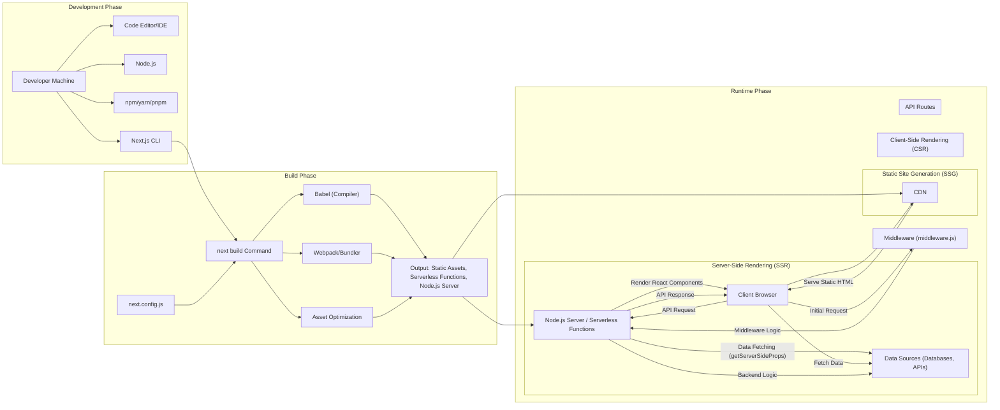
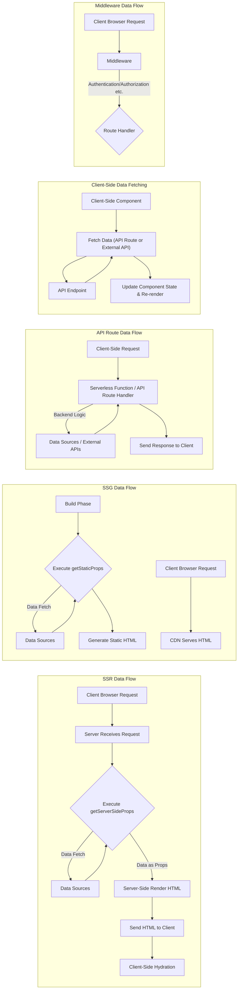

# Project Design Document: Next.js for Threat Modeling (Improved)

**Document Version:** 1.1
**Date:** October 26, 2023
**Prepared By:** Gemini (AI Language Model)

## 1. Introduction

This document provides an enhanced and more detailed design overview of the Next.js framework, based on its open-source repository at [https://github.com/vercel/next.js](https://github.com/vercel/next.js). This document is specifically crafted to serve as a robust foundation for conducting thorough threat modeling exercises. It meticulously outlines the key components, architectural layers, data flows, and underlying technologies involved in a typical Next.js application lifecycle. The information presented herein is derived from a comprehensive understanding of the framework's structure and functionalities as of the current date and aims to provide a deeper insight for security analysis.

## 2. Project Overview: Next.js

Next.js is a highly regarded open-source React framework designed for building production-ready web applications. Its core value proposition lies in providing a streamlined developer experience coupled with performance optimizations and enhanced SEO capabilities. Key features include server-side rendering (SSR), static site generation (SSG), dynamic routing, built-in API routes, middleware, and an extensible architecture. A thorough understanding of its internal workings is paramount for effectively identifying and mitigating potential security vulnerabilities.

## 3. Architectural Overview

A Next.js application's lifecycle can be broadly categorized into distinct stages, each with its own set of components and considerations:

*   **Development Phase:** This is the environment where developers actively build, debug, and iterate on the application.
    *   Key tools involved:
        *   'Node.js': The JavaScript runtime environment.
        *   'npm', 'yarn', or 'pnpm': Package managers for dependency management.
        *   'Code Editor/IDE':  For writing and managing code.
        *   'Next.js CLI': The command-line interface for interacting with the framework.
    *   Developer interactions:
        *   Writing React components and application logic.
        *   Defining routes using the file system convention.
        *   Utilizing hot reloading for rapid development feedback.
        *   Debugging code and resolving errors.
    *   Key features:
        *   Fast refresh (hot reloading).
        *   Built-in error reporting and debugging tools.
        *   Support for various JavaScript and TypeScript features.
*   **Build Phase:** This crucial stage transforms the development codebase into optimized artifacts ready for deployment.
    *   Process initiation: Executing the `next build` command.
    *   Configuration: Utilizing `next.config.js` to customize the build process (e.g., setting environment variables, configuring Webpack).
    *   Compilation and Optimization:
        *   Compiling React components using Babel.
        *   Bundling JavaScript modules and assets using Webpack (or a similar bundler).
        *   Optimizing images and other static assets.
        *   Generating production-ready code and assets.
    *   Output Generation:
        *   Static HTML, CSS, and JavaScript files for SSG pages.
        *   Serverless functions (e.g., AWS Lambda, Vercel Functions) for SSR and API routes.
        *   A standalone Node.js server (if configured for a self-hosted environment).
        *   Manifest files for tracking assets and dependencies.
*   **Runtime Phase:** This is where the application executes and serves user requests in the deployed environment. The specific components and their interactions depend heavily on the chosen rendering strategy and deployment platform.
    *   **Server-Side Rendering (SSR):**
        *   'Node.js Server' (or a compatible runtime) receives incoming requests.
        *   'React Components' are rendered on the server for the requested route.
        *   'Data Fetching' occurs within `getServerSideProps` if defined.
        *   Pre-rendered HTML is sent to the 'Client Browser'.
        *   'Client-Side React' hydrates the HTML to make it interactive.
    *   **Static Site Generation (SSG):**
        *   HTML pages are pre-built during the 'Build Phase'.
        *   'CDN' serves the static HTML files directly to the 'Client Browser'.
        *   'Client-Side JavaScript' can still be used for interactive elements.
    *   **Client-Side Rendering (CSR):**
        *   The initial HTML sent to the 'Client Browser' is minimal.
        *   'Client-Side JavaScript' fetches data and renders the UI in the browser.
    *   **API Routes:**
        *   'Client Browser' (or external services) sends requests to `/api` endpoints.
        *   'Serverless Functions' (or a Node.js server handling API routes) process these requests.
        *   'Backend Logic' interacts with databases, external APIs, etc.
        *   A response is sent back to the client.
    *   **Middleware:**
        *   Code defined in the `middleware.js` file intercepts incoming requests.
        *   Allows for actions like authentication, authorization, redirection, and header modification *before* the route handler is executed.
    *   **Data Fetching Mechanisms:**
        *   `getServerSideProps`: Fetches data on the server *before* rendering for each request (SSR).
        *   `getStaticProps`: Fetches data at build time (SSG).
        *   Client-side fetching (using `fetch` or libraries like `axios`): Fetches data in the browser after the initial page load.

## 4. Data Flow (Detailed)

Understanding how data moves through a Next.js application is crucial for identifying potential vulnerabilities. Here's a more detailed breakdown of common data flow patterns:

*   **Server-Side Rendering (SSR) Data Flow:**
    *   'Client Browser' sends an HTTP request to the server for a specific page.
    *   'Server' receives the request and identifies the corresponding route.
    *   If `getServerSideProps` is defined for the route:
        *   'Server' executes the `getServerSideProps` function.
        *   `getServerSideProps` fetches data from 'Data Sources' (databases, external APIs, etc.).
        *   The fetched data is passed as props to the React component.
    *   'Server' renders the React component with the provided props, generating HTML.
    *   'Server' sends the pre-rendered HTML response back to the 'Client Browser'.
    *   'Client-Side React' hydrates the HTML, attaching event listeners and making it interactive.
*   **Static Site Generation (SSG) Data Flow:**
    *   During the 'Build Phase', the `getStaticProps` function (if defined for a page) is executed.
    *   `getStaticProps` fetches data from 'Data Sources'.
    *   Next.js generates static HTML files for each route, incorporating the fetched data.
    *   When a 'Client Browser' requests a page, the 'CDN' directly serves the pre-built HTML file.
    *   Client-side data fetching can still occur for dynamic sections of the page using JavaScript.
*   **API Route Data Flow:**
    *   'Client-Side JavaScript' (or an external application) sends an HTTP request to a `/api` route.
    *   The request is routed to the corresponding 'Serverless Function' or API route handler on the 'Node.js Server'.
    *   The API route handler executes 'Backend Logic', which may involve:
        *   Accessing and manipulating 'Data Sources'.
        *   Calling other internal or external APIs.
        *   Performing business logic.
    *   The API route handler sends an HTTP response (typically JSON) back to the client.
*   **Client-Side Data Fetching (CSR) Data Flow:**
    *   'Client-Side React Components' use JavaScript (e.g., `fetch`, `axios`) to make asynchronous requests.
    *   These requests can target:
        *   'Next.js API Routes' on the same server.
        *   External APIs hosted elsewhere.
    *   The external API or API route handler processes the request and sends a response.
    *   The 'Client-Side Component' receives the response data and updates its state, triggering a re-render of the UI.
*   **Middleware Data Flow:**
    *   'Client Browser' sends an HTTP request.
    *   'Middleware' intercepts the request *before* it reaches the route handler.
    *   'Middleware Logic' is executed, which can involve:
        *   Checking authentication status.
        *   Verifying authorization levels.
        *   Redirecting the user to a different page.
        *   Modifying request headers.
    *   If the middleware allows, the request is then passed on to the appropriate route handler.

## 5. Key Technologies and Dependencies (Expanded)

A deeper understanding of the underlying technologies and dependencies is crucial for identifying potential security risks.

*   **Core Technologies:**
    *   'Node.js': The foundation for server-side execution and the build process, known for its event-driven, non-blocking I/O model.
    *   'React': The declarative JavaScript library for building user interfaces, emphasizing component-based architecture.
    *   'Webpack' (or alternatives like 'esbuild', 'Parcel'):  A module bundler that packages JavaScript modules, CSS, and other assets for the browser. Configuration can significantly impact security.
    *   'Babel': A JavaScript compiler that transforms modern JavaScript syntax (ES6+) into backward-compatible versions. Incorrect configuration can lead to vulnerabilities.
*   **Dependency Management:**
    *   'npm', 'yarn', 'pnpm': Package managers used to install and manage project dependencies. The security of these dependencies is a critical concern. Supply chain attacks targeting these package managers are a known threat.
*   **Deployment Platforms (Examples):**
    *   'Vercel': Offers seamless integration with Next.js, often utilizing serverless functions. Understanding the security model of serverless functions is important.
    *   'Netlify': Another popular platform for deploying static sites and serverless functions.
    *   'AWS' ('Lambda', 'EC2', etc.): Provides a wide range of deployment options, each with its own security considerations and best practices.
    *   'Google Cloud Platform' ('Cloud Functions', 'Compute Engine', etc.): Similar to AWS, offering various deployment models.
    *   'Docker': Containerization technology that packages applications and their dependencies. Security vulnerabilities in Docker images and configurations are a concern.
*   **Networking and Communication:**
    *   'HTTP/HTTPS': The protocols for communication between clients and servers. Proper HTTPS configuration is essential for protecting data in transit.
    *   'WebSockets':  For real-time, bidirectional communication. Security considerations include proper authentication and authorization.
*   **Languages:**
    *   'JavaScript' (or 'TypeScript'): The primary programming languages. Security vulnerabilities often stem from coding errors and insecure practices.
    *   'HTML': The markup language for structuring web content. Vulnerabilities like XSS can be injected into HTML.
    *   'CSS': The styling language. While less direct, CSS can be a vector for certain attacks.

## 6. Deployment Considerations (Expanded)

The chosen deployment environment introduces a significant layer of security considerations.

*   **Platform-Specific Security:** Each platform (Vercel, Netlify, AWS, GCP, self-hosted) has its own security model, features, and potential vulnerabilities. Understanding these specifics is crucial.
*   **Serverless Function Security:** When deploying with serverless functions, considerations include:
    *   Cold starts and their impact on security.
    *   Function permissions and access controls.
    *   Secrets management within the serverless environment.
    *   Vulnerability management of the underlying function runtime.
*   **Container Security (Docker):** If using Docker, security best practices include:
    *   Using minimal base images.
    *   Regularly scanning images for vulnerabilities.
    *   Properly configuring container runtime security.
    *   Securely managing secrets within containers.
*   **Infrastructure Security (Self-Hosted):** For self-hosted deployments, organizations are responsible for:
    *   Securing the underlying operating system.
    *   Configuring firewalls and network security.
    *   Implementing intrusion detection and prevention systems.
    *   Regularly patching and updating the server environment.
*   **CDN Security:** When using a CDN, considerations include:
    *   CDN configuration and access controls.
    *   Protection against DDoS attacks.
    *   Ensuring secure delivery of assets (HTTPS).
    *   Cache invalidation strategies.

## 7. Security Considerations (More Granular)

Expanding on the high-level considerations, here are more specific security areas relevant to Next.js:

*   **Cross-Site Scripting (XSS):**  Vulnerabilities in React components that allow attackers to inject malicious scripts into web pages viewed by other users.
*   **Server-Side Request Forgery (SSRF):**  Vulnerabilities in API routes that allow an attacker to make requests to internal or external resources from the server.
*   **Insecure Direct Object References (IDOR):**  When API routes expose internal object IDs without proper authorization checks.
*   **Authentication and Authorization Flaws:** Weaknesses in how user identities are verified and access to resources is controlled.
*   **Injection Attacks:**
    *   'SQL Injection':  If API routes interact with databases, improper sanitization of inputs can lead to SQL injection vulnerabilities.
    *   'Command Injection':  If the server executes external commands based on user input.
    *   'NoSQL Injection': Similar to SQL injection but targeting NoSQL databases.
*   **Broken Authentication and Session Management:**  Flaws in how users log in and how their sessions are managed.
*   **Security Misconfiguration:**  Incorrectly configured servers, databases, or application settings that introduce vulnerabilities.
*   **Exposure of Sensitive Data:**  Accidentally exposing sensitive information in API responses, client-side code, or error messages.
*   **Insufficient Logging and Monitoring:**  Lack of adequate logging and monitoring makes it difficult to detect and respond to security incidents.
*   **Dependency Vulnerabilities:**  Using outdated or vulnerable npm packages.
*   **Build Pipeline Security:**  Compromised build processes can inject malicious code into the application.
*   **Middleware Security Bypass:**  Vulnerabilities in middleware logic that allow attackers to bypass security checks.
*   **Routing Vulnerabilities:**  Misconfigured routes or lack of proper access controls on sensitive routes.

## 8. Out of Scope

This document focuses on the general architecture and data flow of Next.js to facilitate threat modeling. The following are explicitly excluded from the scope of this document:

*   Specific implementation details of individual Next.js applications.
*   Zero-day vulnerabilities or undiscovered flaws within the Next.js framework itself.
*   Comprehensive security audits or penetration testing results for Next.js.
*   Detailed analysis of every single third-party library that *could* be used in a Next.js application.
*   Platform-specific configuration guides for deployment environments.
*   Legal or compliance aspects related to application security.

## 9. Conclusion

This enhanced design document provides a more granular and detailed understanding of the Next.js framework's architecture, data flow, and underlying technologies. This in-depth information is essential for security professionals to conduct thorough and effective threat modeling exercises. By carefully analyzing the various components, their interactions, and the potential attack surfaces, organizations can proactively identify and mitigate security risks in their Next.js applications. Continuous review and updates of this document are recommended to reflect the evolving nature of the framework and emerging security threats.